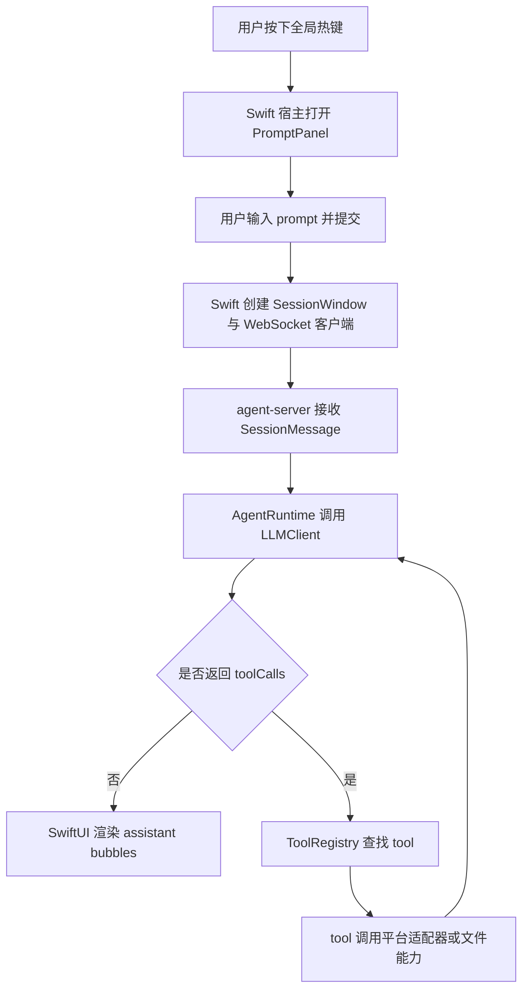

# AGENTS.md

## 文档约定

- 本仓库中的产品文档、设计文档、计划文档、说明文档默认使用中文编写。
- 如果某些内容必须使用英文，应当有明确理由，例如引用外部协议字段、API 原始名称或行业通用专有名词。
- 新增文档时，优先保证中文表达清晰、边界明确、术语一致。

## 文档索引

以下索引仅覆盖仓库自有文档，不包含 `node_modules/` 等依赖目录中的第三方 `md` 文件。

### 根目录

- `README.md`：项目简介、当前能力、本地验证命令。
- `handAgent.md`：仓库级架构总览、调用链路和分层 DTO 索引。
- `AGENTS.md`：仓库工作约定、架构边界与文档导航。

### `apps/`

- `apps/apps.md`：应用层总览，说明桌面入口与交互壳职责。
- `apps/desktop/desktop.md`：macOS 宿主层说明，覆盖热键、PromptPanel、SessionWindow 与状态气泡。

### `packages/`

- `packages/packages.md`：包级总览，说明 `core` 与 `platform-macos` 的边界。
- `packages/core/core.md`：core 包总览，说明会话、runtime、tool、platform 抽象。
- `packages/core/src/src.md`：core 源码目录说明，按子模块解释数据流与 DTO。
- `packages/platform-macos/platform-macos.md`：macOS 平台实现总览。
- `packages/platform-macos/src/src.md`：macOS 平台源码目录说明，覆盖系统能力实现细节。

### `docs/`

- `docs/dev.md`：开发说明，通常用于开发约束和实现规则补充。
- `docs/manual-qa.md`：手工验收说明，记录人工验证步骤与关注点。
- `docs/superpowers/specs/`：设计稿。
- `docs/superpowers/plans/`：实施计划。

### `claude-code/`: 一个本地code agent的参考项目，可以参考权限系统，tool系统，UI流式展示，子agent系统等

## 当前产品边界

- 产品目标是一个可由全局快捷键随时唤起的桌面 Agent。
- 第一版平台以 macOS 为优先，但架构设计需要为后续多平台扩展预留抽象。
- 当前桌面端最低支持版本固定为 `macOS 15+`，本仓库内新增桌面能力默认不为 `macOS 15` 以下系统提供 fallback。
- 只有用户主动提供的输入可以作为初始上下文提交给 LLM，例如用户 prompt、用户主动选区。
- 屏幕、窗口、文件、剪贴板、App 状态等上下文信息不应默认注入模型，必须由 LLM 通过 tool 按需读取。
- 热键、输入框、用户选区属于用户触发入口，不属于 tool。
- 读取 App 信息、操作 App、编辑文件、保存内容等能力统一抽象为 tool，由 LLM 决定是否调用。
- 第一版默认不做复杂权限交互，但后续权限与审计体系需要在架构上保留扩展空间。

## 当前架构概览

- `apps/desktop/HandAgentApp.swift` 是 macOS 宿主入口，负责应用生命周期、全局热键、`PromptPanel`、`SessionWindow` 与状态气泡。
- `apps/desktop/Sources/` 按 `AppServices`、`PromptPanel`、`SessionWindow`、`StatusBubble` 划分宿主实现。
- `packages/core/` 是跨平台核心层，负责会话模型、LLM 循环、tool 协议、tool 注册、平台抽象和通用测试。
- `packages/platform-macos/` 是 macOS 平台实现层，负责把平台能力落到具体系统 API 或 AppleScript。
- `docs/` 里的设计稿和开发说明只描述规则和约束，不作为运行时依赖。

## 主调用链路

## 当前实现状态

- 已实现：热键唤起、PromptPanel、SessionWindow、状态气泡、`AgentRuntime` 循环、工具协议、文件工具、平台抽象、macOS 选区捕获。
- 已预留：screen / OCR / accessibility / file / app 类 tool 的统一协议与平台适配入口。
- 待收尾：把选区采集接入 PromptPanel attachment 流程，并继续补齐更多桌面能力。

## 开发规范

### 输入边界

- 只有用户主动输入和用户主动选区可以作为初始上下文。
- 屏幕、窗口、文件、剪贴板、App 状态一律通过 tool 按需读取。
- 在会话开始前，不要默认抓取额外上下文。
- 任何 tool 的输入 schema 必须清晰、稳定、可序列化，避免把宿主内部状态直接暴露给 LLM。

### LLM 与 tool 约定

- LLM 通过 `LLMClient` 抽象接入，不要把具体 provider 写死在 runtime。
- tool 名称保持点号风格，例如 `file.read`、`screen.capture`、`app.frontmost`。
- tool 输出要尽量可序列化，错误语义要明确。
- 新 tool 优先保持单一职责，输入和输出都要小。

### macOS 15+ 能力策略

- 桌面端默认直接面向 `macOS 15+` 能力设计，不再为了旧系统保留 `if #available` 分支或命令行 fallback。
- 屏幕与窗口采集优先使用 `ScreenCaptureKit`，包括窗口/应用/显示器级过滤、截图与后续可扩展的流式采集能力。
- 与系统控制相关的能力优先使用原生 macOS API，例如 `Accessibility`、`NSWorkspace`、`ScreenCaptureKit`、`AppKit/SwiftUI` 提供的窗口分享与内容选择接口。
- 只有在原生 API 明确无法覆盖需求时，才退回 `osascript` 或其他兼容性方案；若采用退回方案，必须在设计或实现文档中说明原因。
- 新增桌面能力时，默认目标是“尽可能支持系统已提供的高能力接口”，例如系统级内容选择器、窗口级共享、录制或更完整的 accessibility 读写能力。

### 提交前检查

- `bash ./scripts/test.sh`
- `bash ./scripts/swiftw test`
- `bash ./scripts/swiftw build`

说明：
- Swift 相关命令默认通过 `bash ./scripts/swiftw` 执行，把模块缓存固定到仓库内 `.cache/swift/`，避免依赖用户目录下的全局缓存写权限。
- Codex 的 `Stop` hook 当前只执行 TypeScript 侧 `vitest` 校验，不执行 Swift 校验；原因是 hook 运行环境会以 `zsh -lc` 方式触发命令，`swift test/build` 在该环境下会稳定报 `sandbox-exec: sandbox_apply: Operation not permitted`，与线程内直接执行结果不一致。
- 因此，涉及 Swift 或桌面宿主改动时，结束任务前仍必须在当前线程环境手动执行 `bash ./scripts/swiftw test` 与 `bash ./scripts/swiftw build`，不要只依赖 hook 结果。

### Development Workflow

- Before making code changes, create a new worktree from the project root at `.worktrees/<task-name>/`. Pure documentation work or read-only work does not require a worktree.
- After creating the worktree, finish project initialization first. At minimum, ensure the worktree can run independently. For this repo, run `pnpm install` by default, then add any other dependency initialization as needed.
- After initialization, run a baseline verification once to confirm the worktree is usable, then start browsing the codebase. Focus on the architecture docs with the same name under the target folder.
- Make code changes.
- After verification passes, update existing docs.
- run `git commit` and summarize the changes in commit message. Do not leave completed work uncommitted for a long time.
