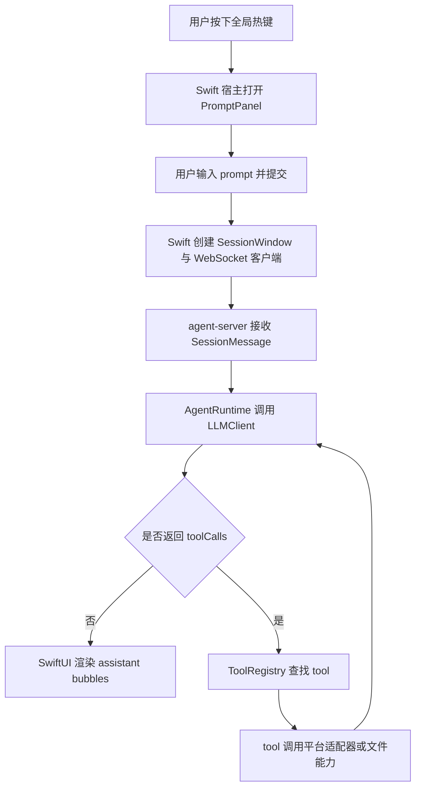

# AGENTS.md

## 文档约定

- 本仓库中的产品文档、设计文档、计划文档、说明文档默认使用中文编写。
- 如果某些内容必须使用英文，应当有明确理由，例如引用外部协议字段、API 原始名称或行业通用专有名词。
- 新增文档时，优先保证中文表达清晰、边界明确、术语一致。

## 文档索引

仓库文档是一棵 DFS 索引树：每个 `<dir>.md` 只列**直接子节点**，更深层细节由子节点自己继续展开。AI / 新人按 `AGENTS.md → handAgent.md → ...` 一路向下读，需要哪一层就钻到哪一层，不必预先吞下所有路径。

本文件只列根目录的直接入口；所有 `apps/` 下的模块、`packages/` 下的源码细节，由各自的 `<dir>.md` 接力展开。

### 根目录入口

- `README.md`：项目简介、当前能力、本地验证命令。
- `handAgent.md`：仓库级架构总览、主调用链路、分层 DTO 索引；后续向 `apps/` 与 `packages/` 分叉。
- `AGENTS.md`：本文件，工作约定 + 文档维护规则。

### 一级子目录（每个目录由其内 `<dir>.md` 接力）

- `apps/apps.md`：应用层总览，索引 desktop 与 agent-server 两个可执行单元。
- `packages/packages.md`：包层总览，索引 core 跨平台核心。
- `docs/`：仅是平铺的开发说明集合，下面列出的文件即叶节点。
- `claude-code/`：本地 code agent 的参考项目（权限系统 / tool 系统 / UI 流式展示 / 子 agent 系统等可借鉴）。

### `docs/` 叶文件

- `docs/dev.md`：开发说明。
- `docs/manual-qa.md`：手工验收清单。
- `docs/architecture-review.md`：当前代码架构问题与改进路线。
- `docs/TODO.md`：按依赖关系分组的待办路线图（P0–P3）。
- `docs/bugs.md`：当前已知 bug 清单与修复约束。
- `docs/human/`：手工撰写的设计资料。
- `docs/superpowers/specs/` 与 `docs/superpowers/plans/`：历史设计稿与实施计划。

## 文档维护约定

- 每级 `<dir>.md` 只索引**直接**子节点；不要把孙节点路径平铺上来，避免上层文档随子树膨胀。
- 新增子目录或子模块时，更新所在目录的 `<dir>.md` 索引；上层文档无需改动。
- 跨模块约定（协议字段、设置文件路径等）必须在双方文档相互引用，避免单边漂移。
- 当代码与文档冲突时，优先以代码为真相并立即修文档；不要在 PR 描述里只写"待补文档"。

## 当前产品边界

- 产品目标是一个可由全局快捷键随时唤起的桌面 Agent。
- 第一版平台以 macOS 为优先，但架构设计需要为后续多平台扩展预留抽象。
- 当前桌面端最低支持版本固定为 `macOS 15+`，本仓库内新增桌面能力默认不为 `macOS 15` 以下系统提供 fallback。
- 只有用户主动提供的输入可以作为初始上下文提交给 LLM，例如用户 prompt、用户主动选区。
- 屏幕、窗口、文件、剪贴板、App 状态等上下文信息不应默认注入模型，必须由 LLM 通过 tool 按需读取。
- 热键、输入框、用户选区属于用户触发入口，不属于 tool。
- 读取 App 信息、操作 App、编辑文件、保存内容等能力统一抽象为 tool，由 LLM 决定是否调用。
- 第一版默认不做复杂权限交互，但后续权限与审计体系需要在架构上保留扩展空间。

## 当前架构概览

- `apps/desktop/HandAgentApp.swift` 是 macOS 宿主入口，负责应用生命周期、全局热键、`PromptPanel`、`SessionWindow` 与状态气泡。
- `apps/desktop/Sources/` 按 `AppServices`、`PromptPanel`、`SessionWindow`、`StatusBubble` 划分宿主实现。
- `packages/core/` 是跨平台核心层，负责会话模型、LLM 循环、tool 协议、tool 注册、平台抽象和通用测试；不得引入 macOS 相关导入或 UI 依赖。
- macOS 平台能力由 `apps/desktop/Sources/AppServices/PlatformBridge/MacPlatformProvider.swift` 实现（NSPasteboard / NSWorkspace / CGWindowList / ScreenCaptureKit 等），通过 `PlatformBridgeService` 暴露为 WebSocket 反向通道；core 侧通过 `RemotePlatformAdapter + PlatformBridge` 接口调用，不直接依赖 macOS API。
- `docs/` 里的设计稿和开发说明只描述规则和约束，不作为运行时依赖。
- 模型相关设置存放在 `~/.spotAgent/settings.json`，每次请求时读取，无需重启。

## 主调用链路

## 当前实现状态

- 已实现：热键唤起、PromptPanel、PromptPanel attachment、文本选区采集、区域截图采集入口、SessionWindow、SessionWindow 自动重连基础逻辑、会话历史侧栏、状态气泡、设置页（模型 / 快捷键 / workspace）、`AgentRuntime` 循环、builtin tool 注册、workspace 沙箱文件工具、权限审批协议、会话审计事件、平台反向 IPC。
- 已实现的 macOS 平台能力：剪贴板、前台 App、窗口列表、ScreenCaptureKit 截图（display / window / region target）。PromptPanel 的手动区域圈选入口保留 `screencapture -i`。
- 已预留但未完成：OCR、accessibility、真实 token streaming、多模态图片消息、会话 interrupt / Stop、插件 tool、独立平台 RPC 协议拆分。
- 待收尾：图片附件已落 Blob/Stub 但尚不能被 LLM 直接理解；SessionWindow 当前用户气泡尚不展示附件；workspace / permission 文件缓存仍需失效策略；tool 设置 UI 与热加载尚未完成；快捷键修改配置不会生效；权限气泡、工作区 UI 与 SessionWindow 自动重连还需要端到端手工验证。
- Since the project hasn’t gone live yet, there’s no need to consider compatibility.

## 开发规范

### 输入边界

- 只有用户主动输入和用户主动选区可以作为初始上下文。
- 屏幕、窗口、文件、剪贴板、App 状态一律通过 tool 按需读取。
- 在会话开始前，不要默认抓取额外上下文。
- 任何 tool 的输入 schema 必须清晰、稳定、可序列化，避免把宿主内部状态直接暴露给 LLM。

### LLM 与 tool 约定

- LLM 通过 `LLMClient` 抽象接入，不要把具体 provider 写死在 runtime。
- tool 名称保持点号风格，例如 `file.read`、`screen.capture`、`app.frontmost`。
- tool 输出要尽量可序列化，错误语义要明确。
- 新 tool 优先保持单一职责，输入和输出都要小。

### macOS 15+ 能力策略

- 桌面端默认直接面向 `macOS 15+` 能力设计，不再为了旧系统保留 `if #available` 分支或命令行 fallback。
- 屏幕与窗口采集优先使用 `ScreenCaptureKit`，包括窗口/应用/显示器级过滤、截图与后续可扩展的流式采集能力。
- 与系统控制相关的能力优先使用原生 macOS API，例如 `Accessibility`、`NSWorkspace`、`ScreenCaptureKit`、`AppKit/SwiftUI` 提供的窗口分享与内容选择接口。
- 只有在原生 API 明确无法覆盖需求时，才退回 `osascript` 或其他兼容性方案；若采用退回方案，必须在设计或实现文档中说明原因。
- 新增桌面能力时，默认目标是“尽可能支持系统已提供的高能力接口”，例如系统级内容选择器、窗口级共享、录制或更完整的 accessibility 读写能力。

### 常用命令

- 安装依赖：`pnpm install`
- TypeScript 测试（agent-server + core，vitest）：`bash ./scripts/test.sh`
- Swift 测试与构建（桌面 App）：`bash ./scripts/swiftw test`、`bash ./scripts/swiftw build`
- 运行桌面 App：`bash ./scripts/swiftw run HandAgentDesktop`

### 提交前检查

- `bash ./scripts/test.sh`
- `bash ./scripts/swiftw test`
- `bash ./scripts/swiftw build`

说明：
- Swift 相关命令默认通过 `bash ./scripts/swiftw` 执行，把模块缓存固定到仓库内 `.cache/swift/`，避免依赖用户目录下的全局缓存写权限。
- Codex 的 `Stop` hook 当前只执行 TypeScript 侧 `vitest` 校验，不执行 Swift 校验；原因是 hook 运行环境会以 `zsh -lc` 方式触发命令，`swift test/build` 在该环境下会稳定报 `sandbox-exec: sandbox_apply: Operation not permitted`，与线程内直接执行结果不一致。
- 因此，涉及 Swift 或桌面宿主改动时，结束任务前仍必须在当前线程环境手动执行 `bash ./scripts/swiftw test` 与 `bash ./scripts/swiftw build`，不要只依赖 hook 结果。

### Development Workflow

- 需要修改代码的任务，必须先在 `.worktrees/<task-name>/` 目录下创建 worktree（使用 `git worktree add .worktrees/<task-name> -b <branch-name>`，**不要使用 `EnterWorktree` 工具** —— 它会把 worktree 放到 `.claude/worktrees/`，与本仓库约定不符）。纯文档任务或只读任务不需要 worktree。
- 创建 worktree 后，先完成项目初始化，至少保证 worktree 可独立运行。本仓库默认执行 `pnpm install`，再按需补齐其他依赖初始化。
- 初始化完成后，先跑一次基线验证（`bash ./scripts/test.sh` 与 `bash ./scripts/swiftw build`）确认 worktree 可用，再开始浏览代码。优先阅读目标目录下同名的架构文档。
- 进行代码修改。
- 验证通过后，更新已有文档。
- 执行 `git commit` 并在 commit message 中总结改动，不要让完成的工作长时间不提交。
