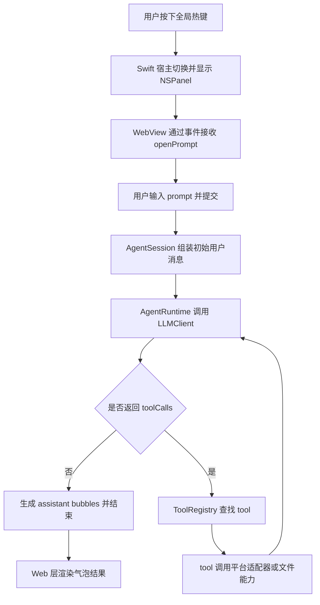

# AGENTS.md

## 文档约定

- 本仓库中的产品文档、设计文档、计划文档、说明文档默认使用中文编写。
- 如果某些内容必须使用英文，应当有明确理由，例如引用外部协议字段、API 原始名称或行业通用专有名词。
- 新增文档时，优先保证中文表达清晰、边界明确、术语一致。

## 当前产品边界

- 产品目标是一个可由全局快捷键随时唤起的桌面 Agent。
- 第一版平台以 macOS 为优先，但架构设计需要为后续多平台扩展预留抽象。
- 只有用户主动提供的输入可以作为初始上下文提交给 LLM，例如用户 prompt、用户主动选区。
- 屏幕、窗口、文件、剪贴板、App 状态等上下文信息不应默认注入模型，必须由 LLM 通过 tool 按需读取。
- 热键、输入框、用户选区属于用户触发入口，不属于 tool。
- 读取 App 信息、操作 App、编辑文件、保存内容等能力统一抽象为 tool，由 LLM 决定是否调用。
- 第一版默认不做复杂权限交互，但后续权限与审计体系需要在架构上保留扩展空间。

## 当前架构概览

- `apps/desktop/HandAgentApp.swift` 是 macOS 宿主入口，负责应用生命周期、全局热键、`WKWebView` 容器、窗口显示隐藏和宿主状态发布。
- `apps/desktop/Web/` 是前端交互层，负责 prompt 输入框、气泡列表、宿主事件桥，以及把用户输入送入 Agent Runtime。
- `packages/core/` 是跨平台核心层，负责会话模型、LLM 循环、tool 协议、tool 注册、平台抽象和通用测试。
- `packages/platform-macos/` 是 macOS 平台实现层，负责把平台能力落到具体系统 API 或 AppleScript。
- `docs/` 里的设计稿和开发说明只描述规则和约束，不作为运行时依赖。

## 主调用链路

## 当前实现状态

- 已实现：热键唤起、WebView 宿主、prompt 输入、基础气泡渲染、`AgentRuntime` 循环、工具协议、文件工具、平台抽象、macOS 选区捕获。
- 已预留：screen / OCR / accessibility / file / app 类 tool 的统一协议与平台适配入口。
- 待接入：Web 侧把 `AgentRuntime` 扩展为真实 tool 注册和真实 LLM provider 调用，宿主侧把选区采集接入 prompt 预填链路。

## 开发规范

### 代码边界

- `apps/desktop/HandAgentApp.swift` 只放 macOS 宿主、窗口、热键和 WebView 桥接逻辑，不放业务编排。
- `apps/desktop/Web/` 只放 React UI、前端事件桥和用户交互状态，不直接写平台 API。
- `packages/core/` 只放跨平台 runtime、tool 协议、会话和通用测试，不直接依赖 AppKit。
- `packages/platform-macos/` 只放 macOS 平台实现，不把 macOS 细节泄漏回 core。
- `packages/core/src/runtime/AgentRuntime.ts` 只负责 LLM/tool 循环，不负责 UI 状态或窗口控制。
- `packages/core/src/runtime/AgentSession.ts` 只负责把用户主动输入和选区组装成首轮消息，不负责额外上下文抓取。
- `packages/core/src/tools/ToolRegistry.ts` 只负责注册、查询和导出 tool schema，不负责 tool 执行以外的编排。

### 输入边界

- 只有用户主动输入和用户主动选区可以作为初始上下文。
- 屏幕、窗口、文件、剪贴板、App 状态一律通过 tool 按需读取。
- 在会话开始前，不要默认抓取额外上下文。
- 任何 tool 的输入 schema 必须清晰、稳定、可序列化，避免把宿主内部状态直接暴露给 LLM。

### LLM 与 tool 约定

- LLM 通过 `LLMClient` 抽象接入，不要把具体 provider 写死在 runtime。
- tool 名称保持点号风格，例如 `file.read`、`screen.capture`、`app.frontmost`。
- tool 输出要尽量可序列化，错误语义要明确。
- 新 tool 优先保持单一职责，输入和输出都要小。

### 提交前检查

- `cd apps/desktop/Web && npm run build`
- `cd apps/desktop/Web && npm run test:hotkey`
- `./apps/desktop/Web/node_modules/.bin/vitest run packages/core/tests/runtime.test.ts packages/core/tests/selection.test.ts packages/core/tests/context-tools.test.ts packages/core/tests/file-tools.test.ts`
- `swift build`

