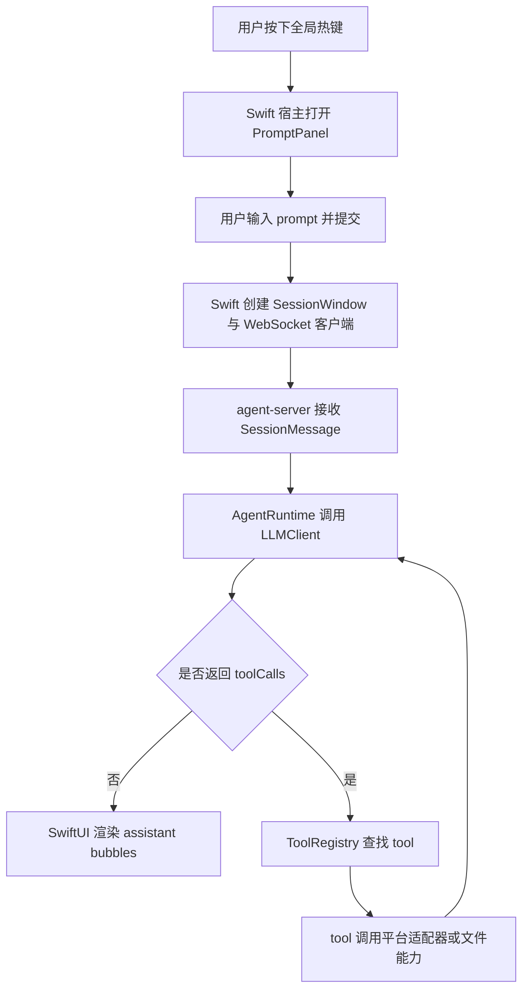

# AGENTS.md

## 文档约定

- 本仓库中的产品文档、设计文档、计划文档、说明文档默认使用中文编写。
- 如果某些内容必须使用英文，应当有明确理由，例如引用外部协议字段、API 原始名称或行业通用专有名词。
- 新增文档时，优先保证中文表达清晰、边界明确、术语一致。

## 文档索引

仓库文档是一棵 DFS 索引树：每个 `<dir>.md` 只列**直接子节点**，更深层细节由子节点自己继续展开。AI / 新人按 `AGENTS.md → handAgent.md → ...` 一路向下读，需要哪一层就钻到哪一层，不必预先吞下所有路径。

本文件只列根目录的直接入口；所有 `apps/` 下的模块、`packages/` 下的源码细节，由各自的 `<dir>.md` 接力展开。

### 根目录入口

- `README.md`：项目简介、当前能力、本地验证命令。
- `handAgent.md`：仓库级架构总览、主调用链路、分层 DTO 索引；后续向 `apps/` 与 `packages/` 分叉。
- `AGENTS.md`：本文件，工作约定 + 文档维护规则。

### 一级子目录（每个目录由其内 `<dir>.md` 接力）

- `apps/apps.md`：应用层总览，索引 desktop 与 agent-server 两个可执行单元。
- `packages/packages.md`：包层总览，索引 core 跨平台核心。
- `examples/examples.md`：示例层总览，索引可复制到 `~/.spotAgent/` 的 Action Plugin 与 MCP server 示例。
- `docs/`：仅是平铺的开发说明集合，下面列出的文件即叶节点。
- `codex/`：本地 code agent 的参考项目（权限系统 / tool 系统 / UI 流式展示 / 子 agent 系统等可借鉴）。

### `docs/` 叶文件

- `docs/dev.md`：开发说明。
- `docs/manual-qa.md`：手工验收清单。
- `docs/llm-api-integration.md`：LLM 真实 API 集成测试运行方式、输出 JSON 结构与 mock 构造依据。
- `docs/live-qa-flow.md`：实机 QA 执行流程、取证规则、停止条件与缺陷报告格式。
- `docs/TODO.md`：按依赖关系分组的待办路线图（P0–P3）。
- `docs/bugs.md`：当前已知 bug 清单与修复约束。
- `docs/human/`：手工撰写的设计资料。
- `docs/superpowers/specs/` 与 `docs/superpowers/plans/`：历史设计稿与实施计划。

## 文档维护约定

- 每级 `<dir>.md` 只索引**直接**子节点；不要把孙节点路径平铺上来，避免上层文档随子树膨胀。
- 新增子目录或子模块时，更新所在目录的 `<dir>.md` 索引；上层文档无需改动。
- 跨模块约定（协议字段、设置文件路径等）必须在双方文档相互引用，避免单边漂移。
- 当代码与文档冲突时，优先以代码为真相并立即修文档；不要在 PR 描述里只写"待补文档"。

## 当前产品边界

- 产品目标是一个可由全局快捷键随时唤起的桌面 Agent。
- 第一版平台以 macOS 为优先，但架构设计需要为后续多平台扩展预留抽象。
- 当前桌面端最低支持版本固定为 `macOS 15+`，本仓库内新增桌面能力默认不为 `macOS 15` 以下系统提供 fallback。
- 只有用户主动提供的输入可以作为初始上下文提交给 LLM，例如用户 prompt、用户主动选区。
- 屏幕、窗口、文件、剪贴板、App 状态等上下文信息不应默认注入模型，必须由 LLM 通过 tool 按需读取。
- 热键、输入框、用户选区属于用户触发入口，不属于 tool。
- 读取 App 信息、操作 App、编辑文件、保存内容等能力统一抽象为 tool，由 LLM 决定是否调用。

## 主调用链路

## 开发规范
### Since the project hasn’t gone live yet, there’s no need to consider compatibility.

### 常用命令

- 安装依赖：`pnpm install`
- TypeScript 测试（agent-server + core，vitest）：`bash ./scripts/test.sh`
- Swift 测试与构建（桌面 App）：`bash ./scripts/swiftw test`、`bash ./scripts/swiftw build`
- 运行桌面 App：`bash ./scripts/swiftw run HandAgentDesktop`

### 提交前检查

- `bash ./scripts/test.sh`
- `bash ./scripts/swiftw test`
- `bash ./scripts/swiftw build`

说明：
- Swift 相关命令默认通过 `bash ./scripts/swiftw` 执行，把模块缓存固定到仓库内 `.cache/swift/`，避免依赖用户目录下的全局缓存写权限。
- Codex 的 `Stop` hook 当前只执行 TypeScript 侧 `vitest` 校验，不执行 Swift 校验；

### Development Workflow

- 读取代码，确定任务的范围，涉及的文件。涉及文件所在目录的 `<dir>.md` 必须读取，并沿父目录递归向上直到根目录的 `handAgent.md`，确保理解完整的分层上下文。
- 需要修改代码的任务，必须先在 `.worktrees/<task-name>/` 目录下创建 worktree（使用 `git worktree add .worktrees/<task-name> -b <branch-name>`，**不要使用 `EnterWorktree` 工具** —— 它会把 worktree 放到 `.claude/worktrees/`，与本仓库约定不符）。纯文档任务或只读任务不需要 worktree。
- 创建 worktree 后，先完成项目初始化，至少保证 worktree 可独立运行。本仓库默认执行 `pnpm install`，再按需补齐其他依赖初始化。
- 初始化完成后，先跑一次基线验证（`bash ./scripts/test.sh` 与 `bash ./scripts/swiftw build`）确认 worktree 可用，再开始浏览代码。优先阅读目标目录下同名的架构文档。
- 进行代码修改。
- 验证通过后，更新已有文档。
- 执行 `git commit` 并在 commit message 中总结改动，不要让完成的工作长时间不提交。
- 最后将完成的改动加入到 manual-qa 中
