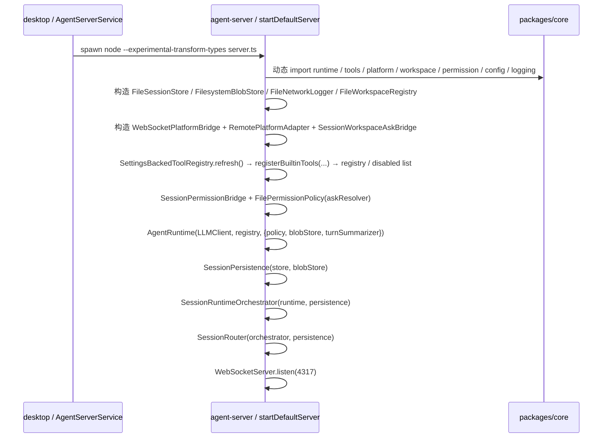

# agent-server

`apps/agent-server` 是本地 WebSocket 会话桥（Node + TypeScript），由 desktop 派生为子进程（详见 [AgentServerService](/Users/mu9/proj/handAgent/apps/desktop/Sources/AppServices/AgentServer/agent-server.md)），监听 `ws://127.0.0.1:4317/api/session`，把 `SessionMessage` 协议帧路由到 core 的 `AgentRuntime`。

## 在分层中的位置

- 上游：`apps/desktop`（用户交互、平台能力）。
- 下游：`@handagent/core` workspace 包（runtime、tools、LLM、storage、permission、workspace、logging）。
- 自身职责：组装依赖、维护 socket 生命周期、在 desktop 与 core 之间做协议翻译。

## 文件

| 文件 | 职责 |
|------|------|
| `src/server.ts` | 启动入口；`startServer` 注入式构造，`attachSessionSocketHandlers` 维护单 socket 的 bridge token 与会话绑定状态，`startDefaultServer` 是组合根（拉起 store / blobStore / bridge / registry / policy / runtime / SessionPersistence / SessionRuntimeOrchestrator / SessionRouter） |
| `src/SessionRouter.ts` | 协议路由层：处理 `open_session` / `list_sessions_request` / `load_session_request` / `delete_session_request`；`open_session` 回 `session_snapshot` 用于桌面端重连续联，并把 `user_message` 委托给 runtime 编排层 |
| `src/SessionRuntimeOrchestrator.ts` | 一轮用户消息编排：确保 session、持久化 user message、等待 pending summary、把 image STUB 展开为 runtime 多模态 content、跑 `AgentRuntime`、翻译 runtime event、落库最终 messages / audit events |
| `src/SessionPersistence.ts` | 会话持久化封装：唯一直接持有 `SessionStore` 的 agent-server 模块，负责 CRUD、标题生成、历史读取、messages / events 写入，并把 image attachment 交给 BlobStore |
| `src/MessageTranslator.ts` | 纯函数：`AgentRuntimeEvent` ↔ `SessionMessage` / `SessionEvent` 翻译（`toSessionMessage` / `toAuditEvent` / `agentMessagesToConversation` / `agentMessagesToRuntimeMessages` / `composeUserContent` / `deriveTitle` / `toErrorMessage`）。`composeUserContent` 会把 image attachment 写入 BlobStore 并渲染 image STUB；`agentMessagesToRuntimeMessages` 在进入 runtime 前把 image STUB 转为多模态 image part；新增 tool_message 形态只改这里 |
| `src/SettingsBackedLLMClient.ts` | 每次 `complete` 先检查 `~/.spotAgent/settings.json` 的 `mtimeMs + size` stamp；stamp 未变复用已缓存的 `VercelClient`，stamp 变化后重读 settings，并只在有效 LLM 配置变化时重建 client；会把 `complete` options（例如 `blobStore`）透传给内部 client；可用 `purpose=summarizer` 读取 `summarizerModel`；注入 `FileNetworkLogger` 把 LLM 网络调用 JSONL 落盘 |
| `src/SettingsBackedToolRegistry.ts` | 按 `~/.spotAgent/settings.json` 的 `mtimeMs + size` stamp 热加载 `tools.allowlist / tools.denylist`，并原地刷新同一个 `ToolRegistry` 实例；`SessionRuntimeOrchestrator` 每次新一轮 user message 进入 runtime 前调用 `refresh()` |
| `src/WebSocketPlatformBridge.ts` | 实现 core 的 `PlatformBridge` 接口；通过 `attach(send)` 接管来自 desktop 的 `channel: "platform"` 反向 socket 并返回 fencing token，按 `requestId + token` 关联 `platform_request` / `platform_response`，60s 超时 |
| `src/SessionPermissionBridge.ts` | 实现 `FilePermissionPolicy` 的 `AskResolver`：把 `permission_request` 推到 desktop，按 `requestId + session binding token` 等回 `permission_response`，60s 超时视为 deny |
| `src/SessionWorkspaceAskBridge.ts` | 实现 `workspace.askUser` 的 `WorkspaceAskResolver`：把 `workspace_ask_request` 推到 desktop，按 `requestId + session binding token` 等回 `workspace_ask_response`，同一 session 内多个 ask 串行展示，取消 / 超时 / 关闭返回 `{ cancelled: true }` |

## 启动序列

## 一条 socket 上的消息分派

`startServer` 为每个连接调用 `attachSessionSocketHandlers`，后者在单 socket 内维护 `bridgeToken`、权限审批 `boundSessions: Map<sessionId, bindingToken>` 与 workspace 选择 `workspaceAskBoundSessions: Map<sessionId, bindingToken>` 三类生命周期状态。消息分派顺序如下：

1. `channel: "platform"` + `platform_bridge_hello` → `bridge.attach(sendPlatform)` 把这条 socket 当反向 IPC 通道，并把返回的 fencing token 存在该 socket 上；新 bridge 会让旧 bridge token 下的 pending platform request 以 offline 失败。
2. `channel: "platform"` + `platform_response` → `bridge.handleResponse(payload, bridgeToken)` 唤醒同 token 下等待中的 `platform_request`；旧 socket 晚到的 response 会被忽略。
3. `permission_response` → 从 `requestId` 还原 sessionId，取该 socket 持有的 binding token，并调用 `permissionBridge.handleResponse(payload, token)`；旧 socket 晚到的审批响应会被忽略。
4. `workspace_ask_response` → 从 `requestId` 还原 sessionId，取该 socket 持有的 workspace ask binding token，并调用 `workspaceAskBridge.handleResponse(payload, token)`；旧 socket 晚到的选择响应会被忽略。
5. `user_message` → 若该 socket 尚未绑定此 session，则分别调用 `permissionBridge.bindSession(...)` 与 `workspaceAskBridge.bindSession(...)`，把这条 socket 注册为该会话的审批 / workspace 选择回流通道；同 socket 同 session 的后续消息复用原 token，避免挂起请求被本 socket 自己重绑成 stale。

随后所有未命中上述分支的消息都交给 `router.receive(message, send)`，由 `SessionRouter` 决定如何处理。

socket 关闭时，若该 socket 持有 bridge token，会调用 `bridge.detach(token)`；旧 socket close 不会摘掉新 bridge。随后遍历 `boundSessions`，逐个 `permissionBridge.unbindSession(sessionId, token)`；只有 token 仍是当前 owner 时才清理该 session 的审批回流与 `permissionPolicy.clearSessionRules(sessionId)`。若同一 session 已被新 socket 重绑，旧 socket close 只会让旧 token 下的 pending 审批返回 `deny/session closed`，不会删除新绑定或清掉新会话的 session-scope 规则。workspace ask 绑定同样按 token fencing 清理；旧 token 下 active / queued ask 都返回 `{ cancelled: true }`。

其中 `open_session` 是 SessionWindow 的订阅 / 恢复握手：客户端首次连接与断线重连都会发送它；若 store 中已有对应 session，server 回 `session_snapshot`，让窗口在 agent-server 重启后恢复消息列表与状态。

## 与文件系统约定

| 路径 | 写入方 | 读取方 | 说明 |
|------|--------|--------|------|
| `~/.spotAgent/settings.json` | desktop（`AgentSettingsStore`） | agent-server（LLM 路径按 `mtimeMs + size` 失效重读；tool registry 在每轮 user message 前按同一文件戳刷新） | 模型配置 + tool allowlist/denylist |
| `~/.spotAgent/sessions/<id>.json` | agent-server（`FileSessionStore`） | agent-server | `PersistedSession` |
| `~/.spotAgent/blobs/<YYYY-MM-DD>/<uuid>.*` | agent-server（`FilesystemBlobStore`） | agent-server / LLM adapter / 后续 tool | 图片附件与大段 tool 输出的原始内容；图片只在进入 LLM 请求前按 blobId 读取 |
| `~/.spotAgent/blobs/<YYYY-MM-DD>/<uuid>.meta.json` | agent-server（`FilesystemBlobStore` / `TurnSummarizer`） | agent-server | Blob 元数据与可选 summary |
| `~/.spotAgent/workspaces.json` | desktop（`WorkspaceSettingsViewModel`） + agent-server（`FileWorkspaceRegistry` 自播种 default） | 双侧 | workspace 注册表 |
| `~/.spotAgent/permissions.json` | agent-server（`FilePermissionPolicy.remember`） | agent-server | 永久权限规则 |
| `~/.spotAgent/log/<YYYY-MM-DD>/network-NNN.jsonl` | agent-server（`FileNetworkLogger`） | 人工排查 | LLM 请求 / 响应 body |

## 编辑此目录的约束

- 不允许 `import` 任何 macOS / browser-only 模块；只用 Node 标准库、`ws` 与 `@handagent/core/...` package alias 访问 core。
- 不在此处定义跨进程 DTO，会话帧走 `packages/core/src/protocol/SessionMessage.ts`，平台帧走 `packages/core/src/protocol/PlatformBridgeMessage.ts`，避免 desktop 与 server 漂移。
- 新增长驻服务（store / bridge / policy）必须放进 `startDefaultServer`，并通过参数透传给 `startServer`，保持 `startServer` 的可注入构造。
- 新增协议分支优先放在 `SessionRouter`；新增 runtime 事件翻译优先放在 `MessageTranslator`；新增持久化顺序优先放在 `SessionPersistence`，不要把职责重新堆回单个类。

## 调试建议

- 修改 TS 后必须重启 desktop app（无 hot reload）。
- 报错排查优先看 `~/.spotAgent/log/`（请求 / 响应 body）与 `~/.spotAgent/sessions/<id>.json`（事件审计）。
- 测试：`bash ./scripts/test.sh` 跑 vitest 全量；单文件 `pnpm --filter @handagent/agent-server vitest run <file>`。

## 相关代码与文档

- [server.ts](/Users/mu9/proj/handAgent/apps/agent-server/src/server.ts)
- [SessionRouter.ts](/Users/mu9/proj/handAgent/apps/agent-server/src/SessionRouter.ts)
- [SessionRuntimeOrchestrator.ts](/Users/mu9/proj/handAgent/apps/agent-server/src/SessionRuntimeOrchestrator.ts)
- [SessionPersistence.ts](/Users/mu9/proj/handAgent/apps/agent-server/src/SessionPersistence.ts)
- [MessageTranslator.ts](/Users/mu9/proj/handAgent/apps/agent-server/src/MessageTranslator.ts)
- [SessionPermissionBridge.ts](/Users/mu9/proj/handAgent/apps/agent-server/src/SessionPermissionBridge.ts)
- [SessionWorkspaceAskBridge.ts](/Users/mu9/proj/handAgent/apps/agent-server/src/SessionWorkspaceAskBridge.ts)
- [SettingsBackedLLMClient.ts](/Users/mu9/proj/handAgent/apps/agent-server/src/SettingsBackedLLMClient.ts)
- [SettingsBackedToolRegistry.ts](/Users/mu9/proj/handAgent/apps/agent-server/src/SettingsBackedToolRegistry.ts)
- [WebSocketPlatformBridge.ts](/Users/mu9/proj/handAgent/apps/agent-server/src/WebSocketPlatformBridge.ts)
- 协议参考：[protocol/protocol.md](/Users/mu9/proj/handAgent/packages/core/src/protocol/protocol.md)
- 桌面侧反向 IPC：[PlatformBridge](/Users/mu9/proj/handAgent/apps/desktop/Sources/AppServices/PlatformBridge/platform-bridge.md)
