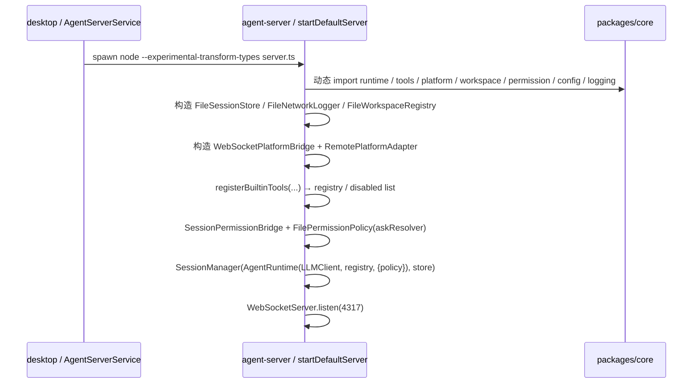

# agent-server

`apps/agent-server` 是本地 WebSocket 会话桥（Node + TypeScript），由 desktop 派生为子进程（详见 [AgentServerService](/Users/mu9/proj/handAgent/apps/desktop/Sources/AppServices/AgentServer/agent-server.md)），监听 `ws://127.0.0.1:4317/api/session`，把 `SessionMessage` 协议帧路由到 core 的 `AgentRuntime`。

## 在分层中的位置

- 上游：`apps/desktop`（用户交互、平台能力）。
- 下游：`packages/core`（runtime、tools、LLM、storage、permission、workspace、logging）。
- 自身职责：组装依赖、维护 socket 生命周期、在 desktop 与 core 之间做协议翻译。

## 文件

| 文件 | 职责 |
|------|------|
| `src/server.ts` | 启动入口；`startServer` 注入式构造，`startDefaultServer` 是组合根（拉起 store / bridge / registry / policy / SessionManager） |
| `src/SessionManager.ts` | 会话生命周期 god class：处理 `user_message` / `list_sessions_request` / `load_session_request` / `delete_session_request`；持久化用户消息、跑 runtime、回流 SessionMessage |
| `src/SettingsBackedLLMClient.ts` | 每次 `complete` 同步读 `~/.spotAgent/settings.json` 重建 `VercelClient`；注入 `FileNetworkLogger` 把 LLM 网络调用 JSONL 落盘 |
| `src/WebSocketPlatformBridge.ts` | 实现 core 的 `PlatformBridge` 接口；通过 `attach(send)` 接管来自 desktop 的反向 socket，按 `requestId` 关联 `platform_request` / `platform_response`，60s 超时 |
| `src/SessionPermissionBridge.ts` | 实现 `FilePermissionPolicy` 的 `AskResolver`：把 `permission_request` 推到 desktop，按 `requestId` 等回 `permission_response`，60s 超时视为 deny |

## 启动序列

## 一条 socket 上的消息分派

`startServer` 在每个连接上做四件事（顺序敏感）：

1. `platform_bridge_hello` → 标记 `isBridge = true`；`bridge.attach(send)` 把这条 socket 当反向 IPC 通道。
2. `platform_response` → `bridge.handleResponse(payload)` 唤醒等待中的 `platform_request`。
3. `permission_response` → `permissionBridge.handleResponse(payload)` 唤醒等待中的审批询问。
4. `user_message`（首次出现）→ `boundSessionId = message.sessionId`，并 `permissionBridge.bindSession(...)` 把这条 socket 注册为该会话的审批回流通道。

随后所有未命中上述分支的消息都交给 `manager.receive(message, send)`，由 `SessionManager` 决定如何处理。

## 与文件系统约定

| 路径 | 写入方 | 读取方 | 说明 |
|------|--------|--------|------|
| `~/.spotAgent/settings.json` | desktop（`AgentSettingsStore`） | agent-server（每次 LLM 请求 sync 读） | 模型配置 + tool allowlist/denylist |
| `~/.spotAgent/sessions/<id>.json` | agent-server（`FileSessionStore`） | agent-server | `PersistedSession` |
| `~/.spotAgent/workspaces.json` | desktop（`WorkspaceSettingsViewModel`） + agent-server（`FileWorkspaceRegistry` 自播种 default） | 双侧 | workspace 注册表 |
| `~/.spotAgent/permissions.json` | agent-server（`FilePermissionPolicy.remember`） | agent-server | 永久权限规则 |
| `~/.spotAgent/log/<YYYY-MM-DD>/network-NNN.jsonl` | agent-server（`FileNetworkLogger`） | 人工排查 | LLM 请求 / 响应 body |

## 编辑此目录的约束

- 不允许 `import` 任何 macOS / browser-only 模块；只用 Node 标准库 + `ws` + 通过相对路径访问 `packages/core/src/...`。
- 不在此处定义跨进程 DTO，全部走 `packages/core/src/protocol/SessionMessage.ts`，避免 desktop 与 server 漂移。
- 新增长驻服务（store / bridge / policy）必须放进 `startDefaultServer`，并通过参数透传给 `startServer`，保持 `startServer` 的可注入构造。
- `SessionManager` 已经吃太多职责，新增功能优先以独立 bridge / policy 形式拆出去，不要继续往 `SessionManager` 里塞。

## 调试建议

- 修改 TS 后必须重启 desktop app（无 hot reload）。
- 报错排查优先看 `~/.spotAgent/log/`（请求 / 响应 body）与 `~/.spotAgent/sessions/<id>.json`（事件审计）。
- 测试：`bash ./scripts/test.sh` 跑 vitest 全量；单文件 `pnpm --filter @handagent/agent-server vitest run <file>`。

## 相关代码与文档

- [server.ts](/Users/mu9/proj/handAgent/apps/agent-server/src/server.ts)
- [SessionManager.ts](/Users/mu9/proj/handAgent/apps/agent-server/src/SessionManager.ts)
- [SessionPermissionBridge.ts](/Users/mu9/proj/handAgent/apps/agent-server/src/SessionPermissionBridge.ts)
- [SettingsBackedLLMClient.ts](/Users/mu9/proj/handAgent/apps/agent-server/src/SettingsBackedLLMClient.ts)
- [WebSocketPlatformBridge.ts](/Users/mu9/proj/handAgent/apps/agent-server/src/WebSocketPlatformBridge.ts)
- 协议参考：[protocol/protocol.md](/Users/mu9/proj/handAgent/packages/core/src/protocol/protocol.md)
- 桌面侧反向 IPC：[PlatformBridge](/Users/mu9/proj/handAgent/apps/desktop/Sources/AppServices/PlatformBridge/platform-bridge.md)
