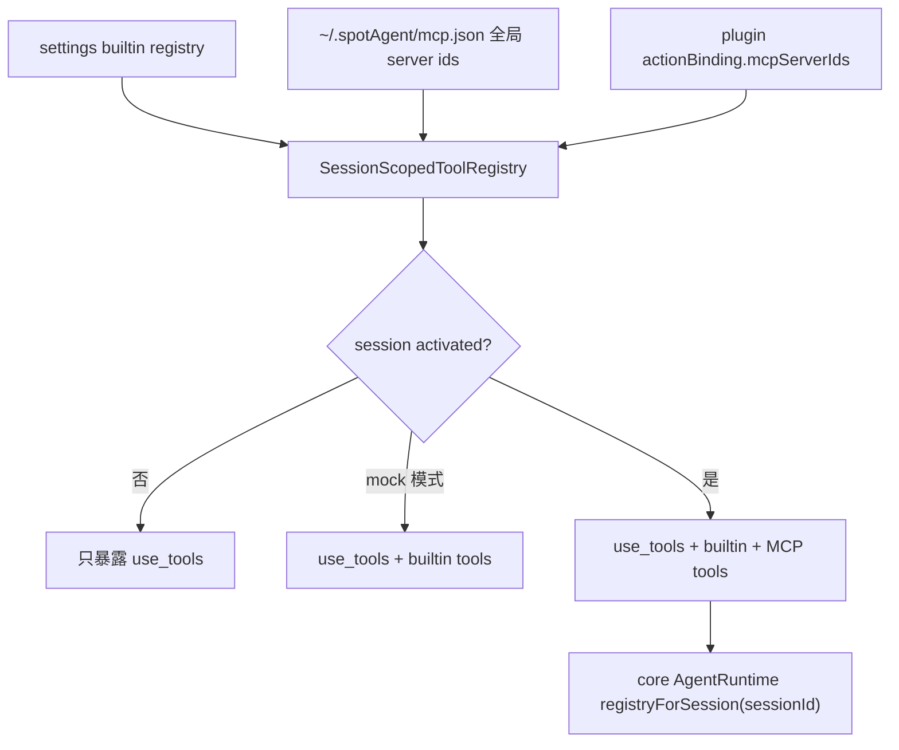

# actions

## 目录职责

`actions/` 管理 session 可用工具集合。它连接三类来源：settings 生成的 builtin tools、`~/.spotAgent/mcp.json` 中的全局 MCP server、plugin action binding 中声明的 session 级 MCP server。它还提供 HandAgent 原生 Computer Use MCP 兼容层。

## 文件

| 文件 | 职责 |
|------|------|
| `ActionBindingResolver.ts` | 校验 `create_session_request.payload.actionBinding`，从 `~/.spotAgent/plugins/<plugin-id>/plugin.json` 重新解析 `mcpServerIds`，不信任 desktop 传入的扩展列表 |
| `MCPServerRegistry.ts` | 按 `serverId` 缓存 MCP client 和适配后的 tools；代理 prompts/resources 能力 |
| `ComputerUseMCPClient.ts` | `computer_use` / `computer-use` server id 的原生兼容实现；暴露 `list_apps` 与 `get_app_state`，底层走 `PlatformAdapter` |
| `SessionScopedToolRegistry.ts` | 为每个 session 维护独立 `ToolRegistry`；处理 `use_tools` 懒加载、全局 MCP、plugin binding MCP、mock LLM 特例和删除清理 |

## 工具组合流



## 关键机制

### action binding 重新读 manifest

```ts
const manifestPath = join(pluginDir, "plugin.json");
const raw = await readFile(manifestPath, "utf8");
const manifest = parsePluginManifest(JSON.parse(raw));

if (manifest.id !== binding.pluginId) {
  throw new Error("plugin id must match directory name");
}
```

desktop 只提交 `{ pluginId, promptName }`。server 端重新读取本地 manifest，并由 core `resolveActionBindingFromManifest()` 判断 prompt 是否可绑定、plugin 是否启用、`mcpServerIds` 是什么。

### MCP client 与 tool cache

```ts
async listTools(serverId: string): Promise<AgentTool[]> {
  const cached = this.toolCache.get(serverId);
  if (cached) return cached;

  const client = await this.getClient(serverId);
  const tools = (await client.listTools()).map(
    (tool) => new MCPToolAdapter({ serverId, tool, callTool: (name, args) => client.callTool(name, args) }),
  );
  this.toolCache.set(serverId, tools);
  return tools;
}
```

`MCPServerRegistry` 让同一个 serverId 复用同一个 initialized client。tools 只适配一次，后续 session 组合时复用 `AgentTool` 包装。

### session 懒激活

```ts
if (this.activated.has(sessionId)) {
  await this.refreshActivated(sessionId, binding, registry);
  return;
}
registry.replaceAll([this.metaTool]);
```

未激活 session 默认只暴露 `use_tools`，减少普通聊天请求里的工具噪音。模型调用 meta-tool 后，core runtime 触发 `activate(sessionId)`，下一轮工具表扩展为 builtin + MCP。

### Computer Use 兼容层

```ts
const app = resolveApp(apps, appQuery);
const windows = await this.options.platform.frontmostWindowList();
const window = resolveWindow(windows, app);
const screenshot = await this.options.platform.captureScreen(
  window?.id !== undefined ? { target: { kind: "window", windowId: window.id } } : {},
);
```

`ComputerUseMCPClient` 不 spawn 外部 Codex 私有 MCP server。它把 Computer Use 形态包装成 MCP client，但实际通过 HandAgent 的 `PlatformAdapter` 走 desktop 原生平台桥。

## 编辑约束

- 新增 plugin action 解析字段时优先放在 core actions 模块，agent-server 只负责读取本地 manifest 并调用 core 解析函数。
- 新增 MCP server transport 时，先扩展 core `MCPClient` / config，再在 `server/createMCPClientFromConfig()` 接入。
- `SessionScopedToolRegistry` 不直接读取磁盘配置；全局 server id 和 binding 都由上游传入。
- 缺失或失败的 MCP server 应记录 skip 日志并保留 builtin tools，不阻断整轮 prompt。

## 下一步阅读

- core MCP 协议：[packages/core/src/mcp/mcp.md](/Users/mu9/proj/handAgent/packages/core/src/mcp/mcp.md)
- core actions 解析：[packages/core/src/actions/actions.md](/Users/mu9/proj/handAgent/packages/core/src/actions/actions.md)
- settings builtin tools：[settings/settings.md](/Users/mu9/proj/handAgent/apps/agent-server/src/settings/settings.md)
