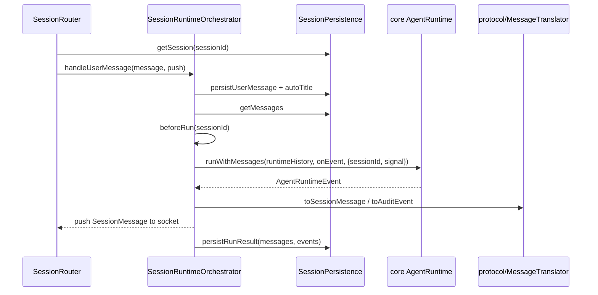

# session

## 目录职责

`session/` 负责会话生命周期：创建/打开/列出/加载/删除 session，把一轮用户消息交给 runtime，按顺序写入持久化消息和审计事件。它是 WebSocket 协议进入 core runtime 前的状态边界。

## 文件

| 文件 | 职责 |
|------|------|
| `SessionRouter.ts` | 处理 `create_session_request`、`open_session`、`list_sessions_request`、`load_session_request`、`delete_session_request`、`user_message`、`interrupt`；只做协议路由和轻量校验 |
| `SessionRuntimeOrchestrator.ts` | 编排一轮 `user_message`：持久化用户消息、自动标题、刷新工具、等待 summary、调用 runtime、转发 event、落库最终 messages/events、处理中断和错误 |
| `SessionPersistence.ts` | `SessionStore` 的唯一直接封装：创建/删除/重命名/读取 session，保存 user message、run result、error，恢复 server 重启后的半截轮次 |

## 一轮 user message



## 关键机制

### Router 只做路由，不跑 runtime

```ts
async receive(message: SessionMessage, push: PushMessage = () => {}): Promise<void> {
  switch (message.type) {
    case "open_session":
      return this.handleOpenSession(message, push);
    case "user_message":
      return this.handleUserMessage(message, push);
    case "interrupt":
      this.orchestrator.interruptSession?.(message.sessionId, push);
      return;
  }
}
```

`SessionRouter` 的上游是 `server/attachSessionSocketHandlers`，下游是 `SessionRuntimeOrchestrator` 和 `SessionPersistence`。它不直接调用 LLM，不直接拼 UI 消息，只决定当前协议帧该交给谁。

### Orchestrator 用 generation 防止旧 run 写回

```ts
const activeRun: ActiveRun = {
  controller: new AbortController(),
  generation: this.nextGeneration + 1,
  interrupted: false,
  interruptionPersisted: false,
};
this.activeRuns.get(sessionId)?.controller.abort();
this.activeRuns.set(sessionId, activeRun);
```

同一 session 新一轮消息会 abort 上一轮，并给本轮分配新的 generation。runtime 事件回调里每次都会检查 `isActive(sessionId, activeRun)`；旧 run 的晚到 token、tool result 或错误不会写入新一轮 UI 和持久化。

### Persistence 恢复半截轮次

```ts
if (lastError?.code === RUN_INTERRUPTED_CODE) {
  return "interrupted";
}
if (lastError) {
  await this.store.setMessages(sessionId, [...session.messages, {
    role: "assistant",
    content: lastError.message,
  }], timestamp);
  return "failed";
}
```

`open_session` 快照前会调用 `recoverIncompleteTurnForSnapshot()`。如果持久化消息最后停在 user message，它会优先复用已有 error 事件补 assistant 消息；只有没有任何可归属错误时，才写入 `run_lost_after_restart`，避免 agent-server 重启后历史里只剩用户消息。

## 状态边界

- `SessionRouter` 只面向协议帧和会话存在性。
- `SessionRuntimeOrchestrator` 只管理当前进程内 active run，不持有 `SessionStore` 之外的磁盘路径。
- `SessionPersistence` 是本目录唯一直接持有 `SessionStore` 的类；新增持久化顺序优先放这里。

## 编辑约束

- 新增 `SessionMessage` 分支优先落在 `SessionRouter`。
- 新增 runtime event 到 UI / audit 的映射不要写进 orchestrator，改 `protocol/MessageTranslator.ts`。
- 中断、删除、重连相关改动必须保留 generation 检查和有限等待边界，避免旧 run 污染已删除 session。

## 下一步阅读

- 协议翻译：[protocol/protocol.md](/Users/mu9/proj/handAgent/apps/agent-server/src/protocol/protocol.md)
- 工具刷新与激活：[actions/actions.md](/Users/mu9/proj/handAgent/apps/agent-server/src/actions/actions.md)
