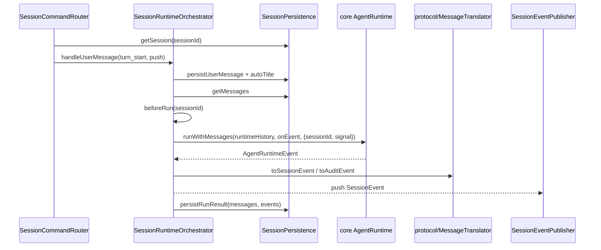
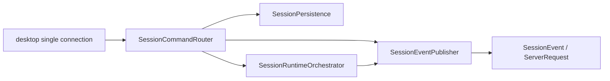

# session

## 目录职责

`session/` 负责会话生命周期：创建、订阅、取消订阅、列出、删除 session，把一轮用户消息交给 runtime，按顺序写入持久化消息和审计事件。它是 `SessionCommand` 进入 core runtime 前的状态边界，也是 `SessionEvent` 对外分发的汇合点。

## 文件

| 文件 | 职责 |
|------|------|
| `SessionCommandRouter.ts` | 处理 `SessionCommand`，协调 `ClientResponse` 回流，调用 orchestrator / persistence，并通过 `SessionEventPublisher` 推送 `SessionEvent` / `ServerRequest` |
| `SessionEventPublisher.ts` | 维护 `connection -> subscribed sessionIds`，在单连接模型下按 `sessionId` fan-out 会话事件 |
| `SessionRuntimeOrchestrator.ts` | 编排一轮 `user_message`：持久化用户消息、自动标题、刷新工具、等待 summary、调用 runtime、转发 event、落库最终 messages/events、处理中断和错误 |
| `SessionPersistence.ts` | `SessionStore` 的唯一直接封装：创建/删除/重命名/读取 session，保存 user message、run result、error，恢复 server 重启后的半截轮次 |

## 一轮 turn_start



## 关键机制

### 主路径：命令路由、编排、事件发布



- `SessionCommandRouter` 是会话主入口，负责 `session_create`、`session_subscribe`、`session_unsubscribe`、`turn_start`、`turn_interrupt`、`sessions_list`、`session_delete`。
- `SessionRuntimeOrchestrator` 只负责编排一轮运行，不维护连接。
- `SessionEventPublisher` 负责维护连接级订阅关系，把 `SessionEvent` / `ServerRequest` 按 `sessionId` 分发。
- 当前主路径不再经过 `SessionRouter`。

### `session_snapshot` 是恢复入口

- `session_subscribe` 会先把当前连接加入 `sessionId` 订阅集合，再读取持久化会话。
- 若该 session 当前未运行，router 会先调用 `recoverIncompleteTurnForSnapshot()` 修复重启前的半截轮次。
- 随后返回 `session_snapshot`，携带当前 `messages` 与 `status`，作为重连恢复与历史打开的统一模型。
- `session_unsubscribe` 只移除当前连接对该 `sessionId` 的订阅；若该连接还是 permission / workspace 的绑定拥有者，server 层会同步解绑并中断对应 run。

### 单连接多 session

- `SessionEventPublisher` 维护 `connectionId -> subscribed sessionIds`。
- 同一条 desktop socket 可以同时订阅多个 session。
- 只要事件带 `sessionId`，publisher 就按订阅关系 fan-out；不带 `sessionId` 的消息按连接直发。
- permission / workspace 请求虽然不属于 `SessionEvent`，但仍复用同一连接路由语义，由 publisher 定向回发给绑定连接。

### Orchestrator 用 generation 防止旧 run 写回

```ts
const activeRun: ActiveRun = {
  controller: new AbortController(),
  generation: this.nextGeneration + 1,
  interrupted: false,
  interruptionPersisted: false,
};
this.activeRuns.get(sessionId)?.controller.abort();
this.activeRuns.set(sessionId, activeRun);
```

同一 session 新一轮消息会 abort 上一轮，并给本轮分配新的 generation。runtime 事件回调里每次都会检查 `isActive(sessionId, activeRun)`；旧 run 的晚到 token、tool result 或错误不会写入新一轮 UI 和持久化。

### Persistence 恢复半截轮次

```ts
if (lastError?.code === RUN_INTERRUPTED_CODE) {
  return "interrupted";
}
if (lastError) {
  await this.store.setMessages(sessionId, [...session.messages, {
    role: "assistant",
    content: lastError.message,
  }], timestamp);
  return "failed";
}
```

`session_snapshot` 发出前会调用 `recoverIncompleteTurnForSnapshot()`。如果持久化消息最后停在 user message，它会优先复用已有 error 事件补 assistant 消息；只有没有任何可归属错误时，才写入 `run_lost_after_restart`，避免 agent-server 重启后历史里只剩用户消息。

## 状态边界

- `SessionCommandRouter` 只面向命令、订阅与会话存在性校验。
- `SessionRuntimeOrchestrator` 只管理当前进程内 active run，不持有 `SessionStore` 之外的磁盘路径。
- `SessionPersistence` 是本目录唯一直接持有 `SessionStore` 的类；新增持久化顺序优先放这里。

## 编辑约束

- 新增 `SessionCommand` 分支优先落在 `SessionCommandRouter`。
- 新增 runtime event 到 `SessionEvent` / audit 的映射不要写进 orchestrator，改 `protocol/MessageTranslator.ts`。
- 中断、删除、重连相关改动必须保留 generation 检查和有限等待边界，避免旧 run 污染已删除 session。

## 下一步阅读

- 协议翻译：[protocol/protocol.md](/Users/mu9/proj/handAgent/apps/agent-server/src/protocol/protocol.md)
- 工具刷新与激活：[actions/actions.md](/Users/mu9/proj/handAgent/apps/agent-server/src/actions/actions.md)
