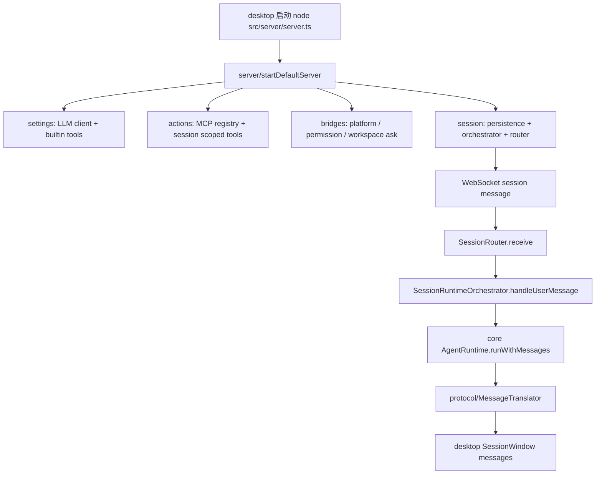

# src

## 目录职责

`apps/agent-server/src` 是本地 Node agent-server 的源码层。它不承载 macOS UI，也不定义 core 协议 DTO；它负责把 desktop WebSocket 消息、core runtime、settings、MCP、权限审批与平台反向 IPC 组装成一个本地会话服务。

## 子目录索引

| 子目录 | 子文档 | 职责 |
|------|------|------|
| `server/` | [server/server.md](/Users/mu9/proj/handAgent/apps/agent-server/src/server/server.md) | 进程入口、WebSocket socket 绑定、组合根与 `~/.spotAgent` 路径解析 |
| `session/` | [session/session.md](/Users/mu9/proj/handAgent/apps/agent-server/src/session/session.md) | 会话路由、一轮 user message 编排、持久化恢复与删除 |
| `protocol/` | [protocol/protocol.md](/Users/mu9/proj/handAgent/apps/agent-server/src/protocol/protocol.md) | core runtime event、会话消息、审计事件与多模态 STUB 的翻译 |
| `settings/` | [settings/settings.md](/Users/mu9/proj/handAgent/apps/agent-server/src/settings/settings.md) | `~/.spotAgent/settings.json` 驱动的 LLM client 与 builtin tool 热加载 |
| `actions/` | [actions/actions.md](/Users/mu9/proj/handAgent/apps/agent-server/src/actions/actions.md) | plugin action binding、全局/会话 MCP、Computer Use 兼容层与 session 级工具表 |
| `bridges/` | [bridges/bridges.md](/Users/mu9/proj/handAgent/apps/agent-server/src/bridges/bridges.md) | desktop 回流桥：平台 RPC、权限审批、workspace 选择 |

## 主运行流

## 边界规则

- 跨进程协议类型只从 `@handagent/core/protocol/*` 引用，不在 `agent-server` 内复制 DTO。
- core 的 runtime、tool、storage、permission、workspace 通过 `@handagent/core/<subpath>` package alias 引用，不使用跨包相对路径。
- `server/` 是组合根；新增长驻服务要先在这里注入，再通过构造函数传给下游目录。
- `session/` 不直接创建 LLM client、MCP client 或 platform adapter；它只消费构造好的 runtime 与 persistence。
- `bridges/` 只负责把 core resolver / bridge 接口映射到 desktop socket，不执行 tool 业务逻辑。

## 推荐阅读顺序

1. 先读 [server/server.md](/Users/mu9/proj/handAgent/apps/agent-server/src/server/server.md)，理解依赖如何被组装。
2. 再读 [session/session.md](/Users/mu9/proj/handAgent/apps/agent-server/src/session/session.md)，理解一条 user message 的生命周期。
3. 再读 [protocol/protocol.md](/Users/mu9/proj/handAgent/apps/agent-server/src/protocol/protocol.md)，理解消息如何给 UI 和审计落盘。
4. 最后按问题域阅读 `settings/`、`actions/`、`bridges/`。
