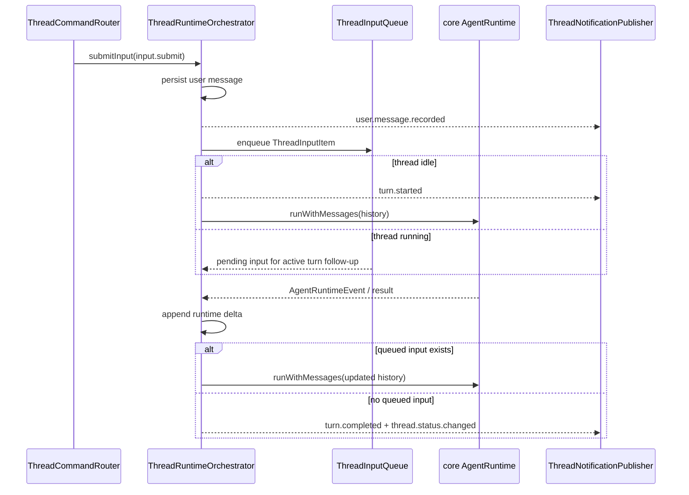

# thread

## 目录职责

`thread/` 负责 thread 生命周期与 turn 编排：创建 thread、恢复 thread、列出 / 删除 thread，把一轮用户输入交给 runtime，并把通知与审计结果写回持久化。

当前文档描述已经提交的 thread socket 协议入口与相关通知：

- `thread.start`
- `thread.resume`
- `thread.list`
- `thread.delete`
- `input.submit`
- `turn.interrupt`
- `workspace.list`
- `workspace.listed`
- `notification`
- `server request`

旧协议里的显式 unsubscribe 语义继续下沉到 [docs/TODO.md](/Users/mu9/proj/handAgent/docs/TODO.md) 跟踪。

## 文件

| 文件 | 职责 |
|------|------|
| `ThreadCommandRouter.ts` | 处理 thread / turn 命令，调用 orchestrator / persistence，并把 notification / server request 推给 publisher |
| `ThreadInputQueue.ts` | thread-local FIFO input item 队列；当前承载用户输入，预留 response item 入口 |
| `ThreadNotificationPublisher.ts` | 维护 `connection -> subscribed threadIds` 的分发表；thread 级消息按 `threadId` 定向，非 thread 级 notification 广播 |
| `ThreadRuntimeOrchestrator.ts` | 维护 per-thread session loop：记录输入、唤醒 runtime、drain queued input、转译通知、处理中断与错误 |
| `ThreadPersistence.ts` | `ThreadStore` 的唯一直接封装：创建 / 删除 / 读取 / 列出 thread，追加用户消息、runtime delta、审计事件，恢复重启前未完成的 turn |

## 常驻输入队列

`input.submit` 是当前用户输入命令，agent-server 内部会先把它归一化为 `ThreadInputItem(kind: "user")`。旧 `turn.start` 不再属于当前 `ThreadCommand`。

运行中收到新的 `input.submit` 不再 abort 当前 run；新输入会立即记录为用户消息，并在当前 active turn 的下一次 follow-up 中进入模型上下文。

## 关键机制

### 命令入口

- `thread.start`：创建 thread，并在当前 `/api/thread` socket 上建立该 thread 的通知路由。
- `thread.resume`：恢复既有 thread，并返回 `thread.snapshot`。
- `thread.list`：返回 `thread.listed`。
- `thread.delete`：删除指定 thread；若该 thread 正在运行，先中断再删。
- `input.submit`：用户输入入口；后端内部归一化为 user input item，idle 时唤醒 session loop，running 时 steer 到 active turn follow-up。
- `turn.interrupt`：中断当前运行中的 turn。
- `workspace.list`：读取 workspace 注册表，并在当前连接返回 `workspace.listed`；未配置 registry 时返回 `thread.error(workspace_registry_not_configured)`。

### `workspace.listed` 是连接级响应

- `workspace.listed` 对应 `workspace.list` 命令，不带 `threadId`，只发给发起命令的连接。
- payload 当前包含 `id`、`name`、`rootPath`，用于 ThreadWindow 展示和选择用户已注册 workspace。

### `thread.snapshot` 是恢复入口

- thread 打开、重连或恢复时，统一走 `thread.resume(threadId)`。
- `thread.resume` 的结果是 `thread.snapshot`，携带当前 `messages` 与 `status`。
- 如果 thread 当前未运行，router 会在返回 snapshot 前尝试恢复重启前的半截 turn，避免历史只停在 user message。

### 连接与通知分发

- `ThreadNotificationPublisher` 维护 `connectionId -> subscribed threadIds`。
- 同一条 React `/api/thread` socket 可以同时接收多个 thread 的通知。
- 带 `threadId` 的 notification / server request 按 thread 定向；不带 `threadId` 的全局 notification 广播给所有连接。
- 文档层面不再承诺显式 unsubscribe 协议；当前若实现中仍保留过渡逻辑，视为待清理内部细节。

### active turn 与 append-only 写回

- 每个 thread 进程内最多一个 active run；session loop 会持续等待该 thread 的输入队列。
- runtime 回调落通知或持久化前都要检查当前 generation；被中断或超时清理的旧 run 的晚到 delta / tool result / error 不得污染当前状态。
- runtime 结果通过 `persistRunDelta` 追加 generated messages 和 events，避免覆盖运行期间已经持久化的新 user input。
- 每轮 runtime 使用稳定输入快照；active run 准备阶段收到的新 input 只进入 follow-up，不会被当前 runtime 和 follow-up 重复处理。

### 中断与重启恢复

- `turn.interrupt` 结束后，notification 侧应收敛为 `turn.completed(status: "interrupted")` 与 `thread.status.changed(value: "interrupted")`。
- 中断会先清理 active pending input；若 `interruptAndWait` 等待 stubborn runtime 清理超时，orchestrator 会关闭旧 session，并把 timeout 等待期间已经持久化的新输入重放到新 session，避免用户输入丢失。
- 若 agent-server 在 turn 运行中重启，`ThreadPersistence` 会在下一次 `thread.resume` 前修复残缺记录：优先复用已有 error 事件，否则补一个明确的恢复失败痕迹。

## 状态边界

- `ThreadCommandRouter`：只处理命令路由、thread 是否存在校验、删除前中断。
- `ThreadRuntimeOrchestrator`：只管理进程内 active run，不直接掌握 socket。
- `ThreadPersistence`：本目录唯一直接持有 `ThreadStore` 的类。
- `ThreadNotificationPublisher`：只负责连接与 thread 维度的消息分发，不做业务判断。

## 编辑约束

- 新增 thread / turn 命令分支优先落在 `ThreadCommandRouter.ts`。
- runtime event 到 notification / 审计事件的翻译不要散落到文档外推断；以 core 协议与实际 translator 为准。
- 旧输入协议不要继续写回本文件；当前输入入口以 `input.submit` 为准。
