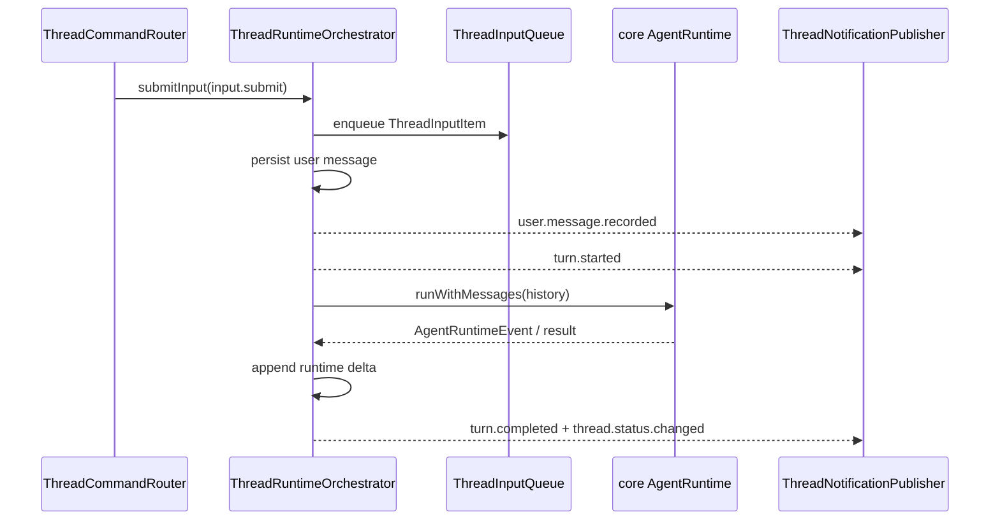

# thread

## 目录职责

`thread/` 负责 `/api/thread` 内部的 thread 生命周期与 turn 编排：创建、恢复、列出、删除 thread，把用户输入交给 runtime，并把通知、审计事件和消息写回持久化。

本目录不持有 WebSocket，也不创建 LLM client、MCP client 或 platform adapter；这些依赖由 `server/` 注入。

## 文件

| 文件 | 职责 |
|------|------|
| `ThreadCommandRouter.ts` | 处理 `ThreadCommand` 路由，保留 `ClientResponse` fallback hooks，调用 orchestrator / persistence，并把 notification 推给 publisher |
| `ThreadInputQueue.ts` | thread-local FIFO input item 队列；当前生产路径承载 idle user input 的 session 唤醒，类型上为后续 response item / 子 agent 通信预留 |
| `ThreadNotificationPublisher.ts` | 维护 `connection -> subscribed threadIds` 的分发表；thread 级消息按 `threadId` 定向，非 thread 级 notification 广播 |
| `ThreadRuntimeOrchestrator.ts` | 维护 per-thread session loop：记录输入、唤醒 runtime、drain queued input、转译通知、处理中断与错误 |
| `ThreadPersistence.ts` | `ThreadStore` 的唯一直接封装：创建 / 删除 / 读取 / 列出 thread，追加用户消息、runtime delta、审计事件，恢复重启前未完成的 turn |

## 常驻输入队列

`input.submit` 是当前普通用户输入命令；公开 `/api/thread` 路由只在目标 thread 非 running 时把它交给 orchestrator。running 时的普通用户 follow-up 由 React 前端排队展示，后端若收到 running `input.submit` 会返回 `thread.error(code: "thread_running")`。旧输入命令不再属于当前 `ThreadCommand`。

运行中普通用户输入不进入后端 session loop；React ThreadWindow 会把它保存在前端队列里，待 `turn.completed` / `thread.status.changed` 后逐条发送新的 `input.submit`。每个 thread 进程内最多一个 active run，晚到 runtime event 必须通过 generation 检查后才能发布或落盘。

## 关键机制

### 命令入口

- `thread.start`：创建 thread，并在当前 `/api/thread` socket 上建立该 thread 的通知路由。
- `thread.resume`：恢复既有 thread，并返回 `thread.snapshot`。
- `thread.list`：返回 `thread.listed`。
- `thread.delete`：删除指定 thread；若该 thread 正在运行，先中断再删。
- `input.submit`：普通用户输入入口；thread 非 running 时进入 orchestrator，running 时 router 返回 `thread.error(code: "thread_running")`，由前端继续持有 queued input。
- `turn.interrupt`：中断当前运行中的 turn。
- `workspace.list`：读取 workspace 注册表，并在当前连接返回 `workspace.listed`；未配置 registry 时返回 `thread.error(workspace_registry_not_configured)`。

### `workspace.listed` 是连接级响应

- `workspace.listed` 对应 `workspace.list` 命令，不带 `threadId`，只发给发起命令的连接。
- payload 当前包含 `id`、`name`、`rootPath`，用于 ThreadWindow 展示和选择用户已注册 workspace。

### `thread.snapshot` 是恢复入口

- thread 打开、重连或恢复时，React 统一发送 `thread.resume(threadId)`。
- `thread.resume` 的结果是 `thread.snapshot`，携带当前 `messages` 与 `status`。
- 如果 thread 当前未运行，router 会在返回 snapshot 前尝试恢复重启前的半截 turn，避免历史只停在 user message。

### 连接与通知分发

- `ThreadNotificationPublisher` 维护 `connectionId -> subscribed threadIds`，但不持有 socket；发送函数由 `server/attachThreadSocketHandlers` 注入。
- Phase 2 起，`ThreadNotificationPublisher` 可接收一个 observer，把每个 `ThreadNotification` 旁路交给 `AgentActivityPublisher`；`ThreadPermissionBridge` / `ThreadWorkspaceAskBridge` 发出的 `ServerRequest` 也会走同一 observer 派生活动状态。observer 发送失败会在 activity 层被隔离，不改变 `/api/thread` 的订阅分发。
- 同一条 React `/api/thread` socket 可以同时接收多个 thread 的通知。
- 带 `threadId` 的 notification / server request 按 thread 定向；不带 `threadId` 的全局 notification 广播给所有连接。
- 当前协议不承诺显式 unsubscribe；tab 关闭是 React 本地订阅状态，不会单独通知 server。

### active turn 与 append-only 写回

- runtime 回调落通知或持久化前都要检查当前 generation；被中断或超时清理的旧 run 的晚到 delta / tool result / error 不得污染当前状态。
- runtime 结果通过 `persistRunDelta` 追加 generated messages 和 events，避免覆盖运行期间已有消息。
- 每轮 runtime 使用稳定输入快照；后续若接入内部 response item / 子 agent 通信，active run 准备阶段收到的内部队列项只进入后续 follow-up，不会被当前 runtime 和 follow-up 重复处理。

### 中断与重启恢复

- `turn.interrupt` 结束后，notification 侧应收敛为 `turn.completed(status: "interrupted")` 与 `thread.status.changed(value: "interrupted")`。
- 中断会先清理 active pending input；若 `interruptAndWait` 等待 stubborn runtime 清理超时，orchestrator 会关闭旧 session，并把 timeout 等待期间已经持久化的新输入重放到新 session，避免用户输入丢失。
- 若 agent-server 在 turn 运行中重启，`ThreadPersistence` 会在下一次 `thread.resume` 前修复残缺记录：优先复用已有 error 事件，否则补一个明确的恢复失败痕迹。

## 状态边界

- `ThreadCommandRouter`：只处理命令路由、thread 是否存在校验、删除前中断。
- `ThreadRuntimeOrchestrator`：只管理进程内 active run，不直接掌握 socket。
- `ThreadInputQueue`：只负责队列和等待者，不做持久化、不判断运行状态。
- `ThreadPersistence`：本目录唯一直接持有 `ThreadStore` 的类；同时负责 user attachment 入库、conversation snapshot 转换和残缺 turn 恢复。
- `ThreadNotificationPublisher`：只负责连接与 thread 维度的消息分发，不做业务判断。

## 编辑约束

- 新增 thread / turn 命令分支优先落在 `ThreadCommandRouter.ts`。
- runtime event 到 notification / 审计事件的翻译归 `protocol/MessageTranslator.ts`。
- 需要 request-response 的能力优先判断是否属于 `/api/thread` 的 `ServerRequest` / `ClientResponse`；不要误挂到 `/api/platform`。
- 旧输入协议不要继续写回本文件；当前输入入口以 `input.submit` 为准。
