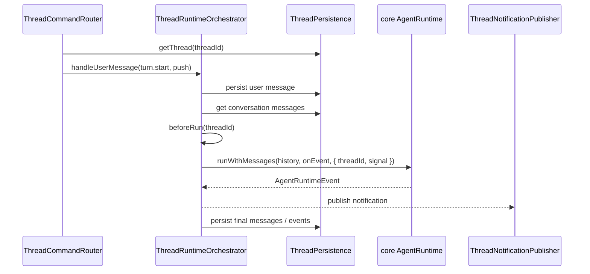

# thread

## 目录职责

`thread/` 负责 thread 生命周期与 turn 编排：创建 thread、恢复 thread、列出 / 删除 thread，把一轮用户输入交给 runtime，并把通知与审计结果写回持久化。

当前文档只描述已经提交的最小协议约束：

- `thread.start`
- `thread.resume`
- `thread.list`
- `thread.delete`
- `turn.start`
- `turn.interrupt`
- `notification`
- `server request`

旧的 session 语义、显式 unsubscribe 语义、以及任何额外命令均不再视为目标协议的一部分，统一下沉到 [docs/TODO.md](/Users/mu9/proj/handAgent/docs/TODO.md) 跟踪。

## 文件

| 文件 | 职责 |
|------|------|
| `ThreadCommandRouter.ts` | 处理 thread / turn 命令，调用 orchestrator / persistence，并把 notification / server request 推给 publisher |
| `ThreadNotificationPublisher.ts` | 维护 `connection -> subscribed threadIds` 的分发表；thread 级消息按 `threadId` 定向，非 thread 级 notification 广播 |
| `ThreadRuntimeOrchestrator.ts` | 编排一轮 `turn.start`：持久化用户消息、等待 summary、调用 runtime、转译通知、处理中断与错误 |
| `ThreadPersistence.ts` | `ThreadStore` 的唯一直接封装：创建 / 删除 / 读取 / 列出 thread，恢复重启前未完成的 turn |

## 一轮 `turn.start`

## 关键机制

### 最小命令入口

- `thread.start`：创建 thread，并在同一连接上建立该 thread 的通知路由。
- `thread.resume`：恢复既有 thread，并返回 `thread.snapshot`。
- `thread.list`：返回 `thread.listed`。
- `thread.delete`：删除指定 thread；若该 thread 正在运行，先中断再删。
- `turn.start`：启动新一轮运行。
- `turn.interrupt`：中断当前运行中的 turn。

### `thread.snapshot` 是恢复入口

- thread 打开、重连或恢复时，统一走 `thread.resume(threadId)`。
- `thread.resume` 的结果是 `thread.snapshot`，携带当前 `messages` 与 `status`。
- 如果 thread 当前未运行，router 会在返回 snapshot 前尝试恢复重启前的半截 turn，避免历史只停在 user message。

### 连接与通知分发

- `ThreadNotificationPublisher` 维护 `connectionId -> subscribed threadIds`。
- 同一条 desktop 连接可以同时接收多个 thread 的通知。
- 带 `threadId` 的 notification / server request 按 thread 定向；不带 `threadId` 的全局 notification 广播给所有连接。
- 文档层面不再承诺显式 unsubscribe 协议；当前若实现中仍保留过渡逻辑，视为待清理内部细节。

### generation 防旧 run 写回

- 同一 thread 启动新一轮 turn 时，会先 abort 旧 run，再分配新的 generation。
- runtime 回调落通知或持久化前都要检查当前 generation；旧 run 的晚到 delta / tool result / error 不得污染新一轮状态。

### 中断与重启恢复

- `turn.interrupt` 结束后，notification 侧应收敛为 `turn.completed(status: "interrupted")` 与 `thread.status.changed(value: "interrupted")`。
- 若 agent-server 在 turn 运行中重启，`ThreadPersistence` 会在下一次 `thread.resume` 前修复残缺记录：优先复用已有 error 事件，否则补一个明确的恢复失败痕迹。

## 状态边界

- `ThreadCommandRouter`：只处理命令路由、thread 是否存在校验、删除前中断。
- `ThreadRuntimeOrchestrator`：只管理进程内 active run，不直接掌握 socket。
- `ThreadPersistence`：本目录唯一直接持有 `ThreadStore` 的类。
- `ThreadNotificationPublisher`：只负责连接与 thread 维度的消息分发，不做业务判断。

## 编辑约束

- 新增 thread / turn 命令分支优先落在 `ThreadCommandRouter.ts`。
- runtime event 到 notification / 审计事件的翻译不要散落到文档外推断；以 core 协议与实际 translator 为准。
- 与旧 session / unsubscribe 兼容相关的内容不要继续写回本文件，统一写入 `docs/TODO.md`。
