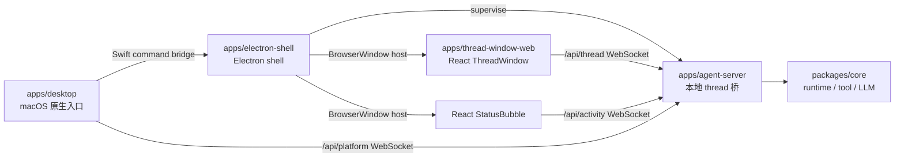

# apps

## 目录职责

`apps` 层负责可执行产品入口与用户交互壳层，不承载跨平台业务规则。

当前包含三个可执行单元和一个 Web 前端包：

- [desktop/desktop.md](/Users/mu9/proj/handAgent/apps/desktop/desktop.md) —— macOS 原生入口（Swift / SwiftUI），负责 PromptPanel、Settings、热键、焦点恢复、平台能力 IPC 和 Electron 生命周期。
- [electron-shell/electron-shell.md](/Users/mu9/proj/handAgent/apps/electron-shell/electron-shell.md) —— Electron UI shell，监督 agent-server，承载 Electron ThreadWindow 和 React StatusBubble。
- [thread-window-web/thread-window-web.md](/Users/mu9/proj/handAgent/apps/thread-window-web/thread-window-web.md) —— React ThreadWindow 前端，由 Electron `BrowserWindow` 承载。
- [agent-server/agent-server.md](/Users/mu9/proj/handAgent/apps/agent-server/agent-server.md) —— 本地 WebSocket thread 桥（Node / TypeScript），由 electron-shell 监督。

## 在整体架构中的位置

## 本层核心流转

### 1. 宿主唤起

- 全局热键由 `KeyboardShortcuts` 库监听（命名表见 [Hotkey](/Users/mu9/proj/handAgent/apps/desktop/Sources/AppServices/Hotkey/hotkey.md)），事件转发给 `AppCoordinator`。
- `PromptPanelController` 负责打开输入面板、聚焦输入框、采集选区附件、提交 prompt。

### 2. Thread 交互

- Electron main 在 agent-server ready 后主动预热隐藏 `BrowserWindow`；PromptPanel show/toggle 不触发 ThreadWindow 预热。
- 用户提交 prompt 后，Swift 通过 command bridge 发送 `thread_window.open_initial_prompt`；打开历史和聚焦分别发送 `thread_window.open_history` / `thread_window.focus`。
- React ThreadWindow 接收初始 prompt 后，通过 `/api/thread` 发送 `thread.start`，收到 `thread.started` 后发送首轮 `input.submit` 和 attachments；后续 composer 追问在 idle 时直接发送 `input.submit`，running 时先在 React 本地 FIFO 排队，等 thread 离开 running 后逐条发送。
- React ThreadWindow 负责 `ThreadCommand` / `ClientResponse` 编码、`ThreadNotification` / `ServerRequest` 接收，以及 tabs、消息、请求面板和 composer 状态。
- ThreadWindow 左侧历史列表通过 thread 协议读取 `~/.spotAgent/threads/`，用于搜索、预览、恢复和删除持久化 thread。

### 3. 平台能力反向 IPC

- `agent-server` 通过 `RemotePlatformAdapter` 调 `PlatformBridge.call`。
- 桌面端 `PlatformBridgeConnectionClient` 连接 `/api/platform`，接收 `platform_request`，交给 `PlatformBridgeService` 派发给 `MacPlatformProvider`，再通过 `/api/platform` 回写 `platform_response`。

### 4. 状态反馈

- Electron ActivityWindow 承载 React StatusBubble；renderer 订阅 `/api/activity`，接收 agent-server 派生的 `AgentActivityEvent`。
- Electron 气泡点击时先请求 Electron main 聚焦 ThreadWindow；无法聚焦时 Electron 回告 Swift 打开 PromptPanel。
- Swift 不订阅 `/api/activity`，也不把完整 ThreadWindow tabs、消息或历史同步到 Swift 状态。

## 本层关键 DTO

- `PromptAttachmentResult`（5 case：textSelection / selectionError / textToken / imageRegion / noAttachment）
- `UserMessageAttachmentPayload`
- `ThreadCommand` / `ThreadNotification` / `ServerRequest` / `ClientResponse`
- `AgentActivityEvent`
- `PlatformBridgeMessage`（含 platform_bridge_hello / platform_request / platform_response）

## 模块边界

- 宿主层不负责编排 LLM/tool 循环。
- `agent-server` 不负责宿主 UI；只用 `~/.spotAgent/settings.json` 与 desktop 交换配置，不直接读宿主进程状态。
- Runtime、tool、平台抽象统一下沉到 `packages/core`。
