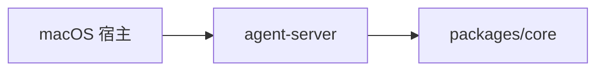

# apps

## 目录职责

`apps` 层负责可执行产品入口与用户交互壳层，不承载跨平台业务规则。

当前仅包含桌面端入口：

- [desktop/desktop.md](/Users/mu9/proj/handAgent/apps/desktop/desktop.md)

## 在整体架构中的位置

## 本层核心流转

### 1. 宿主唤起

- 全局热键由 `HotkeyService` 监听。
- `PromptPanelController` 负责打开输入面板、聚焦输入框和提交 prompt。

### 2. 会话交互

- 用户提交 prompt 后，Swift 宿主创建 `SessionWindow` 与 `SessionViewModel`。
- `SessionSocketClient` 通过 `agent-server` 发送 `SessionMessage`，由后端驱动 `AgentRuntime`。

### 3. 状态反馈

- `SessionRegistry` 聚合最近活跃会话。
- `StatusBubbleController` 根据聚合结果回跳正在运行或最近活跃的窗口。

## 本层关键 DTO

- `PromptAttachmentResult`
- `SessionSummary`
- `SessionMessage`

## 模块边界

- 宿主层不负责编排 LLM/tool 循环。
- `agent-server` 不负责宿主 UI。
- Runtime、tool、平台抽象统一下沉到 `packages`。
