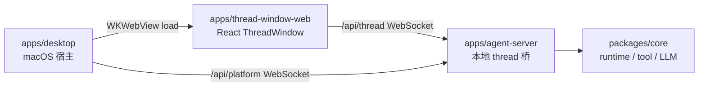

# apps

## 目录职责

`apps` 层负责可执行产品入口与用户交互壳层，不承载跨平台业务规则。

当前包含两个可执行单元和一个 Web 前端包：

- [desktop/desktop.md](/Users/mu9/proj/handAgent/apps/desktop/desktop.md) —— macOS 宿主壳（Swift / SwiftUI）。
- [thread-window-web/thread-window-web.md](/Users/mu9/proj/handAgent/apps/thread-window-web/thread-window-web.md) —— WKWebView 承载的 React ThreadWindow 前端。
- [agent-server/agent-server.md](/Users/mu9/proj/handAgent/apps/agent-server/agent-server.md) —— 本地 WebSocket thread 桥（Node / TypeScript），由 desktop 派生为子进程。

## 在整体架构中的位置

## 本层核心流转

### 1. 宿主唤起

- 全局热键由 `KeyboardShortcuts` 库监听（命名表见 [Hotkey](/Users/mu9/proj/handAgent/apps/desktop/Sources/AppServices/Hotkey/hotkey.md)），事件转发给 `AppCoordinator`。
- `PromptPanelController` 负责打开输入面板、聚焦输入框、采集选区附件、提交 prompt。

### 2. Thread 交互

- 用户提交 prompt 后，`AppCoordinator` 创建或聚焦 `ThreadWindow`。
- Swift `ThreadWindowLifecycle` 创建 `WKWebView`，加载 `apps/thread-window-web` bundle，并注入 `/api/thread` URL 与初始 prompt 队列。
- React ThreadWindow 接收初始 prompt 后，通过 `/api/thread` 发送 `thread.start`，收到 `thread.started` 后发送首轮 `turn.start` 和 attachments；后续 composer 追问也由 React 发送 `turn.start`。
- React ThreadWindow 负责 `ThreadCommand` / `ClientResponse` 编码、`ThreadNotification` / `ServerRequest` 接收，以及 tabs、消息、请求面板和 composer 状态。
- ThreadWindow 左侧历史列表通过 thread 协议读取 `~/.spotAgent/threads/`，用于搜索、预览、恢复和删除持久化 thread。

### 3. 平台能力反向 IPC

- `agent-server` 通过 `RemotePlatformAdapter` 调 `PlatformBridge.call`。
- 桌面端 `PlatformBridgeConnectionClient` 连接 `/api/platform`，接收 `platform_request`，交给 `PlatformBridgeService` 派发给 `MacPlatformProvider`，再通过 `/api/platform` 回写 `platform_response`。

### 4. 状态反馈

- `StatusBubbleController` 的 ViewModel 从 Swift 侧 `ThreadRegistry` 派生 `isRunning` / `latestSummary` / `primaryThreadID`。
- 当前 React ThreadWindow / agent-server 的实时 thread 摘要尚未接入 `ThreadRegistry`；不要把 `ThreadRegistry` 理解为 ThreadWindow tabs 或消息状态源。
- 气泡点击时，若 `ThreadRegistry.primaryThreadID` 存在且全局 ThreadWindow 已打开，则聚焦该窗口；否则回到 PromptPanel。

## 本层关键 DTO

- `PromptAttachmentResult`（5 case：textSelection / selectionError / textToken / imageRegion / noAttachment）
- `ThreadSummary`
- `ThreadCommand` / `ThreadNotification` / `ServerRequest` / `ClientResponse`
- `PlatformBridgeMessage`（含 platform_bridge_hello / platform_request / platform_response）

## 模块边界

- 宿主层不负责编排 LLM/tool 循环。
- `agent-server` 不负责宿主 UI；只用 `~/.spotAgent/settings.json` 与 desktop 交换配置，不直接读宿主进程状态。
- Runtime、tool、平台抽象统一下沉到 `packages/core`。
