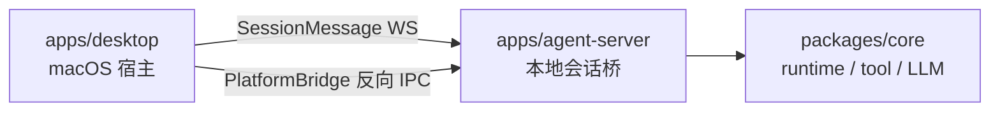

# apps

## 目录职责

`apps` 层负责可执行产品入口与用户交互壳层，不承载跨平台业务规则。

当前包含两个独立可执行单元：

- [desktop/desktop.md](/Users/mu9/proj/handAgent/apps/desktop/desktop.md) —— macOS 宿主壳（Swift / SwiftUI）。
- [agent-server/agent-server.md](/Users/mu9/proj/handAgent/apps/agent-server/agent-server.md) —— 本地 WebSocket 会话桥（Node / TypeScript），由 desktop 派生为子进程。

## 在整体架构中的位置

## 本层核心流转

### 1. 宿主唤起

- 全局热键由 `KeyboardShortcuts` 库监听（命名表见 [Hotkey](/Users/mu9/proj/handAgent/apps/desktop/Sources/AppServices/Hotkey/hotkey.md)），事件转发给 `AppCoordinator`。
- `PromptPanelController` 负责打开输入面板、聚焦输入框、采集选区附件、提交 prompt。

### 2. 会话交互

- 用户提交 prompt 后，`AppCoordinator` 创建 `SessionWindow` 与 `SessionViewModel`。
- `SessionSocketClient` 通过 `agent-server` 发送 `SessionMessage`，由后端 `SessionRouter` 路由并交给 `SessionRuntimeOrchestrator` 驱动 `AgentRuntime`。

### 3. 平台能力反向 IPC

- `agent-server` 通过 `RemotePlatformAdapter` 调 `PlatformBridge.call`。
- 桌面端 `PlatformBridgeService` 监听独立 WebSocket，把 `platform_request` 派发给 `MacPlatformProvider`。

### 4. 状态反馈

- `SessionRegistry` 聚合最近活跃会话。
- `StatusBubbleController` 根据聚合结果回跳正在运行或最近活跃的窗口。

## 本层关键 DTO

- `PromptAttachmentResult`（5 case：textSelection / selectionError / textToken / imageRegion / noAttachment）
- `SessionSummary`
- `SessionMessage`（含 user_message / assistant_message_* / tool_message / permission_request / platform_request 等共 17 个变体）

## 模块边界

- 宿主层不负责编排 LLM/tool 循环。
- `agent-server` 不负责宿主 UI；只用 `~/.spotAgent/settings.json` 与 desktop 交换配置，不直接读宿主进程状态。
- Runtime、tool、平台抽象统一下沉到 `packages/core`。
