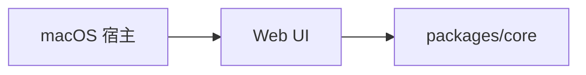

# apps

## 目录职责

`apps` 层负责可执行产品入口与用户交互壳层，不承载跨平台业务规则。

当前仅包含桌面端入口：

- [desktop/desktop.md](/Users/mu9/proj/handAgent/apps/desktop/desktop.md)

## 在整体架构中的位置

## 本层核心流转

### 1. 宿主唤起

- 全局热键由 `HandAgentApp.swift` 中的 `HotkeyMonitor` 监听。
- `DesktopController` 控制窗口显隐，并把 prompt 打开事件发给 Web。

### 2. Web 交互

- `Web/App.tsx` 接收宿主事件，展示输入框与状态消息。
- 用户提交 prompt 后，由 Web 层构造 `AgentSession` 并调用 `AgentRuntime`。

## 本层关键 DTO

- `PromptPayload`
- `HostStatusPayload`
- `BubblePayload`
- `PromptState`
- `HostStatus`
- `BubbleItem`

## 模块边界

- 宿主层不负责编排 LLM/tool 循环。
- Web 层不直接访问平台 API。
- Runtime、tool、平台抽象统一下沉到 `packages`。
