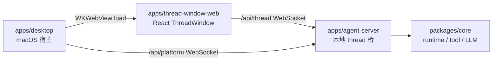

# apps

## 目录职责

`apps` 层负责可执行产品入口与用户交互壳层，不承载跨平台业务规则。

当前包含两个可执行单元和一个 Web 前端包：

- [desktop/desktop.md](/Users/mu9/proj/handAgent/apps/desktop/desktop.md) —— macOS 宿主壳（Swift / SwiftUI）。
- [thread-window-web/thread-window-web.md](/Users/mu9/proj/handAgent/apps/thread-window-web/thread-window-web.md) —— WKWebView 承载的 React ThreadWindow 前端。
- [agent-server/agent-server.md](/Users/mu9/proj/handAgent/apps/agent-server/agent-server.md) —— 本地 WebSocket thread 桥（Node / TypeScript），由 desktop 派生为子进程。

## 在整体架构中的位置

## 本层核心流转

### 1. 宿主唤起

- 全局热键由 `KeyboardShortcuts` 库监听（命名表见 [Hotkey](/Users/mu9/proj/handAgent/apps/desktop/Sources/AppServices/Hotkey/hotkey.md)），事件转发给 `AppCoordinator`。
- `PromptPanelController` 负责打开输入面板、聚焦输入框、采集选区附件、提交 prompt。

### 2. Thread 交互

- 用户提交 prompt 后，`AppCoordinator` 创建或聚焦 `ThreadWindow`。
- Swift `ThreadWindowLifecycle` 创建 `WKWebView`，加载 `apps/thread-window-web` bundle，并注入 `/api/thread` URL 与初始 prompt 队列。
- React ThreadWindow 接收初始 prompt 后，通过 `/api/thread` 发送 `thread.start`，收到 `thread.started` 后发送首轮 `input.submit` 和 attachments；后续 composer 追问也由 React 发送 `input.submit`，运行中输入会进入 active turn 的队列。
- React ThreadWindow 负责 `ThreadCommand` / `ClientResponse` 编码、`ThreadNotification` / `ServerRequest` 接收，以及 tabs、消息、请求面板和 composer 状态。
- ThreadWindow 左侧历史列表通过 thread 协议读取 `~/.spotAgent/threads/`，用于搜索、预览、恢复和删除持久化 thread。

### 3. 平台能力反向 IPC

- `agent-server` 通过 `RemotePlatformAdapter` 调 `PlatformBridge.call`。
- 桌面端 `PlatformBridgeConnectionClient` 连接 `/api/platform`，接收 `platform_request`，交给 `PlatformBridgeService` 派发给 `MacPlatformProvider`，再通过 `/api/platform` 回写 `platform_response`。

### 4. 状态反馈

- `StatusBubbleController` 的 ViewModel 从 Swift 侧 `ThreadRegistry` 派生 `isRunning` / `latestSummary` / `primaryThreadID`。
- 当前 React ThreadWindow / agent-server 的实时 thread 摘要尚未接入 `ThreadRegistry`；不要把 `ThreadRegistry` 理解为 ThreadWindow tabs 或消息状态源。
- 气泡点击时，若 `ThreadRegistry.primaryThreadID` 存在且全局 ThreadWindow 已打开，则聚焦该窗口；否则回到 PromptPanel。

## 本层关键 DTO

- `PromptAttachmentResult`（5 case：textSelection / selectionError / textToken / imageRegion / noAttachment）
- `ThreadSummary`
- `ThreadCommand` / `ThreadNotification` / `ServerRequest` / `ClientResponse`
- `PlatformBridgeMessage`（含 platform_bridge_hello / platform_request / platform_response）

## 近期重构经验

最近一次 `codex/swift-refactor-review` 重构主要落在 `apps/desktop`，目标是优先清理 SwiftUI 层的自维护实现与字符串状态：

- Settings 模型页把 provider / API 选择从自绘 `HStack + Button` 改为系统 segmented `Picker`，API Key 输入改为 `SecureField`；Workspace 添加目录从直接创建 `NSOpenPanel` 改为 SwiftUI `fileImporter`。
- Settings 容器把 tab 字符串收敛为 `SettingsTab` enum，并抽出 `SettingsListSection` 复用列表分割线逻辑，避免多个页面重复 `Array(enumerated())`。
- ThreadWindow 已迁移到 React；旧 Swift ViewModel 中的 `ThreadRunStatus` 经验只作为历史重构记录保留。
- Theme 环境值从手写 `EnvironmentKey` 改为 SwiftUI `@Entry`；StatusBubble 补了首次出现时 running 动画启动和 accessibility action。

可复用经验：

- 涉及 SwiftUI 视图或 macOS 窗口交互时，先查 SwiftUI 相关技能与最新 API 参考，再按模块文档里的 AppKit 约束落地。
- 优先用系统控件承接交互语义，但要先读模块文档里的 AppKit 约束；例如 StatusBubble 文档明确说明整块包成 `Button` 会吞掉拖拽手势，所以这次保留 `onTapGesture`，只补 accessibility。
- 协议字符串不要直接扩散到 UI 层；跨进程 DTO 保持兼容，宿主内部用 enum / struct 承接，类型错误尽量变成编译错误。
- 重复行列表、分割线、tab 元数据这类 UI 结构应抽成小型共享 View 或 enum；这比在每个页面复制索引判断更容易维护。
- 改动系统交互方式时必须同步对应 `<dir>.md`，例如 `WorkspaceSettingsView` 改成 `fileImporter` 后，`Settings/settings.md` 也要同时更新。
- apps 层改动通常要同时跑 TypeScript 与 Swift 校验：`bash ./scripts/test.sh`、`bash ./scripts/swiftw test`、`bash ./scripts/swiftw build`。

## 模块边界

- 宿主层不负责编排 LLM/tool 循环。
- `agent-server` 不负责宿主 UI；只用 `~/.spotAgent/settings.json` 与 desktop 交换配置，不直接读宿主进程状态。
- Runtime、tool、平台抽象统一下沉到 `packages/core`。
