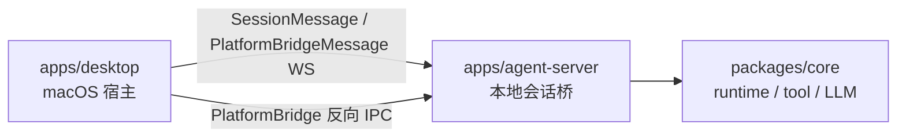

# apps

## 目录职责

`apps` 层负责可执行产品入口与用户交互壳层，不承载跨平台业务规则。

当前包含两个独立可执行单元：

- [desktop/desktop.md](/Users/mu9/proj/handAgent/apps/desktop/desktop.md) —— macOS 宿主壳（Swift / SwiftUI）。
- [agent-server/agent-server.md](/Users/mu9/proj/handAgent/apps/agent-server/agent-server.md) —— 本地 WebSocket 会话桥（Node / TypeScript），由 desktop 派生为子进程。

## 在整体架构中的位置

## 本层核心流转

### 1. 宿主唤起

- 全局热键由 `KeyboardShortcuts` 库监听（命名表见 [Hotkey](/Users/mu9/proj/handAgent/apps/desktop/Sources/AppServices/Hotkey/hotkey.md)），事件转发给 `AppCoordinator`。
- `PromptPanelController` 负责打开输入面板、聚焦输入框、采集选区附件、提交 prompt。

### 2. 会话交互

- 用户提交 prompt 后，`AppCoordinator` 创建 `SessionWindow` 与 `SessionViewModel`。
- `SessionSocketClient` 通过 `agent-server` 发送 `SessionMessage`，由后端 `SessionRouter` 路由并交给 `SessionRuntimeOrchestrator` 驱动 `AgentRuntime`。
- SessionWindow 左侧历史列表读取 `~/.spotAgent/sessions/`，用于搜索、预览、恢复和删除持久化会话。

### 3. 平台能力反向 IPC

- `agent-server` 通过 `RemotePlatformAdapter` 调 `PlatformBridge.call`。
- 桌面端 `PlatformBridgeService` 监听独立 WebSocket，把 `platform_request` 派发给 `MacPlatformProvider`。

### 4. 状态反馈

- `SessionRegistry` 聚合最近活跃会话。
- `StatusBubbleController` 根据聚合结果回跳正在运行或最近活跃的窗口。

## 本层关键 DTO

- `PromptAttachmentResult`（5 case：textSelection / selectionError / textToken / imageRegion / noAttachment）
- `SessionSummary`
- `SessionMessage`（含 user_message / assistant_message_* / tool_message / permission_request 等会话帧）
- `PlatformBridgeMessage`（含 platform_bridge_hello / platform_request / platform_response）

## 近期重构经验

最近一次 `codex/swift-refactor-review` 重构主要落在 `apps/desktop`，目标是优先清理 SwiftUI 层的自维护实现与字符串状态：

- Settings 模型页把 provider / API 选择从自绘 `HStack + Button` 改为系统 segmented `Picker`，API Key 输入改为 `SecureField`；Workspace 添加目录从直接创建 `NSOpenPanel` 改为 SwiftUI `fileImporter`。
- Settings 容器把 tab 字符串收敛为 `SettingsTab` enum，并抽出 `SettingsListSection` 复用列表分割线逻辑，避免多个页面重复 `Array(enumerated())`。
- SessionWindow 新增 `SessionRunStatus`，WebSocket 协议边界仍接收原始字符串，但进入 ViewModel 后立即归一化为枚举，UI 只用 `.isRunning` / `.rawValue`，避免散落比较 `"running"` / `"failed"`。
- Theme 环境值从手写 `EnvironmentKey` 改为 SwiftUI `@Entry`；StatusBubble 补了首次出现时 running 动画启动和 accessibility action。

可复用经验：

- 涉及 SwiftUI 视图或 macOS 窗口交互时，先查 SwiftUI 相关技能与最新 API 参考，再按模块文档里的 AppKit 约束落地。
- 优先用系统控件承接交互语义，但要先读模块文档里的 AppKit 约束；例如 StatusBubble 文档明确说明整块包成 `Button` 会吞掉拖拽手势，所以这次保留 `onTapGesture`，只补 accessibility。
- 协议字符串不要直接扩散到 UI 层；跨进程 DTO 保持兼容，宿主内部用 enum / struct 承接，类型错误尽量变成编译错误。
- 重复行列表、分割线、tab 元数据这类 UI 结构应抽成小型共享 View 或 enum；这比在每个页面复制索引判断更容易维护。
- 改动系统交互方式时必须同步对应 `<dir>.md`，例如 `WorkspaceSettingsView` 改成 `fileImporter` 后，`Settings/settings.md` 也要同时更新。
- apps 层改动通常要同时跑 TypeScript 与 Swift 校验：`bash ./scripts/test.sh`、`bash ./scripts/swiftw test`、`bash ./scripts/swiftw build`。

## 模块边界

- 宿主层不负责编排 LLM/tool 循环。
- `agent-server` 不负责宿主 UI；只用 `~/.spotAgent/settings.json` 与 desktop 交换配置，不直接读宿主进程状态。
- Runtime、tool、平台抽象统一下沉到 `packages/core`。
