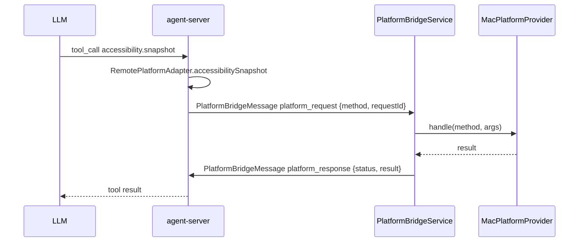

# PlatformBridge

`PlatformBridgeService` 在桌面 App 进程内开一条独立 WebSocket，向 `agent-server` 发送 `channel: "platform"` 的 `platform_bridge_hello` 之后接管 `platform_request` / `platform_response` 这条反向通道，让 server 通过 `RemotePlatformAdapter` 调用 macOS 原生能力（剪贴板 / 前台 App / 窗口列表等）。

设计关键：

- **独立连接**：与会话窗口的 socket 区分，避免 platform 通道被会话生命周期影响。
- **provider 注入**：`MacPlatformProvider` 实现 macOS 原生能力；UI 层只关心 service 生命周期。
- **能力分级**：clipboard / app / window / screen 已落地（`NSPasteboard` / `NSWorkspace` / `CGWindowListCopyWindowInfo` / `ScreenCaptureKit SCScreenshotManager`）；`ocr.read` 走 Vision 文本识别；`accessibility.snapshot` / `accessibility.action` 走 Accessibility API。
- **权限边界**：`screen.capture` 依赖「屏幕录制」权限，枚举内容失败时返回 `permission_denied` 并提示到系统设置授权。Accessibility 能力调用前用 `AXIsProcessTrustedWithOptions(false)` 检查，不主动弹系统权限框；未授权时返回 `permission_denied`，提示用户到「系统设置 → 隐私与安全性 → 辅助功能」允许 HandAgent。
- **上下文边界**：`ocr.read` 只处理 tool 入参里的 `imageBase64`，不会默认读取屏幕、剪贴板或文件；需要先由用户主动提供图片或由 LLM 显式调用 `screen.capture` 获得图片后再传入。
- **Accessibility 快照限制**：快照返回 `role` / `label` / `title` / `value` / `description` / `frame` / `elementId` / `children`，默认限制深度与子节点数量，上限为 `maxDepth=6`、`maxChildren=50`，避免一次返回巨大无障碍树。
- **Accessibility 动作限制**：`accessibility.action` 支持 `press`、`click`、`set_value`。元素定位优先使用快照返回的 `elementId`，格式为 `pid:<pid>;path:<childIndex.childIndex>`；`click` 先尝试 AX press，不支持时再按元素 frame 中心点发送鼠标事件。
- **重连**：连接断开后 2s 自动重连，避免 server 重启后桌面端需要手动恢复。

调用链：

文件：

- `PlatformBridgeService.swift`：负责 WebSocket 维护、`channel: "platform"` 握手、JSON 编解码、自动重连。
- `MacPlatformProvider.swift`：实际能力实现；新增 macOS 能力时在此扩展。

真实 App QA 步骤：

1. 启动桌面端并确认 agent-server 已连接：`bash ./scripts/swiftw run HandAgentDesktop`。
2. 在「系统设置 → 隐私与安全性 → 辅助功能」允许 HandAgent；如要通过 `screen.capture` 生成 OCR 图片，也在「屏幕录制」里允许 HandAgent。
3. 打开一个包含可读文本的图片或先用区域截图 tool 获取图片，让 LLM 调用 `ocr.read`，确认返回 `text` 和 `lines[].confidence`，且缺少 `imageBase64` 时返回 `invalid_argument`。
4. 打开 TextEdit 或系统设置作为前台 App，让 LLM 调用 `accessibility.snapshot`，目标 `{ "kind": "frontmost_app" }`，确认返回有限层级的 `children`，节点包含 `role`、可读 label/value 和可复用 `elementId`。
5. 选择一个快照里可操作的按钮或文本框，让 LLM 用该 `elementId` 调用 `accessibility.action`：按钮验证 `press` 或 `click`，文本框验证 `set_value`。
6. 临时移除 HandAgent 辅助功能权限后重复 snapshot/action，确认返回 `permission_denied`，文案指向「系统设置 → 隐私与安全性 → 辅助功能」。
