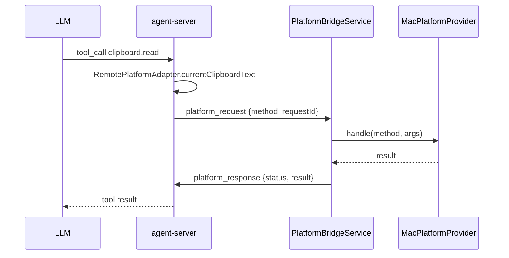

# PlatformBridge

`PlatformBridgeService` 在桌面 App 进程内开一条独立 WebSocket，向 `agent-server` 发送 `platform_bridge_hello` 之后接管 `platform_request`/`platform_response` 这条反向通道，让 server 通过 `RemotePlatformAdapter` 调用 macOS 原生能力（剪贴板 / 前台 App / 窗口列表等）。

设计关键：

- **独立连接**：与会话窗口的 socket 区分，避免 platform 通道被会话生命周期影响。
- **provider 注入**：`MacPlatformProvider` 实现 macOS 原生能力；UI 层只关心 service 生命周期。
- **能力分级**：clipboard / app / window / screen 四项已落地（`NSPasteboard` / `NSWorkspace` / `CGWindowListCopyWindowInfo` / `ScreenCaptureKit SCScreenshotManager`）；ocr / accessibility 暂返回 `not_implemented`，待后续扩展。
- **重连**：连接断开后 2s 自动重连，避免 server 重启后桌面端需要手动恢复。

调用链：

文件：

- `PlatformBridgeService.swift`：负责 WebSocket 维护、`platform_bridge_hello` 握手、JSON 编解码、自动重连。
- `MacPlatformProvider.swift`：实际能力实现；新增 macOS 能力时在此扩展。
