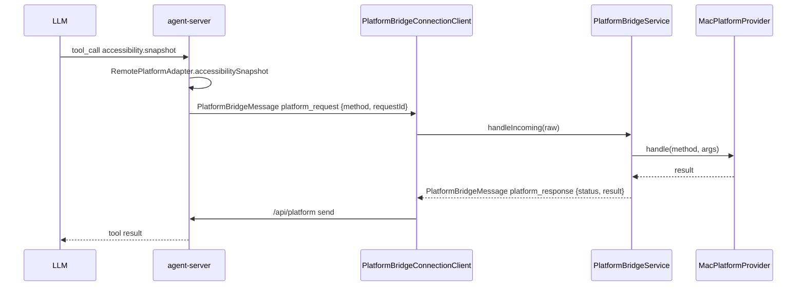

# PlatformBridge

`PlatformBridgeService` 是桌面 App 进程内的平台请求处理器。`PlatformBridgeConnectionClient` 建立到 `ws://127.0.0.1:4317/api/platform` 的独立 WebSocket，连接成功后发送 `channel: "platform"` 的 `platform_bridge_hello`，并把收到的 `platform_request` 分派给 `PlatformBridgeService`。service 调用 `MacPlatformProvider` 后编码 `platform_response`，仍通过 `/api/platform` 连接回到 agent-server。

设计关键：

- **独立连接，独立语义**：platform RPC 只使用 `/api/platform`，不与 React ThreadWindow 的 `/api/thread` 共享 WebSocket。
- **provider 注入**：`MacPlatformProvider` 实现 macOS 原生能力；UI 层只关心 service 生命周期，不直接调用 provider。
- **能力分级**：clipboard / app / window / screen 已落地（`NSPasteboard` / `NSWorkspace.runningApplications` / `CGWindowListCopyWindowInfo` / `ScreenCaptureKit SCScreenshotManager`）；`ocr.read` 走 Vision 文本识别；`accessibility.snapshot` / `accessibility.action` 走 Accessibility API。`app.list` 是内部平台桥能力，当前主要供 `ComputerUseMCPClient` 兼容层实现 `mcp.computer_use.list_apps`。
- **权限边界**：`screen.capture` 依赖「屏幕录制」权限，枚举内容失败时返回 `permission_denied` 并提示到系统设置授权。Accessibility 能力调用前用 `AXIsProcessTrustedWithOptions(false)` 检查，不主动弹系统权限框；未授权时返回 `permission_denied`，提示用户到「系统设置 → 隐私与安全性 → 辅助功能」允许 HandAgent。
- **上下文边界**：`ocr.read` 只处理 tool 入参里的 `imageBase64`，不会默认读取屏幕、剪贴板或文件；需要先由用户主动提供图片或由 LLM 显式调用 `screen.capture` 获得图片后再传入。
- **Accessibility 快照限制**：快照返回 `role` / `label` / `title` / `value` / `description` / `frame` / `elementId` / `children`，默认限制深度与子节点数量，上限为 `maxDepth=6`、`maxChildren=50`，避免一次返回巨大无障碍树。
- **Accessibility 动作限制**：`accessibility.action` 支持 `press`、`click`、`set_value`。元素定位优先使用快照返回的 `elementId`，格式为 `pid:<pid>;path:<childIndex.childIndex>`；`click` 先尝试 AX press，不支持时再按元素 frame 中心点发送鼠标事件。
- **重连归属**：断线与自动重连由 `/api/platform` 的 `AppServerConnection` 负责；重连成功后 `PlatformBridgeConnectionClient` 会重新发送 `platform_bridge_hello`。

调用链：

文件：

- `PlatformBridgeService.swift`：负责 `channel: "platform"` 请求过滤、JSON 编解码、provider 调用和 `platform_response` 构造。
- `MacPlatformProvider.swift`：实际能力实现；新增 macOS 能力时在此扩展。

## 编辑此目录的约束

- 新增平台能力时先扩 `MacPlatformProvider.handle(method:args:)` 的分派与解析，再同步 core 侧 `PlatformAdapter` / protocol 文档。
- 不要把 platform RPC 混入 `/api/thread`；Swift 宿主只处理 `channel: "platform"` 的消息。
- 需要真实系统权限的行为不放进自动化测试主路径，实机步骤维护到 `docs/manual-qa.md`。
