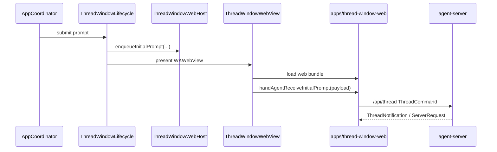

# ThreadWindow

`ThreadWindow` 目录现在只保留 Swift 侧的 WKWebView host。ThreadWindow 的 UI 状态、历史、tabs、消息、请求面板和 composer 都由 `apps/thread-window-web` 的 React 前端管理。

## 文件

| 文件 | 职责 |
|------|------|
| `ThreadWindowWebHost.swift` | 保存 web app URL、`/api/thread` WebSocket URL 和待注入的初始 prompt 队列 |
| `ThreadWindowWebView.swift` | 创建 `WKWebView`，注入 `window.handAgentThreadWindowConfig`，页面加载完成后调用 `window.handAgentReceiveInitialPrompt(...)` |
| `UserMessageAttachmentPayload.swift` | Swift 到 React 初始 prompt attachment DTO |

## 数据流

## 边界

- Swift 不再持有 ThreadWindow tab/message/history 状态。
- Swift 不发送 `ThreadCommand`，不解析 `ThreadNotification`，不回执 `ClientResponse`。
- Swift 只负责 `NSWindow` 生命周期、`WKWebView` 加载、注入配置和初始 prompt。
- React 直接连接 `/api/thread`，用 `zustand + immer` 作为 ThreadWindow 状态源。
- 首版不做 StatusBubble 摘要同步。

## 编辑此目录的约束

- 不要重新引入旧 Swift ThreadWindow view、view model、reducer、event bus 或 Swift thread protocol client。
- 新增 Swift 代码只能服务 WebView host、资源加载、初始 prompt 注入或窗口生命周期。
- 改动初始 prompt payload 时，同时更新 `apps/thread-window-web/src/protocol/threadProtocol.ts` 和相关测试。
- 改动 WebView 注入配置时，运行 `bash ./scripts/swiftw test --filter ThreadWindowWebHostTests`。

## 相关文档

- React 前端：[apps/thread-window-web/thread-window-web.md](/Users/mu9/proj/handAgent/apps/thread-window-web/thread-window-web.md)
- Swift AppServer：[agent-server.md](/Users/mu9/proj/handAgent/apps/desktop/Sources/AppServices/AgentServer/agent-server.md)
- 平台桥：[platform-bridge.md](/Users/mu9/proj/handAgent/apps/desktop/Sources/AppServices/PlatformBridge/platform-bridge.md)
