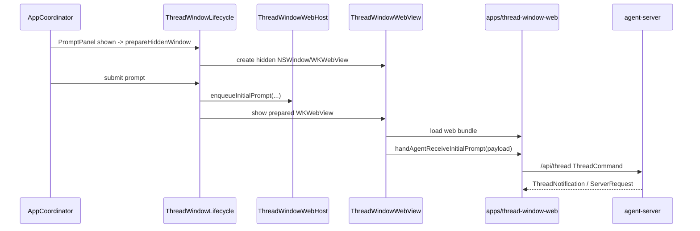

# ThreadWindow

`ThreadWindow` 目录现在只保留 Swift 侧的 WKWebView host。ThreadWindow 的 UI 状态、历史、tabs、消息、请求面板和 composer 都由 `apps/thread-window-web` 的 React 前端管理。

## 文件

| 文件 | 职责 |
|------|------|
| `ThreadWindowWebHost.swift` | 保存 web app URL、`/api/thread` WebSocket URL 和待注入的初始 prompt 队列；配置脚本会在 document start 安装 early receiver，避免 React 尚未挂载时丢失初始 prompt |
| `ThreadWindowWebView.swift` | 创建 `WKWebView`，注入 `window.handAgentThreadWindowConfig`，页面加载完成后调用 `window.handAgentReceiveInitialPrompt(...)` |
| `UserMessageAttachmentPayload.swift` | Swift 到 React 初始 prompt attachment DTO |

## 数据流

Swift 在 `WKUserScript.atDocumentStart` 注入 `window.handAgentThreadWindowConfig` 时，也会初始化 `window.handAgentPendingInitialPrompts` 和临时 `window.handAgentReceiveInitialPrompt`。如果 `WKNavigationDelegate.didFinish` 早于 React `useEffect` 安装正式 receiver，初始 prompt 会先进入 pending 队列；React 启动后由 `installInitialPromptReceiver` flush，再发送 `thread.start` 和首轮 `turn.start`。改动这个桥时必须同时覆盖 Swift 配置脚本和 React native config 测试。

## 隐藏预热

- `PromptPanel` 显示后，Coordinator 会在下一轮 main runloop 调用 `ThreadWindowLifecycle.prepareHiddenWindow`。
- 预热只创建隐藏的 `NSWindow/WKWebView` 并加载 web bundle，不注入初始 prompt，不显示窗口，不激活 App，不把 ThreadWindow 计入 `.regular` 激活策略。
- 用户提交 prompt 或打开历史时才会真实显示窗口；若预热窗口已存在，会复用同一个 `ThreadWindowWebHost` 和 `WKWebView`。
- agent-server 不可用时不做预热，避免隐藏 WebView 加载不可达的 `/thread-window/index.html`。

## 调试前提

- 仅通过全局快捷键打开 `PromptPanel`，会触发隐藏 WebView 预热，但不会显示 ThreadWindow，也不会创建新 thread。
- 新 thread 的加载链路只会在以下入口触发：
  - 用户在 `PromptPanel` 中输入内容并提交（回车）；
  - Coordinator 显式调用历史入口 `openOrFocusHistory(...)`。
- 因此排查 `ThreadWindow` 白屏、`WKWebView` 导航、React 首屏渲染等问题时，可以先打开 `PromptPanel` 观察隐藏预热日志；但要验证 `thread.start / turn.start` 仍必须完成一次真实提交。

## 边界

- Swift 不再持有 ThreadWindow tab/message/history 状态。
- Swift 不发送 `ThreadCommand`，不解析 `ThreadNotification`，不回执 `ClientResponse`。
- Swift 只负责 `NSWindow` 生命周期、`WKWebView` 加载、注入配置和初始 prompt。
- 默认加载入口是 `http://127.0.0.1:4317/thread-window/index.html`。本地 React 静态资源由 `agent-server` 在同端口按 `/thread-window/*` 提供，避免 `file://` 下 `type="module"` bundle 在 `WKWebView` 中不执行导致白屏。
- React 直接连接 `/api/thread`，用 `zustand + immer` 作为 ThreadWindow 状态源。
- 首版不做 StatusBubble 摘要同步。

## 编辑此目录的约束

- 不要重新引入旧 Swift ThreadWindow view、view model、reducer、event bus 或 Swift thread protocol client。
- 新增 Swift 代码只能服务 WebView host、资源加载、初始 prompt 注入或窗口生命周期。
- 改动初始 prompt payload 时，同时更新 `apps/thread-window-web/src/protocol/threadProtocol.ts` 和相关测试。
- 改动 WebView 注入配置时，运行 `bash ./scripts/swiftw test --filter ThreadWindowWebHostTests`，并运行 `pnpm --filter handagent-thread-window-web test nativeConfig.test.ts`。

## 相关文档

- React 前端：[apps/thread-window-web/thread-window-web.md](/Users/mu9/proj/handAgent/apps/thread-window-web/thread-window-web.md)
- Swift AppServer：[agent-server.md](/Users/mu9/proj/handAgent/apps/desktop/Sources/AppServices/AgentServer/agent-server.md)
- 平台桥：[platform-bridge.md](/Users/mu9/proj/handAgent/apps/desktop/Sources/AppServices/PlatformBridge/platform-bridge.md)
