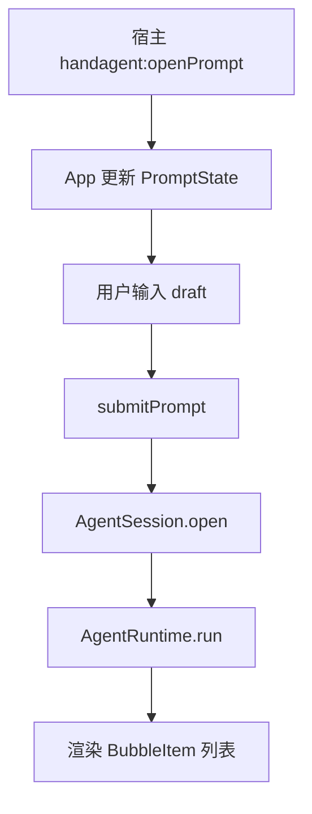

# Web

## 目录职责

`apps/desktop/Web` 是桌面 Agent 的前端交互层，负责宿主事件接收、prompt 输入、气泡渲染，以及把用户请求送入 core runtime。

## 核心模块

- `App.tsx`：页面状态中心，负责事件订阅、prompt 提交、结果渲染。
- `bridge.ts`：定义宿主桥接事件名和 Web 侧 DTO。
- `BubbleList.tsx`：负责展示用户与 assistant 气泡。
- `main.tsx`：挂载 React 应用。

## 前端调用链路

## 核心状态结构

### `PromptState`

- `visible: boolean`
- `prefill: string`

### `HostStatus`

- `hotkeyAvailable: boolean`
- `message: string`

### `BubbleItem`

- `id: string`
- `text: string`
- `kind?: "user" | "assistant"`

## 与 core 的衔接点

### 会话输入

Web 层当前调用：

- `AgentSession.open({ prompt: nextPrompt })`

这意味着当前版本已经把 prompt 送入 core，但还没有把宿主选区结果真正接进来。

### runtime 调用

Web 层当前直接创建：

- `new AgentRuntime(new VercelClient(), new ToolRegistry())`

这说明：

- LLM client 已接到前端提交链路。
- tool registry 已预留，但当前尚未注册真实 tool。

## 当前数据流特点

- 用户输入先进入 `draft`。
- 提交后会追加一条用户 `BubbleItem`。
- runtime 返回的 `AgentBubble[]` 会被映射为 assistant `BubbleItem[]`。
- 失败时以 assistant 气泡形式展示错误消息。
