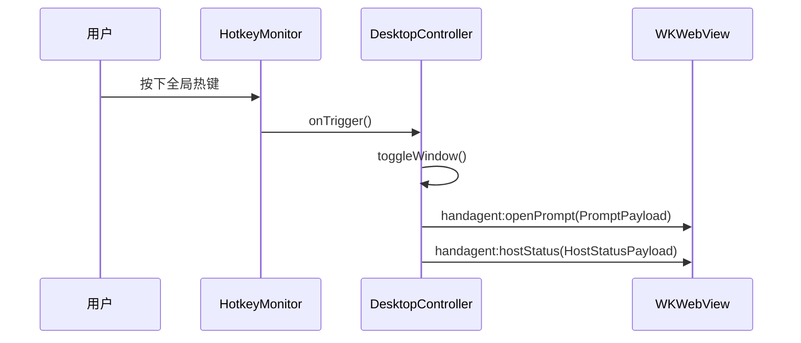

# desktop

## 目录职责

`apps/desktop` 是 macOS 宿主层，负责应用生命周期、窗口管理、热键监听和 `WKWebView` 桥接。

下级文档入口：

- [Web/Web.md](/Users/mu9/proj/handAgent/apps/desktop/Web/Web.md)

## 核心模块

### `HandAgentApp.swift`

- `HandAgentApp`：SwiftUI 程序入口。
- `AppDelegate`：应用启动后初始化宿主控制器。
- `DesktopController`：窗口、WebView、原生拖拽区、宿主状态、事件分发的中心控制器。
- `HotkeyMonitor`：注册全局热键并触发 `onTrigger` 回调。

## 宿主调用链路

## 宿主核心 DTO

### `PromptPayload`

- `visible: Bool`
- `prefill: String`

作用：

- 通知 Web 输入框是否打开。
- 把宿主预填文本传入输入框。

### `HostStatusPayload`

- `hotkeyAvailable: Bool`
- `message: String`

作用：

- 把热键注册结果与当前宿主提示文案同步给 Web。

### `BubblePayload`

- `id: String`
- `text: String`

作用：

- 预留宿主主动向 Web 追加气泡消息的桥接载体。

## 对下游的约束

- 宿主层只通过事件和 JSON payload 与 Web 通信。
- 宿主层不组装 LLM 消息，不读取 runtime 内部状态。
- 宿主层不直接执行 tool 编排。
