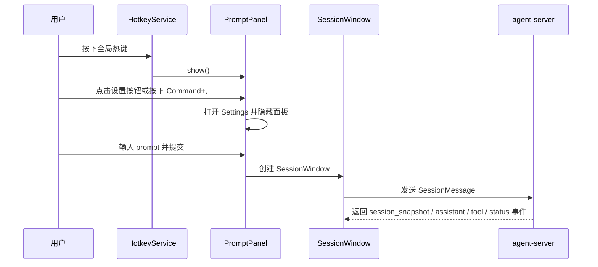

# desktop

## 目录职责

`apps/desktop` 是 macOS 宿主层，负责应用生命周期、PromptPanel、SessionWindow、状态气泡和热键监听。

## 核心模块

### `HandAgentApp.swift`

- `HandAgentApp`：SwiftUI 程序入口。
- `AppDelegate`：应用启动后初始化服务、面板、会话窗口和状态气泡，并根据是否存在打开中的 `SessionWindow` 在 `.accessory` / `.regular` 激活策略之间切换，确保有会话窗口时可通过 `Command+Tab` 回到应用。
- `Settings` scene：承载模型配置页，写入 `~/.spotAgent/settings.json`。

### `Sources/AppServices`

- `AppServices`：组装宿主依赖。
- `AgentServerService`：启动和停止本地 `agent-server` 进程。
- `AgentSettingsStore`：加载、保存模型设置，并把 `model / apiKey / baseUrl / api` 编码到 `~/.spotAgent/settings.json`。
- `AgentSettingsView`：渲染设置页表单。
- `HotkeyService`：注册全局热键并触发 `onTrigger` 回调。
- `SessionRegistry`：维护会话摘要与最近活跃顺序。

### `Sources/PromptPanel`

- `PromptPanelController`：管理面板生命周期与 prompt 提交。
- `PromptPanelView`：渲染输入框、设置入口和 action 列表。
- `PromptAction`：定义 action 数据结构与过滤逻辑。

### `Sources/Settings`

- `ShortcutSettingsView`：渲染全局热键与 `PromptAction` 快捷键配置页。
- `ShortcutRecorderView`：负责录制和清空快捷键。

### `Sources/SessionWindow`

- `SessionWindowController`：管理单个会话窗口与 SwiftUI 内容。
- `SessionViewModel`：消费 WebSocket 事件并维护消息列表、状态和错误。
- `SessionSocketClient`：负责与 `agent-server` 建立会话级 WebSocket 连接。

### `Sources/StatusBubble`

- `StatusBubbleController`：管理状态气泡展示与回跳。
- `StatusBubbleView`：渲染气泡内容与点击区域。

## 宿主调用链路

## 宿主核心 DTO

### `SessionSummary`

- `sessionId: String`
- `isRunning: Bool`
- `latestSummary: String`
- `lastActiveAt: Date`
- `windowIsOpen: Bool`

作用：

- 为状态气泡和会话回跳提供聚合摘要。

## 对下游的约束

- 宿主层只通过 `WebSocket + SessionMessage` 与 TS 边界通信。
- 宿主层不组装 LLM 消息，不读取 runtime 内部状态。
- 宿主层不直接执行 tool 编排。
- 快捷键配置只保存在宿主层本地，不下沉到 runtime。
