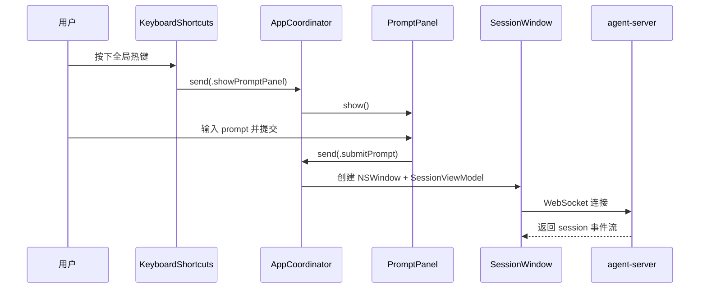

# desktop

## 目录职责

`apps/desktop` 是 macOS 宿主层，负责应用生命周期、PromptPanel、SessionWindow、状态气泡和热键监听。

## 架构概览

采用 **AppCoordinator + ViewModel + Theme** 三层架构：

- **AppCoordinator**：单向事件流（`send(.action)`），管理全局状态和模块间协调。
- **ViewModel**（`@Observable`）：每个 View 模块的状态和交互逻辑。
- **Theme**：通过 `@Environment(\.appTheme)` 注入全局设计 token（颜色/字体/间距）。
- **Styles**：ViewModifier 文件，封装可复用的样式组合。

所有 `ObservableObject` / `@Published` / Combine 已迁移为 Observation 框架的 `@Observable`。

## 目录结构

```
HandAgentApp.swift          — @main 入口，纯 Scene 声明
Sources/
  Coordinator/
    AppCoordinator.swift    — 单向事件流，全局状态协调
  Theme/
    AppTheme.swift          — 颜色/字体/间距 token
    ThemeEnvironment.swift  — EnvironmentKey + View extension
  PromptPanel/
    PromptPanelController.swift — 纯窗口管理
    PromptPanelView.swift       — 纯 UI + Theme + ViewModel 绑定
    PromptPanelViewModel.swift  — 状态 + 交互逻辑
    PromptPanelStyles.swift     — ViewModifier
    PromptPanelWindow.swift     — NSPanel 子类
    PromptAction.swift          — action 数据结构与过滤
  SessionWindow/
    SessionViewModel.swift      — @Observable，消费 WebSocket 事件
    SessionWindowView.swift     — 纯 UI + Theme
    SessionStyles.swift         — ViewModifier
    SessionSocketClient.swift   — WebSocket 连接
  StatusBubble/
    StatusBubbleController.swift — 窗口管理 + ViewModel 注入
    StatusBubbleView.swift       — 纯 UI + Theme + ViewModel
    StatusBubbleViewModel.swift  — 状态逻辑
    StatusBubbleStyles.swift     — ViewModifier
  Settings/
    SettingsView.swift           — TabView 容器
    AgentSettingsViewModel.swift — 设置逻辑代理
    ShortcutSettingsView.swift   — 快捷键配置页
  AppServices/
    AgentServer/AgentServerService.swift
    AgentSettings/AgentSettingsStore.swift, AgentSettingsView.swift
    Lifecycle/AppActivationPolicyCoordinator.swift
    Hotkey/GlobalShortcutNames.swift
    Session/SessionRegistry.swift
    AppServices.swift
TestsSwift/
  AppThemeTests.swift
  PromptPanelViewModelTests.swift
  AppCoordinatorTests.swift
  AgentSettingsViewModelTests.swift
  StatusBubbleViewModelTests.swift
  SessionViewModelTests.swift
  SessionRegistryTests.swift
  AgentSettingsStoreTests.swift
  AppActivationPolicyCoordinatorTests.swift
  PromptActionTests.swift
```

## 核心模块

### `HandAgentApp.swift`

- `HandAgentApp`：SwiftUI 程序入口，持有 `AppCoordinator` 作为 `@State`。
- `Settings` scene：仅保留空占位，真实设置页由 `AppCoordinator` 以独立 `NSWindow` 托管。
- 不再使用 `AppDelegate`，所有初始化由 `AppCoordinator.bootstrap()` 完成。

### `Sources/Coordinator`

- `AppCoordinator`：`@Observable`，通过 `send(_ action:)` 接收事件，管理 PromptPanel、SessionWindow、SettingsWindow、StatusBubble、AgentServer 的生命周期。非测试模式下 `init` 自动调用 `bootstrap()`。

### `Sources/Theme`

- `AppTheme`：定义 `ThemeColors`、`ThemeTypography`、`ThemeSpacing` token。
- `ThemeEnvironment`：通过 `EnvironmentKey` 注入，所有 View 通过 `@Environment(\.appTheme)` 访问。

### `Sources/PromptPanel`

- `PromptPanelViewModel`：`@Observable`，管理 draft、action 过滤、提交逻辑。
- `PromptPanelController`：纯窗口管理，接收 ViewModel 后创建 NSPanel。
- `PromptPanelView`：纯 UI，绑定 ViewModel + Theme。
- `PromptPanelStyles`：`PromptPanelContainerModifier`、`ActionRowModifier`。

### `Sources/SessionWindow`

- `SessionViewModel`：`@Observable`，消费 WebSocket 事件并维护消息列表、状态和错误。
- `SessionWindowView`：纯 UI + Theme，使用 `messageBubble(role:)` modifier。
- `SessionStyles`：`MessageBubbleModifier`。
- `SessionSocketClient`：负责与 `agent-server` 建立会话级 WebSocket 连接。

### `Sources/StatusBubble`

- `StatusBubbleViewModel`：`@Observable`，从 `SessionRegistry` 派生 `isRunning` / `latestSummary`。
- `StatusBubbleController`：管理状态气泡窗口，注入 ViewModel。
- `StatusBubbleView`：纯 UI + Theme。
- `StatusBubbleStyles`：`StatusBubbleContainerModifier`。

### `Sources/Settings`

- `SettingsView`：TabView 容器，包含"模型"和"快捷键"两个 Tab。
- `AgentSettingsViewModel`：`@Observable`，代理 `AgentSettingsStore` 的读写。
- `AgentSettingsView`：纯 UI + Theme + ViewModel 绑定。
- `ShortcutSettingsView`：渲染全局热键与 PromptAction 快捷键配置。

### `Sources/AppServices`

- `AgentServerService`：启动和停止本地 `agent-server` 进程。
- `AgentSettingsStore`：`@Observable`，加载、保存模型设置到 `~/.spotAgent/settings.json`。
- `SessionRegistry`：`@Observable`，维护会话摘要与最近活跃顺序。
- `AppActivationPolicyCoordinator`：根据打开的 SessionWindow 与 SettingsWindow 状态切换激活策略。

## 宿主调用链路



## 宿主核心 DTO

### `SessionSummary`

- `sessionId: String`
- `isRunning: Bool`
- `latestSummary: String`
- `lastActiveAt: Date`
- `windowIsOpen: Bool`

作用：为状态气泡和会话回跳提供聚合摘要。

## 对下游的约束

- 宿主层只通过 `WebSocket + SessionMessage` 与 TS 边界通信。
- 宿主层不组装 LLM 消息，不读取 runtime 内部状态。
- 宿主层不直接执行 tool 编排。
- 快捷键配置只保存在宿主层本地，不下沉到 runtime。
