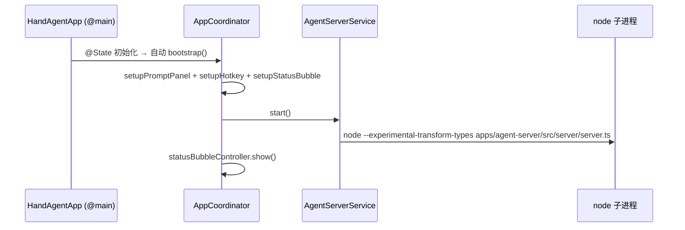
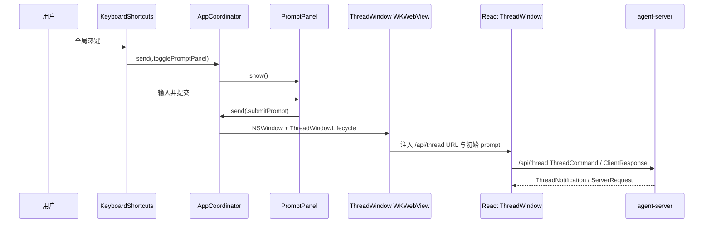

# desktop

`apps/desktop` 是 macOS 宿主层：应用生命周期、PromptPanel、全局唯一 WKWebView ThreadWindow、StatusBubble、Settings 与全局热键。

## 架构红线（编辑此目录前必读）

新代码必须遵守以下约束。违反约束的改动应被回退或在合并前重设计。

### 1. 状态：Observation 框架（`@Observable`）

- **不要**新增 `ObservableObject` / `@Published` / `@StateObject` / `@ObservedObject` / Combine。所有状态类用 `@Observable`，View 用 `@Bindable`、`@State`。
- 非状态依赖（store、registry、回调闭包、socket client）用 `@ObservationIgnored` 标注，避免无意义的 SwiftUI 重渲染。
- `@MainActor` 用在 UI 相关的 `@Observable` 类（ViewModel / Registry / Settings store）；纯进程/IO 服务保持非 MainActor。

### 2. 模块布局：View + ViewModel + Controller + Styles

原生 SwiftUI UI 模块（PromptPanel / StatusBubble / Settings）按四件套拆分：

- **View**：纯 SwiftUI，只读 ViewModel 状态、消费 `@Environment(\.appTheme)`，不直接调 `NSEvent` / `NSPanel` / 系统 API。
- **ViewModel**：`@Observable` 状态机；不持有 `View` / `Color` / `Font`；跨模块意图通过闭包出口（`onSubmit` / `onTap` / `onHide`）暴露。
- **Controller**（仅当模块需要 `NSPanel` / `NSWindow` 自定义生命周期时）：纯窗口与事件监听层，不写业务逻辑。
- **Styles**：跨 View 复用的 `ViewModifier`。一次性样式直接写在 View 里，避免 ViewModifier 爆炸。

`ThreadWindow` 已迁到 React，Swift 侧只保留 `NSWindow/WKWebView` host、配置注入和 initial prompt 队列，不再按 Swift ViewModel / reducer / message view 方式扩展。

### 3. 协调：AppCoordinator 单向事件流

- 全局唯一 `AppCoordinator`（`@Observable @MainActor`）由 `HandAgentApp` 持有为 `@State`。
- 模块间一切协调通过 `coordinator.send(.action)`，禁止 `NotificationCenter` / 全局单例 / 直接调 Coordinator 的 private 方法绕开。
- 新增协调行为：在 `AppCoordinator.Action` 枚举显式增分支；新窗口生命周期优先下沉到独立 lifecycle 控制器，子模块通过闭包注入接入。
- 测试态用 `AppCoordinator(services: AppServices.testing(...))` 注入 nop 服务，跳过窗口/进程/激活策略副作用；非测试态 `init()` 自动装配生产 `AppServices` 并 `bootstrap()`。

### 4. 视觉：Theme token

- Swift `Theme` token 是原生 SwiftUI 界面的视觉主入口；新增可复用颜色、字体、间距、圆角、动画时长时，优先扩 `theme.colors.*` / `theme.typography.*` / `theme.spacing.*` / `theme.radius.*` / `theme.animation.*`。
- 当前代码里仍存在局部 SwiftUI layout 数值，例如窗口尺寸、一次性 padding 或定位偏移；修文档和新代码时按模块逐步收敛，不把阶段性状态写成绝对禁令。
- 当前 SwiftUI 原生界面通过 Swift `Theme` 映射根目录 `DESIGN.md` 的 warm-canvas / coral / dark product surface 视觉语言，目标 macOS 15+，不为旧系统加 fallback。
- React ThreadWindow 的视觉 token 不走 Swift `Theme`，由 [thread-window-web.md](/Users/mu9/proj/handAgent/apps/thread-window-web/thread-window-web.md) 和根目录 `DESIGN.md` 约束。

### 5. 输入边界（产品红线）

- 只有用户主动输入和用户主动选区可以作为 thread 初始上下文；屏幕 / 窗口 / 文件 / 剪贴板 / App 状态一律通过 tool 按需读取。
- 宿主层不组装 LLM 消息、不读取 runtime 内部状态、不直接执行 tool 编排。ThreadWindow 的 thread 协议由 React 前端通过 `/api/thread` 处理；Swift 宿主只通过 `/api/platform` 处理平台能力 RPC。
- 快捷键配置只保存在宿主层本地（UserDefaults，由 `KeyboardShortcuts` 库管理），不下沉到 runtime。

### 6. 点击区域：视觉边界 = 可交互边界

- 用户看到的可视区域（背景色、hover 高亮、圆角裁切）必须与实际可点击区域完全一致。
- 典型错误：`Button` 只包裹了内部文字/图标，外层容器虽有 `.contentShape` 和 hover 效果但没有绑定 tap action，导致"看起来能点但点不动"。
- 正确做法：将 tap 行为（`onTapGesture` 或 `Button`）绑定在**定义视觉边界的那一层**，而不是内部子元素。确保 `.contentShape(Rectangle())` 与 tap gesture 在同一层级。
- 审查清单：新增可交互组件时，确认 `background` / `clipShape` / `frame` 所在层级同时拥有对应的 tap action。如果 hover 区域能响应但点击不能，说明 hit area 和 action 分离了。

### 7. 测试与验证

- `TestsSwift/` 按 `Sources/` 目录结构分组；每个 ViewModel / 协调器都有对应 `*Tests.swift`，共享测试辅助放在 `TestsSwift/TestSupport/`。
- 新增 ViewModel 必须配测试；不把依赖系统权限或真实屏幕状态的 spike 放进自动化测试，真实平台能力走 `docs/manual-qa.md` 与模块 QA 步骤。
- 提交前在当前 shell 跑：`bash ./scripts/swiftw test` + `bash ./scripts/swiftw build` + `bash ./scripts/test.sh`。Stop hook 不跑 Swift 校验，必须手动。

### 8. macOS 15+ 能力策略

- 桌面端默认直接面向 `macOS 15+` 能力设计，不再为了旧系统保留 `if #available` 分支或命令行 fallback。
- 屏幕与窗口采集优先使用 `ScreenCaptureKit`，包括窗口/应用/显示器级过滤、截图与后续可扩展的流式采集能力。
- 与系统控制相关的能力优先使用原生 macOS API，例如 `Accessibility`、`NSWorkspace`、`ScreenCaptureKit`、`AppKit/SwiftUI` 提供的窗口分享与内容选择接口。
- 只有在原生 API 明确无法覆盖需求时，才退回 `osascript` 或其他兼容性方案；若采用退回方案，必须在设计或实现文档中说明原因。
- 新增桌面能力时，默认目标是"尽可能支持系统已提供的高能力接口"，例如系统级内容选择器、窗口级共享、录制或更完整的 accessibility 读写能力。

## 目录索引

`apps/desktop` 的直接子节点：

- `HandAgentApp.swift` — SwiftUI `@main` 入口。
- `Sources/` — Swift 源码目录；具体模块由各自目录下已有 `<dir>.md` 继续说明。
- `TestsSwift/` — Swift 测试目录。
- `Web/` — desktop 侧 Web 资源目录。
- `desktop.md` — 本文件。

## 入口与启动流程

`HandAgentApp.swift` 是 SwiftUI `@main`：

- 持有 `AppCoordinator` 为 `@State`；非测试态 `init` 自动 `bootstrap()`。
- `Settings` scene 仅放空占位，实际设置窗口由 Coordinator 用 `NSWindow` 托管（需要主动 `openOrFocus` 控制）。
- `CommandGroup(replacing: .appSettings)` 把 ⌘, 路由到 `coordinator.send(.openSettings)`。

当 `HANDAGENT_ELECTRON_SHELL=1` 时，`AppServices.defaultAppServer` 改用 `ElectronBackedAppServer`。此路径下 Swift 不直接启动 `AgentServerService`，而是启动 Electron shell；Electron shell 再作为唯一 supervisor 启动 agent-server，并在隐藏 ThreadWindow 预热完成后向 Swift 回报 `thread_window.prepared`。PromptPanel 的可提交状态仍由 `AgentServerHealth` 控制，真实提交窗口仍是 Swift `WKWebView` ThreadWindow。

## 主调用链路

## 跨层数据

### `~/.spotAgent/settings.json`

desktop 与 agent-server 共享的模型和 builtin tool 配置文件。desktop 侧由 [AgentSettings](/Users/mu9/proj/handAgent/apps/desktop/Sources/AppServices/AgentSettings/agent-settings.md) 读写；agent-server 在下一次 LLM 请求或 tool registry 刷新时按文件戳读取，无需重启。

### `PromptAttachmentResult` / `ActionDefinition`

`PromptAttachmentResult` 是 PromptPanel 提交时能进入 initial prompt 的用户主动附件，只包含 5 类：`.noAttachment`、`.textToken`、`.textSelection`、`.imageRegion`、`.selectionError`。屏幕、剪贴板、App 状态不能在这里默认注入。

`ActionDefinition` 来自 `~/.spotAgent/plugins/*/plugin.json` 的 `prompts[]`。desktop 负责 trigger、参数和 template 的本地渲染；plugin action 会把 `{ pluginId, promptName }` 作为 `actionBinding` 随 initial prompt 发给 React，再由 agent-server 重新校验 manifest 并持久化 thread 绑定。

### `ThreadSummary`

`ThreadSummary` 只服务 Swift 侧 `ThreadRegistry` 和 StatusBubble 回跳，不是 React ThreadWindow 的 tabs、消息或运行态来源。实时 thread UI 状态属于 `apps/thread-window-web`。

## 注意事项

- agent-server 是 desktop app fork 的长驻子进程，**修改 TS 源码必须重启 desktop app**，无 hot reload。
- `AgentServerService` 已实现指数退避重启（最多 5 次），多次失败时通过 `onFatalError` 回调上抛 Coordinator 弹原生 alert（详见 [agent-server.md](Sources/AppServices/AgentServer/agent-server.md)）。
- 设置窗口与 Thread 窗口共享 `AppActivationPolicyCoordinator`，全部关闭后 app 切回 `.accessory`。
- desktop 不再持有 thread client。`ThreadWindowLifecycle` 只创建或聚焦 `WKWebView`，并把初始 prompt 队列注入 React。
- React ThreadWindow 负责 `/api/thread` 上的 command / notification / request / response 编解码和 UI 状态。
- `PlatformBridgeConnectionClient` 连接 `/api/platform`，发送 `platform_bridge_hello`，并把 `platform_request` 分派给 `PlatformBridgeService`。
