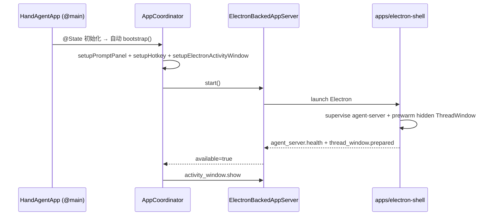
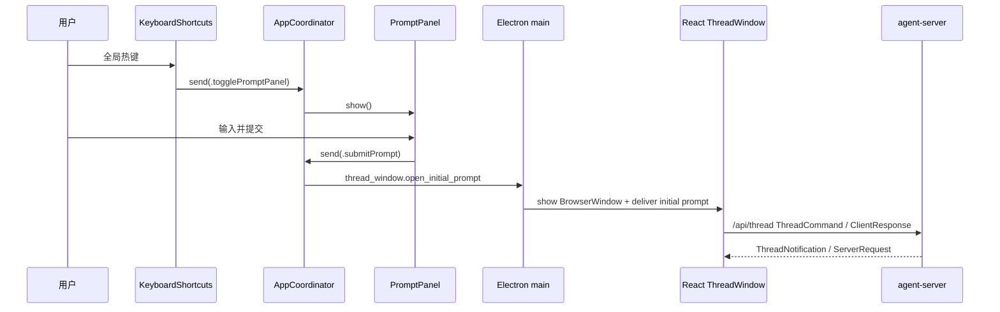

# desktop

`apps/desktop` 是 macOS 原生入口层：应用生命周期、PromptPanel、Settings、全局热键、焦点恢复、平台能力桥，以及 Swift 到 Electron 的 command bridge。ThreadWindow、StatusBubble 和 agent-server supervision 都由 `apps/electron-shell` 承载。

## 架构红线（编辑此目录前必读）

### 1. 状态：Observation 框架（`@Observable`）

- **不要**新增 `ObservableObject` / `@Published` / `@StateObject` / `@ObservedObject` / Combine。所有状态类用 `@Observable`，View 用 `@Bindable`、`@State`。
- 非状态依赖（store、回调闭包、socket client）用 `@ObservationIgnored` 标注，避免无意义的 SwiftUI 重渲染。
- `@MainActor` 用在 UI 相关的 `@Observable` 类；纯进程/IO 服务保持非 MainActor。

### 2. 原生 UI 范围

Swift 原生 UI 只保留 PromptPanel 和 Settings：

- **PromptPanel**：全局热键唤起、输入、用户主动附件采集、提交。
- **Settings**：模型、外观主题、工具、Plugin、MCP、权限、workspace 和快捷键配置。

不要新增 Swift ThreadWindow、Swift StatusBubble 或 Swift 侧 thread 状态 mirror。复杂常驻 UI 走 Electron/React。

### 3. 协调：AppCoordinator 单向事件流

- 全局唯一 `AppCoordinator`（`@Observable @MainActor`）由 `HandAgentApp` 持有为 `@State`。
- 模块间一切协调通过 `coordinator.send(.action)`，禁止 `NotificationCenter` / 全局单例 / 直接调 Coordinator 的 private 方法绕开。
- 窗口生命周期下沉到 lifecycle 控制器：`ElectronThreadWindowLifecycle` 只发送 Electron command，`SettingsLifecycle` 管 Settings。
- 测试态用 `AppServices.testing(...)` 注入 nop 服务，跳过窗口/进程/激活策略副作用；非测试态 `init()` 自动装配生产 `AppServices` 并 `bootstrap()`。

### 4. 输入边界（产品红线）

- 只有用户主动输入和用户主动选区可以作为 thread 初始上下文；屏幕 / 窗口 / 文件 / 剪贴板 / App 状态一律通过 tool 按需读取。
- 宿主层不组装 LLM 消息、不读取 runtime 内部状态、不直接执行 tool 编排。ThreadWindow 的 thread 协议由 React 前端通过 `/api/thread` 处理；Swift 宿主只通过 `/api/platform` 处理平台能力 RPC。
- 快捷键配置只保存在宿主层本地（UserDefaults，由 `KeyboardShortcuts` 库管理），不下沉到 runtime。外观主题偏好由 Swift 宿主持久化到 `~/.spotAgent/settings.json`，并把解析后的主题通过 Electron command bridge 传给 React。

### 5. 测试与验证

- `TestsSwift/` 按 `Sources/` 目录结构分组；每个 ViewModel / 协调器都有对应 `*Tests.swift`，共享测试辅助放在 `TestsSwift/TestSupport/`。
- 新增 ViewModel 必须配测试；不把依赖系统权限或真实屏幕状态的 spike 放进自动化测试，真实平台能力走 `docs/manual-qa.md` 与模块 QA 步骤。
- 提交前在当前 shell 跑：`bash ./scripts/swiftw test` + `bash ./scripts/swiftw build` + `bash ./scripts/test.sh`。Stop hook 不跑 Swift 校验，必须手动。

## 目录索引

`apps/desktop` 的直接子节点：

- `HandAgentApp.swift` — SwiftUI `@main` 入口。
- `Sources/` — Swift 源码目录；由 [Sources/sources.md](/Users/mu9/proj/handAgent/apps/desktop/Sources/sources.md) 继续索引直接子模块。
- `TestsSwift/` — Swift 测试目录。
- `Web/` — desktop 侧 Web 资源目录。
- `desktop.md` — 本文件。

## 入口与启动流程

`HandAgentApp.swift` 是 SwiftUI `@main`：

- 持有 `AppCoordinator` 为 `@State`；非测试态 `init` 自动 `bootstrap()`。
- 通过 `HandAgentApplicationDelegate` 接入 macOS termination 回调；`applicationShouldTerminate` / `applicationWillTerminate` 会幂等调用 `AppCoordinator.shutdown()`，确保 Electron shell 进入 stop 链路。
- 当 Electron ThreadWindow 是前台 App 并先收到 `Command+Q` 时，Electron shell clean exit 会反向请求 Swift 宿主退出；Swift 再进入同一个 `applicationShouldTerminate` / `shutdown()` 链路，避免把 status 0 当作 agent-server fatal alert。
- `Settings` scene 仅放空占位，实际设置窗口由 Coordinator 用 `NSWindow` 托管（需要主动 `openOrFocus` 控制）。
- `CommandGroup(replacing: .appSettings)` 把 ⌘, 路由到 `coordinator.send(.openSettings)`。

`AppServices.defaultRuntime` 创建同一个 `ElectronBackedAppServer` 实例作为 app-server health source、Electron ThreadWindow command client 和 ActivityWindow command client。Swift 不直接启动 agent-server，也不创建 WKWebView ThreadWindow；Electron shell 作为唯一 supervisor 启动 agent-server，在 agent-server ready 后主动预热隐藏 ThreadWindow，并在 PromptPanel submit/openHistory/focus 时展示或聚焦 Electron `BrowserWindow`。PromptPanel show/toggle 不触发 ThreadWindow prepare；可提交状态由 `agent_server.health` 与 `thread_window.prepared` 共同控制。Electron shell 会在 app-server available 后通过 `activity_window.show` 展示 Electron React StatusBubble。

## 主调用链路

## 跨层数据

### `~/.spotAgent/settings.json`

desktop 与 agent-server 共享的模型、builtin tool 和外观主题配置文件。desktop 侧由 [AgentSettings](/Users/mu9/proj/handAgent/apps/desktop/Sources/AppServices/AgentSettings/agent-settings.md) 读写；agent-server 在下一次 LLM 请求或 tool registry 刷新时按文件戳读取 LLM/tool 配置，无需重启。外观主题只由 Swift 读取和写入，并经 `theme.changed` 同步给 Electron/React。

### `PromptAttachmentResult` / `ActionDefinition`

`PromptAttachmentResult` 是 PromptPanel 提交时能进入 initial prompt 的用户主动附件，只包含 5 类：`.noAttachment`、`.textToken`、`.textSelection`、`.imageRegion`、`.selectionError`。屏幕、剪贴板、App 状态不能在这里默认注入。

`ActionDefinition` 来自 `~/.spotAgent/plugins/*/plugin.json` 的 `prompts[]`。desktop 负责 trigger、参数和 template 的本地渲染；plugin action 会把 `{ pluginId, promptName }` 作为 `actionBinding` 随 initial prompt 发给 React，再由 agent-server 重新校验 manifest 并持久化 thread 绑定。

## 注意事项

- 修改 TS 源码必须重启 desktop app 才能让受监督 agent-server 重新加载。
- 设置窗口与 Electron ThreadWindow 共享 `AppActivationPolicyCoordinator`；全部关闭后 app 切回 `.accessory`。
- desktop 不持有 thread client。`ElectronThreadWindowLifecycle` 只通过 `ThreadWindowCommanding` 发送 Electron command，并把初始 prompt payload 交给 Electron main。
- PromptPanel show/toggle 只打开原生输入面板，不触发 Electron ThreadWindow 预热。
- React ThreadWindow 负责 `/api/thread` 上的 command / notification / request / response 编解码和 UI 状态。
- ActivityWindow 负责 React StatusBubble；Swift 只发送 `activity_window.show`，show 失败不再回退到 Swift StatusBubble。
- `PlatformBridgeConnectionClient` 连接 `/api/platform`，发送 `platform_bridge_hello`，并把 `platform_request` 分派给 `PlatformBridgeService`。
