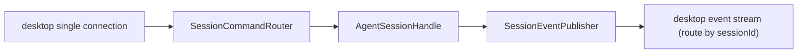
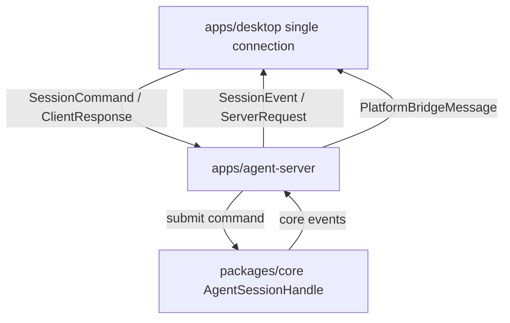

# Codex Style Three Layer Unidirectional Refactor Implementation Plan

> **For agentic workers:** REQUIRED SUB-SKILL: Use superpowers:subagent-driven-development (recommended) or superpowers:executing-plans to implement this plan task-by-task. Steps use checkbox (`- [ ]`) syntax for tracking.

**Goal:** 将 HandAgent 重构为更接近 Codex 的 UI / app-server / core 三层架构，把当前“每个 tab 一条 WebSocket”改为“desktop 进程唯一一条长连接 + 按 `sessionId` 路由”，并把会话通信收敛为“UI 发命令、server/core 发事件、少量 server request 等待 UI 回执”的单向主干。

**Architecture:** `apps/desktop` 只保留宿主 UI、窗口生命周期和用户意图提交，并由一个共享 `AppServerConnection` 负责全局连接；`apps/agent-server` 成为命令路由、连接级订阅管理、线程/会话生命周期、事件 fan-out 与持久化边界；`packages/core` 暴露类似 Codex `tx_sub` / `rx_event` 的 session handle。协议直接切换为 `SessionCommand`、`SessionEvent`、`ServerRequest`、`ClientResponse`，删除旧 `SessionMessage` 路径，不保留双协议兼容层。

**Tech Stack:** SwiftUI Observation / URLSessionWebSocketTask、Node + TypeScript WebSocket server、`@handagent/core` runtime/tool/LLM、Vitest、Swift Testing、Codex 参考目录 `codex/codex-rs/core` 与 `codex/codex-rs/app-server`。

---

## 0. 事实依据与目标边界

本计划依据当前仓库代码与文档，而不是把 Codex 结构简单照搬：

- HandAgent 当前三层已有雏形：`apps/desktop`、`apps/agent-server`、`packages/core`。
- HandAgent 当前 desktop 侧是“每个 tab 一个 `SessionSocketClient` / 一条 WebSocket”；这会把连接状态、重连、快照恢复和权限请求分散到 tab 级别。
- 当前协议仍把命令、事件、请求、响应放在同一个 `SessionMessage` union 中，例如 `create_session_request` 与 `assistant_message_delta` 同级。
- Codex core 的公开把手是队列对：外层通过 `tx_sub: Sender<Submission>` 提交 `Op`，通过 `rx_event: Receiver<Event>` 接收 `EventMsg`。
- Codex app-server 暴露 `thread/start`、`turn/start` 等请求，同时用 `turn/started`、`item/*`、`turn/completed` 等通知流承载运行进度。
- “单向通信机制”在这里不等于没有 UI 回包。权限审批、workspace 选择、auth refresh 这类 server 发起的问题仍需要 UI 回执；它们应归入独立的 `ServerRequest -> ClientResponse` 通道，不能混在普通会话事件里。
- 本次按破坏性重构处理：不保留旧 `SessionMessage`、不增加 adapter、不同协议不共存，所有调用点一次性切到新结构。

## 1. 目标分层

### UI 层：`apps/desktop`

职责：

- 展示 PromptPanel、SessionWindow、StatusBubble、Settings。
- 持有 desktop 全局唯一的 `AppServerConnection`，负责连接、重连、订阅恢复、消息收发。
- 把用户动作转成 `SessionCommand`：创建会话、打开会话、发送用户输入、打断 turn、删除历史、审批/选择回执。
- 订阅 `SessionEvent` 更新 ViewModel 状态。
- 处理 `ServerRequest` 并发送 `ClientResponse`，例如权限审批和 workspace 选择。

禁止：

- 组装 LLM 消息。
- 推断 runtime 内部状态。
- 直接执行 tool 或读取非用户主动提供的上下文。
- 依赖 request/response 语义更新会话 UI。
- 为每个 tab 持有独立 socket、独立重连器或独立会话握手。

### App-server 层：`apps/agent-server`

职责：

- 接收 UI command，路由到 session/thread manager。
- 维护“连接 -> 已订阅 `sessionId` 集合”的路由表，在单连接上复用多会话事件流。
- 为每个 session 持有 core handle，负责提交 command、消费 core event。
- 把 core event 翻译为 UI event，并按 `sessionId` fan-out 给同一连接上的订阅方。
- 统一处理 history/list/load/delete 等非 runtime 请求。
- 维护 server request pending 表，等待 UI 的 client response。

禁止：

- 定义跨层 DTO。DTO 继续放在 `packages/core/src/protocol` 或新建 `packages/core/src/app-protocol`。
- 持有 Swift/AppKit 语义。
- 让 UI socket close 直接等价于 runtime 取消；取消只能由 `turn_interrupt` command 或明确策略触发。
- 为兼容旧客户端保留旧协议分支；本次重构后 server 只接受新协议。

### Core 层：`packages/core`

职责：

- 提供 `AgentSessionHandle`：`submit(command)` + `events`。
- 管理 runtime 消息、turn 状态、LLM/tool loop、权限决策调用点。
- 输出 UI 无关的 core event，例如 `turn_started`、`assistant_delta`、`tool_started`、`tool_finished`、`turn_completed`、`runtime_error`。
- 通过注入的 resolver 发起 server request，例如 permission ask、workspace ask、platform bridge。

禁止：

- 引入 UI 消息模型。
- 依赖 agent-server socket。
- 直接写 Swift 端需要的展示状态。

## 2. 新协议模型

新增协议文件：

- `packages/core/src/protocol/SessionCommand.ts`
- `packages/core/src/protocol/SessionEvent.ts`
- `packages/core/src/protocol/ServerRequest.ts`
- `packages/core/src/protocol/ClientResponse.ts`

推荐形状：

```ts
export type SessionCommand =
  | { type: "session_create"; commandId: string; timestamp: string; payload: { initialText?: string; attachments?: UserMessageAttachment[]; workspaceId?: string | null; actionBinding?: ActionBindingPayload } }
  | { type: "session_subscribe"; sessionId: string; commandId: string; timestamp: string; payload: {} }
  | { type: "session_unsubscribe"; sessionId: string; commandId: string; timestamp: string; payload: {} }
  | { type: "turn_start"; sessionId: string; commandId: string; timestamp: string; payload: { text: string; attachments?: UserMessageAttachment[] } }
  | { type: "turn_interrupt"; sessionId: string; commandId: string; timestamp: string; payload: {} }
  | { type: "sessions_list"; commandId: string; timestamp: string; payload: {} }
  | { type: "session_delete"; commandId: string; timestamp: string; payload: { targetSessionId: string } };
```

```ts
export type SessionEvent =
  | { type: "session_created"; sessionId: string; eventId: string; commandId?: string; timestamp: string; payload: { title: string | null } }
  | { type: "session_snapshot"; sessionId: string; eventId: string; commandId?: string; timestamp: string; payload: { messages: ConversationMessage[]; status: RunStatus } }
  | { type: "user_message_recorded"; sessionId: string; eventId: string; timestamp: string; payload: { messageId: string; text: string } }
  | { type: "turn_started"; sessionId: string; eventId: string; turnId: string; timestamp: string; payload: {} }
  | { type: "assistant_delta"; sessionId: string; eventId: string; turnId: string; itemId: string; timestamp: string; payload: { text: string } }
  | { type: "tool_started"; sessionId: string; eventId: string; turnId: string; itemId: string; timestamp: string; payload: { name: string; input: Record<string, unknown> } }
  | { type: "tool_finished"; sessionId: string; eventId: string; turnId: string; itemId: string; timestamp: string; payload: { name: string; status: "completed" | "failed"; output: string; durationMs: number } }
  | { type: "turn_completed"; sessionId: string; eventId: string; turnId: string; timestamp: string; payload: { status: "completed" | "interrupted" | "failed" } }
  | { type: "session_status_changed"; sessionId: string; eventId: string; timestamp: string; payload: { value: RunStatus } }
  | { type: "sessions_listed"; eventId: string; commandId?: string; timestamp: string; payload: { sessions: SessionListEntry[] } }
  | { type: "session_deleted"; eventId: string; commandId?: string; timestamp: string; payload: { targetSessionId: string; status: "deleted" | "not_found" } }
  | { type: "session_error"; sessionId?: string; eventId: string; commandId?: string; timestamp: string; payload: { code?: string; message: string } };
```

```ts
export type ServerRequest =
  | { type: "permission_ask"; requestId: string; sessionId: string; timestamp: string; payload: { toolName: string; toolCallId: string; arguments: Record<string, unknown>; timeoutMs?: number } }
  | { type: "workspace_ask"; requestId: string; sessionId: string; timestamp: string; payload: { toolCallId?: string; prompt: string; candidates: WorkspaceAskCandidate[]; timeoutMs?: number } };

export type ClientResponse =
  | { type: "permission_answer"; requestId: string; timestamp: string; payload: { decision: "allow" | "deny"; scope?: "once" | "session" | "always"; reason?: string } }
  | { type: "workspace_answer"; requestId: string; timestamp: string; payload: { workspaceId?: string; cancelled?: boolean } };
```

连接模型：

- desktop 进程只有一条到 `app-server` 的长连接。
- tab 打开时发送 `session_subscribe(sessionId)`，关闭时发送 `session_unsubscribe(sessionId)`。
- `session_subscribe` 的响应是该 `sessionId` 的 `session_snapshot`，而不是新建 socket 或额外握手通道。
- 所有 `SessionEvent` 和 `ServerRequest` 都带 `sessionId`，由 desktop 本地总线分发给对应 tab view model。

## 3. 文件结构变更

### Create

- `packages/core/src/protocol/SessionCommand.ts`：UI -> app-server 命令。
- `packages/core/src/protocol/SessionEvent.ts`：app-server/core -> UI 事件。
- `packages/core/src/protocol/ServerRequest.ts`：server -> UI 待回执请求。
- `packages/core/src/protocol/ClientResponse.ts`：UI -> server 请求回执。
- `packages/core/src/runtime/AgentSessionHandle.ts`：Codex-style `submit` / `subscribe` 会话把手。
- `apps/desktop/Sources/AppServices/AgentServer/AppServerConnection.swift`：desktop 进程唯一长连接。
- `apps/desktop/Sources/AppServices/AgentServer/SessionEventBus.swift`：按 `sessionId` 把共享连接消息分发到 tab。
- `apps/agent-server/src/session/SessionCommandRouter.ts`：替代 `SessionRouter` 的命令路由。
- `apps/agent-server/src/session/SessionEventPublisher.ts`：按连接和 `sessionId` 订阅关系做 fan-out。
- `apps/desktop/Sources/SessionWindow/SessionProtocolClient.swift`：共享连接上的 command/event codec。

### Modify

- `packages/core/src/protocol/protocol.md`
- `packages/core/src/runtime/AgentRuntime.ts`
- `packages/core/src/runtime/runtime.md`
- `apps/agent-server/src/server/server.ts`
- `apps/agent-server/src/session/SessionRuntimeOrchestrator.ts`
- `apps/agent-server/src/session/session.md`
- `apps/agent-server/src/protocol/MessageTranslator.ts`
- `apps/agent-server/src/protocol/protocol.md`
- `apps/desktop/Sources/AppServices/AgentServer/agent-server.md`
- `apps/desktop/Sources/Coordinator/AppCoordinator.swift`
- `apps/desktop/Sources/SessionWindow/SessionTabViewModel.swift`
- `apps/desktop/Sources/SessionWindow/SessionWindowViewModel.swift`
- `apps/desktop/Sources/SessionWindow/session-window.md`
- `handAgent.md`
- `apps/apps.md`
- `packages/core/core.md`
- `docs/manual-qa.md`

### Delete

- `packages/core/src/protocol/SessionMessage.ts`
- `apps/agent-server/src/session/SessionRouter.ts`
- `apps/desktop/Sources/SessionWindow/SessionSocketClient.swift`

### Test

- `packages/core/tests/protocol/session-command-event.test.ts`
- `packages/core/tests/runtime/agent-session-handle.test.ts`
- `apps/agent-server/tests/session/SessionCommandRouter.test.ts`
- `apps/agent-server/tests/session/SessionEventPublisher.test.ts`
- `apps/desktop/TestsSwift/AppServices/AgentServer/AppServerConnectionTests.swift`
- `apps/desktop/TestsSwift/AppServices/AgentServer/SessionEventBusTests.swift`
- `apps/desktop/TestsSwift/SessionWindow/SessionProtocolClientTests.swift`
- 更新既有 `SessionTabViewModelTests.swift`、`SessionWindowViewModelTests.swift`。

## 4. 实施任务

### Task 1: 建立新协议并直接替换旧 union

**Files:**
- Create: `packages/core/src/protocol/SessionCommand.ts`
- Create: `packages/core/src/protocol/SessionEvent.ts`
- Create: `packages/core/src/protocol/ServerRequest.ts`
- Create: `packages/core/src/protocol/ClientResponse.ts`
- Create: `packages/core/tests/protocol/session-command-event.test.ts`
- Delete: `packages/core/src/protocol/SessionMessage.ts`
- Modify: `packages/core/src/protocol/protocol.md`

- [ ] **Step 1: 写协议类型测试**

测试覆盖：

```ts
import { describe, expect, it } from "vitest";
import type { SessionCommand } from "../../src/protocol/SessionCommand.ts";
import type { SessionEvent } from "../../src/protocol/SessionEvent.ts";
import type { ServerRequest } from "../../src/protocol/ServerRequest.ts";
import type { ClientResponse } from "../../src/protocol/ClientResponse.ts";

describe("session command/event protocol", () => {
  it("keeps UI commands separate from server events", () => {
    const command: SessionCommand = {
      type: "turn_start",
      sessionId: "s1",
      commandId: "c1",
      timestamp: "2026-06-03T00:00:00.000Z",
      payload: { text: "hello" },
    };
    const event: SessionEvent = {
      type: "assistant_delta",
      sessionId: "s1",
      eventId: "e1",
      turnId: "t1",
      itemId: "i1",
      timestamp: "2026-06-03T00:00:01.000Z",
      payload: { text: "world" },
    };

    expect(command.type).toBe("turn_start");
    expect(event.type).toBe("assistant_delta");
  });

  it("models server requests separately from client responses", () => {
    const request: ServerRequest = {
      type: "permission_ask",
      requestId: "s1:tc1",
      sessionId: "s1",
      timestamp: "2026-06-03T00:00:00.000Z",
      payload: {
        toolName: "file.write",
        toolCallId: "tc1",
        arguments: { path: "/tmp/a.txt" },
      },
    };
    const response: ClientResponse = {
      type: "permission_answer",
      requestId: "s1:tc1",
      timestamp: "2026-06-03T00:00:01.000Z",
      payload: { decision: "allow", scope: "once" },
    };

    expect(request.type).toBe("permission_ask");
    expect(response.type).toBe("permission_answer");
  });

  it("models single-connection session routing explicitly", () => {
    const subscribe: SessionCommand = {
      type: "session_subscribe",
      sessionId: "s1",
      commandId: "c2",
      timestamp: "2026-06-04T00:00:00.000Z",
      payload: {},
    };
    const unsubscribe: SessionCommand = {
      type: "session_unsubscribe",
      sessionId: "s1",
      commandId: "c3",
      timestamp: "2026-06-04T00:00:01.000Z",
      payload: {},
    };

    expect(subscribe.type).toBe("session_subscribe");
    expect(unsubscribe.type).toBe("session_unsubscribe");
  });
});
```

- [ ] **Step 2: 跑测试确认失败**

Run: `bash ./scripts/test.sh packages/core/tests/protocol/session-command-event.test.ts`

Expected: FAIL，原因是新增协议文件还不存在。

- [ ] **Step 3: 创建协议文件并删除旧 union**

按第 2 节的类型定义创建四个协议文件。把 `UserMessageAttachment`、`SessionListEntry`、`WorkspaceAskCandidate` 提升到可复用文件，例如 `SessionProtocolShared.ts`，避免因删除 `SessionMessage.ts` 丢失基础类型。

- [ ] **Step 4: 跑 core 测试**

Run: `bash ./scripts/test.sh`

Expected: PASS。

- [ ] **Step 5: 更新协议文档**

在 `packages/core/src/protocol/protocol.md` 增加：

- 新主干是 `SessionCommand` / `SessionEvent`。
- `ServerRequest` / `ClientResponse` 只用于 UI 回执型交互。
- desktop 与 app-server 固定为单连接、多 `sessionId` 订阅模型。
- 旧 `SessionMessage` 已删除，不再接受兼容接入。
- `PlatformBridgeMessage` 仍是独立平台 RPC 通道，不并入 session event。

- [ ] **Step 6: Commit**

```bash
git add packages/core/src/protocol packages/core/tests/protocol/session-command-event.test.ts
git commit -m "refactor: define codex-style session protocol"
```

### Task 2: 在 core 中引入 AgentSessionHandle

**Files:**
- Create: `packages/core/src/runtime/AgentSessionHandle.ts`
- Create: `packages/core/tests/runtime/agent-session-handle.test.ts`
- Modify: `packages/core/src/runtime/AgentRuntime.ts`
- Modify: `packages/core/src/runtime/runtime.md`

- [ ] **Step 1: 写 handle 行为测试**

测试目标：

- `submit({ type: "turn_start" })` 启动 runtime。
- runtime event 转成 core event 后从 `events` 队列读出。
- `turn_interrupt` 使用 AbortController 取消当前 run。
- 同一 session 同时只有一个 active turn。

测试示例：

```ts
import { describe, expect, it } from "vitest";
import { AgentSessionHandle } from "../../src/runtime/AgentSessionHandle.ts";

describe("AgentSessionHandle", () => {
  it("accepts commands and emits events through a queue pair", async () => {
    const runtime = {
      runWithMessages: async (_messages: unknown[], onEvent: (event: any) => void) => {
        onEvent({ type: "assistant_message_delta", messageId: "a1", payload: { text: "ok" } });
        return { messages: [{ role: "user", content: "hi" }, { role: "assistant", content: "ok" }] };
      },
      waitForPendingSummaries: async () => {},
    };
    const handle = new AgentSessionHandle({
      sessionId: "s1",
      runtime,
      loadMessages: async () => [],
      persistUserMessage: async () => {},
      persistRunResult: async () => {},
      now: () => "2026-06-03T00:00:00.000Z",
    });

    await handle.submit({
      type: "turn_start",
      sessionId: "s1",
      commandId: "c1",
      timestamp: "2026-06-03T00:00:00.000Z",
      payload: { text: "hi" },
    });

    const event = await handle.nextEvent();
    expect(event?.type).toBe("assistant_delta");
    expect(event?.payload).toEqual({ text: "ok" });
  });
});
```

- [ ] **Step 2: 跑测试确认失败**

Run: `bash ./scripts/test.sh packages/core/tests/runtime/agent-session-handle.test.ts`

Expected: FAIL，原因是 `AgentSessionHandle` 不存在。

- [ ] **Step 3: 实现 AgentSessionHandle**

实现要求：

- 内部维护 `events: AsyncQueue<SessionEvent>`。
- `submit(command)` 只处理 core runtime 相关命令：`turn_start`、`turn_interrupt`。
- 不处理 list/load/delete，这些属于 app-server。
- 使用当前 `AgentRuntime.runWithMessages`，但把 `AgentRuntimeEvent` 转为 `SessionEvent`。
- `turn_start` 先 emit `user_message_recorded` 与 `turn_started`。
- runtime 结束 emit `turn_completed` 与 `session_status_changed(idle)`。
- abort emit `turn_completed(interrupted)` 与 `session_status_changed(interrupted)`。

- [ ] **Step 4: 保持 AgentRuntime 本体 UI 无关**

只在必要处调整 `AgentRuntimeEvent` 命名或增加 `turnId` 输入，不让 `AgentRuntime` import `SessionEvent`。转换逻辑放在 `AgentSessionHandle`。

- [ ] **Step 5: 跑 core 测试**

Run: `bash ./scripts/test.sh`

Expected: PASS。

- [ ] **Step 6: 更新 runtime 文档**

在 `packages/core/src/runtime/runtime.md` 写明：

- `AgentRuntime` 是 LLM/tool loop。
- `AgentSessionHandle` 是 Codex-style queue pair。
- UI/app-server 不应直接依赖 `runWithMessages` 的事件细节。

- [ ] **Step 7: Commit**

```bash
git add packages/core/src/runtime packages/core/tests/runtime/agent-session-handle.test.ts
git commit -m "refactor: add agent session command event handle"
```

### Task 3: 重构 agent-server 为单连接 command router + event publisher

**Files:**
- Create: `apps/agent-server/src/session/SessionCommandRouter.ts`
- Create: `apps/agent-server/src/session/SessionEventPublisher.ts`
- Create: `apps/agent-server/tests/session/SessionCommandRouter.test.ts`
- Create: `apps/agent-server/tests/session/SessionEventPublisher.test.ts`
- Modify: `apps/agent-server/src/session/SessionRuntimeOrchestrator.ts`
- Modify: `apps/agent-server/src/server/server.ts`
- Modify: `apps/agent-server/src/session/session.md`
- Delete: `apps/agent-server/src/session/SessionRouter.ts`

- [ ] **Step 1: 写 SessionEventPublisher 测试**

测试目标：

- 一个 desktop 连接可以同时订阅多个 `sessionId`。
- `session_subscribe("s1")` 后，只接收 `s1` 事件和全局事件。
- 同一连接再订阅 `s2` 后，可以同时接收 `s1`、`s2` 事件。
- `session_unsubscribe("s1")` 后不再收到 `s1` 事件，但继续收到 `s2` 事件。
- 连接关闭后，publisher 会清理该连接的全部订阅关系。

- [ ] **Step 2: 写 SessionCommandRouter 测试**

测试目标：

- `session_create` 创建持久化 session，并 emit `session_created`。
- `turn_start` 转发给对应 `AgentSessionHandle.submit`。
- `session_subscribe` 注册订阅，并立刻 emit `session_snapshot`，不启动 runtime。
- `session_unsubscribe` 只移除订阅，不影响 session 生命周期。
- `sessions_list` emit `sessions_listed`。
- `session_delete` 对 running session 先 interrupt，再删除，再 emit `session_deleted`。

- [ ] **Step 3: 跑测试确认失败**

Run: `bash ./scripts/test.sh apps/agent-server/tests/session/SessionCommandRouter.test.ts apps/agent-server/tests/session/SessionEventPublisher.test.ts`

Expected: FAIL，新增类不存在。

- [ ] **Step 4: 实现 SessionEventPublisher**

接口建议：

```ts
type SendEvent = (event: SessionEvent | ServerRequest) => void;

class SessionEventPublisher {
  attachConnection(connectionId: string, send: SendEvent): void;
  detachConnection(connectionId: string): void;
  subscribe(connectionId: string, sessionId: string): void;
  unsubscribe(connectionId: string, sessionId: string): void;
  publish(event: SessionEvent | ServerRequest): void;
}
```

- [ ] **Step 5: 实现 SessionCommandRouter**

接口建议：

```ts
class SessionCommandRouter {
  receive(command: SessionCommand): Promise<void>;
  handleResponse(response: ClientResponse): void;
}
```

实现约束：

- `receive` 不直接持有 socket send，只通过 `SessionEventPublisher.publish`。
- session runtime handle 由 resolver/factory 创建，按 sessionId 缓存。
- 非 runtime 命令由 `SessionPersistence` 处理。
- 连接级订阅关系只存于 publisher；router 只处理 command。
- 删除 `SessionRouter.ts`，不保留 wrapper 壳。

- [ ] **Step 6: 调整 SessionRuntimeOrchestrator**

把 `handleUserMessage(message, push)` 替换为：

- `startTurn(sessionId, text, attachments, commandId)`
- 通过 publisher 发事件。
- 持久化逻辑保持现状，但不再把 `AgentRuntimeEvent` 直接转旧 `SessionMessage`。

- [ ] **Step 7: 跑 agent-server 测试**

Run: `bash ./scripts/test.sh`

Expected: PASS。

- [ ] **Step 8: 更新 agent-server session 文档**

在 `apps/agent-server/src/session/session.md` 增加新流转：



- [ ] **Step 9: Commit**

```bash
git add apps/agent-server/src/session apps/agent-server/tests/session
git commit -m "refactor: split session command routing from event publishing"
```

### Task 4: Swift 端改为单连接 command/event 客户端

**Files:**
- Create: `apps/desktop/Sources/AppServices/AgentServer/AppServerConnection.swift`
- Create: `apps/desktop/Sources/AppServices/AgentServer/SessionEventBus.swift`
- Create: `apps/desktop/TestsSwift/AppServices/AgentServer/AppServerConnectionTests.swift`
- Create: `apps/desktop/TestsSwift/AppServices/AgentServer/SessionEventBusTests.swift`
- Create: `apps/desktop/Sources/SessionWindow/SessionProtocolClient.swift`
- Create: `apps/desktop/TestsSwift/SessionWindow/SessionProtocolClientTests.swift`
- Modify: `apps/desktop/Sources/Coordinator/AppCoordinator.swift`
- Modify: `apps/desktop/Sources/SessionWindow/SessionTabViewModel.swift`
- Modify: `apps/desktop/Sources/SessionWindow/SessionWindowViewModel.swift`
- Modify: `apps/desktop/Sources/SessionWindow/session-window.md`
- Delete: `apps/desktop/Sources/SessionWindow/SessionSocketClient.swift`

- [ ] **Step 1: 写共享连接与路由测试**

覆盖：

- `AppServerConnection` 只建立一条 socket。
- 两个 tab 分别订阅 `s1`、`s2` 时，共用同一连接。
- 连接重连后，会自动重发当前订阅集合里的 `session_subscribe`。
- `SessionEventBus` 只把 `s1` 事件送给 `s1` tab，只把 `s2` 事件送给 `s2` tab。
- 全局事件如 `sessions_listed` 送给窗口级 view model。

- [ ] **Step 2: 写 Swift codec 测试**

覆盖：

- `sendCreateSession` 编码为 `session_create`。
- `subscribe(sessionId:)` 编码为 `session_subscribe`。
- `unsubscribe(sessionId:)` 编码为 `session_unsubscribe`。
- `sendUserMessage` 编码为 `turn_start`。
- `sendInterrupt` 编码为 `turn_interrupt`。
- 解码 `assistant_delta` 为现有 `SessionEvent.assistantMessageDelta`。
- 解码 `permission_ask` 为现有 `SessionEvent.permissionRequest`。
- 解码 `workspace_ask` 为现有 `SessionEvent.workspaceAskRequest`。

Run:

```bash
bash ./scripts/swiftw test --filter AppServerConnectionTests
bash ./scripts/swiftw test --filter SessionEventBusTests
bash ./scripts/swiftw test --filter SessionProtocolClientTests
```

Expected: FAIL，新文件不存在。

- [ ] **Step 3: 实现 AppServerConnection**

实现要求：

- 进程级单例，由 `AppCoordinator` 或 `AppServices` 持有。
- 内部只有一条 `URLSessionWebSocketTask`。
- 暴露 `connectIfNeeded()`、`send(_:)`、`subscribe(sessionId:)`、`unsubscribe(sessionId:)`。
- 维护当前订阅的 `Set<String>`，重连后自动重发 `session_subscribe`。

- [ ] **Step 4: 实现 SessionEventBus**

- 按 `sessionId` 注册 tab 级 listener。
- 支持窗口级 listener 订阅全局事件。
- 不持有 socket，只消费 `AppServerConnection` 解码后的 event/request。

- [ ] **Step 5: 更新 ViewModel 调用**

确保：

- `SessionWindowViewModel.createTabWithInitialPrompt` 发 `session_create`，收到 `session_created` 后创建 tab。
- tab 打开时通过共享连接发 `session_subscribe(sessionId)`。
- tab 关闭时发 `session_unsubscribe(sessionId)`。
- composer 发 `turn_start`。
- Stop 发 `turn_interrupt`。
- 权限和 workspace 面板发 `ClientResponse`。

- [ ] **Step 6: 删除 SessionSocketClient**

- 直接删除文件与相关测试。
- 所有 tab 状态来源都改为 `SessionEventBus`。

- [ ] **Step 7: 跑 Swift 测试与构建**

Run:

```bash
bash ./scripts/swiftw test
bash ./scripts/swiftw build
```

Expected: PASS。

- [ ] **Step 8: 更新 SessionWindow 文档**

说明：

- desktop 现在只有一条到 app-server 的长连接。
- tab 不再持有 socket，只持有 `sessionId` 订阅关系。
- 连接、重连、权限请求、workspace 请求都走共享连接。

- [ ] **Step 9: Commit**

```bash
git add apps/desktop/Sources/AppServices/AgentServer apps/desktop/Sources/Coordinator apps/desktop/Sources/SessionWindow apps/desktop/TestsSwift/AppServices/AgentServer apps/desktop/TestsSwift/SessionWindow
git commit -m "refactor: move desktop to single app-server connection"
```

### Task 5: 收敛状态语义与会话生命周期

**Files:**
- Modify: `apps/desktop/Sources/SessionWindow/SessionRunStatus.swift`
- Modify: `apps/desktop/Sources/SessionWindow/SessionTabViewModel.swift`
- Modify: `apps/desktop/Sources/SessionWindow/SessionWindowViewModel.swift`
- Modify: `apps/agent-server/src/session/SessionCommandRouter.ts`
- Modify: `apps/agent-server/src/session/SessionEventPublisher.ts`
- Modify: related tests

- [ ] **Step 1: 写状态回归测试**

覆盖：

- `turn_started` 进入 running。
- `assistant_delta` 不改变 running。
- `tool_started` 保持 running。
- `tool_finished` 不提前 idle。
- `turn_completed(completed)` 才进入 idle。
- `turn_completed(interrupted)` 进入 interrupted。
- server 重启 snapshot failed 显示错误但保留历史。

- [ ] **Step 2: 跑测试确认现状差异**

Run:

```bash
bash ./scripts/test.sh
bash ./scripts/swiftw test --filter SessionTabViewModelTests
```

Expected: 迁移前相关新增断言失败。

- [ ] **Step 3: 调整事件顺序**

统一 event 顺序：

1. `user_message_recorded`
2. `turn_started`
3. `assistant_delta` / `tool_started` / `tool_finished`
4. `turn_completed`
5. `session_status_changed`

- [ ] **Step 4: 调整 UI 状态机**

`SessionTabViewModel` 只根据上述事件更新状态，不再用 `assistant_message_end(completed)` 推断整轮完成。

- [ ] **Step 5: 跑测试**

Run:

```bash
bash ./scripts/test.sh
bash ./scripts/swiftw test
bash ./scripts/swiftw build
```

Expected: PASS。

- [ ] **Step 6: Commit**

```bash
git add apps/desktop/Sources/SessionWindow apps/desktop/TestsSwift/SessionWindow apps/agent-server/src/session apps/agent-server/tests/session
git commit -m "refactor: align session run status with turn lifecycle"
```

### Task 6: 删除旧路径并更新仓库文档

**Files:**
- Modify: `apps/agent-server/src/server/server.ts`
- Modify: `apps/agent-server/src/protocol/protocol.md`
- Modify: `apps/desktop/Sources/AppServices/AgentServer/agent-server.md`
- Modify: `handAgent.md`
- Modify: `apps/apps.md`
- Modify: `apps/agent-server/agent-server.md`
- Modify: `apps/desktop/desktop.md`
- Modify: `packages/core/core.md`
- Modify: `docs/manual-qa.md`

- [ ] **Step 1: 确认旧路径已从代码删除**

Run:

```bash
rg -n "SessionMessage|SessionSocketClient|SessionRouter|create_session_request|open_session|user_message|assistant_message_delta|load_session_request" apps/desktop apps/agent-server packages/core/src
```

Expected: 无结果，或只剩明确的历史文档引用。

- [ ] **Step 2: 更新架构图**

`handAgent.md` 中把主图改为：



- [ ] **Step 3: 更新三层职责与单连接约束**

明确：

- UI 是状态投影和用户意图入口，且全进程只持有一个 app-server 连接。
- app-server 是命令处理、订阅路由和事件发布者。
- core 是 runtime queue pair。
- tab 不再拥有网络生命周期。

- [ ] **Step 4: 更新 manual QA**

新增手工验收：

- 打开两个 tab，确认只建立一条 app-server WebSocket。
- 两个 tab 分别订阅不同 `sessionId`，流式回复互不串线。
- 关闭一个 tab 后，该 `sessionId` 不再收到新事件，另一个 tab 正常。
- 连接断开后自动重连，并恢复之前的 `session_subscribe` 集合。
- PromptPanel 创建新 session，左侧历史刷新，右侧 tab 收到流式回复。
- 运行中 Stop 后收到 interrupted，composer 恢复可输入。
- 触发权限审批 tool，UI 显示请求，allow 后 tool 继续，deny 后模型收到拒绝结果。
- 触发 workspace ask，取消时 tool 返回 cancelled。
- agent-server 重启后共享连接重连，已订阅 tab 收到 snapshot，历史不丢。
- 删除 running session 会先 interrupt，再删除历史与关闭 tab。

- [ ] **Step 5: 跑最终验证**

Run:

```bash
bash ./scripts/test.sh
bash ./scripts/swiftw test
bash ./scripts/swiftw build
```

Expected: PASS。

- [ ] **Step 6: Commit**

```bash
git add handAgent.md apps/apps.md apps/agent-server/agent-server.md apps/desktop/desktop.md packages/core/core.md docs/manual-qa.md
git commit -m "docs: document codex-style session architecture"
```

## 5. 风险与约束

- 不要把 `PlatformBridgeMessage` 并入 session command/event。平台 RPC 是 tool 触发的能力通道，继续独立。
- 不要取消 UI 回执。权限审批和 workspace 选择必须保留 `ServerRequest` / `ClientResponse`。
- 不要让 socket 断开自动中断 turn。Codex app-server 的模型是订阅可取消，turn 生命周期由 command 控制。
- 不要保留“每个 tab 一个连接”的壳。tab 只能拥有 `sessionId` 订阅，不再拥有网络对象。
- 不要保留旧协议类型、adapter、wrapper。此次按破坏性切换执行。
- 不要在 Swift UI 层引入 runtime 状态推断。UI 只根据 event 投影状态。
- 不要在迁移中修改产品输入边界。屏幕、窗口、文件、剪贴板、App 状态仍只能由 tool 按需读取。

## 6. 验证矩阵

每个任务至少跑对应局部测试。Task 6 收尾时必须跑：

```bash
bash ./scripts/test.sh
bash ./scripts/swiftw test
bash ./scripts/swiftw build
```

手工 QA 使用 `docs/manual-qa.md` 中新增条目。涉及真实 LLM/tool 的场景优先用 mock LLM 验证协议和 UI 状态，再用真实 API 做一轮 smoke test。

## 7. 自检结果

- 覆盖用户目标：计划覆盖 Codex 风格三层架构、app-server/core/UI 职责、单向主通信、server request 回执例外。
- 无占位项：各任务给出具体文件、测试目标、命令、期望结果和 commit 点。
- 类型一致性：全计划统一使用 `SessionCommand`、`SessionEvent`、`ServerRequest`、`ClientResponse`、`AgentSessionHandle`。
- 范围控制：不引入新 UI 设计、不改平台能力、不改变产品输入边界。
