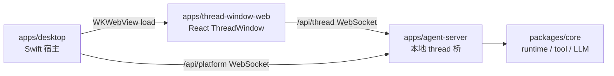
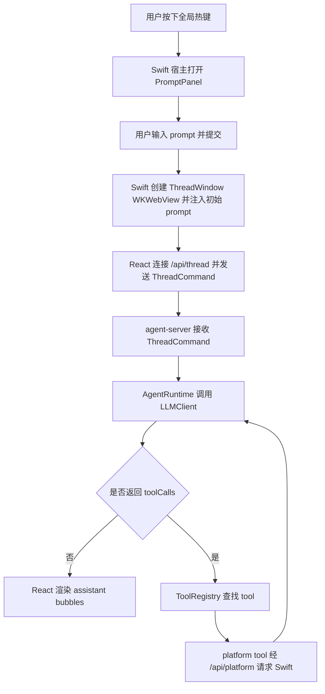

# ThreadWindow WebView React Implementation Plan

> **状态：历史实施计划。**
> 本文记录 ThreadWindow 迁移到 `WKWebView + React` 以及拆分 `/api/thread` / `/api/platform` 的实施步骤。当前事实以 `handAgent.md`、`apps/thread-window-web/thread-window-web.md` 与 `apps/desktop/Sources/ThreadWindow/thread-window.md` 为准。

> **For agentic workers:** REQUIRED SUB-SKILL: Use superpowers:subagent-driven-development (recommended) or superpowers:executing-plans to implement this plan task-by-task. Steps use checkbox (`- [ ]`) syntax for tracking.

**Goal:** 将 SwiftUI/TCA ThreadWindow 替换为 `WKWebView` 承载的 React ThreadWindow，并把 agent-server 的 thread 与 platform WebSocket 拆成两条连接。

**Architecture:** agent-server 暴露 `/api/thread` 给 React 持有 thread UI 状态，暴露 `/api/platform` 给 Swift 持有原生 platform RPC。新增 `apps/thread-window-web` 使用 React + Vite + `zustand + immer` 作为唯一状态源，socket client 只负责收发与重连，组件只派发明确 action，不直接操作 WebSocket。Swift 只负责进程健康、`NSWindow/WKWebView` 生命周期、PromptPanel 初始 prompt 派发和 `/api/platform`。首版不做 `StatusBubble` 摘要同步。

**Tech Stack:** TypeScript, Vitest, React 19, Vite, Zustand, immer, WebSocket, Swift 6, SwiftUI, WebKit, XCTest.

---

## File Map

| 操作 | 路径 | 职责 |
|--------|------|----------------|
| Modify | `pnpm-workspace.yaml` | 将 `apps/thread-window-web` 加入 workspace |
| Modify | `package.json` | 增加前端 build/test root scripts |
| Create | `apps/thread-window-web/package.json` | React 包依赖与脚本 |
| Create | `apps/thread-window-web/index.html` | Vite HTML 入口 |
| Create | `apps/thread-window-web/tsconfig.json` | Web TypeScript 配置 |
| Create | `apps/thread-window-web/vite.config.ts` | Vite + Vitest 配置 |
| Create | `apps/thread-window-web/src/main.tsx` | React 启动入口 |
| Create | `apps/thread-window-web/src/App.tsx` | ThreadWindow 根组合 |
| Create | `apps/thread-window-web/src/protocol/threadProtocol.ts` | 协议类型复用、编码器、类型守卫 |
| Create | `apps/thread-window-web/src/store/threadWindowStore.ts` | `zustand + immer` 状态源 |
| Create | `apps/thread-window-web/src/thread/threadSocketClient.ts` | WebSocket 生命周期、重连、命令发送 |
| Create | `apps/thread-window-web/src/native/nativeConfig.ts` | 运行配置与初始 prompt 接收 |
| Create | `apps/thread-window-web/src/components/*.tsx` | 历史侧栏、tab、消息、请求面板、输入区 |
| Create | `apps/thread-window-web/src/styles/thread-window.css` | ThreadWindow web 样式 |
| Create | `apps/thread-window-web/tests/*.test.ts` | 协议、store、socket 测试 |
| Create | `apps/thread-window-web/thread-window-web.md` | 前端包文档 |
| Modify | `apps/agent-server/src/server/server.ts` | 拆分 `/api/thread` 与 `/api/platform` handler |
| Modify | `apps/agent-server/src/server/server.md` | 记录拆分后的 WebSocket 路径 |
| Modify | `apps/agent-server/src/bridges/bridges.md` | 记录 platform bridge socket 归属 |
| Modify | `apps/agent-server/tests/server/server.test.ts` | 覆盖 thread/platform socket 边界 |
| Modify | `apps/desktop/Sources/AppServices/AppServices.swift` | 接入 platform URL 与 web ThreadWindow presenter |
| Modify | `apps/desktop/Sources/AppServices/AppServicesProductionImpls.swift` | 用 WKWebView 呈现 ThreadWindow |
| Modify | `apps/desktop/Sources/AppServices/AgentServer/AppServer.swift` | 删除 Swift thread 路由，新增 platform bridge 连接 |
| Delete | `apps/desktop/Sources/AppServices/AgentServer/ThreadProtocolClient.swift` | 删除旧 Swift thread 协议 client |
| Delete | `apps/desktop/Sources/AppServices/AgentServer/ThreadEventBus.swift` | 删除旧 Swift ThreadWindow event bus |
| Modify | `apps/desktop/Sources/Coordinator/ThreadWindowLifecycle.swift` | 将 prompt 入队到 WebView host |
| Modify | `apps/desktop/Sources/Coordinator/AppCoordinator.swift` | 暴露 web host，而不是 Swift ThreadWindow view model |
| Create | `apps/desktop/Sources/ThreadWindow/ThreadWindowWebHost.swift` | WebView host 与初始 prompt 队列 |
| Create | `apps/desktop/Sources/ThreadWindow/ThreadWindowWebView.swift` | WKWebView representable |
| Delete | `apps/desktop/Sources/ThreadWindow/EventStore.swift` | 删除旧 Swift ThreadWindow 状态存储 |
| Delete | `apps/desktop/Sources/ThreadWindow/MarkdownMessageView.swift` | 删除旧 Swift 消息视图 |
| Delete | `apps/desktop/Sources/ThreadWindow/ThreadContentView.swift` | 删除旧 Swift thread 内容 UI |
| Delete | `apps/desktop/Sources/ThreadWindow/ThreadEventTypes.swift` | 删除旧 Swift thread UI event model |
| Delete | `apps/desktop/Sources/ThreadWindow/ThreadFeature.swift` | 删除旧 Swift TCA thread reducer |
| Delete | `apps/desktop/Sources/ThreadWindow/ThreadHistorySidebarView.swift` | 删除旧 Swift 历史侧栏 |
| Delete | `apps/desktop/Sources/ThreadWindow/ThreadMessageClipboard.swift` | 删除旧 Swift 消息复制 helper |
| Delete | `apps/desktop/Sources/ThreadWindow/ThreadModels.swift` | 删除旧 Swift thread UI models |
| Delete | `apps/desktop/Sources/ThreadWindow/ThreadRequestBubbleViews.swift` | 删除旧 Swift 请求 UI |
| Delete | `apps/desktop/Sources/ThreadWindow/ThreadRunStatus.swift` | 删除旧 Swift thread status model |
| Delete | `apps/desktop/Sources/ThreadWindow/ThreadState.swift` | 删除旧 Swift thread state |
| Delete | `apps/desktop/Sources/ThreadWindow/ThreadStyles.swift` | 删除旧 Swift thread styles |
| Delete | `apps/desktop/Sources/ThreadWindow/ThreadTabBarView.swift` | 删除旧 Swift tab bar |
| Delete | `apps/desktop/Sources/ThreadWindow/ThreadTabViewModel.swift` | 删除旧 Swift tab adapter |
| Delete | `apps/desktop/Sources/ThreadWindow/ThreadWindowCommands.swift` | 删除旧 Swift ThreadWindow command/response model |
| Delete | `apps/desktop/Sources/ThreadWindow/ThreadWindowFeature.swift` | 删除旧 Swift TCA window reducer |
| Delete | `apps/desktop/Sources/ThreadWindow/ThreadWindowView.swift` | 删除旧 Swift ThreadWindow 根视图 |
| Delete | `apps/desktop/Sources/ThreadWindow/ThreadWindowViewModel.swift` | 删除旧 Swift ThreadWindow adapter |
| Delete | `apps/desktop/Sources/ThreadWindow/ThreadWorkspaceView.swift` | 删除旧 Swift workspace view |
| Modify | `apps/desktop/TestsSwift/AppServices/AgentServer/AppServerConnectionTests.swift` | platform connection 测试 |
| Modify | `apps/desktop/TestsSwift/Coordinator/AppCoordinatorTests.swift` | 断言 WebView host 生命周期 |
| Modify | `apps/desktop/TestsSwift/Coordinator/ThreadWindowLifecycleTests.swift` | prompt 队列行为 |
| Create | `apps/desktop/TestsSwift/ThreadWindow/ThreadWindowWebHostTests.swift` | web host 队列与配置测试 |
| Delete | `apps/desktop/TestsSwift/AppServices/AgentServer/ThreadProtocolClientTests.swift` | 删除旧 Swift thread 协议测试 |
| Delete | `apps/desktop/TestsSwift/AppServices/AgentServer/ThreadEventBusTests.swift` | 删除旧 event bus 测试 |
| Delete | `apps/desktop/TestsSwift/ThreadWindow/ThreadFeatureTests.swift` | 删除旧 Swift thread reducer 测试 |
| Delete | `apps/desktop/TestsSwift/ThreadWindow/ThreadTabViewModelTests.swift` | 删除旧 Swift tab adapter 测试 |
| Delete | `apps/desktop/TestsSwift/ThreadWindow/ThreadWindowFeatureTests.swift` | 删除旧 Swift window reducer 测试 |
| Delete | `apps/desktop/TestsSwift/ThreadWindow/ThreadWindowViewModelTests.swift` | 删除旧 Swift window adapter 测试 |
| Delete | `apps/desktop/TestsSwift/ThreadWindow/ThreadWindowViewTests.swift` | 删除旧 Swift view 测试 |
| Modify | `scripts/package-app.sh` | 构建/复制 web bundle 到 app resources |
| Modify | `scripts/package-app.test.sh` | 断言 web bundle 打包结果 |
| Modify | `handAgent.md` | 更新架构总览 |
| Modify | `apps/apps.md` | 增加 `thread-window-web` 包和 split sockets |
| Modify | `apps/desktop/desktop.md` | 更新 ThreadWindow 与 platform bridge 文档 |
| Modify | `apps/desktop/Sources/ThreadWindow/thread-window.md` | 替换 SwiftUI/TCA ThreadWindow 文档 |
| Modify | `apps/desktop/Sources/AppServices/AgentServer/agent-server.md` | 记录 Swift AppServer 只持有 platform 连接 |
| Modify | `apps/desktop/Sources/AppServices/PlatformBridge/platform-bridge.md` | 记录 `/api/platform` |
| Modify | `apps/agent-server/agent-server.md` | 记录 `/api/thread` 与 `/api/platform` |
| Modify | `packages/core/src/protocol/protocol.md` | 更新进程边界说明 |
| Modify | `docs/manual-qa.md` | 增加 WebView ThreadWindow QA 并替换旧共享 bridge QA |

---

## Tasks

### Task 1: 按路径拆分 agent-server WebSocket handler

**Files:**
- Modify: `apps/agent-server/src/server/server.ts`
- Modify: `apps/agent-server/tests/server/server.test.ts`

- [ ] **Step 1: 为 `/api/thread` 不再拥有 platform bridge 写失败测试**

在 `apps/agent-server/tests/server/server.test.ts` 中，把 `attachPlatformSocketHandlers` 加到 import，并把旧的 `detaches bridge sockets with the token returned by attach` 测试替换为下面两个测试：

```typescript
import {
  attachPlatformSocketHandlers,
  attachThreadSocketHandlers,
  createMCPClientFromConfig,
  resolveLLMMode,
} from "../../src/server/server.ts";

it("ignores platform bridge messages on the thread socket", async () => {
  const socket = new FakeSocket();
  const { commandRouter, eventPublisher } = makeHandlerDependencies();

  attachThreadSocketHandlers(socket as never, {
    commandRouter,
    eventPublisher,
  });

  await emitMessage(socket, platformHello("bridge-1"));
  socket.emit("close");

  expect(commandRouter.receive).not.toHaveBeenCalled();
  expect(socket.sent).toEqual([]);
});

it("detaches platform sockets without interrupting thread runs", async () => {
  const socket = new FakeSocket();
  const bridge = {
    attach: vi.fn().mockReturnValue(501),
    detach: vi.fn(),
    handleResponse: vi.fn(),
  };

  attachPlatformSocketHandlers(socket as never, {
    bridge: bridge as never,
  });

  await emitMessage(socket, platformHello("bridge-1"));
  socket.emit("close");

  expect(bridge.attach).toHaveBeenCalledWith(expect.any(Function));
  expect(bridge.detach).toHaveBeenCalledWith(501);
});
```

- [ ] **Step 2: 运行聚焦失败测试**

运行：

```bash
pnpm exec vitest run apps/agent-server/tests/server/server.test.ts
```

预期：FAIL，因为 `attachPlatformSocketHandlers` 尚未导出，thread handler 仍会消费 `PlatformBridgeMessage`。

- [ ] **Step 3: 实现 `attachPlatformSocketHandlers`，并从 `attachThreadSocketHandlers` 删除 platform 处理**

在 `apps/agent-server/src/server/server.ts` 中，把旧的 `SocketMessage` union 替换为两条 socket 各自的消息类型：

```typescript
type ThreadSocketMessage = ThreadCommand | ClientResponse;
type PlatformSocketMessage = PlatformBridgeMessage;
```

在 `attachThreadSocketHandlers` 的参数对象里删除 `bridge`，删除函数体内的：

```typescript
  let bridgeToken: BridgeToken | null = null;
  const sendPlatform = (outgoing: PlatformBridgeMessage) => {
    socket.send(JSON.stringify(outgoing));
  };
```

同时删除 message handler 内完整的 `if (isPlatformBridgeMessage(message)) { ... }` 分支。thread handler 内解析消息时使用：

```typescript
const message = JSON.parse(raw.toString()) as ThreadSocketMessage;
```

把 helper 签名改成只接收各自 socket 的消息类型，彻底删除 `SocketMessage`：

```typescript
function isPlatformBridgeMessage(message: unknown): message is PlatformBridgeMessage {
  return isRecord(message) && message.channel === "platform";
}

function isThreadCommand(message: ThreadSocketMessage): message is ThreadCommand {
  return [
    "thread.start",
    "thread.resume",
    "thread.list",
    "thread.delete",
    "turn.start",
    "turn.interrupt",
  ].includes((message as { type?: string }).type ?? "");
}

function isClientResponse(message: ThreadSocketMessage): message is ClientResponse {
  return message.type === "permission.answered" || message.type === "workspace.answered";
}

function isRecord(value: unknown): value is Record<string, unknown> {
  return typeof value === "object" && value !== null;
}
```

在 `attachThreadSocketHandlers` 下方新增：

```typescript
export function attachPlatformSocketHandlers(
  socket: ThreadSocket,
  {
    bridge,
  }: {
    bridge?: WebSocketPlatformBridge;
  },
): void {
  let bridgeToken: BridgeToken | null = null;
  const sendPlatform = (outgoing: PlatformBridgeMessage) => {
    socket.send(JSON.stringify(outgoing));
  };

  socket.on("message", (raw) => {
    const message = JSON.parse(raw.toString()) as PlatformSocketMessage;
    if (!isPlatformBridgeMessage(message)) {
      return;
    }

    if (message.type === "platform_bridge_hello" && bridge) {
      bridgeToken = bridge.attach(sendPlatform);
    } else if (message.type === "platform_response") {
      bridge?.handleResponse(message.payload, bridgeToken);
    }
  });

  socket.on("close", () => {
    if (bridgeToken !== null && bridge) {
      bridge.detach(bridgeToken);
    }
  });
}
```

- [ ] **Step 4: 在 `startServer` 中按 request URL 分流**

在 `apps/agent-server/src/server/server.ts` 中更新 `connection` callback：

```typescript
  wss.on("connection", (socket, request) => {
    const path = request.url?.split("?")[0];
    if (path === "/api/platform") {
      attachPlatformSocketHandlers(socket, { bridge });
      return;
    }

    if (path === "/api/thread") {
      attachThreadSocketHandlers(socket, {
        commandRouter,
        eventPublisher,
        permissionBridge,
        permissionPolicy,
        workspaceAskBridge,
      });
      return;
    }

    socket.close();
  });
```

本任务不保留旧共享连接兼容层。若测试未传 request URL，应显式补为 `/api/thread`，避免 server 逻辑靠 fallback 维持旧客户端行为。不要再把 `bridge` 传给 `attachThreadSocketHandlers`。

- [ ] **Step 5: 运行聚焦 server 测试**

运行：

```bash
pnpm exec vitest run apps/agent-server/tests/server/server.test.ts apps/agent-server/tests/bridges/WebSocketPlatformBridge.test.ts
```

预期：PASS。

- [ ] **Step 6: 提交**

运行：

```bash
git add apps/agent-server/src/server/server.ts apps/agent-server/tests/server/server.test.ts
git commit -m "refactor: split thread and platform websocket handlers"
```

---

### Task 2: 搭建 React ThreadWindow 包和构建接线

**Files:**
- Modify: `pnpm-workspace.yaml`
- Modify: `package.json`
- Create: `apps/thread-window-web/package.json`
- Create: `apps/thread-window-web/index.html`
- Create: `apps/thread-window-web/tsconfig.json`
- Create: `apps/thread-window-web/vite.config.ts`
- Create: `apps/thread-window-web/src/main.tsx`
- Create: `apps/thread-window-web/src/App.tsx`
- Create: `apps/thread-window-web/src/styles/thread-window.css`
- Create: `apps/thread-window-web/tests/smoke.test.ts`

- [ ] **Step 1: 将前端包加入 pnpm workspace**

在 `pnpm-workspace.yaml` 中：

```yaml
packages:
  - apps/agent-server
  - apps/thread-window-web
  - packages/core
```

- [ ] **Step 2: 增加 root scripts**

In root `package.json`, replace the `scripts` object with:

```json
"scripts": {
  "build:thread-window-web": "pnpm --filter handagent-thread-window-web build",
  "test:thread-window-web": "pnpm --filter handagent-thread-window-web test",
  "test:llm:integration": "HANDAGENT_LLM_INTEGRATION=1 vitest run packages/core/tests/llm/vercel-client.integration.test.ts"
}
```

- [ ] **Step 3: 创建 `apps/thread-window-web/package.json`**

Create:

```json
{
  "name": "handagent-thread-window-web",
  "private": true,
  "type": "module",
  "scripts": {
    "dev": "vite --host 127.0.0.1",
    "build": "tsc -p tsconfig.json && vite build",
    "test": "vitest run"
  },
  "dependencies": {
    "@handagent/core": "workspace:*",
    "immer": "^10.2.0",
    "react": "^19.2.1",
    "react-dom": "^19.2.1",
    "zustand": "^5.0.8"
  },
  "devDependencies": {
    "@types/react": "^19.2.7",
    "@types/react-dom": "^19.2.3",
    "@vitejs/plugin-react": "^5.1.1",
    "typescript": "^5.9.3",
    "vite": "^7.2.6",
    "vitest": "^3.2.4"
  }
}
```

- [ ] **Step 4: 创建 TypeScript 和 Vite 配置**

创建 `apps/thread-window-web/tsconfig.json`:

```json
{
  "compilerOptions": {
    "target": "ES2022",
    "useDefineForClassFields": true,
    "lib": ["DOM", "DOM.Iterable", "ES2022"],
    "allowJs": false,
    "skipLibCheck": true,
    "esModuleInterop": true,
    "allowSyntheticDefaultImports": true,
    "strict": true,
    "forceConsistentCasingInFileNames": true,
    "module": "ESNext",
    "moduleResolution": "Bundler",
    "resolveJsonModule": true,
    "isolatedModules": true,
    "noEmit": true,
    "jsx": "react-jsx"
  },
  "include": ["src", "tests", "vite.config.ts"]
}
```

创建 `apps/thread-window-web/vite.config.ts`:

```typescript
import react from "@vitejs/plugin-react";
import { defineConfig } from "vite";

export default defineConfig({
  plugins: [react()],
  base: "./",
  build: {
    outDir: "dist",
    emptyOutDir: true,
  },
  test: {
    environment: "node",
    include: ["tests/**/*.test.ts"],
  },
});
```

- [ ] **Step 5: 创建最小 React 入口**

创建 `apps/thread-window-web/index.html`:

```html
<!doctype html>
<html lang="zh-CN">
  <head>
    <meta charset="UTF-8" />
    <meta name="viewport" content="width=device-width, initial-scale=1.0" />
    <title>HandAgent ThreadWindow</title>
  </head>
  <body>
    <div id="root"></div>
    <script type="module" src="/src/main.tsx"></script>
  </body>
</html>
```

创建 `apps/thread-window-web/src/main.tsx`:

```typescript
import React from "react";
import { createRoot } from "react-dom/client";
import { App } from "./App.tsx";
import "./styles/thread-window.css";

const rootElement = document.getElementById("root");
if (!rootElement) {
  throw new Error("Missing #root element");
}

createRoot(rootElement).render(
  <React.StrictMode>
    <App />
  </React.StrictMode>,
);
```

创建 `apps/thread-window-web/src/App.tsx`:

```typescript
export function App() {
  return (
    <main className="thread-window-shell">
      <aside className="thread-history-panel" aria-label="Thread history">
        <div className="thread-window-title">HandAgent</div>
      </aside>
      <section className="thread-workspace" aria-label="Thread workspace">
        <div className="thread-empty-state">准备开始</div>
      </section>
    </main>
  );
}
```

创建 `apps/thread-window-web/src/styles/thread-window.css`:

```css
:root {
  color: #f7f2ea;
  background: #151312;
  font-family: Inter, ui-sans-serif, system-ui, -apple-system, BlinkMacSystemFont, "Segoe UI", sans-serif;
}

* {
  box-sizing: border-box;
}

body {
  margin: 0;
  min-width: 720px;
  min-height: 520px;
  background: #151312;
}

button,
input,
textarea {
  font: inherit;
}

.thread-window-shell {
  display: grid;
  grid-template-columns: 260px minmax(0, 1fr);
  min-height: 100vh;
  color: #f7f2ea;
}

.thread-history-panel {
  border-right: 1px solid rgba(255, 255, 255, 0.08);
  background: rgba(22, 20, 19, 0.96);
  padding: 14px;
}

.thread-window-title {
  font-size: 13px;
  font-weight: 650;
  color: #ffbc65;
}

.thread-workspace {
  min-width: 0;
  background: #1d1a18;
  display: grid;
  place-items: center;
}

.thread-empty-state {
  color: rgba(247, 242, 234, 0.64);
  font-size: 14px;
}
```

- [ ] **Step 6: 增加 smoke test**

创建 `apps/thread-window-web/tests/smoke.test.ts`:

```typescript
import { describe, expect, it } from "vitest";

describe("thread-window-web package", () => {
  it("runs vitest", () => {
    expect("thread-window-web").toContain("thread");
  });
});
```

- [ ] **Step 7: 安装依赖并验证前端包**

运行：

```bash
pnpm install
pnpm --filter handagent-thread-window-web test
pnpm --filter handagent-thread-window-web build
```

预期：测试 PASS，Vite build 生成 `apps/thread-window-web/dist/index.html`。

- [ ] **Step 8: 提交**

运行：

```bash
git add pnpm-workspace.yaml package.json pnpm-lock.yaml apps/thread-window-web
git commit -m "feat: scaffold threadwindow react package"
```

---

### Task 3: 实现 React protocol helpers 和 Zustand store

**Files:**
- Create: `apps/thread-window-web/src/protocol/threadProtocol.ts`
- Create: `apps/thread-window-web/src/store/threadWindowStore.ts`
- Create: `apps/thread-window-web/tests/threadProtocol.test.ts`
- Create: `apps/thread-window-web/tests/threadWindowStore.test.ts`

- [ ] **Step 1: 编写 protocol 测试**

创建 `apps/thread-window-web/tests/threadProtocol.test.ts`：

```typescript
import { describe, expect, it } from "vitest";
import {
  encodePermissionAnswer,
  encodeThreadList,
  encodeThreadStart,
  encodeTurnStart,
  isServerRequest,
  isThreadNotification,
} from "../src/protocol/threadProtocol.ts";

describe("thread protocol helpers", () => {
  it("encodes thread.start with nullable payload fields", () => {
    expect(JSON.parse(encodeThreadStart({
      commandId: "cmd-1",
      timestamp: "2026-06-06T00:00:00.000Z",
      workspaceId: null,
      actionBinding: null,
    }))).toEqual({
      type: "thread.start",
      commandId: "cmd-1",
      timestamp: "2026-06-06T00:00:00.000Z",
      payload: { workspaceId: null, actionBinding: null },
    });
  });

  it("encodes turn.start with attachments", () => {
    expect(JSON.parse(encodeTurnStart({
      threadId: "thread-1",
      commandId: "cmd-2",
      timestamp: "2026-06-06T00:00:01.000Z",
      text: "hello",
      attachments: [{ kind: "text_selection", id: "sel-1", text: "selected" }],
    }))).toMatchObject({
      type: "turn.start",
      threadId: "thread-1",
      payload: {
        text: "hello",
        attachments: [{ kind: "text_selection", id: "sel-1", text: "selected" }],
      },
    });
  });

  it("encodes thread.list and permission answer", () => {
    expect(JSON.parse(encodeThreadList({
      commandId: "cmd-list",
      timestamp: "2026-06-06T00:00:02.000Z",
    })).type).toBe("thread.list");
    expect(JSON.parse(encodePermissionAnswer({
      requestId: "thread-1:req-1",
      timestamp: "2026-06-06T00:00:03.000Z",
      decision: "allow",
      scope: "thread",
    }))).toMatchObject({
      type: "permission.answered",
      requestId: "thread-1:req-1",
      payload: { decision: "allow", scope: "thread" },
    });
  });

  it("guards inbound notifications and requests", () => {
    expect(isThreadNotification({
      type: "assistant.delta",
      threadId: "thread-1",
      notificationId: "n1",
      turnId: "turn-1",
      itemId: "assistant-1",
      timestamp: "2026-06-06T00:00:04.000Z",
      payload: { text: "hi" },
    })).toBe(true);

    expect(isServerRequest({
      type: "workspace.requested",
      requestId: "thread-1:req-2",
      threadId: "thread-1",
      timestamp: "2026-06-06T00:00:05.000Z",
      payload: { prompt: "Pick", candidates: [] },
    })).toBe(true);
  });
});
```

- [ ] **Step 2: 运行 protocol 测试并确认失败**

运行：

```bash
pnpm --filter handagent-thread-window-web test -- tests/threadProtocol.test.ts
```

预期：FAIL，因为 `src/protocol/threadProtocol.ts` 尚不存在。

- [ ] **Step 3: 实现 protocol helpers**

创建 `apps/thread-window-web/src/protocol/threadProtocol.ts`，内容为：

```typescript
import type { ClientResponse } from "@handagent/core/protocol/ClientResponse.ts";
import type { ServerRequest } from "@handagent/core/protocol/ServerRequest.ts";
import type { ThreadCommand } from "@handagent/core/protocol/ThreadCommand.ts";
import type { ThreadNotification } from "@handagent/core/protocol/ThreadNotification.ts";
import type {
  ActionBindingPayload,
  ThreadAttachment,
} from "@handagent/core/protocol/ThreadProtocolShared.ts";

export type {
  ActionBindingPayload,
  RunStatus,
  ThreadAttachment,
  ThreadListEntry,
  WorkspaceAskCandidate,
} from "@handagent/core/protocol/ThreadProtocolShared.ts";
export type { ClientResponse } from "@handagent/core/protocol/ClientResponse.ts";
export type { ServerRequest } from "@handagent/core/protocol/ServerRequest.ts";
export type { ThreadCommand } from "@handagent/core/protocol/ThreadCommand.ts";
export type { ThreadNotification } from "@handagent/core/protocol/ThreadNotification.ts";

export type InitialPromptPayload = {
  clientRequestId: string;
  text: string;
  attachments: ThreadAttachment[];
  actionBinding: ActionBindingPayload | null;
};

export function encodeThreadStart(input: {
  commandId: string;
  timestamp: string;
  workspaceId: string | null;
  actionBinding: ActionBindingPayload | null;
}): string {
  const command: ThreadCommand = {
    type: "thread.start",
    commandId: input.commandId,
    timestamp: input.timestamp,
    payload: {
      workspaceId: input.workspaceId,
      actionBinding: input.actionBinding,
    },
  };
  return encode(command);
}

export function encodeThreadResume(input: { threadId: string; commandId: string; timestamp: string }): string {
  return encode({ type: "thread.resume", threadId: input.threadId, commandId: input.commandId, timestamp: input.timestamp });
}

export function encodeThreadList(input: { commandId: string; timestamp: string }): string {
  return encode({ type: "thread.list", commandId: input.commandId, timestamp: input.timestamp });
}

export function encodeThreadDelete(input: { commandId: string; timestamp: string; targetThreadId: string }): string {
  return encode({
    type: "thread.delete",
    commandId: input.commandId,
    timestamp: input.timestamp,
    payload: { targetThreadId: input.targetThreadId },
  });
}

export function encodeTurnStart(input: {
  threadId: string;
  commandId: string;
  timestamp: string;
  text: string;
  attachments: ThreadAttachment[];
}): string {
  return encode({
    type: "turn.start",
    threadId: input.threadId,
    commandId: input.commandId,
    timestamp: input.timestamp,
    payload: {
      text: input.text,
      ...(input.attachments.length ? { attachments: input.attachments } : {}),
    },
  });
}

export function encodeTurnInterrupt(input: { threadId: string; commandId: string; timestamp: string }): string {
  return encode({ type: "turn.interrupt", threadId: input.threadId, commandId: input.commandId, timestamp: input.timestamp });
}

export function encodePermissionAnswer(input: {
  requestId: string;
  timestamp: string;
  decision: "allow" | "deny";
  scope?: "once" | "thread" | "always";
  reason?: string;
}): string {
  return encode({
    type: "permission.answered",
    requestId: input.requestId,
    timestamp: input.timestamp,
    payload: {
      decision: input.decision,
      ...(input.scope ? { scope: input.scope } : {}),
      ...(input.reason ? { reason: input.reason } : {}),
    },
  });
}

export function encodeWorkspaceAnswer(input: {
  requestId: string;
  timestamp: string;
  workspaceId?: string;
  cancelled?: boolean;
}): string {
  return encode({
    type: "workspace.answered",
    requestId: input.requestId,
    timestamp: input.timestamp,
    payload: {
      ...(input.workspaceId ? { workspaceId: input.workspaceId } : {}),
      ...(input.cancelled === undefined ? {} : { cancelled: input.cancelled }),
    },
  });
}

export function isThreadNotification(value: unknown): value is ThreadNotification {
  if (!isRecord(value) || typeof value.type !== "string") return false;
  return [
    "thread.started",
    "thread.snapshot",
    "user.message.recorded",
    "turn.started",
    "assistant.delta",
    "tool.started",
    "tool.finished",
    "turn.completed",
    "thread.status.changed",
    "thread.listed",
    "thread.deleted",
    "thread.error",
  ].includes(value.type);
}

export function isServerRequest(value: unknown): value is ServerRequest {
  if (!isRecord(value) || typeof value.type !== "string") return false;
  return value.type === "permission.requested" || value.type === "workspace.requested";
}

function encode(value: ThreadCommand | ClientResponse): string {
  return JSON.stringify(value);
}

function isRecord(value: unknown): value is Record<string, unknown> {
  return typeof value === "object" && value !== null;
}
```

- [ ] **Step 4: 编写 store 测试**

创建 `apps/thread-window-web/tests/threadWindowStore.test.ts`：

```typescript
import { beforeEach, describe, expect, it } from "vitest";
import { createThreadWindowStore } from "../src/store/threadWindowStore.ts";

const timestamp = "2026-06-06T00:00:00.000Z";

describe("threadWindowStore", () => {
  beforeEach(() => {
    createThreadWindowStore.setState(createThreadWindowStore.getInitialState(), true);
  });

  it("creates a tab from a started notification and keeps pending initial prompt", () => {
    const store = createThreadWindowStore;
    store.getState().enqueueInitialPrompt({
      clientRequestId: "prompt-1",
      text: "hello",
      attachments: [],
      actionBinding: null,
    });

    store.getState().handleNotification({
      type: "thread.started",
      threadId: "thread-1",
      notificationId: "n1",
      commandId: "prompt-1",
      timestamp,
      payload: { preview: "hello" },
    });

    expect(store.getState().activeTabId).toBe("thread-1");
    expect(store.getState().tabs["thread-1"].pendingInitialPrompt?.text).toBe("hello");
  });

  it("merges snapshot without dropping pending initial user message", () => {
    const store = createThreadWindowStore;
    store.getState().enqueueInitialPrompt({
      clientRequestId: "prompt-1",
      text: "hello",
      attachments: [],
      actionBinding: null,
    });
    store.getState().handleNotification({
      type: "thread.started",
      threadId: "thread-1",
      notificationId: "n1",
      commandId: "prompt-1",
      timestamp,
      payload: { preview: "hello" },
    });
    store.getState().handleNotification({
      type: "thread.snapshot",
      threadId: "thread-1",
      notificationId: "n2",
      commandId: "resume-1",
      timestamp,
      payload: { messages: [], status: "running" },
    });

    expect(store.getState().tabs["thread-1"].messages).toEqual([
      { id: "pending-prompt-1", role: "user", text: "hello", pending: true, attachments: [] },
    ]);
  });

  it("appends assistant delta and tool events", () => {
    const store = createThreadWindowStore;
    store.getState().openHistoryThread("thread-1");
    store.getState().handleNotification({
      type: "assistant.delta",
      threadId: "thread-1",
      notificationId: "n3",
      turnId: "turn-1",
      itemId: "assistant-1",
      timestamp,
      payload: { text: "hel" },
    });
    store.getState().handleNotification({
      type: "assistant.delta",
      threadId: "thread-1",
      notificationId: "n4",
      turnId: "turn-1",
      itemId: "assistant-1",
      timestamp,
      payload: { text: "lo" },
    });

    expect(store.getState().tabs["thread-1"].messages[0].text).toBe("hello");
  });

  it("stores permission and workspace requests by thread", () => {
    const store = createThreadWindowStore;
    store.getState().openHistoryThread("thread-1");
    store.getState().handleRequest({
      type: "permission.requested",
      requestId: "thread-1:req-1",
      threadId: "thread-1",
      timestamp,
      payload: { toolName: "file.write", toolCallId: "tool-1", arguments: { path: "a.txt" } },
    });
    store.getState().handleRequest({
      type: "workspace.requested",
      requestId: "thread-1:req-2",
      threadId: "thread-1",
      timestamp,
      payload: { prompt: "Pick", candidates: [] },
    });

    expect(store.getState().tabs["thread-1"].permissionRequests).toHaveLength(1);
    expect(store.getState().tabs["thread-1"].workspaceRequests).toHaveLength(1);
  });

  it("removes answered requests through explicit store actions", () => {
    const store = createThreadWindowStore;
    store.getState().openHistoryThread("thread-1");
    store.getState().handleRequest({
      type: "permission.requested",
      requestId: "thread-1:req-1",
      threadId: "thread-1",
      timestamp,
      payload: { toolName: "file.write", toolCallId: "tool-1", arguments: { path: "a.txt" } },
    });
    store.getState().handleRequest({
      type: "workspace.requested",
      requestId: "thread-1:req-2",
      threadId: "thread-1",
      timestamp,
      payload: { prompt: "Pick", candidates: [] },
    });

    store.getState().resolvePermissionRequest("thread-1:req-1");
    store.getState().resolveWorkspaceRequest("thread-1:req-2");

    expect(store.getState().tabs["thread-1"].permissionRequests).toEqual([]);
    expect(store.getState().tabs["thread-1"].workspaceRequests).toEqual([]);
  });
});
```

- [ ] **Step 5: 运行 store 测试并确认失败**

运行：

```bash
pnpm --filter handagent-thread-window-web test -- tests/threadWindowStore.test.ts
```

预期：FAIL，因为 `threadWindowStore.ts` 尚不存在。

- [ ] **Step 6: 实现 Zustand store**

创建 `apps/thread-window-web/src/store/threadWindowStore.ts`，包含 store types 和 actions。使用 `zustand + immer`：

```typescript
import { produce } from "immer";
import { create } from "zustand";
import type {
  InitialPromptPayload,
  ServerRequest,
  ThreadAttachment,
  ThreadListEntry,
  ThreadNotification,
  WorkspaceAskCandidate,
} from "../protocol/threadProtocol.ts";

export type ConnectionState = "disconnected" | "connecting" | "connected" | "reconnecting";

export type ThreadMessage = {
  id: string;
  role: "user" | "assistant" | "tool" | "system";
  text: string;
  pending?: boolean;
  attachments?: ThreadAttachment[];
  toolName?: string;
  status?: string;
};

export type PermissionRequestState = {
  id: string;
  toolName: string;
  toolCallId: string;
  argumentsJSON: string;
};

export type WorkspaceRequestState = {
  id: string;
  prompt: string;
  candidates: WorkspaceAskCandidate[];
};

export type ThreadTabState = {
  threadId: string;
  title: string | null;
  status: "idle" | "running" | "failed" | "interrupted";
  messages: ThreadMessage[];
  pendingInitialPrompt: InitialPromptPayload | null;
  permissionRequests: PermissionRequestState[];
  workspaceRequests: WorkspaceRequestState[];
  errorMessage: string | null;
};

export type ThreadWindowState = {
  connectionState: ConnectionState;
  history: ThreadListEntry[];
  tabs: Record<string, ThreadTabState>;
  activeTabId: string | null;
  pendingInitialPrompts: Record<string, InitialPromptPayload>;
  setConnectionState(state: ConnectionState): void;
  enqueueInitialPrompt(prompt: InitialPromptPayload): void;
  openHistoryThread(threadId: string): void;
  closeTab(threadId: string): void;
  resolvePermissionRequest(requestId: string): void;
  resolveWorkspaceRequest(requestId: string): void;
  handleNotification(notification: ThreadNotification): void;
  handleRequest(request: ServerRequest): void;
};

function emptyTab(threadId: string, title: string | null = null): ThreadTabState {
  return {
    threadId,
    title,
    status: "idle",
    messages: [],
    pendingInitialPrompt: null,
    permissionRequests: [],
    workspaceRequests: [],
    errorMessage: null,
  };
}

export const createThreadWindowStore = create<ThreadWindowState>((set) => ({
  connectionState: "disconnected",
  history: [],
  tabs: {},
  activeTabId: null,
  pendingInitialPrompts: {},

  setConnectionState(state) {
    set({ connectionState: state });
  },

  enqueueInitialPrompt(prompt) {
    set(produce<ThreadWindowState>((draft) => {
      draft.pendingInitialPrompts[prompt.clientRequestId] = prompt;
    }));
  },

  openHistoryThread(threadId) {
    set(produce<ThreadWindowState>((draft) => {
      draft.tabs[threadId] ??= emptyTab(threadId);
      draft.activeTabId = threadId;
    }));
  },

  closeTab(threadId) {
    set(produce<ThreadWindowState>((draft) => {
      delete draft.tabs[threadId];
      if (draft.activeTabId === threadId) {
        draft.activeTabId = Object.keys(draft.tabs)[0] ?? null;
      }
    }));
  },

  resolvePermissionRequest(requestId) {
    set(produce<ThreadWindowState>((draft) => {
      for (const tab of Object.values(draft.tabs)) {
        tab.permissionRequests = tab.permissionRequests.filter((request) => request.id !== requestId);
      }
    }));
  },

  resolveWorkspaceRequest(requestId) {
    set(produce<ThreadWindowState>((draft) => {
      for (const tab of Object.values(draft.tabs)) {
        tab.workspaceRequests = tab.workspaceRequests.filter((request) => request.id !== requestId);
      }
    }));
  },

  handleNotification(notification) {
    set(produce<ThreadWindowState>((draft) => {
      switch (notification.type) {
      case "thread.started": {
        const prompt = notification.commandId ? draft.pendingInitialPrompts[notification.commandId] : undefined;
        if (notification.commandId) delete draft.pendingInitialPrompts[notification.commandId];
        draft.tabs[notification.threadId] = emptyTab(notification.threadId, notification.payload.preview);
        draft.tabs[notification.threadId].pendingInitialPrompt = prompt ?? null;
        draft.activeTabId = notification.threadId;
        break;
      }
      case "thread.listed":
        draft.history = notification.payload.threads;
        break;
      case "thread.snapshot": {
        const tab = draft.tabs[notification.threadId] ??= emptyTab(notification.threadId);
        tab.status = notification.payload.status;
        tab.messages = notification.payload.messages.map((message, index) => ({
          id: message.id,
          role: message.role,
          text: message.text,
          status: message.status,
          toolName: message.toolCall?.name,
        }));
        if (tab.pendingInitialPrompt && !tab.messages.some((message) => message.role === "user" && message.text === tab.pendingInitialPrompt?.text)) {
          tab.messages.unshift({
            id: `pending-${tab.pendingInitialPrompt.clientRequestId}`,
            role: "user",
            text: tab.pendingInitialPrompt.text,
            pending: true,
            attachments: tab.pendingInitialPrompt.attachments,
          });
        }
        break;
      }
      case "assistant.delta": {
        const tab = draft.tabs[notification.threadId] ??= emptyTab(notification.threadId);
        const existing = tab.messages.find((message) => message.id === notification.itemId);
        if (existing) {
          existing.text += notification.payload.text;
        } else {
          tab.messages.push({ id: notification.itemId, role: "assistant", text: notification.payload.text });
        }
        break;
      }
      case "tool.started": {
        const tab = draft.tabs[notification.threadId] ??= emptyTab(notification.threadId);
        tab.messages.push({
          id: notification.itemId,
          role: "tool",
          text: JSON.stringify(notification.payload.input),
          toolName: notification.payload.name,
          status: "running",
        });
        break;
      }
      case "tool.finished": {
        const tab = draft.tabs[notification.threadId] ??= emptyTab(notification.threadId);
        const existing = tab.messages.find((message) => message.id === notification.itemId);
        if (existing) {
          existing.text = notification.payload.output;
          existing.status = notification.payload.status;
        } else {
          tab.messages.push({
            id: notification.itemId,
            role: "tool",
            text: notification.payload.output,
            toolName: notification.payload.name,
            status: notification.payload.status,
          });
        }
        break;
      }
      case "turn.completed": {
        const tab = draft.tabs[notification.threadId] ??= emptyTab(notification.threadId);
        tab.status = notification.payload.status === "completed" ? "idle" : notification.payload.status;
        tab.pendingInitialPrompt = null;
        break;
      }
      case "thread.status.changed": {
        const tab = draft.tabs[notification.threadId] ??= emptyTab(notification.threadId);
        tab.status = notification.payload.value;
        break;
      }
      case "thread.deleted":
        draft.history = draft.history.filter((item) => item.id !== notification.payload.targetThreadId);
        delete draft.tabs[notification.payload.targetThreadId];
        if (draft.activeTabId === notification.payload.targetThreadId) {
          draft.activeTabId = Object.keys(draft.tabs)[0] ?? null;
        }
        break;
      case "thread.error": {
        const threadId = notification.threadId;
        if (threadId) {
          const tab = draft.tabs[threadId] ??= emptyTab(threadId);
          tab.errorMessage = notification.payload.message;
          tab.status = "failed";
        }
        break;
      }
      case "user.message.recorded":
      case "turn.started":
        break;
      }
    }));
  },

  handleRequest(request) {
    set(produce<ThreadWindowState>((draft) => {
      const tab = draft.tabs[request.threadId] ??= emptyTab(request.threadId);
      if (request.type === "permission.requested") {
        tab.permissionRequests.push({
          id: request.requestId,
          toolName: request.payload.toolName,
          toolCallId: request.payload.toolCallId,
          argumentsJSON: JSON.stringify(request.payload.arguments),
        });
      } else {
        tab.workspaceRequests.push({
          id: request.requestId,
          prompt: request.payload.prompt,
          candidates: request.payload.candidates,
        });
      }
    }));
  },
}));
```

- [ ] **Step 7: 运行 web 测试**

运行：

```bash
pnpm --filter handagent-thread-window-web test
```

预期：PASS.

- [ ] **Step 8: 提交**

运行：

```bash
git add apps/thread-window-web/src/protocol apps/thread-window-web/src/store apps/thread-window-web/tests
git commit -m "feat: add threadwindow web protocol store"
```

---

### Task 4: 实现 React WebSocket client 和命令流

**Files:**
- Create: `apps/thread-window-web/src/thread/threadSocketClient.ts`
- Create: `apps/thread-window-web/src/native/nativeConfig.ts`
- Create: `apps/thread-window-web/tests/threadSocketClient.test.ts`

- [ ] **Step 1: 编写 socket client 测试**

创建 `apps/thread-window-web/tests/threadSocketClient.test.ts`:

```typescript
import { describe, expect, it, vi } from "vitest";
import { ThreadSocketClient } from "../src/thread/threadSocketClient.ts";

class FakeWebSocket {
  static instances: FakeWebSocket[] = [];
  sent: string[] = [];
  onopen: (() => void) | null = null;
  onclose: (() => void) | null = null;
  onmessage: ((event: { data: string }) => void) | null = null;

  constructor(readonly url: string) {
    FakeWebSocket.instances.push(this);
  }

  send(message: string) {
    this.sent.push(message);
  }

  close() {
    this.onclose?.();
  }
}

describe("ThreadSocketClient", () => {
  it("connects, lists threads, and dispatches inbound notifications", () => {
    const events: string[] = [];
    const client = new ThreadSocketClient({
      url: "ws://127.0.0.1:4317/api/thread",
      WebSocketImpl: FakeWebSocket as never,
      now: () => "2026-06-06T00:00:00.000Z",
      id: () => "cmd-1",
      reconnectDelayMs: 0,
      onConnectionState: (state) => events.push(`state:${state}`),
      onNotification: (notification) => events.push(notification.type),
      onRequest: (request) => events.push(request.type),
      getOpenThreadIds: () => ["thread-1"],
    });

    client.connect();
    FakeWebSocket.instances[0].onopen?.();
    FakeWebSocket.instances[0].onmessage?.({
      data: JSON.stringify({
        type: "thread.listed",
        notificationId: "n1",
        timestamp: "2026-06-06T00:00:00.000Z",
        payload: { threads: [] },
      }),
    });

    expect(events).toEqual(["state:connecting", "state:connected", "thread.listed"]);
    expect(FakeWebSocket.instances[0].sent.map((raw) => JSON.parse(raw).type)).toEqual([
      "thread.list",
      "thread.resume",
    ]);
  });

  it("sends initial prompt as thread.start then turn.start after started", () => {
    const client = new ThreadSocketClient({
      url: "ws://127.0.0.1:4317/api/thread",
      WebSocketImpl: FakeWebSocket as never,
      now: () => "2026-06-06T00:00:00.000Z",
      id: vi.fn()
        .mockReturnValueOnce("list-1")
        .mockReturnValueOnce("resume-1")
        .mockReturnValueOnce("turn-1"),
      reconnectDelayMs: 0,
      onConnectionState: () => {},
      onNotification: () => {},
      onRequest: () => {},
      getOpenThreadIds: () => [],
    });

    client.connect();
    const socket = FakeWebSocket.instances.at(-1)!;
    socket.onopen?.();
    client.startInitialPrompt({
      clientRequestId: "prompt-1",
      text: "hello",
      attachments: [],
      actionBinding: null,
    });
    socket.onmessage?.({
      data: JSON.stringify({
        type: "thread.started",
        threadId: "thread-1",
        notificationId: "n1",
        commandId: "prompt-1",
        timestamp: "2026-06-06T00:00:00.000Z",
        payload: { preview: "hello" },
      }),
    });

    expect(socket.sent.map((raw) => JSON.parse(raw).type)).toContain("thread.start");
    expect(socket.sent.map((raw) => JSON.parse(raw).type)).toContain("thread.resume");
    expect(socket.sent.map((raw) => JSON.parse(raw).type)).toContain("turn.start");
  });

  it("reconnects after an unexpected close", () => {
    vi.useFakeTimers();
    try {
      FakeWebSocket.instances = [];
      const events: string[] = [];
      const client = new ThreadSocketClient({
        url: "ws://127.0.0.1:4317/api/thread",
        WebSocketImpl: FakeWebSocket as never,
        now: () => "2026-06-06T00:00:00.000Z",
        id: () => "cmd-1",
        reconnectDelayMs: 25,
        onConnectionState: (state) => events.push(state),
        onNotification: () => {},
        onRequest: () => {},
        getOpenThreadIds: () => [],
      });

      client.connect();
      FakeWebSocket.instances[0].onopen?.();
      FakeWebSocket.instances[0].onclose?.();
      vi.advanceTimersByTime(25);

      expect(events).toEqual(["connecting", "connected", "reconnecting", "reconnecting"]);
      expect(FakeWebSocket.instances).toHaveLength(2);
    } finally {
      vi.useRealTimers();
    }
  });
});
```

- [ ] **Step 2: 运行 socket 测试并确认失败**

运行：

```bash
pnpm --filter handagent-thread-window-web test -- tests/threadSocketClient.test.ts
```

预期：FAIL，因为 `threadSocketClient.ts` 尚不存在。

- [ ] **Step 3: 实现 native config**

创建 `apps/thread-window-web/src/native/nativeConfig.ts`:

```typescript
import type { InitialPromptPayload } from "../protocol/threadProtocol.ts";

declare global {
  interface Window {
    handAgentThreadWindowConfig?: {
      threadWebSocketURL?: string;
    };
    handAgentReceiveInitialPrompt?: (payload: InitialPromptPayload) => void;
  }
}

export function getThreadWebSocketURL(): string {
  return window.handAgentThreadWindowConfig?.threadWebSocketURL ?? "ws://127.0.0.1:4317/api/thread";
}

export function installInitialPromptReceiver(handler: (payload: InitialPromptPayload) => void): void {
  window.handAgentReceiveInitialPrompt = handler;
}
```

- [ ] **Step 4: 实现 socket client**

创建 `apps/thread-window-web/src/thread/threadSocketClient.ts`，内容满足上面的测试：

```typescript
import {
  encodeThreadList,
  encodeThreadResume,
  encodeThreadStart,
  encodeTurnStart,
  isServerRequest,
  isThreadNotification,
  type InitialPromptPayload,
  type ServerRequest,
  type ThreadNotification,
} from "../protocol/threadProtocol.ts";
import type { ConnectionState } from "../store/threadWindowStore.ts";

type WebSocketLike = {
  onopen: (() => void) | null;
  onclose: (() => void) | null;
  onmessage: ((event: { data: string }) => void) | null;
  send(message: string): void;
  close(): void;
};

type WebSocketConstructor = new (url: string) => WebSocketLike;

export class ThreadSocketClient {
  private socket: WebSocketLike | null = null;
  private reconnectTimer: ReturnType<typeof setTimeout> | null = null;
  private manuallyClosed = false;
  private readonly pendingInitialPrompts = new Map<string, InitialPromptPayload>();

  constructor(private readonly options: {
    url: string;
    WebSocketImpl?: WebSocketConstructor;
    now?: () => string;
    id?: () => string;
    reconnectDelayMs?: number;
    onConnectionState: (state: ConnectionState) => void;
    onNotification: (notification: ThreadNotification) => void;
    onRequest: (request: ServerRequest) => void;
    getOpenThreadIds: () => string[];
  }) {}

  connect(): void {
    this.manuallyClosed = false;
    this.openSocket(this.socket ? "reconnecting" : "connecting");
  }

  disconnect(): void {
    this.manuallyClosed = true;
    if (this.reconnectTimer) clearTimeout(this.reconnectTimer);
    this.reconnectTimer = null;
    this.socket?.close();
    this.socket = null;
    this.options.onConnectionState("disconnected");
  }

  sendRaw(message: string): void {
    this.socket?.send(message);
  }

  listThreads(): void {
    this.sendRaw(encodeThreadList({ commandId: this.nextId(), timestamp: this.now() }));
  }

  resumeThread(threadId: string): void {
    this.sendRaw(encodeThreadResume({ threadId, commandId: this.nextId(), timestamp: this.now() }));
  }

  startInitialPrompt(prompt: InitialPromptPayload): void {
    this.pendingInitialPrompts.set(prompt.clientRequestId, prompt);
    this.sendRaw(encodeThreadStart({
      commandId: prompt.clientRequestId,
      timestamp: this.now(),
      workspaceId: null,
      actionBinding: prompt.actionBinding,
    }));
  }

  startTurn(threadId: string, text: string, attachments = [] as InitialPromptPayload["attachments"]): void {
    this.sendRaw(encodeTurnStart({
      threadId,
      commandId: this.nextId(),
      timestamp: this.now(),
      text,
      attachments,
    }));
  }

  private openSocket(state: ConnectionState): void {
    const WebSocketImpl = this.options.WebSocketImpl ?? WebSocket;
    this.options.onConnectionState(state);
    const socket = new WebSocketImpl(this.options.url);
    this.socket = socket;
    socket.onopen = () => {
      this.options.onConnectionState("connected");
      this.listThreads();
      for (const threadId of this.options.getOpenThreadIds()) {
        this.resumeThread(threadId);
      }
    };
    socket.onclose = () => {
      if (this.manuallyClosed) return;
      this.options.onConnectionState("reconnecting");
      this.reconnectTimer = setTimeout(() => {
        this.openSocket("reconnecting");
      }, this.options.reconnectDelayMs ?? 1_000);
    };
    socket.onmessage = (event) => {
      const value = JSON.parse(event.data) as unknown;
      if (isThreadNotification(value)) {
        this.options.onNotification(value);
        if (value.type === "thread.started" && value.commandId) {
          const pending = this.pendingInitialPrompts.get(value.commandId);
          if (pending) {
            this.pendingInitialPrompts.delete(value.commandId);
            this.resumeThread(value.threadId);
            this.startTurn(value.threadId, pending.text, pending.attachments);
          }
        }
      } else if (isServerRequest(value)) {
        this.options.onRequest(value);
      }
    };
  }

  private now(): string {
    return (this.options.now ?? (() => new Date().toISOString()))();
  }

  private nextId(): string {
    return (this.options.id ?? (() => crypto.randomUUID()))();
  }
}
```

- [ ] **Step 5: 运行 web 测试**

运行：

```bash
pnpm --filter handagent-thread-window-web test
```

预期：PASS.

- [ ] **Step 6: 提交**

运行：

```bash
git add apps/thread-window-web/src/thread apps/thread-window-web/src/native apps/thread-window-web/tests/threadSocketClient.test.ts
git commit -m "feat: add threadwindow web socket client"
```

---

### Task 5: 基于 store 构建 React ThreadWindow UI

**Files:**
- Modify: `apps/thread-window-web/src/App.tsx`
- Create: `apps/thread-window-web/src/components/HistorySidebar.tsx`
- Create: `apps/thread-window-web/src/components/TabBar.tsx`
- Create: `apps/thread-window-web/src/components/MessageList.tsx`
- Create: `apps/thread-window-web/src/components/RequestPanels.tsx`
- Create: `apps/thread-window-web/src/components/Composer.tsx`
- Modify: `apps/thread-window-web/src/styles/thread-window.css`

- [ ] **Step 1: 创建聚焦组件**

创建 `apps/thread-window-web/src/components/HistorySidebar.tsx`:

```typescript
import type { ThreadListEntry } from "../protocol/threadProtocol.ts";

export function HistorySidebar({
  history,
  activeTabId,
  onOpenThread,
  onDeleteThread,
}: {
  history: ThreadListEntry[];
  activeTabId: string | null;
  onOpenThread(threadId: string): void;
  onDeleteThread(threadId: string): void;
}) {
  return (
    <aside className="thread-history-panel" aria-label="Thread history">
      <div className="thread-window-title">HandAgent</div>
      <div className="thread-history-list">
        {history.map((item) => (
          <div className="thread-history-row" data-active={activeTabId === item.id} key={item.id}>
            <button type="button" onClick={() => onOpenThread(item.id)}>
              <span>{item.preview ?? "Untitled thread"}</span>
              <small>{item.messageCount} messages</small>
            </button>
            <button className="icon-button" type="button" aria-label="Delete thread" onClick={() => onDeleteThread(item.id)}>
              ×
            </button>
          </div>
        ))}
      </div>
    </aside>
  );
}
```

创建 `apps/thread-window-web/src/components/TabBar.tsx`:

```typescript
import type { ThreadTabState } from "../store/threadWindowStore.ts";

export function TabBar({
  tabs,
  activeTabId,
  onActivate,
  onClose,
}: {
  tabs: ThreadTabState[];
  activeTabId: string | null;
  onActivate(threadId: string): void;
  onClose(threadId: string): void;
}) {
  return (
    <div className="thread-tab-bar" role="tablist">
      {tabs.map((tab) => (
        <div className="thread-tab" data-active={activeTabId === tab.threadId} key={tab.threadId}>
          <button type="button" role="tab" onClick={() => onActivate(tab.threadId)}>
            <span className="status-dot" data-status={tab.status} />
            {tab.title ?? tab.threadId}
          </button>
          <button className="icon-button" type="button" aria-label="Close tab" onClick={() => onClose(tab.threadId)}>
            ×
          </button>
        </div>
      ))}
    </div>
  );
}
```

创建 `apps/thread-window-web/src/components/MessageList.tsx`:

```typescript
import type { ThreadMessage } from "../store/threadWindowStore.ts";

export function MessageList({ messages, errorMessage }: { messages: ThreadMessage[]; errorMessage: string | null }) {
  return (
    <div className="message-list">
      {messages.map((message) => (
        <article className="message-bubble" data-role={message.role} key={message.id}>
          {message.toolName ? <div className="tool-name">{message.toolName}</div> : null}
          <p>{message.text}</p>
          {message.pending ? <small>pending</small> : null}
        </article>
      ))}
      {errorMessage ? <div className="thread-error">{errorMessage}</div> : null}
    </div>
  );
}
```

创建 `apps/thread-window-web/src/components/RequestPanels.tsx`:

```typescript
import type { PermissionRequestState, WorkspaceRequestState } from "../store/threadWindowStore.ts";

export function RequestPanels({
  permissionRequests,
  workspaceRequests,
  onAnswerPermission,
  onAnswerWorkspace,
}: {
  permissionRequests: PermissionRequestState[];
  workspaceRequests: WorkspaceRequestState[];
  onAnswerPermission(requestId: string, decision: "allow" | "deny"): void;
  onAnswerWorkspace(requestId: string, workspaceId: string | null): void;
}) {
  return (
    <div className="request-panels">
      {permissionRequests.map((request) => (
        <section className="request-panel" key={request.id}>
          <strong>{request.toolName}</strong>
          <pre>{request.argumentsJSON}</pre>
          <button type="button" onClick={() => onAnswerPermission(request.id, "allow")}>允许</button>
          <button type="button" onClick={() => onAnswerPermission(request.id, "deny")}>拒绝</button>
        </section>
      ))}
      {workspaceRequests.map((request) => (
        <section className="request-panel" key={request.id}>
          <strong>{request.prompt}</strong>
          {request.candidates.map((candidate) => (
            <button type="button" key={candidate.id} onClick={() => onAnswerWorkspace(request.id, candidate.id)}>
              {candidate.name}
            </button>
          ))}
          <button type="button" onClick={() => onAnswerWorkspace(request.id, null)}>取消</button>
        </section>
      ))}
    </div>
  );
}
```

创建 `apps/thread-window-web/src/components/Composer.tsx`:

```typescript
import { useState } from "react";

export function Composer({
  disabled,
  onSubmit,
  onStop,
}: {
  disabled: boolean;
  onSubmit(text: string): void;
  onStop(): void;
}) {
  const [text, setText] = useState("");

  return (
    <form
      className="composer"
      onSubmit={(event) => {
        event.preventDefault();
        const trimmed = text.trim();
        if (!trimmed) return;
        onSubmit(trimmed);
        setText("");
      }}
    >
      <textarea value={text} onChange={(event) => setText(event.target.value)} placeholder="Ask HandAgent" />
      <button type="submit" disabled={disabled}>发送</button>
      <button type="button" onClick={onStop}>停止</button>
    </form>
  );
}
```

- [ ] **Step 2: 将 `App.tsx` 接到 Zustand store 和 socket client**

替换 `apps/thread-window-web/src/App.tsx` with:

```typescript
import { useEffect, useRef } from "react";
import { Composer } from "./components/Composer.tsx";
import { HistorySidebar } from "./components/HistorySidebar.tsx";
import { MessageList } from "./components/MessageList.tsx";
import { RequestPanels } from "./components/RequestPanels.tsx";
import { TabBar } from "./components/TabBar.tsx";
import { getThreadWebSocketURL, installInitialPromptReceiver } from "./native/nativeConfig.ts";
import { encodePermissionAnswer, encodeThreadDelete, encodeTurnInterrupt, encodeWorkspaceAnswer } from "./protocol/threadProtocol.ts";
import { ThreadSocketClient } from "./thread/threadSocketClient.ts";
import { createThreadWindowStore } from "./store/threadWindowStore.ts";

function now() {
  return new Date().toISOString();
}

function id(prefix: string) {
  return `${prefix}-${crypto.randomUUID()}`;
}

export function App() {
  const state = createThreadWindowStore();
  const tabs = Object.values(state.tabs);
  const activeTab = state.activeTabId ? state.tabs[state.activeTabId] : null;
  const clientRef = useRef<ThreadSocketClient | null>(null);

  useEffect(() => {
    const socket = new ThreadSocketClient({
      url: getThreadWebSocketURL(),
      onConnectionState: (connectionState) => createThreadWindowStore.getState().setConnectionState(connectionState),
      onNotification: (notification) => createThreadWindowStore.getState().handleNotification(notification),
      onRequest: (request) => createThreadWindowStore.getState().handleRequest(request),
      getOpenThreadIds: () => Object.keys(createThreadWindowStore.getState().tabs),
    });
    clientRef.current = socket;
    socket.connect();
    installInitialPromptReceiver((payload) => {
      createThreadWindowStore.getState().enqueueInitialPrompt(payload);
      socket.startInitialPrompt(payload);
    });
    return () => {
      socket.disconnect();
      clientRef.current = null;
    };
  }, []);

  return (
    <main className="thread-window-shell">
      <HistorySidebar
        history={state.history}
        activeTabId={state.activeTabId}
        onOpenThread={(threadId) => {
          state.openHistoryThread(threadId);
          clientRef.current?.resumeThread(threadId);
        }}
        onDeleteThread={(threadId) => {
          clientRef.current?.sendRaw(encodeThreadDelete({ commandId: id("delete"), timestamp: now(), targetThreadId: threadId }));
        }}
      />
      <section className="thread-workspace" aria-label="Thread workspace">
        <TabBar
          tabs={tabs}
          activeTabId={state.activeTabId}
          onActivate={(threadId) => state.openHistoryThread(threadId)}
          onClose={state.closeTab}
        />
        {activeTab ? (
          <>
            <MessageList messages={activeTab.messages} errorMessage={activeTab.errorMessage} />
            <RequestPanels
              permissionRequests={activeTab.permissionRequests}
              workspaceRequests={activeTab.workspaceRequests}
              onAnswerPermission={(requestId, decision) => {
                clientRef.current?.sendRaw(encodePermissionAnswer({ requestId, timestamp: now(), decision, scope: "thread" }));
                createThreadWindowStore.getState().resolvePermissionRequest(requestId);
              }}
              onAnswerWorkspace={(requestId, workspaceId) => {
                clientRef.current?.sendRaw(encodeWorkspaceAnswer({ requestId, timestamp: now(), workspaceId: workspaceId ?? undefined, cancelled: workspaceId === null }));
                createThreadWindowStore.getState().resolveWorkspaceRequest(requestId);
              }}
            />
            <Composer
              disabled={state.connectionState !== "connected"}
              onSubmit={(text) => clientRef.current?.startTurn(activeTab.threadId, text)}
              onStop={() => clientRef.current?.sendRaw(encodeTurnInterrupt({ threadId: activeTab.threadId, commandId: id("interrupt"), timestamp: now() }))}
            />
          </>
        ) : (
          <div className="thread-empty-state">准备开始</div>
        )}
      </section>
    </main>
  );
}
```

- [ ] **Step 3: 扩展 CSS**

追加到 `apps/thread-window-web/src/styles/thread-window.css`:

```css
.thread-history-list,
.message-list {
  display: flex;
  flex-direction: column;
  gap: 8px;
}

.thread-history-row,
.thread-tab,
.request-panel,
.message-bubble,
.composer {
  border: 1px solid rgba(255, 255, 255, 0.08);
  border-radius: 8px;
  background: rgba(255, 255, 255, 0.05);
}

.thread-history-row {
  display: grid;
  grid-template-columns: minmax(0, 1fr) 30px;
  align-items: center;
}

.thread-history-row button,
.thread-tab button,
.icon-button {
  color: inherit;
  background: transparent;
  border: 0;
  text-align: left;
}

.thread-history-row[data-active="true"],
.thread-tab[data-active="true"] {
  border-color: rgba(255, 188, 101, 0.42);
  background: rgba(255, 188, 101, 0.12);
}

.thread-tab-bar {
  display: flex;
  gap: 8px;
  padding: 10px;
  border-bottom: 1px solid rgba(255, 255, 255, 0.08);
}

.thread-tab {
  display: flex;
  align-items: center;
  max-width: 220px;
}

.status-dot {
  display: inline-block;
  width: 7px;
  height: 7px;
  border-radius: 50%;
  margin-right: 8px;
  background: rgba(247, 242, 234, 0.45);
}

.status-dot[data-status="running"] {
  background: #ffbc65;
}

.message-list {
  align-self: stretch;
  justify-self: stretch;
  overflow: auto;
  padding: 18px;
}

.message-bubble {
  max-width: min(720px, 88%);
  padding: 10px 12px;
}

.message-bubble[data-role="user"] {
  margin-left: auto;
  background: rgba(255, 188, 101, 0.14);
}

.tool-name {
  color: #ffbc65;
  font-size: 12px;
  margin-bottom: 4px;
}

.request-panels {
  padding: 0 18px 12px;
}

.request-panel {
  padding: 12px;
}

.request-panel button,
.composer button {
  border: 1px solid rgba(255, 188, 101, 0.38);
  border-radius: 6px;
  background: rgba(255, 188, 101, 0.14);
  color: #f7f2ea;
  padding: 6px 10px;
}

.composer {
  display: grid;
  grid-template-columns: minmax(0, 1fr) auto auto;
  gap: 8px;
  padding: 12px;
  margin: 0 18px 18px;
  align-self: stretch;
}

.composer textarea {
  min-height: 44px;
  max-height: 140px;
  resize: vertical;
  color: #f7f2ea;
  background: rgba(0, 0, 0, 0.24);
  border: 1px solid rgba(255, 255, 255, 0.1);
  border-radius: 6px;
  padding: 8px 10px;
}
```

- [ ] **Step 4: 验证 build**

运行：

```bash
pnpm --filter handagent-thread-window-web build
```

预期：PASS.

- [ ] **Step 5: 提交**

运行：

```bash
git add apps/thread-window-web/src
git commit -m "feat: build threadwindow react ui"
```

---

### Task 6: 将 Swift AppServer 收缩为进程健康 + `/api/platform`

**Files:**
- Modify: `apps/desktop/Sources/AppServices/AgentServer/AppServer.swift`
- Modify: `apps/desktop/Sources/AppServices/AppServices.swift`
- Modify: `apps/desktop/TestsSwift/AppServices/AgentServer/AppServerConnectionTests.swift`
- Modify: `apps/desktop/TestsSwift/Coordinator/AppCoordinatorTests.swift`
- Delete: `apps/desktop/Sources/AppServices/AgentServer/ThreadProtocolClient.swift`
- Delete: `apps/desktop/Sources/AppServices/AgentServer/ThreadEventBus.swift`
- Delete: `apps/desktop/TestsSwift/AppServices/AgentServer/ThreadProtocolClientTests.swift`
- Delete: `apps/desktop/TestsSwift/AppServices/AgentServer/ThreadEventBusTests.swift`

- [ ] **Step 1: 将 AppServerConnection 测试改成 platform-only**

在 `apps/desktop/TestsSwift/AppServices/AgentServer/AppServerConnectionTests.swift` 中，删除 `AppServerTests.testAppServerConvertsProtocolTurnStartedIntoThreadEvent`，并从 `AppServerClientTests` 删除 `testThreadMessageIsDecodedAndForwardedToInboundHandler` 与 `testSendCommandEncodesThreadProtocolBeforeWritingToSocket`。

将 `AppServerClientTests` 重命名为：

```swift
@MainActor
final class PlatformBridgeConnectionClientTests: XCTestCase {
}
```

在该 class 中，将 `testConnectSendsPlatformHelloThroughSharedConnection` 替换为：

```swift
func testConnectPlatformBridgeSendsHelloToPlatformConnection() async {
    let transport = RecordingAppServerConnectionTransport()
    let connection = AppServerConnection(
        serverURL: URL(string: "ws://127.0.0.1:4317/api/platform")!,
        transport: transport,
        reconnectDelay: 0
    )
    let client = PlatformBridgeConnectionClient(
        connection: connection,
        platformBridge: PlatformBridgeService(provider: RecordingAppServerClientPlatformProvider())
    )

    client.connect()
    await Task.yield()

    let sent = transport.tasks[0].sentObjects
    XCTAssertEqual(sent.count, 1)
    XCTAssertEqual(sent[0]["channel"] as? String, "platform")
    XCTAssertEqual(sent[0]["type"] as? String, "platform_bridge_hello")
}
```

同时将 `testPlatformRequestIsHandledWithoutForwardingToThreadMessages` 替换为 platform-only 版本：

```swift
func testPlatformConnectionHandlesPlatformRequest() async {
    let transport = RecordingAppServerConnectionTransport()
    let connection = AppServerConnection(
        serverURL: URL(string: "ws://127.0.0.1:4317/api/platform")!,
        transport: transport,
        reconnectDelay: 0
    )
    let provider = RecordingAppServerClientPlatformProvider(result: ["text": "hello"])
    let client = PlatformBridgeConnectionClient(
        connection: connection,
        platformBridge: PlatformBridgeService(provider: provider)
    )

    client.connect()
    transport.tasks[0].succeedReceive(
        """
        {
          "channel": "platform",
          "type": "platform_request",
          "messageId": "m1",
          "timestamp": "2026-05-19T00:00:00Z",
          "payload": {
            "requestId": "r1",
            "method": "clipboard.read",
            "args": {}
          }
        }
        """
    )
    await Task.yield()

    XCTAssertEqual(provider.calls.map(\.method), ["clipboard.read"])
    let response = transport.tasks[0].sentObjects[1]
    XCTAssertEqual(response["channel"] as? String, "platform")
    XCTAssertEqual(response["type"] as? String, "platform_response")
}
```

底层 `AppServerConnectionTests` 的 connect/reconnect/disconnect/send raw 测试继续保留，只把测试 URL 改成 `ws://127.0.0.1:4317/api/platform`，避免测试名和 fixture 暗示 Swift 仍持有 thread socket。

- [ ] **Step 2: 运行失败测试**

运行：

```bash
bash ./scripts/swiftw test --filter AppServerConnectionTests
```

预期：FAIL，因为 `PlatformBridgeConnectionClient` 尚不存在。

- [ ] **Step 3: 新增 `PlatformBridgeConnectionClient`**

在 `apps/desktop/Sources/AppServices/AgentServer/AppServer.swift` 中新增：

```swift
@MainActor
final class PlatformBridgeConnectionClient {
    private let connection: AppServerConnection
    private let platformBridge: PlatformBridgeService

    init(connection: AppServerConnection, platformBridge: PlatformBridgeService) {
        self.connection = connection
        self.platformBridge = platformBridge
        connection.onStateChange = { [weak self] state in
            Task { @MainActor in
                guard state == .connected else { return }
                self?.connection.send(text: self?.platformBridge.makeHelloMessage() ?? "")
            }
        }
        connection.onTextMessage = { [weak self] text in
            Task { @MainActor in
                await self?.platformBridge.handleIncoming(raw: text) { [weak self] response in
                    self?.connection.send(text: response)
                }
            }
        }
    }

    func connect() {
        connection.connect()
    }

    func disconnect() {
        connection.disconnect()
    }
}
```

- [ ] **Step 4: 删除 Swift thread client API**

在 `apps/desktop/Sources/AppServices/AgentServer/AppServer.swift` 中，将 `AppServerManaging` 改为只保留进程健康与生命周期：

```swift
@MainActor
protocol AppServerManaging: AnyObject {
    var isAvailable: Bool { get }
    var startupErrorMessage: String? { get }
    var onAvailabilityChange: ((Bool) -> Void)? { get set }
    var onFatalError: ((String) -> Void)? { get set }

    func start()
    func stop()
}
```

删除以下旧类型和方法：

```swift
enum AppServerThreadEvent
enum AppServerPermissionDecision
enum AppServerPermissionScope
```

从 `AppServer` 删除这些属性和方法：

```swift
var threadConnectionState: AppServerConnectionState
var onThreadConnectionStateChange: ((AppServerConnectionState) -> Void)?
var onThreadEvent: ((AppServerThreadEvent) -> Void)?
func connectThreadClient()
func disconnectThreadClient()
func startThread(commandId: String, timestamp: String, workspaceId: String?, actionBinding: ActionBindingPayload?)
func resumeThread(threadId: String, commandId: String, timestamp: String)
func listThreads(commandId: String, timestamp: String)
func deleteThread(commandId: String, timestamp: String, targetThreadId: String)
func startTurn(threadId: String, commandId: String, timestamp: String, text: String, attachments: [UserMessageAttachmentPayload])
func interruptTurn(threadId: String, commandId: String, timestamp: String)
func answerPermission(requestId: String, timestamp: String, decision: AppServerPermissionDecision, scope: AppServerPermissionScope?, reason: String?)
func answerWorkspace(requestId: String, timestamp: String, workspaceId: String?, cancelled: Bool?)
```

删除 `AppServerClient`、`routeProtocolEvent(_:)`、`routeProtocolRequest(_:)`、`translateProtocolEvent(_:)`。Swift 不再解析 `ThreadNotification` 或发送 `ThreadCommand`。

- [ ] **Step 5: 将 platform connection 生命周期挂到 `AppServer`**

在 `AppServer` 中新增 stored property：

```swift
private let platformClient: PlatformBridgeConnectionClient?
```

更新 initializer：

```swift
init(
    agentServer: any AgentServerStarting,
    platformClient: PlatformBridgeConnectionClient? = nil
) {
    self.agentServer = agentServer
    self.platformClient = platformClient
}
```

在 `start()` 成功执行 `agentServer.start()` 后：

```swift
platformClient?.connect()
```

在 `stop()` 中：

```swift
platformClient?.disconnect()
agentServer.stop()
```

- [ ] **Step 6: 更新 `AppServices` 的 platform URL 注入**

在 `apps/desktop/Sources/AppServices/AppServices.swift` 中新增：

```swift
let platformServerURL: URL
```

新增 initializer 参数：

```swift
platformServerURL: URL = URL(string: "ws://127.0.0.1:4317/api/platform")!,
```

默认 `AppServer` 构造改为：

```swift
self.appServer = appServer ?? AppServer(
    agentServer: AgentServerService(),
    platformClient: PlatformBridgeConnectionClient(
        connection: AppServerConnection(serverURL: platformServerURL),
        platformBridge: PlatformBridgeService()
    )
)
```

设置 `self.platformServerURL = platformServerURL`。在 `testing()` 中传入 `platformServerURL: URL(string: "ws://127.0.0.1:0/noop-platform")!`。

- [ ] **Step 7: 更新 `NopAppServer` 和 coordinator 测试 stub**

在 `apps/desktop/Sources/AppServices/AppServices.swift` 中，将 `NopAppServer` 收缩成：

```swift
@MainActor
final class NopAppServer: AppServerManaging {
    var isAvailable = true
    var startupErrorMessage: String?
    var onAvailabilityChange: ((Bool) -> Void)?
    var onFatalError: ((String) -> Void)?

    func start() {}
    func stop() {}
}
```

在 `apps/desktop/TestsSwift/Coordinator/AppCoordinatorTests.swift` 中，所有 `StubAppServer` 也只实现相同的最小接口。例如：

```swift
@MainActor
final class StubAppServer: AppServerManaging {
    var isAvailable = true
    var startupErrorMessage: String?
    var onAvailabilityChange: ((Bool) -> Void)?
    var onFatalError: ((String) -> Void)?
    var startCount = 0

    func start() { startCount += 1 }
    func stop() {}
}
```

- [ ] **Step 8: 删除旧 Swift thread protocol 文件和测试**

删除：

```bash
rm apps/desktop/Sources/AppServices/AgentServer/ThreadProtocolClient.swift
rm apps/desktop/Sources/AppServices/AgentServer/ThreadEventBus.swift
rm apps/desktop/TestsSwift/AppServices/AgentServer/ThreadProtocolClientTests.swift
rm apps/desktop/TestsSwift/AppServices/AgentServer/ThreadEventBusTests.swift
```

- [ ] **Step 9: 运行 Swift 测试**

运行：

```bash
bash ./scripts/swiftw test --filter AppServerConnectionTests
bash ./scripts/swiftw test --filter AppCoordinatorTests
bash ./scripts/swiftw build
```

预期：PASS.

- [ ] **Step 10: 提交**

运行：

```bash
git add apps/desktop/Sources/AppServices/AgentServer/AppServer.swift apps/desktop/Sources/AppServices/AppServices.swift apps/desktop/TestsSwift/AppServices/AgentServer/AppServerConnectionTests.swift apps/desktop/TestsSwift/Coordinator/AppCoordinatorTests.swift
git add -u apps/desktop/Sources/AppServices/AgentServer/ThreadProtocolClient.swift apps/desktop/Sources/AppServices/AgentServer/ThreadEventBus.swift apps/desktop/TestsSwift/AppServices/AgentServer/ThreadProtocolClientTests.swift apps/desktop/TestsSwift/AppServices/AgentServer/ThreadEventBusTests.swift
git commit -m "refactor: move platform bridge to dedicated websocket"
```

---

### Task 7: 新增 WKWebView host 并迁移 ThreadWindowLifecycle

**Files:**
- Modify: `apps/desktop/Sources/AppServices/AppServices.swift`
- Modify: `apps/desktop/Sources/AppServices/AppServicesProductionImpls.swift`
- Modify: `apps/desktop/Sources/Coordinator/ThreadWindowLifecycle.swift`
- Modify: `apps/desktop/Sources/Coordinator/AppCoordinator.swift`
- Create: `apps/desktop/Sources/ThreadWindow/ThreadWindowWebHost.swift`
- Create: `apps/desktop/Sources/ThreadWindow/ThreadWindowWebView.swift`
- Create: `apps/desktop/TestsSwift/ThreadWindow/ThreadWindowWebHostTests.swift`
- Modify: `apps/desktop/TestsSwift/Coordinator/ThreadWindowLifecycleTests.swift`
- Modify: `apps/desktop/TestsSwift/Coordinator/AppCoordinatorTests.swift`

- [ ] **Step 1: 将 presenter protocol 改成接收 web host**

在 `apps/desktop/Sources/AppServices/AppServices.swift` 中替换：

```swift
func present(
    viewModel: ThreadWindowViewModel,
    onClose: @escaping () -> Void
) -> NSWindow?
```

with:

```swift
func present(
    webHost: ThreadWindowWebHost,
    onClose: @escaping () -> Void
) -> NSWindow?
```

更新 `NopThreadWindowPresenter`：

```swift
@MainActor
final class NopThreadWindowPresenter: ThreadWindowPresenting {
    private(set) var presentedWebHost: ThreadWindowWebHost?

    func present(webHost: ThreadWindowWebHost, onClose: @escaping () -> Void) -> NSWindow? {
        presentedWebHost = webHost
        return NSWindow()
    }
}
```

- [ ] **Step 2: 编写 web host 测试**

创建 `apps/desktop/TestsSwift/ThreadWindow/ThreadWindowWebHostTests.swift`:

```swift
import XCTest
@testable import HandAgentDesktop

@MainActor
final class ThreadWindowWebHostTests: XCTestCase {
    func testEnqueueInitialPromptPreservesOrderAndPayload() throws {
        let host = ThreadWindowWebHost(
            threadWebSocketURL: URL(string: "ws://127.0.0.1:4317/api/thread")!,
            webAppURL: URL(fileURLWithPath: "/tmp/index.html")
        )
        let first = try XCTUnwrap(PromptSubmission.compose(draft: "first", attachments: []))
        let second = try XCTUnwrap(PromptSubmission.compose(draft: "second", attachments: []))

        host.enqueueInitialPrompt(first)
        host.enqueueInitialPrompt(second)

        XCTAssertEqual(host.pendingInitialPrompts.map(\.text), ["first", "second"])
        XCTAssertEqual(host.pendingInitialPrompts[0].attachments, [])
        XCTAssertNil(host.pendingInitialPrompts[0].actionBinding)
    }

    func testConfigScriptContainsThreadURL() {
        let host = ThreadWindowWebHost(
            threadWebSocketURL: URL(string: "ws://127.0.0.1:4317/api/thread")!,
            webAppURL: URL(fileURLWithPath: "/tmp/index.html")
        )

        XCTAssertTrue(host.configurationScript.contains("ws://127.0.0.1:4317/api/thread"))
        XCTAssertTrue(host.configurationScript.contains("handAgentThreadWindowConfig"))
    }
}
```

- [ ] **Step 3: 实现 `ThreadWindowWebHost`**

创建 `apps/desktop/Sources/ThreadWindow/ThreadWindowWebHost.swift`:

```swift
import Foundation

struct ThreadWindowInitialPromptPayload: Encodable, Equatable {
    let clientRequestId: String
    let text: String
    let attachments: [UserMessageAttachmentPayload]
    let actionBinding: ActionBindingPayload?
}

@Observable
@MainActor
final class ThreadWindowWebHost {
    let threadWebSocketURL: URL
    let webAppURL: URL
    private(set) var pendingInitialPrompts: [ThreadWindowInitialPromptPayload] = []

    init(threadWebSocketURL: URL, webAppURL: URL) {
        self.threadWebSocketURL = threadWebSocketURL
        self.webAppURL = webAppURL
    }

    var configurationScript: String {
        """
        window.handAgentThreadWindowConfig = {
          threadWebSocketURL: "\(threadWebSocketURL.absoluteString)"
        };
        """
    }

    func enqueueInitialPrompt(_ submission: PromptSubmission) {
        pendingInitialPrompts.append(
            ThreadWindowInitialPromptPayload(
                clientRequestId: UUID().uuidString,
                text: submission.composed,
                attachments: submission.socketAttachments,
                actionBinding: submission.actionBinding
            )
        )
    }

    func drainInitialPrompts() -> [ThreadWindowInitialPromptPayload] {
        let prompts = pendingInitialPrompts
        pendingInitialPrompts.removeAll()
        return prompts
    }
}
```

- [ ] **Step 4: 实现 `ThreadWindowWebView`**

创建 `apps/desktop/Sources/ThreadWindow/ThreadWindowWebView.swift`:

```swift
import SwiftUI
import WebKit

struct ThreadWindowWebView: NSViewRepresentable {
    let host: ThreadWindowWebHost

    func makeNSView(context: Context) -> WKWebView {
        let configuration = WKWebViewConfiguration()
        configuration.userContentController.addUserScript(
            WKUserScript(
                source: host.configurationScript,
                injectionTime: .atDocumentStart,
                forMainFrameOnly: true
            )
        )
        let webView = WKWebView(frame: .zero, configuration: configuration)
        webView.navigationDelegate = context.coordinator
        if host.webAppURL.isFileURL {
            webView.loadFileURL(host.webAppURL, allowingReadAccessTo: host.webAppURL.deletingLastPathComponent())
        } else {
            webView.load(URLRequest(url: host.webAppURL))
        }
        return webView
    }

    func updateNSView(_ webView: WKWebView, context: Context) {}

    func makeCoordinator() -> Coordinator {
        Coordinator(host: host)
    }

    final class Coordinator: NSObject, WKNavigationDelegate {
        private let host: ThreadWindowWebHost

        init(host: ThreadWindowWebHost) {
            self.host = host
        }

        func webView(_ webView: WKWebView, didFinish navigation: WKNavigation!) {
            Task { @MainActor in
                for prompt in host.drainInitialPrompts() {
                    guard let data = try? JSONEncoder().encode(prompt),
                          let json = String(data: data, encoding: .utf8) else {
                        continue
                    }
                    webView.evaluateJavaScript("window.handAgentReceiveInitialPrompt && window.handAgentReceiveInitialPrompt(\(json));")
                }
            }
        }
    }
}
```

- [ ] **Step 5: 更新生产 presenter**

在 `apps/desktop/Sources/AppServices/AppServicesProductionImpls.swift` 中替换：

```swift
let hosting = NSHostingController(rootView: ThreadWindowView(viewModel: viewModel))
```

with:

```swift
let hosting = NSHostingController(rootView: ThreadWindowWebView(host: webHost))
```

更新方法签名：

```swift
func present(
    webHost: ThreadWindowWebHost,
    onClose: @escaping () -> Void
) -> NSWindow?
```

- [ ] **Step 6: 更新 lifecycle 测试**

替换 `testInitialPromptUsesAppServerThreadTurnSemantics` in `ThreadWindowLifecycleTests.swift` with:

```swift
func testInitialPromptIsQueuedForWebHostWithoutThreadSocketCommands() throws {
    let presenter = NopThreadWindowPresenter()
    let lifecycle = ThreadWindowLifecycle(
        windowPresenter: presenter,
        threadWebSocketURL: URL(string: "ws://127.0.0.1:4317/api/thread")!,
        webAppURL: URL(fileURLWithPath: "/tmp/index.html"),
        activationPolicy: AppActivationPolicyCoordinator(),
        setActivationPolicy: { _ in }
    )
    let prompt = try XCTUnwrap(PromptSubmission.compose(draft: "hello", attachments: []))

    lifecycle.createTabWithInitialPrompt(prompt, onClosed: {})

    let host = try XCTUnwrap(presenter.presentedWebHost)
    XCTAssertEqual(host.pendingInitialPrompts.map(\.text), ["hello"])
}
```

- [ ] **Step 7: 更新 `ThreadWindowLifecycle` 初始化与行为**

在 `ThreadWindowLifecycle` 中，将 `viewModel` 替换为：

```swift
private(set) var webHost: ThreadWindowWebHost?
```

新增属性：

```swift
@ObservationIgnored private let threadWebSocketURL: URL
@ObservationIgnored private let webAppURL: URL
```

Initializer parameters:

```swift
threadWebSocketURL: URL,
webAppURL: URL,
```

删除 initializer 参数中的 `registry` 和 `appServer`。本次迁移首版不做 StatusBubble 摘要同步，Lifecycle 也不再连接 Swift thread client。

更新 `createTabWithInitialPrompt`：

```swift
func createTabWithInitialPrompt(
    _ prompt: PromptSubmission,
    onClosed: @escaping @MainActor () -> Void
) {
    let host = ensureWindow(onClosed: onClosed)
    host.enqueueInitialPrompt(prompt)
}
```

更新 `ensureWindow`，创建并展示 `ThreadWindowWebHost`：

```swift
private func ensureWindow(onClosed: @escaping @MainActor () -> Void) -> ThreadWindowWebHost {
    if let window, let webHost {
        window.makeKeyAndOrderFront(nil)
        NSApp.activate(ignoringOtherApps: true)
        return webHost
    }

    let host = ThreadWindowWebHost(
        threadWebSocketURL: threadWebSocketURL,
        webAppURL: webAppURL
    )

    webHost = host
    window = windowPresenter.present(webHost: host) {
        Task { @MainActor in onClosed() }
    }
    if window != nil {
        setActivationPolicy(activationPolicy.policyAfterUpdatingOpenThreadWindows(by: 1))
    }
    return host
}
```

Keep `focus()` and `close()` window lifecycle. Remove event bus, tab sync, and AppServer thread command calls from this lifecycle.

- [ ] **Step 8: 更新 `AppCoordinator` 暴露点和测试**

在 `apps/desktop/Sources/AppServices/AppServices.swift` 中，新增 WebView 加载 URL：

```swift
let threadWindowWebAppURL: URL
```

新增默认 URL helper：

```swift
private static func defaultThreadWindowWebAppURL() -> URL {
    if let devURLString = ProcessInfo.processInfo.environment["HANDAGENT_THREAD_WINDOW_WEB_URL"],
       let devURL = URL(string: devURLString) {
        return devURL
    }
    if let resourceURL = Bundle.main.resourceURL?.appendingPathComponent("ThreadWindowWeb/index.html") {
        return resourceURL
    }
    return URL(fileURLWithPath: FileManager.default.currentDirectoryPath)
        .appendingPathComponent("apps/thread-window-web/dist/index.html")
}
```

给 `AppServices.init` 增加参数：

```swift
threadWindowWebAppURL: URL = AppServices.defaultThreadWindowWebAppURL(),
```

并在 initializer 中赋值：

```swift
self.threadWindowWebAppURL = threadWindowWebAppURL
```

在 `AppServices.testing()` 中传入：

```swift
threadWindowWebAppURL: URL(fileURLWithPath: "/tmp/index.html")
```

在 `apps/desktop/Sources/Coordinator/AppCoordinator.swift` 中，将：

```swift
var threadWindowViewModel: ThreadWindowViewModel? { threadWindowLifecycle.viewModel }
```

替换为：

```swift
var threadWindowWebHost: ThreadWindowWebHost? { threadWindowLifecycle.webHost }
```

更新 `ThreadWindowLifecycle` 构造参数，去掉 `registry` 和 `appServer`：

```swift
self.threadWindowLifecycle = ThreadWindowLifecycle(
    windowPresenter: services.threadWindowPresenter,
    threadWebSocketURL: services.appServerURL,
    webAppURL: services.threadWindowWebAppURL,
    activationPolicy: activationPolicy,
    setActivationPolicy: services.setActivationPolicy
)
```

在 `apps/desktop/TestsSwift/Coordinator/AppCoordinatorTests.swift` 中修改相关断言：

```swift
XCTAssertNotNil(coordinator.threadWindowWebHost)
XCTAssertNil(coordinator.threadWindowWebHost)
```

将 `testHistoryActionOpensSingleThreadWindowWithoutChangingActiveTab` 替换为：

```swift
@MainActor
func testHistoryActionOpensSingleThreadWindow() {
    let coordinator = AppCoordinator(services: AppServices.testing())

    coordinator.send(.openHistory)
    let firstHost = coordinator.threadWindowWebHost
    coordinator.send(.openHistory)

    XCTAssertNotNil(firstHost)
    XCTAssertTrue(coordinator.threadWindowWebHost === firstHost)
}
```

将 `testMultiplePromptsReuseSingleWindow` 改为比较 `threadWindowWebHost`：

```swift
@MainActor
func testMultiplePromptsReuseSingleWindow() {
    let coordinator = AppCoordinator(services: AppServices.testing())

    coordinator.send(.submitPrompt("first", attachments: []))
    let firstHost = coordinator.threadWindowWebHost
    coordinator.send(.submitPrompt("second", attachments: []))

    XCTAssertTrue(coordinator.threadWindowWebHost === firstHost)
    XCTAssertEqual(coordinator.threadWindowWebHost?.pendingInitialPrompts.map(\.text), ["first", "second"])
}
```

- [ ] **Step 9: 运行 Swift 测试**

运行：

```bash
bash ./scripts/swiftw test --filter ThreadWindowWebHostTests
bash ./scripts/swiftw test --filter ThreadWindowLifecycleTests
bash ./scripts/swiftw test --filter AppCoordinatorTests
bash ./scripts/swiftw build
```

预期：PASS.

- [ ] **Step 10: 提交**

运行：

```bash
git add apps/desktop/Sources/AppServices/AppServices.swift apps/desktop/Sources/AppServices/AppServicesProductionImpls.swift apps/desktop/Sources/Coordinator/AppCoordinator.swift apps/desktop/Sources/Coordinator/ThreadWindowLifecycle.swift apps/desktop/Sources/ThreadWindow/ThreadWindowWebHost.swift apps/desktop/Sources/ThreadWindow/ThreadWindowWebView.swift apps/desktop/TestsSwift/ThreadWindow/ThreadWindowWebHostTests.swift apps/desktop/TestsSwift/Coordinator/AppCoordinatorTests.swift apps/desktop/TestsSwift/Coordinator/ThreadWindowLifecycleTests.swift
git commit -m "feat: host threadwindow in wkwebview"
```

---

### Task 8: 删除旧 SwiftUI/TCA ThreadWindow 实现

**Files:**
保留：`apps/desktop/Sources/ThreadWindow/UserMessageAttachmentPayload.swift`，仍作为 Swift 注入初始 prompt 的 attachment payload DTO。

- Delete: `apps/desktop/Sources/ThreadWindow/EventStore.swift`
- Delete: `apps/desktop/Sources/ThreadWindow/MarkdownMessageView.swift`
- Delete: `apps/desktop/Sources/ThreadWindow/ThreadContentView.swift`
- Delete: `apps/desktop/Sources/ThreadWindow/ThreadEventTypes.swift`
- Delete: `apps/desktop/Sources/ThreadWindow/ThreadFeature.swift`
- Delete: `apps/desktop/Sources/ThreadWindow/ThreadHistorySidebarView.swift`
- Delete: `apps/desktop/Sources/ThreadWindow/ThreadMessageClipboard.swift`
- Delete: `apps/desktop/Sources/ThreadWindow/ThreadModels.swift`
- Delete: `apps/desktop/Sources/ThreadWindow/ThreadRequestBubbleViews.swift`
- Delete: `apps/desktop/Sources/ThreadWindow/ThreadRunStatus.swift`
- Delete: `apps/desktop/Sources/ThreadWindow/ThreadState.swift`
- Delete: `apps/desktop/Sources/ThreadWindow/ThreadStyles.swift`
- Delete: `apps/desktop/Sources/ThreadWindow/ThreadTabBarView.swift`
- Delete: `apps/desktop/Sources/ThreadWindow/ThreadTabViewModel.swift`
- Delete: `apps/desktop/Sources/ThreadWindow/ThreadWindowCommands.swift`
- Delete: `apps/desktop/Sources/ThreadWindow/ThreadWindowFeature.swift`
- Delete: `apps/desktop/Sources/ThreadWindow/ThreadWindowView.swift`
- Delete: `apps/desktop/Sources/ThreadWindow/ThreadWindowViewModel.swift`
- Delete: `apps/desktop/Sources/ThreadWindow/ThreadWorkspaceView.swift`
- Delete: `apps/desktop/TestsSwift/ThreadWindow/ThreadFeatureTests.swift`
- Delete: `apps/desktop/TestsSwift/ThreadWindow/ThreadTabViewModelTests.swift`
- Delete: `apps/desktop/TestsSwift/ThreadWindow/ThreadWindowFeatureTests.swift`
- Delete: `apps/desktop/TestsSwift/ThreadWindow/ThreadWindowViewModelTests.swift`
- Delete: `apps/desktop/TestsSwift/ThreadWindow/ThreadWindowViewTests.swift`

- [ ] **Step 1: 删除旧 ThreadWindow 源文件和测试**

运行：

```bash
rm apps/desktop/Sources/ThreadWindow/EventStore.swift
rm apps/desktop/Sources/ThreadWindow/MarkdownMessageView.swift
rm apps/desktop/Sources/ThreadWindow/ThreadContentView.swift
rm apps/desktop/Sources/ThreadWindow/ThreadEventTypes.swift
rm apps/desktop/Sources/ThreadWindow/ThreadFeature.swift
rm apps/desktop/Sources/ThreadWindow/ThreadHistorySidebarView.swift
rm apps/desktop/Sources/ThreadWindow/ThreadMessageClipboard.swift
rm apps/desktop/Sources/ThreadWindow/ThreadModels.swift
rm apps/desktop/Sources/ThreadWindow/ThreadRequestBubbleViews.swift
rm apps/desktop/Sources/ThreadWindow/ThreadRunStatus.swift
rm apps/desktop/Sources/ThreadWindow/ThreadState.swift
rm apps/desktop/Sources/ThreadWindow/ThreadStyles.swift
rm apps/desktop/Sources/ThreadWindow/ThreadTabBarView.swift
rm apps/desktop/Sources/ThreadWindow/ThreadTabViewModel.swift
rm apps/desktop/Sources/ThreadWindow/ThreadWindowCommands.swift
rm apps/desktop/Sources/ThreadWindow/ThreadWindowFeature.swift
rm apps/desktop/Sources/ThreadWindow/ThreadWindowView.swift
rm apps/desktop/Sources/ThreadWindow/ThreadWindowViewModel.swift
rm apps/desktop/Sources/ThreadWindow/ThreadWorkspaceView.swift
rm apps/desktop/TestsSwift/ThreadWindow/ThreadFeatureTests.swift
rm apps/desktop/TestsSwift/ThreadWindow/ThreadTabViewModelTests.swift
rm apps/desktop/TestsSwift/ThreadWindow/ThreadWindowFeatureTests.swift
rm apps/desktop/TestsSwift/ThreadWindow/ThreadWindowViewModelTests.swift
rm apps/desktop/TestsSwift/ThreadWindow/ThreadWindowViewTests.swift
```

- [ ] **Step 2: 确认 Swift 不再引用旧 ThreadWindow 类型**

运行：

```bash
rg -n "ThreadWindowViewModel|ThreadTabViewModel|ThreadWindowFeature|ThreadFeature|ThreadWindowView\\(|ThreadWindowCommand|ThreadWindowResponse|ThreadEventBus|ThreadProtocolClient" apps/desktop/Sources apps/desktop/TestsSwift
```

预期：no matches.

- [ ] **Step 3: 运行 Swift build**

运行：

```bash
bash ./scripts/swiftw build
```

预期：PASS.

- [ ] **Step 4: 提交**

运行：

```bash
git add -u apps/desktop/Sources/ThreadWindow apps/desktop/TestsSwift/ThreadWindow
git commit -m "refactor: remove swift threadwindow implementation"
```

---

### Task 9: 将 React build assets 打进 macOS app

**Files:**
- Modify: `scripts/package-app.sh`
- Modify: `scripts/package-app.test.sh`

- [ ] **Step 1: 更新 package-app 测试，让它断言 web asset copy**

在 `scripts/package-app.test.sh` 中，运行 package script 前创建 fake web dist：

```bash
mkdir -p "$ROOT_DIR/apps/thread-window-web/dist"
cat >"$ROOT_DIR/apps/thread-window-web/dist/index.html" <<'HTML'
<!doctype html><html><body>mock web</body></html>
HTML
```

在 `test -f "$MARKER_FILE"` 后新增：

```bash
test -f "$APP_DIR/Contents/Resources/ThreadWindowWeb/index.html"
grep -q 'mock web' "$APP_DIR/Contents/Resources/ThreadWindowWeb/index.html"
```

在 non-mock package block 的 `test ! -f "$MARKER_FILE"` 后重复同样两个断言。

- [ ] **Step 2: 运行 package 测试并确认失败**

运行：

```bash
bash ./scripts/package-app.test.sh
```

预期：FAIL，因为 package script 尚未复制 `ThreadWindowWeb`。

- [ ] **Step 3: 更新 package script**

在 `scripts/package-app.sh` 中，在 `mkdir -p "$APP_DIR/Contents/Resources"` 后新增：

```bash
WEB_DIST_DIR="${HANDAGENT_THREAD_WINDOW_WEB_DIST_DIR:-apps/thread-window-web/dist}"
```

在可选的 `HandAgentRuntimeMode.json` 处理后新增：

```bash
if [[ -d "$WEB_DIST_DIR" ]]; then
  rm -rf "$APP_DIR/Contents/Resources/ThreadWindowWeb"
  mkdir -p "$APP_DIR/Contents/Resources/ThreadWindowWeb"
  cp -R "$WEB_DIST_DIR"/. "$APP_DIR/Contents/Resources/ThreadWindowWeb/"
fi
```

- [ ] **Step 4: 确认生产 URL helper 指向 app resource**

确认 Task 7 已经在 `AppServices.swift` 中加入了下面的 resource path：

```swift
Bundle.main.resourceURL?.appendingPathComponent("ThreadWindowWeb/index.html")
```

运行：

```bash
rg -n "ThreadWindowWeb/index.html|HANDAGENT_THREAD_WINDOW_WEB_URL|threadWindowWebAppURL" apps/desktop/Sources/AppServices/AppServices.swift apps/desktop/Sources/Coordinator/AppCoordinator.swift
```

预期：能看到 resource fallback、dev server env 和 `ThreadWindowLifecycle(webAppURL: services.threadWindowWebAppURL)`。

- [ ] **Step 5: 运行 package 测试和 Swift build**

运行：

```bash
bash ./scripts/package-app.test.sh
bash ./scripts/swiftw build
```

预期：PASS.

- [ ] **Step 6: 提交**

运行：

```bash
git add scripts/package-app.sh scripts/package-app.test.sh
git commit -m "build: package threadwindow web assets"
```

---

### Task 10: 更新文档和 manual QA

**Files:**
- Modify: `handAgent.md`
- Modify: `apps/apps.md`
- Create: `apps/thread-window-web/thread-window-web.md`
- Modify: `apps/desktop/desktop.md`
- Modify: `apps/desktop/Sources/ThreadWindow/thread-window.md`
- Modify: `apps/desktop/Sources/AppServices/AgentServer/agent-server.md`
- Modify: `apps/desktop/Sources/AppServices/PlatformBridge/platform-bridge.md`
- Modify: `apps/agent-server/agent-server.md`
- Modify: `apps/agent-server/src/server/server.md`
- Modify: `apps/agent-server/src/bridges/bridges.md`
- Modify: `packages/core/src/protocol/protocol.md`
- Modify: `docs/manual-qa.md`

- [ ] **Step 1: 更新 app 索引文档**

在 `apps/apps.md` 中列出新的直接子节点：

```markdown
- [thread-window-web/thread-window-web.md](/Users/mu9/proj/handAgent/apps/thread-window-web/thread-window-web.md) —— WKWebView 承载的 React ThreadWindow 前端。
```

更新架构图为：



- [ ] **Step 2: 创建 `apps/thread-window-web/thread-window-web.md`**

Create:

```markdown
# thread-window-web

`apps/thread-window-web` 是 ThreadWindow 的 React 前端。它由 Swift `WKWebView` 加载，直接连接 `ws://127.0.0.1:4317/api/thread`，管理 thread 历史、tabs、消息、请求回执和 composer。

## 目录职责

| 路径 | 职责 |
|------|------|
| `src/protocol/` | ThreadCommand / ThreadNotification / ServerRequest / ClientResponse 的 TS 编码与类型守卫 |
| `src/thread/` | WebSocket client、重连、命令发送 |
| `src/store/` | `zustand + immer` ThreadWindow 状态源 |
| `src/components/` | 历史侧栏、tab、消息、请求面板、输入区 |
| `src/native/` | Swift 注入配置和初始 prompt 接收 |

## 边界

- React 直接持有 `/api/thread` socket。
- Swift 不解析 thread notification。
- platform tool 仍由 Swift 通过 `/api/platform` 处理。
- 首版不做 StatusBubble 摘要同步。

## 常用命令

```bash
pnpm --filter handagent-thread-window-web test
pnpm --filter handagent-thread-window-web build
```
```

- [ ] **Step 3: 更新 manual QA**

在 `docs/manual-qa.md` 中，将 "AppServer 共享 PlatformBridge smoke" 替换为：

```markdown
## ThreadWindow WebView + split WebSocket smoke（P2）

1. 从当前 worktree 执行 `pnpm --filter handagent-thread-window-web build`。
1. 从当前 worktree 执行 `bash ./scripts/swiftw run HandAgentDesktop`。
1. 通过 PromptPanel 提交一个普通 prompt，确认打开的是 WKWebView ThreadWindow，React 页面显示新 tab。
1. 确认 React 建立到 `ws://127.0.0.1:4317/api/thread` 的 WebSocket，Swift 建立到 `ws://127.0.0.1:4317/api/platform` 的 WebSocket。
1. 在当前 tab 继续追问，确认消息进入同一个 thread。
1. 打开历史列表，确认 `thread.list`、历史恢复、删除确认可用。
1. 触发 permission 或 workspace 请求，确认 React 内联面板可回执。
1. 触发平台能力 tool，例如 `clipboard.read` 或 `app.frontmost`，确认 agent-server 通过 `/api/platform` 发出 `platform_request`，Swift 回写 `platform_response`。
1. 暂停或关闭 platform socket 后确认 platform tool 明确失败，但 thread socket 不因此中断。
```

Also update the old "单连接 thread 路由 smoke" wording so it no longer says desktop has one shared WebSocket; it should say React owns the one thread WebSocket for ThreadWindow.

- [ ] **Step 4: 更新 `handAgent.md` 主调用链路**

将主调用链路改为 React 持有 thread UI 和 `/api/thread`，Swift 持有 `/api/platform`：



同时删除或替换任何 “SwiftUI 渲染 assistant bubbles”、“AppServer 共享连接发送 ThreadCommand” 的当前实现描述。

- [ ] **Step 5: 更新 desktop 文档**

在 `apps/desktop/desktop.md` 中把 ThreadWindow 描述替换为：

```markdown
ThreadWindow 由 Swift `WKWebView` 承载 React 前端。Swift 只负责窗口生命周期、加载 web bundle、注入 `/api/thread` WebSocket URL 和初始 prompt；thread tabs、历史、消息、permission/workspace 请求面板和 composer 均由 React 管理。
```

在 `apps/desktop/Sources/ThreadWindow/thread-window.md` 中写明：

```markdown
# ThreadWindow

该目录只保留 WKWebView host 相关 Swift 代码：

- `ThreadWindowWebHost.swift`：保存 web app URL、`/api/thread` URL 和待注入的初始 prompt 队列。
- `ThreadWindowWebView.swift`：创建 `WKWebView`，注入 `window.handAgentThreadWindowConfig`，页面加载完成后调用 `window.handAgentReceiveInitialPrompt(...)`。
- `UserMessageAttachmentPayload.swift`：Swift 到 React 初始 prompt attachment DTO。

ThreadWindow UI 状态不再由 SwiftUI/TCA 管理。React 前端位于 `apps/thread-window-web`，通过 `/api/thread` 直接收发 thread 协议。
```

- [ ] **Step 6: 更新 desktop AppServer 与 PlatformBridge 文档**

在 `apps/desktop/Sources/AppServices/AgentServer/agent-server.md` 中明确：

```markdown
Swift `AppServer` 只负责启动/停止 agent-server 子进程、维护可用性状态，以及建立 `/api/platform` 连接。Swift 不再持有 `/api/thread` client，不发送 `ThreadCommand`，不解析 `ThreadNotification`。
```

在 `apps/desktop/Sources/AppServices/PlatformBridge/platform-bridge.md` 中明确：

```markdown
PlatformBridge 通过 `ws://127.0.0.1:4317/api/platform` 与 agent-server 通信。该连接只承载 `PlatformBridgeMessage`。ThreadWindow 的 `ThreadCommand` / `ClientResponse` / `ThreadNotification` 由 React 前端通过 `/api/thread` 处理。
```

删除旧的 “desktop 到 `/api/thread` 只有一条共享 WebSocket” 和 “PlatformBridgeService 不另建连接” 表述。

- [ ] **Step 7: 更新 agent-server 文档**

在 `apps/agent-server/agent-server.md` 和 `apps/agent-server/src/server/server.md` 中把 socket 边界写成：

```markdown
agent-server 暴露两条 WebSocket 路径：

- `/api/thread`：面向 React ThreadWindow，接收 `ThreadCommand` / `ClientResponse`，发送 `ThreadNotification` / `ServerRequest`。
- `/api/platform`：面向 Swift 宿主，接收和发送 `PlatformBridgeMessage`，用于平台 tool RPC。
```

在 `apps/agent-server/src/bridges/bridges.md` 中写明：

```markdown
`WebSocketPlatformBridge` 只绑定 `/api/platform` socket。它不挂载在 `/api/thread`，也不与 ThreadWindow UI 共享 WebSocket。
```

- [ ] **Step 8: 更新 core protocol 文档**

在 `packages/core/src/protocol/protocol.md` 中只更新进程边界，不改 DTO 定义：

```markdown
DTO 仍按 thread 协议和 platform bridge 协议分层定义。迁移后，thread DTO 的浏览器端消费者是 `apps/thread-window-web`，platform bridge DTO 的桌面端消费者是 Swift `PlatformBridgeConnectionClient`。
```

- [ ] **Step 9: 运行文档 grep 检查**

运行：

```bash
rg -n "共享连接|同一连接|只有一条到 `ws://127.0.0.1:4317/api/thread`|PlatformBridgeService 不另建连接|SwiftUI/TCA" handAgent.md apps docs packages/core/src/protocol/protocol.md
```

预期：no stale statements claiming platform bridge shares the thread socket. Mentions of historical SwiftUI/TCA are allowed only when clearly described as old implementation.

- [ ] **Step 10: 提交**

运行：

```bash
git add handAgent.md apps docs/manual-qa.md packages/core/src/protocol/protocol.md
git commit -m "docs: document threadwindow webview migration"
```

---

### Task 11: 最终验证

**Files:**
- 除非验证暴露问题，否则不修改源码。

- [ ] **Step 1: 运行完整 TypeScript 与 package 验证**

运行：

```bash
pnpm --filter handagent-thread-window-web test
pnpm --filter handagent-thread-window-web build
bash ./scripts/test.sh
```

预期：all pass. `bash ./scripts/test.sh` should still report the existing skipped LLM integration test only.

- [ ] **Step 2: 运行 Swift 验证**

运行：

```bash
bash ./scripts/swiftw test
bash ./scripts/swiftw build
```

预期：all pass.

- [ ] **Step 3: 运行打包验证**

运行：

```bash
bash ./scripts/package-app.sh --mock-llm
test -f dist/HandAgentDesktop.app/Contents/Resources/ThreadWindowWeb/index.html
```

预期：`package-app.sh` prints `success`, and the React bundle exists in app resources.

- [ ] **Step 4: 提交验证修复**

如果验证失败，先按失败归属回到对应 Task 修改并提交；最终验证任务本身不要求固定提交。若只修验证阶段暴露的小范围问题，先用 `git status --short` 确认实际改动文件，再仅添加这些实际修改文件并提交：

```bash
git status --short
git add path/to/actual-changed-file
git commit -m "fix: stabilize threadwindow webview verification"
```

如果没有修复，不创建空提交。
