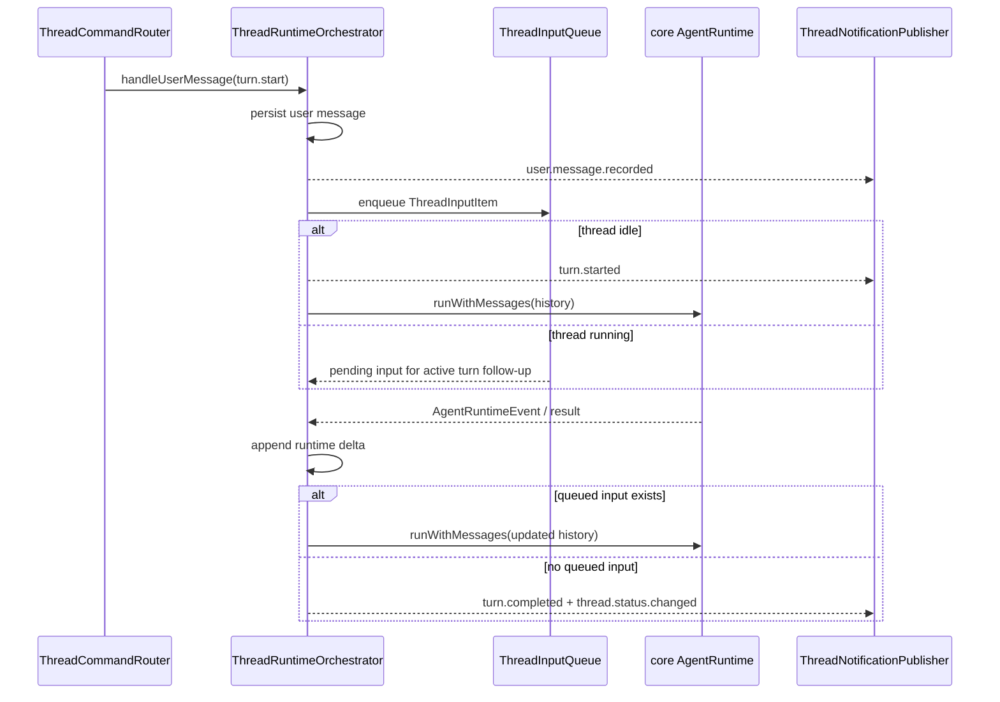

# Persistent Thread Input Queue Implementation Plan

> **For agentic workers:** REQUIRED SUB-SKILL: Use superpowers:subagent-driven-development (recommended) or superpowers:executing-plans to implement this plan task-by-task. Steps use checkbox (`- [ ]`) syntax for tracking.

**Goal:** Keep each backend thread session alive behind the old `turn.start` protocol, steer new input into the active turn first, and drain queued input without losing persisted messages.

**Architecture:** Add a focused `ThreadInputQueue` unit in `apps/agent-server/src/thread`, then refactor `ThreadRuntimeOrchestrator` into a per-thread session loop. `turn.start` remains the external command; internally it becomes a `ThreadInputItem`, is persisted immediately, and either wakes an idle loop or queues into the current active run.

**Tech Stack:** TypeScript, Vitest, Node async promises, existing `ThreadRuntimeOrchestrator`, `ThreadPersistence`, `AgentRuntime.runWithMessages`, `ThreadNotification`.

---

## File Map

- Create `apps/agent-server/src/thread/ThreadInputQueue.ts`: thread-local FIFO input abstraction, including user input and future response-item input.
- Create `apps/agent-server/tests/thread/ThreadInputQueue.test.ts`: unit tests for FIFO drain, async wait, and clearing pending input.
- Modify `apps/agent-server/src/thread/ThreadPersistence.ts`: add append-only run delta persistence so active-run output cannot overwrite user input recorded while the run was active.
- Modify `apps/agent-server/tests/thread/ThreadPersistence.test.ts`: cover append-only delta persistence.
- Modify `apps/agent-server/src/thread/ThreadRuntimeOrchestrator.ts`: replace one-shot `handleUserMessage` execution with a per-thread session loop that waits for queued input.
- Modify `apps/agent-server/tests/thread/ThreadRuntimeOrchestrator.test.ts`: update old one-shot expectations and add active-turn steer / follow-up coverage.
- Modify `apps/agent-server/tests/thread/ThreadCommandRouter.test.ts`: confirm router still accepts old `turn.start` and no Swift protocol changes are required.
- Modify `apps/agent-server/src/thread/thread.md`, `apps/agent-server/agent-server.md`, `handAgent.md`: document the compatible backend input queue model.
- Modify `docs/manual-qa.md`: add a completed verification entry after implementation and validation.

---

### Task 1: Add ThreadInputQueue

**Files:**
- Create: `apps/agent-server/src/thread/ThreadInputQueue.ts`
- Create: `apps/agent-server/tests/thread/ThreadInputQueue.test.ts`

- [ ] **Step 1: Write the failing queue tests**

Create `apps/agent-server/tests/thread/ThreadInputQueue.test.ts`:

```ts
import { describe, expect, it } from "vitest";
import type { ThreadAttachment } from "@handagent/core/protocol/ThreadProtocolShared.ts";
import { ThreadInputQueue, type ThreadInputItem } from "../../src/thread/ThreadInputQueue.ts";

function userItem(messageId: string, text: string): ThreadInputItem {
  return {
    kind: "user",
    threadId: "thread-queue",
    messageId,
    timestamp: "2026-06-07T00:00:00.000Z",
    payload: { text },
  };
}

describe("ThreadInputQueue", () => {
  it("drains queued input in FIFO order", () => {
    const queue = new ThreadInputQueue();

    queue.enqueue(userItem("u1", "first"));
    queue.enqueue(userItem("u2", "second"));

    expect(queue.hasPending()).toBe(true);
    expect(queue.takeAll()).toEqual([
      userItem("u1", "first"),
      userItem("u2", "second"),
    ]);
    expect(queue.hasPending()).toBe(false);
  });

  it("resolves waiters when input arrives", async () => {
    const queue = new ThreadInputQueue();
    const waiter = queue.waitForItems();

    queue.enqueue(userItem("u1", "wake"));

    await expect(waiter).resolves.toEqual([userItem("u1", "wake")]);
    expect(queue.hasPending()).toBe(false);
  });

  it("keeps attachment payloads on user input items", () => {
    const attachments: ThreadAttachment[] = [
      { kind: "text_selection", id: "selection-1", text: "selected text" },
    ];
    const queue = new ThreadInputQueue();

    queue.enqueue({
      kind: "user",
      threadId: "thread-queue",
      messageId: "u1",
      timestamp: "2026-06-07T00:00:00.000Z",
      payload: { text: "with attachment", attachments },
    });

    expect(queue.takeAll()[0]).toMatchObject({
      kind: "user",
      payload: { attachments },
    });
  });

  it("clears pending input without resolving future waits", () => {
    const queue = new ThreadInputQueue();

    queue.enqueue(userItem("u1", "discard"));
    queue.clear();

    expect(queue.takeAll()).toEqual([]);
    expect(queue.hasPending()).toBe(false);
  });
});
```

- [ ] **Step 2: Run the queue tests and verify they fail**

Run:

```bash
pnpm exec vitest run apps/agent-server/tests/thread/ThreadInputQueue.test.ts
```

Expected: fail because `apps/agent-server/src/thread/ThreadInputQueue.ts` does not exist.

- [ ] **Step 3: Implement the queue**

Create `apps/agent-server/src/thread/ThreadInputQueue.ts`:

```ts
import type { AgentMessage } from "@handagent/core/runtime/AgentMessage.ts";
import type { ThreadAttachment } from "@handagent/core/protocol/ThreadProtocolShared.ts";

export type ThreadUserInputItem = {
  kind: "user";
  threadId: string;
  messageId: string;
  timestamp: string;
  payload: {
    text: string;
    attachments?: ThreadAttachment[];
  };
};

export type ThreadResponseInputItem = {
  kind: "response";
  id: string;
  timestamp: string;
  payload: {
    messages: AgentMessage[];
  };
};

export type ThreadInputItem = ThreadUserInputItem | ThreadResponseInputItem;

type QueueWaiter = (items: ThreadInputItem[]) => void;

export class ThreadInputQueue {
  private readonly items: ThreadInputItem[] = [];
  private readonly waiters: QueueWaiter[] = [];

  enqueue(item: ThreadInputItem): void {
    this.items.push(item);
    this.resolveNextWaiter();
  }

  hasPending(): boolean {
    return this.items.length > 0;
  }

  takeAll(): ThreadInputItem[] {
    return this.items.splice(0);
  }

  clear(): void {
    this.items.splice(0);
  }

  waitForItems(): Promise<ThreadInputItem[]> {
    const ready = this.takeAll();
    if (ready.length > 0) {
      return Promise.resolve(ready);
    }

    return new Promise((resolve) => {
      this.waiters.push(resolve);
    });
  }

  private resolveNextWaiter(): void {
    if (this.items.length === 0 || this.waiters.length === 0) {
      return;
    }

    const waiter = this.waiters.shift();
    waiter?.(this.takeAll());
  }
}
```

- [ ] **Step 4: Run the queue tests and verify they pass**

Run:

```bash
pnpm exec vitest run apps/agent-server/tests/thread/ThreadInputQueue.test.ts
```

Expected: all tests in `ThreadInputQueue.test.ts` pass.

- [ ] **Step 5: Commit**

```bash
git add apps/agent-server/src/thread/ThreadInputQueue.ts apps/agent-server/tests/thread/ThreadInputQueue.test.ts
git commit -m "feat: add thread input queue"
```

---

### Task 2: Add Append-Only Runtime Result Persistence

**Files:**
- Modify: `apps/agent-server/src/thread/ThreadPersistence.ts`
- Modify: `apps/agent-server/tests/thread/ThreadPersistence.test.ts`

- [ ] **Step 1: Write the failing persistence test**

Append this test to the `describe("ThreadPersistence", ...)` block in `apps/agent-server/tests/thread/ThreadPersistence.test.ts`:

```ts
  it("appends runtime output without dropping user input recorded during the run", async () => {
    const persistence = new ThreadPersistence(
      new InMemoryThreadStore(),
      () => "2026-06-07T00:00:00.000Z",
    );
    await persistence.ensureThread("thread-delta");
    await persistence.persistUserMessage("thread-delta", "first");
    const baseMessages = await persistence.getMessages("thread-delta");

    await persistence.persistUserMessage("thread-delta", "steered while running");
    await persistence.persistRunDelta(
      "thread-delta",
      baseMessages.length,
      [
        ...baseMessages,
        { role: "assistant", content: "reply to first" },
      ],
      [],
    );

    expect(await persistence.getMessages("thread-delta")).toEqual([
      { role: "user", content: "first" },
      { role: "user", content: "steered while running" },
      { role: "assistant", content: "reply to first" },
    ]);
  });
```

If `InMemoryThreadStore` is not already imported in that test file, add:

```ts
import { InMemoryThreadStore } from "@handagent/core/storage/index.ts";
```

- [ ] **Step 2: Run the persistence test and verify it fails**

Run:

```bash
pnpm exec vitest run apps/agent-server/tests/thread/ThreadPersistence.test.ts -t "appends runtime output"
```

Expected: fail because `persistRunDelta` is not defined.

- [ ] **Step 3: Implement append-only delta persistence**

Add this method to `ThreadPersistence` in `apps/agent-server/src/thread/ThreadPersistence.ts`, directly after `persistRunResult`:

```ts
  async persistRunDelta(
    threadId: string,
    baseMessageCount: number,
    runtimeMessages: AgentMessage[],
    events: ThreadAuditEvent[],
  ): Promise<void> {
    const generatedMessages = runtimeMessages.slice(baseMessageCount);
    if (generatedMessages.length > 0) {
      const currentMessages = await this.getMessages(threadId);
      await this.store.setMessages(
        threadId,
        [...currentMessages, ...generatedMessages],
        this.now(),
      );
    }
    if (events.length > 0) {
      await this.store.appendEvents(threadId, events);
    }
  }
```

- [ ] **Step 4: Run the persistence test and verify it passes**

Run:

```bash
pnpm exec vitest run apps/agent-server/tests/thread/ThreadPersistence.test.ts -t "appends runtime output"
```

Expected: selected test passes.

- [ ] **Step 5: Run all persistence tests**

Run:

```bash
pnpm exec vitest run apps/agent-server/tests/thread/ThreadPersistence.test.ts
```

Expected: all `ThreadPersistence` tests pass.

- [ ] **Step 6: Commit**

```bash
git add apps/agent-server/src/thread/ThreadPersistence.ts apps/agent-server/tests/thread/ThreadPersistence.test.ts
git commit -m "feat: append runtime deltas without dropping queued input"
```

---

### Task 3: Refactor Orchestrator Into a Per-Thread Session Loop

**Files:**
- Modify: `apps/agent-server/src/thread/ThreadRuntimeOrchestrator.ts`
- Modify: `apps/agent-server/tests/thread/ThreadRuntimeOrchestrator.test.ts`

- [ ] **Step 1: Add test helpers**

In `apps/agent-server/tests/thread/ThreadRuntimeOrchestrator.test.ts`, add these helpers near `expectTypes`:

```ts
async function waitUntil(
  predicate: () => boolean | Promise<boolean>,
  label: string,
): Promise<void> {
  const startedAt = Date.now();
  while (Date.now() - startedAt < 500) {
    if (await predicate()) {
      return;
    }
    await new Promise((resolve) => setTimeout(resolve, 5));
  }
  throw new Error(`Timed out waiting for ${label}`);
}

function createDeferred(): { promise: Promise<void>; resolve: () => void } {
  let resolve!: () => void;
  const promise = new Promise<void>((done) => {
    resolve = done;
  });
  return { promise, resolve };
}
```

- [ ] **Step 2: Write the failing active-turn steer test**

Add this test to `describe("ThreadRuntimeOrchestrator", ...)`:

```ts
  it("steers new user input into the active turn without aborting the running request", async () => {
    const pushed: ThreadNotification[] = [];
    const runtimeCalls: AgentMessage[][] = [];
    const runSignals: AbortSignal[] = [];
    const firstRunGate = createDeferred();
    const persistence = new ThreadPersistence(
      new InMemoryThreadStore(),
      () => "2026-06-07T00:00:00.000Z",
    );
    const orchestrator = new ThreadRuntimeOrchestrator(
      {
        async runWithMessages(messages, _onEvent, runOptions) {
          runtimeCalls.push(messages.map((message) => ({ ...message })));
          if (runOptions?.signal) {
            runSignals.push(runOptions.signal);
          }
          if (runtimeCalls.length === 1) {
            await firstRunGate.promise;
            return {
              messages: [
                ...messages,
                { role: "assistant" as const, content: "first reply" },
              ],
            };
          }
          return {
            messages: [
              ...messages,
              { role: "assistant" as const, content: "second reply" },
            ],
          };
        },
      },
      persistence,
      () => "2026-06-07T00:00:00.000Z",
    );

    await persistence.ensureThread("thread-steer");

    await orchestrator.handleUserMessage(
      createUserMessage("thread-steer", "first", "user-1"),
      (message) => pushed.push(message),
    );
    await waitUntil(() => runtimeCalls.length === 1, "first runtime call");

    await orchestrator.handleUserMessage(
      createUserMessage("thread-steer", "second", "user-2"),
      (message) => pushed.push(message),
    );

    expect(runSignals[0]?.aborted).toBe(false);
    expect(eventTypes(pushed).filter((type) => type === "turn.started")).toHaveLength(1);
    expect(eventTypes(pushed).filter((type) => type === "user.message.recorded")).toHaveLength(2);

    firstRunGate.resolve();
    await waitUntil(() => runtimeCalls.length === 2, "follow-up runtime call");
    await orchestrator.waitForThreadIdle("thread-steer");

    expect(runtimeCalls).toEqual([
      [{ role: "user", content: "first" }],
      [
        { role: "user", content: "first" },
        { role: "user", content: "second" },
        { role: "assistant", content: "first reply" },
      ],
    ]);
    expect(await persistence.getMessages("thread-steer")).toEqual([
      { role: "user", content: "first" },
      { role: "user", content: "second" },
      { role: "assistant", content: "first reply" },
      { role: "assistant", content: "second reply" },
    ]);
    expect(eventTypes(pushed).filter((type) => type === "turn.completed")).toHaveLength(1);
    expect(pushed.at(-1)).toMatchObject({
      type: "thread.status.changed",
      payload: { value: "idle" },
    });
  });
```

- [ ] **Step 3: Run the active-turn steer test and verify it fails**

Run:

```bash
pnpm exec vitest run apps/agent-server/tests/thread/ThreadRuntimeOrchestrator.test.ts -t "steers new user input"
```

Expected: fail because current `handleUserMessage` blocks on the first runtime call and has no `waitForThreadIdle`.

- [ ] **Step 4: Refactor orchestrator types and constructor state**

In `apps/agent-server/src/thread/ThreadRuntimeOrchestrator.ts`, add the import:

```ts
import { ThreadInputQueue, type ThreadUserInputItem } from "./ThreadInputQueue.ts";
```

Replace the current `ActiveRun` type with:

```ts
type ActiveRun = {
  turnId: string;
  controller: AbortController;
  generation: number;
  interrupted: boolean;
  interruptionPersisted: boolean;
};

type ThreadSession = {
  threadId: string;
  queue: ThreadInputQueue;
  push: PushMessage;
  loop: Promise<void> | null;
  activeRun: ActiveRun | null;
  idleWaiters: Set<() => void>;
  closed: boolean;
};
```

Replace the existing active run fields with:

```ts
  private readonly sessions = new Map<string, ThreadSession>();
  private readonly activeRuns = new Map<string, ActiveRun>();
  private nextGeneration = 0;
```

- [ ] **Step 5: Replace handleUserMessage with enqueue-and-wake behavior**

Replace `handleUserMessage` in `ThreadRuntimeOrchestrator.ts` with:

```ts
  async handleUserMessage(
    message: UserMessageInput,
    push: PushMessage,
  ): Promise<void> {
    const item: ThreadUserInputItem = {
      kind: "user",
      threadId: message.threadId,
      messageId: message.messageId,
      timestamp: message.timestamp,
      payload: {
        text: message.payload.text,
        attachments: message.payload.attachments,
      },
    };

    await this.recordUserInput(item, push);
    const session = this.getOrCreateSession(message.threadId, push);
    session.push = push;
    session.queue.enqueue(item);
    this.ensureSessionLoop(session);
  }
```

Add this helper near the other private methods:

```ts
  private async recordUserInput(item: ThreadUserInputItem, push: PushMessage): Promise<void> {
    await this.persistence.persistUserMessage(
      item.threadId,
      item.payload.text,
      item.payload.attachments,
    );
    await this.persistence.autoTitle(item.threadId, item.payload.text);
    push({
      type: "user.message.recorded",
      threadId: item.threadId,
      notificationId: `${item.threadId}-${item.messageId}-user-recorded`,
      timestamp: this.now(),
      payload: {
        messageId: item.messageId,
        text: item.payload.text,
      },
    });
  }
```

- [ ] **Step 6: Add session loop helpers**

Add these private methods to `ThreadRuntimeOrchestrator.ts`:

```ts
  private getOrCreateSession(threadId: string, push: PushMessage): ThreadSession {
    const existing = this.sessions.get(threadId);
    if (existing) {
      return existing;
    }

    const session: ThreadSession = {
      threadId,
      queue: new ThreadInputQueue(),
      push,
      loop: null,
      activeRun: null,
      idleWaiters: new Set(),
      closed: false,
    };
    this.sessions.set(threadId, session);
    return session;
  }

  private ensureSessionLoop(session: ThreadSession): void {
    if (session.loop) {
      return;
    }

    session.loop = this.runSessionLoop(session).catch((error) => {
      const message = toErrorMessage(error);
      session.push({
        type: "thread.error",
        threadId: session.threadId,
        notificationId: `${session.threadId}-session-loop-error`,
        timestamp: this.now(),
        payload: { message },
      });
    });
  }

  private async runSessionLoop(session: ThreadSession): Promise<void> {
    while (!session.closed) {
      const queuedItems = await session.queue.waitForItems();
      const firstUserInput = queuedItems.find((item): item is ThreadUserInputItem => item.kind === "user");
      if (!firstUserInput) {
        continue;
      }

      const activeRun = this.createActiveRun(firstUserInput.messageId);
      session.activeRun = activeRun;
      this.activeRuns.set(session.threadId, activeRun);
      this.emitTurnStarted(session.threadId, firstUserInput.messageId, session.push);

      try {
        await this.runActiveTurnUntilDrained(session, activeRun);
      } finally {
        if (this.isActive(session.threadId, activeRun)) {
          this.activeRuns.delete(session.threadId);
        }
        if (session.activeRun === activeRun) {
          session.activeRun = null;
        }
        this.resolveIdleWaiters(session);
      }
    }
  }

  private createActiveRun(turnId: string): ActiveRun {
    const activeRun: ActiveRun = {
      turnId,
      controller: new AbortController(),
      generation: this.nextGeneration + 1,
      interrupted: false,
      interruptionPersisted: false,
    };
    this.nextGeneration = activeRun.generation;
    return activeRun;
  }

  private emitTurnStarted(threadId: string, turnId: string, push: PushMessage): void {
    push({
      type: "turn.started",
      threadId,
      notificationId: `${threadId}-${turnId}-turn-started`,
      turnId,
      timestamp: this.now(),
      payload: {},
    });
  }
```

- [ ] **Step 7: Add active turn drain loop**

Move the existing runtime execution body into this new method and use `persistRunDelta`:

```ts
  private async runActiveTurnUntilDrained(
    session: ThreadSession,
    activeRun: ActiveRun,
  ): Promise<void> {
    while (this.isActive(session.threadId, activeRun) && !activeRun.controller.signal.aborted) {
      const history = await this.persistence.getMessages(session.threadId);
      await this.beforeRun(session.threadId);
      const runtime = this.runtimeForThread(session.threadId);
      await runtime.waitForPendingSummaries?.(history);
      const runtimeHistory = agentMessagesToRuntimeMessages(history);

      try {
        const events: ThreadAuditEvent[] = [];
        const result = await runtime.runWithMessages(
          runtimeHistory,
          (event) => {
            if (!this.isActive(session.threadId, activeRun) || activeRun.controller.signal.aborted) {
              return;
            }
            const outgoing = toThreadNotification(session.threadId, activeRun.turnId, event, this.now());
            if (outgoing) {
              session.push(outgoing);
            }

            const auditEvent = toAuditEvent(event, this.now());
            if (auditEvent) {
              events.push(auditEvent);
            }
          },
          { threadId: session.threadId, signal: activeRun.controller.signal },
        );

        if (!this.isActive(session.threadId, activeRun) || activeRun.controller.signal.aborted) {
          if (this.isActive(session.threadId, activeRun) && activeRun.interrupted) {
            await this.persistInterrupted(session.threadId, activeRun);
          }
          return;
        }

        await this.persistence.persistRunDelta(
          session.threadId,
          history.length,
          result.messages,
          events,
        );

        const steeredItems = session.queue.takeAll();
        if (steeredItems.length > 0) {
          continue;
        }

        this.emitCompleted(session.threadId, session.push, activeRun, "completed");
        this.emitThreadStatus(session.threadId, session.push, activeRun.turnId, "idle");
        return;
      } catch (error) {
        await this.handleActiveRunError(session, activeRun, error);
        return;
      }
    }
  }
```

Add these emit/error helpers:

```ts
  private emitCompleted(
    threadId: string,
    push: PushMessage,
    activeRun: ActiveRun,
    status: "completed" | "failed" | "interrupted",
  ): void {
    push({
      type: "turn.completed",
      threadId,
      notificationId: `${threadId}-${activeRun.turnId}-turn-${status}`,
      turnId: activeRun.turnId,
      timestamp: this.now(),
      payload: { status },
    });
  }

  private emitThreadStatus(
    threadId: string,
    push: PushMessage,
    turnId: string,
    value: "idle" | "failed" | "interrupted",
  ): void {
    push({
      type: "thread.status.changed",
      threadId,
      notificationId: `${threadId}-${turnId}-status-${value}`,
      timestamp: this.now(),
      payload: { value },
    });
  }

  private async handleActiveRunError(
    session: ThreadSession,
    activeRun: ActiveRun,
    error: unknown,
  ): Promise<void> {
    if (isAbortError(error)) {
      if (this.isActive(session.threadId, activeRun)) {
        if (!activeRun.interrupted) {
          this.emitInterrupted(session.threadId, session.push, activeRun);
        }
        await this.persistInterrupted(session.threadId, activeRun);
      }
      return;
    }
    if (!this.isActive(session.threadId, activeRun)) {
      return;
    }
    if (activeRun.controller.signal.aborted) {
      if (activeRun.interrupted) {
        await this.persistInterrupted(session.threadId, activeRun);
      }
      return;
    }
    const errorMessage = toErrorMessage(error);
    session.push({
      type: "thread.error",
      threadId: session.threadId,
      notificationId: `${session.threadId}-${activeRun.turnId}-error`,
      timestamp: this.now(),
      payload: { message: errorMessage },
    });
    this.emitCompleted(session.threadId, session.push, activeRun, "failed");
    this.emitThreadStatus(session.threadId, session.push, activeRun.turnId, "failed");
    await this.persistence.persistError(session.threadId, errorMessage);
  }
```

- [ ] **Step 8: Update interrupt, running, and idle wait methods**

Replace `interruptThread`, `isThreadRunning`, and `interruptAndWait` with:

```ts
  interruptThread(threadId: string, push: PushMessage = () => {}): void {
    const session = this.sessions.get(threadId);
    const activeRun = session?.activeRun ?? this.activeRuns.get(threadId);
    if (!activeRun || activeRun.interrupted) return;

    session?.queue.clear();
    activeRun.controller.abort();
    this.emitInterrupted(threadId, push, activeRun);
  }

  isThreadRunning(threadId: string): boolean {
    return this.sessions.get(threadId)?.activeRun !== null || this.activeRuns.has(threadId);
  }

  async waitForThreadIdle(threadId: string): Promise<void> {
    const session = this.sessions.get(threadId);
    if (!session || !session.activeRun) {
      return;
    }

    await new Promise<void>((resolve) => {
      session.idleWaiters.add(resolve);
    });
  }

  async interruptAndWait(threadId: string, push: PushMessage = () => {}): Promise<void> {
    const session = this.sessions.get(threadId);
    const activeRun = session?.activeRun ?? this.activeRuns.get(threadId);
    if (!activeRun) return;

    this.interruptThread(threadId, push);

    const startedAt = Date.now();
    while (this.isActive(threadId, activeRun)) {
      if (Date.now() - startedAt >= this.interruptWaitTimeoutMs) {
        await this.persistInterrupted(threadId, activeRun);
        if (this.isActive(threadId, activeRun)) {
          this.activeRuns.delete(threadId);
          if (session?.activeRun === activeRun) {
            session.activeRun = null;
            this.resolveIdleWaiters(session);
          }
        }
        return;
      }
      await new Promise((resolve) => setTimeout(resolve, this.interruptPollIntervalMs));
    }
  }
```

Add:

```ts
  private resolveIdleWaiters(session: ThreadSession): void {
    const waiters = [...session.idleWaiters];
    session.idleWaiters.clear();
    for (const resolve of waiters) {
      resolve();
    }
  }
```

- [ ] **Step 9: Remove obsolete merge usage**

Delete `mergeRuntimeResultWithPersistedHistory` from `ThreadRuntimeOrchestrator.ts` after no call sites remain.

- [ ] **Step 10: Run the active-turn steer test and verify it passes**

Run:

```bash
pnpm exec vitest run apps/agent-server/tests/thread/ThreadRuntimeOrchestrator.test.ts -t "steers new user input"
```

Expected: selected test passes.

- [ ] **Step 11: Run all orchestrator tests and fix expectation drift**

Run:

```bash
pnpm exec vitest run apps/agent-server/tests/thread/ThreadRuntimeOrchestrator.test.ts
```

Expected: all orchestrator tests pass. For old tests that awaited `handleUserMessage` to mean "run finished", add `await orchestrator.waitForThreadIdle("<thread-id>")` immediately after `handleUserMessage`.

- [ ] **Step 12: Commit**

```bash
git add apps/agent-server/src/thread/ThreadRuntimeOrchestrator.ts apps/agent-server/tests/thread/ThreadRuntimeOrchestrator.test.ts
git commit -m "feat: steer input through persistent thread sessions"
```

---

### Task 4: Router Compatibility Coverage

**Files:**
- Modify: `apps/agent-server/tests/thread/ThreadCommandRouter.test.ts`

- [ ] **Step 1: Add a router compatibility test**

Append this test to `describe("ThreadCommandRouter", ...)`:

```ts
  it("keeps old turn.start compatible with async backend input handling", async () => {
    const publisher = new ThreadNotificationPublisher();
    const seen: ThreadNotification[] = [];
    publisher.attachConnection("c1", (event) => seen.push(event as ThreadNotification));
    const persistence = new ThreadPersistence(
      new InMemoryThreadStore(),
      () => "2026-06-07T00:00:00.000Z",
    );
    const thread = await persistence.createThread();
    publisher.subscribe("c1", thread.metadata.id);
    const orchestrator = {
      handleUserMessage: vi.fn(async (_message, push: (message: ThreadNotification) => void) => {
        push({
          type: "user.message.recorded",
          threadId: thread.metadata.id,
          notificationId: "recorded",
          timestamp: "2026-06-07T00:00:00.000Z",
          payload: { messageId: "turn-1", text: "hi" },
        });
      }),
    };
    const router = new ThreadCommandRouter(
      orchestrator,
      persistence,
      publisher,
      () => "2026-06-07T00:00:00.000Z",
    );

    await router.receive(
      {
        type: "turn.start",
        threadId: thread.metadata.id,
        commandId: "turn-1",
        timestamp: "2026-06-07T00:00:00.000Z",
        payload: { text: "hi" },
      },
      "c1",
    );

    expect(orchestrator.handleUserMessage).toHaveBeenCalledWith(
      expect.objectContaining({
        threadId: thread.metadata.id,
        messageId: "turn-1",
        payload: { text: "hi", attachments: undefined },
      }),
      expect.any(Function),
    );
    expect(seen).toEqual([
      expect.objectContaining({
        type: "user.message.recorded",
        threadId: thread.metadata.id,
      }),
    ]);
  });
```

- [ ] **Step 2: Run the router tests**

Run:

```bash
pnpm exec vitest run apps/agent-server/tests/thread/ThreadCommandRouter.test.ts
```

Expected: all router tests pass.

- [ ] **Step 3: Commit**

```bash
git add apps/agent-server/tests/thread/ThreadCommandRouter.test.ts
git commit -m "test: cover legacy turn start input routing"
```

---

### Task 5: Update Backend Documentation

**Files:**
- Modify: `apps/agent-server/src/thread/thread.md`
- Modify: `apps/agent-server/agent-server.md`
- Modify: `handAgent.md`

- [ ] **Step 1: Update `apps/agent-server/src/thread/thread.md`**

Replace the current “一轮 `turn.start`” section with text matching this shape:

```md
## 兼容旧协议的输入队列

`turn.start` 仍是 desktop 发来的旧命令，但 agent-server 内部会先把它归一化为 `ThreadInputItem(kind: "user")`。



运行中收到新的 `turn.start` 不再 abort 当前 run；新输入会立即记录为用户消息，并在当前 active turn 的下一次 follow-up 中进入模型上下文。
```

- [ ] **Step 2: Update `apps/agent-server/agent-server.md`**

In the “启动与组合” list, replace the thread orchestration bullet with:

```md
7. 创建 `ThreadPersistence`、`ThreadRuntimeOrchestrator`、`ThreadInputQueue` 驱动的 per-thread session loop、`ThreadNotificationPublisher`、`ThreadCommandRouter`。
```

In “主消息流”, add one sentence after the diagram:

```md
`turn.start` 是兼容入口；进入 `ThreadRuntimeOrchestrator` 后会变成 thread-local input item，优先 steer 到当前 active turn，没有 active turn 时才唤醒新的 backend turn worker。
```

- [ ] **Step 3: Update `handAgent.md`**

In “当前实现状态”, replace the existing orchestrator sentence with:

```md
- `agent-server` 通过 `ThreadCommandRouter + ThreadRuntimeOrchestrator + ThreadInputQueue + ThreadNotificationPublisher + ThreadPersistence + ThreadStore` 管理 thread；旧 `turn.start` 协议在后端内部归一化为 input item，运行中的 thread 会优先把新输入 steer 到当前 active turn。
```

- [ ] **Step 4: Commit docs**

```bash
git add apps/agent-server/src/thread/thread.md apps/agent-server/agent-server.md handAgent.md
git commit -m "docs: document backend thread input queue"
```

---

### Task 6: Final Verification and Manual QA Entry

**Files:**
- Modify: `docs/manual-qa.md`

- [ ] **Step 1: Run focused backend tests**

Run:

```bash
pnpm exec vitest run \
  apps/agent-server/tests/thread/ThreadInputQueue.test.ts \
  apps/agent-server/tests/thread/ThreadPersistence.test.ts \
  apps/agent-server/tests/thread/ThreadRuntimeOrchestrator.test.ts \
  apps/agent-server/tests/thread/ThreadCommandRouter.test.ts
```

Expected: all selected tests pass.

- [ ] **Step 2: Run full TypeScript/core validation**

Run:

```bash
bash ./scripts/test.sh
```

Expected: all non-integration tests pass, with the existing LLM integration test skipped.

- [ ] **Step 3: Run Swift validation for compatibility**

Run:

```bash
bash ./scripts/swiftw test
bash ./scripts/swiftw build
```

Expected: Swift tests and build pass without changing Swift source.

- [ ] **Step 4: Add manual QA entry**

Run this command and keep the printed hash for the entry:

```bash
git rev-parse --short HEAD
```

Append this entry to `docs/manual-qa.md` in the current completed-verification section format used by the file, using the printed hash as the value after `关键 commit`:

```md
### 后端常驻 Thread 输入队列

- 完成日期：2026-06-07
- 关键 commit：使用 Step 4 命令输出的短 hash
- 实现位置：`apps/agent-server/src/thread/ThreadInputQueue.ts`、`apps/agent-server/src/thread/ThreadRuntimeOrchestrator.ts`、`apps/agent-server/src/thread/ThreadPersistence.ts`
- 验收结果：后端兼容旧 `turn.start`；运行中输入不再中断当前 run，而是排队进入 active turn follow-up。已通过 `bash ./scripts/test.sh`、`bash ./scripts/swiftw test`、`bash ./scripts/swiftw build`。
```

- [ ] **Step 5: Commit manual QA**

```bash
git add docs/manual-qa.md
git commit -m "docs: record thread input queue manual qa"
```

- [ ] **Step 6: Final status check**

Run:

```bash
git status --short
```

Expected: no uncommitted changes in `.worktrees/persistent-thread-input-queue`.

---

## Self-Review

- Spec coverage: old `turn.start` compatibility is covered by Task 4; input item abstraction by Task 1; active-turn steering by Task 3; append-only persistence by Task 2; docs and manual QA by Tasks 5 and 6.
- Scope: Swift protocol changes and destructive protocol cleanup remain excluded from implementation and are already listed in the waiting work document.
- Type consistency: `ThreadInputItem`, `ThreadUserInputItem`, `ThreadInputQueue`, `persistRunDelta`, and `waitForThreadIdle` are introduced before later tasks use them.
