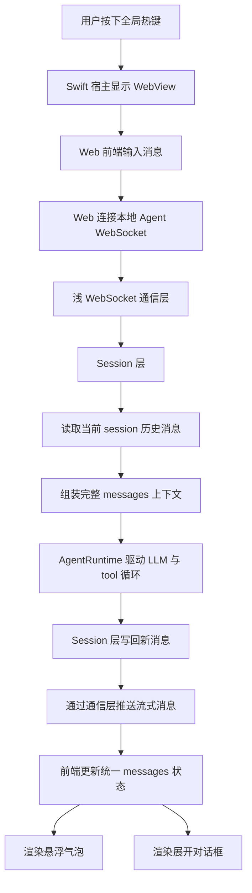

# Agent Core 本地流式通信层设计稿

## 背景

当前实现中，`apps/desktop/Web/App.tsx` 直接在 WebView 前端实例化 `AgentRuntime` 与 `VercelClient`。这会带来几个直接问题：

- WebView 是浏览器运行时，不适合直接承担 Agent Core 的执行职责。
- `OPENAI_API_KEY` 无法由浏览器运行时直接读取，这与“由 Agent Core 自己读取环境变量”的目标冲突。
- 前端现在主要面向悬浮气泡渲染，没有统一的会话内存状态，后续很难扩展到完整对话框、历史记录和查询能力。

因此，本设计将运行边界调整为：

- 前端只负责 UI、输入、流式事件消费和内存状态维护。
- Agent Core 由独立 Node 进程运行。
- 前后端通过一个很浅的本地 WebSocket 通信层连接。
- Swift 宿主负责拉起本地 Node agent server，并把连接地址注入到 WebView 全局变量。
- Node 侧增加一个独立 `session` 层，负责消息存储、历史读取、上下文组装和 runtime 编排。
- 宿主只负责生命周期管理与本地连接信息下发，不读取 API key，不参与 LLM 业务。

## 当前实现状态

- 已实现：`apps/agent-server/` 独立 Node server、`SessionManager`、本地 WebSocket glue。
- 已实现：`packages/core/` 的 `runWithMessages` 流式入口，以及共享 `SessionMessage` / `ConversationMessage` 协议。
- 已实现：`apps/desktop/Web/` 切到 WebSocket 连接、统一 `ConversationState`、`session_snapshot` / `tool_message` / `status` reducer。
- 已实现：`apps/desktop/HandAgentApp.swift` 启动本地 Node server，并向 WebView 注入 `window.__HANDAGENT_SERVER_URL__`。
- 仍保留：对话记录持久化、历史查询、完整权限与审计体系。

## 设计目标

- 让 `packages/core/` 运行在独立 Node 进程中，由该进程直接读取环境变量。
- 让 `apps/desktop/Web/` 不再直接实例化 runtime / provider。
- 前后端尽量同构，减少个人独立开发下不必要的 DTO 转换成本。
- 通信层尽量薄，只负责 WebSocket 通信与消息分发，不承载复杂编排。
- 单条消息进入服务端后，由 `session` 层负责存储、读取历史、组装上下文并调用 runtime。
- 不把协议拆成 `command/event` 两类，而是统一成单一消息模型，用 `type` 区分语义。
- 前端维护一份统一 `messages` 内存状态，并基于同一份数据派生两种 UI：
  - 悬浮气泡
  - 展开后的大对话框
- 收到用户单条消息后，服务端读取当前 session 的既有消息，组装成完整上下文后再调用 agent loop。
- 为未来“对话记录存储与查询”预留清晰的数据模型和协议边界。
- 保持现有产品边界：只有用户主动输入和用户主动选区可以作为初始上下文。

## 第一版非目标

- 不实现远程多机通信。
- 不实现复杂鉴权体系。
- 不实现完整的断线恢复。
- 不在第一版实现对话记录持久化和历史查询。
- 不在第一版实现完整 tool 审批流。

## 参考来源与提炼结论

本设计参考本地 `claude-code` 的以下实现思路：

- `/Users/mu9/proj/claude-code/src/remote/RemoteSessionManager.ts`
- `/Users/mu9/proj/claude-code/src/remote/SessionsWebSocket.ts`
- `/Users/mu9/proj/claude-code/src/remote/sdkMessageAdapter.ts`

需要明确的是，`claude-code` 远程模式并不是“所有消息都走单个 WebSocket”：

- 用户消息写入走 HTTP
- 会话事件订阅走 WebSocket
- 少量控制消息也走 WebSocket

HandAgent 这里不照搬它的传输方案，只借鉴它的两点：

1. 会话是流式的，不是一次性请求返回。
2. UI 不应直接绑死在 runtime 内部结构上。

## 架构概览

## 分层与职责

### 1. Web 前端层

位置：

- `apps/desktop/Web/`

职责：

- 收集用户输入。
- 接收宿主下发的本地连接地址。
- 建立并维护本地 WebSocket 连接。
- 发送用户消息和用户动作。
- 消费流式消息并维护统一会话内存状态。
- 由同一份会话状态派生两种视图：
  - 悬浮气泡视图
  - 展开后的大对话框视图

约束：

- 不直接实例化 `AgentRuntime`。
- 不直接读取 API key。
- 不直接注册或执行 tool。

### 2. 宿主层

位置：

- `apps/desktop/HandAgentApp.swift`

职责：

- 启动、监控、停止本地 Node Agent Server。
- 管理本地连接地址，例如端口和 `window.__HANDAGENT_SERVER_URL__` 注入。
- 把连接地址注入 WebView。
- 保持热键、窗口、WebView 桥接职责不变。

约束：

- 不读取 `OPENAI_API_KEY`。
- 不参与模型请求。
- 不承载 tool 调度逻辑。

### 3. Agent Server 层

建议新增位置：

- `apps/agent-server/`

职责：

- 作为独立 Node 进程运行。
- 从 Node 环境读取 `OPENAI_API_KEY`。
- 创建 `ToolRegistry`、`PlatformAdapter`、`VercelClient`、`AgentRuntime`。
- 暴露本地 WebSocket 服务。
- 挂载浅通信层与 `session` 层。

### 4. Session 层

建议新增位置：

- `packages/core/src/session/` 或 `apps/agent-server/session/`

职责：

- 维护每个 `session` 的消息状态。
- 存储新进入的用户消息。
- 读取指定 `session` 的历史消息。
- 将历史消息与本轮新增消息组装成完整 `messages` 上下文。
- 调用 runtime。
- 接收 runtime 流式输出。
- 将新增 assistant / tool / system 消息写回当前 `session`。
- 将应发送给前端的消息回推给通信层。

### 5. Core 层

位置：

- `packages/core/`

职责：

- 保持平台无关的会话模型、runtime 循环、tool 协议和 schema 定义。
- 补充可流式观察的 runtime 事件接口。
- 接收完整 `messages` 上下文，执行 agent loop。

约束：

- 不依赖前端状态。
- 不依赖 Swift 宿主。
- 不依赖具体 WebSocket 框架。

## 浅通信层原则

通信层只做三件事：

- 建立 WebSocket 连接。
- 按 `type` 收发消息。
- 把消息转交给 `session` 层。

它不负责：

- 复杂的协议编排。
- DTO 转换层。
- 业务状态机。
- 会话历史管理。
- runtime 调度逻辑。
- 会话消息的 UI 派生逻辑。

也就是说，这一层只是“transport glue”，不是新的业务中枢。

## 同构策略

考虑到当前是个人独立开发，第一版不追求严格的前后端 DTO 隔离，而采用“协议显式、类型同构”的策略。

原则：

- 协议类型在共享层定义。
- Web 与 Node 共同依赖这套类型。
- 只有在必须屏蔽内部实现时才引入额外适配。

建议共享的类型：

- `SessionMessage`
- `ConversationMessage`
- `SessionStatus`
- `ToolCallSummary`

不建议直接共享的内容：

- provider 原始响应
- 平台适配器内部对象
- 未稳定的 runtime 调试结构

## 连接模型

第一版采用单个本地 WebSocket 连接：

- `ws://127.0.0.1:<port>/api/session`

这条连接上既承载用户侧发出的消息，也承载服务端推送回来的流式消息。

这里的“单连接”是 HandAgent 的本地方案选择，不是 `claude-code` 远程模式的照搬。

## 协议设计

### 单一消息模型

统一使用一个消息结构：

- `type`
- `sessionId`
- `messageId`
- `payload`
- `timestamp`

通过 `type` 概括不同语义。

### 第一版建议的 `type`

前端发给服务端：

- `user_message`
  用户发出一条新的输入消息。
- `interrupt`
  请求中断当前生成。
- `open_session`
  建立或切换到某个 session。

服务端发给前端：

- `assistant_message_start`
- `assistant_message_delta`
- `assistant_message_end`
- `tool_message`
- `status`
- `error`
- `session_snapshot`

说明：

- `user_message` 是普通业务输入。
- `interrupt` 是用户动作，不再额外包装为 command。
- `assistant_message_*` 用于流式生成。
- `session_snapshot` 用于前端首次进入某个 session 时同步当前完整消息状态。

## Session 与消息组装

第一版按你要求采用非常直接的方式：

1. 前端发送一条 `user_message`
2. 浅通信层将该消息交给 `session` 层
3. `session` 层根据 `sessionId` 读取当前 session 之前的消息
4. `session` 层先写入这条新的用户消息
5. `session` 层将历史消息与这条新的用户消息组装成完整 `messages`
6. `session` 层把完整 `messages` 传给 agent loop
7. runtime 流式产出新的 assistant / tool 消息
8. `session` 层把这些新增消息继续写回该 session，并通过通信层推回前端

这意味着：

- WebSocket 层本身不维护复杂上下文。
- `session` 层才是会话历史与上下文组装的真实拥有者。
- 前端每次只需发送“这一次新增的用户消息”。

## Session 层内部模型

第一版不再拆 `SessionStore` / `SessionCoordinator`，先保持一个最小的 `SessionManager`。

建议 `SessionManager` 直接承担以下职责：

- 按 `sessionId` 维护 `SessionRecord`
- 写入新的用户消息
- 读取当前 session 历史
- 组装完整 `messages` 上下文
- 调用 runtime
- 接收流式结果
- 写回新增 assistant / tool / system 消息
- 把应发送给前端的消息回推给通信层

建议 `SessionRecord` 至少包含：

- `sessionId`
- `messages`
- `status`
- `currentRun`
- `updatedAt`

等后续真的引入持久化、并发控制或多实例需求时，再判断是否拆分为更细的角色。

## 前端状态模型

前端接收到流式消息后，不应只维护“当前气泡文本”，而应维护一份完整的内存会话状态。

建议统一状态模型：

- `ConversationState`
  - `sessionId`
  - `messages`
  - `status`
  - `activeMessageId`
  - `runningToolCalls`
  - `error`

其中 `messages` 是唯一事实来源。

### Message 作为单一事实来源

同一份 `messages` 同时支撑两种展示：

- 悬浮气泡视图
  展示最近的重点消息、状态摘要和入口按钮。
- 展开对话框视图
  展示完整对话、tool 摘要、错误与上下文。

因此前端不应维护两套分离结构，例如：

- 一套 `bubbles`
- 一套 `chatMessages`

推荐方式：

- 先维护标准化的 `messages`
- 再由 selector 派生：
  - `bubbleItems`
  - `dialogTimelineItems`

### 推荐 message 类型

建议统一成较少的几类：

- `user`
- `assistant`
- `tool`
- `system`

每条 message 保持稳定字段：

- `id`
- `role`
- `text`
- `status`
- `createdAt`
- `updatedAt`
- `toolCall`
- `error`

映射关系：

- `user_message`
  在服务端写入一条新的 `user` message
- `assistant_message_start`
  创建一条空的 assistant message
- `assistant_message_delta`
  增量更新该 assistant message 的 `text`
- `assistant_message_end`
  将该 assistant message 标记为完成
- `tool_message`
  创建或更新对应的 tool message
- `status`
  更新会话级状态

## Runtime 演进要求

为了支持流式通信，`packages/core/src/runtime/AgentRuntime.ts` 需要从“只返回最终结果”演进为“可在执行过程中发出事件”。

建议演进方向：

- 保留当前 `run()` 返回最终结果的能力，用于测试和同步调用。
- 新增接收完整 `messages` 上下文的运行入口。
- 新增可观察执行过程的接口。

推荐方式：

- `run(messages, sink)` 或等价接口。
- `messages` 由 session 历史加本轮新消息组装得出。
- 每次 assistant 输出、tool 开始、tool 结束、最终完成时，向 sink 发消息。

这样可以保持 `core` 仍然不依赖 WebSocket，只输出抽象执行事件。

## 生命周期

### 宿主启动阶段

1. Swift 宿主启动应用。
2. 宿主拉起本地 Node Agent Server。
3. 宿主把本地 WebSocket 地址注入 WebView。
4. Web 前端通过 `readAgentServerUrl()` 读取该地址并建立连接。

### 用户运行阶段

1. 用户通过热键唤起输入框。
2. Web 前端建立或复用本地 WebSocket 连接。
3. Web 打开某个 session，必要时接收 `session_snapshot`。
4. 用户输入一条消息，前端发送 `user_message`。
5. 通信层把该消息交给 `session` 层。
6. `session` 层写入用户消息并读取该 session 既有消息历史。
7. `session` 层组装完整 `messages` 后调用 agent loop。
8. runtime 流式输出 assistant / tool / status 消息。
9. `session` 层写回这些新增消息，并通过通信层推送给前端。
10. 前端更新统一 `messages` 状态。
11. 悬浮气泡与大对话框从同一份状态派生渲染。

### 中断阶段

1. 用户点击停止。
2. 前端发送 `interrupt`。
3. Server 请求中断当前运行。
4. 前端收到最终状态更新。

## 错误处理

错误分层：

- 宿主启动错误
  例如 Node 进程拉起失败、端口占用。
- 连接错误
  例如 WebSocket 未建立、连接中断、服务未就绪。
- runtime 错误
  例如 provider 调用失败、未知 tool、超出 maxTurns。
- tool 错误
  例如文件不存在、权限不足、AppleScript 执行失败。

向前端暴露的原则：

- 错误信息要能让用户区分失败层级。
- 不直接暴露内部堆栈。
- `error` 消息可以进入同一条消息流。

## 安全边界

- `OPENAI_API_KEY` 只存在于 Node Agent Server 的进程环境中。
- Swift 宿主不读取该值。
- Web 前端不读取该值。
- 初始会话输入仍然只允许用户主动输入和用户主动选区。
- 文件、窗口、屏幕、剪贴板、App 状态仍然必须通过 tool 按需读取。

## 对话记录预留

后续需要支持：

- 对话记录存储
- 历史记录查询
- 指定 session 恢复或回放

本次不实现，但当前设计必须预留：

- `sessionId` 必须稳定。
- `messages` 模型必须可序列化。
- `session_snapshot` 能作为未来历史恢复的基础消息形态。
- 前端状态模型不能只服务一次性气泡展示。

建议未来实现方向：

- 存储层可选文件、SQLite 或 append-only 日志。
- 历史查询仍然可以复用同一条 WebSocket 通道，通过新的 `type` 请求。
- 历史恢复后，前端继续复用同一套 `messages` 渲染逻辑。
- 只要 `SessionStore` 接口稳定，持久化方案可以在不影响通信层和 runtime 的前提下替换。

## 与现有结构的关系

需要调整的方向：

- `apps/desktop/Web/App.tsx`
  从“本地直接运行 runtime”改为“连接本地 Agent WebSocket 并维护统一会话状态”。
- `apps/desktop/HandAgentApp.swift`
  新增本地 Node 进程生命周期管理和 `window.__HANDAGENT_SERVER_URL__` 注入。
- `packages/core/src/runtime/AgentRuntime.ts`
  增加“基于完整 messages 上下文运行”和流式事件发射能力。
- `session` 层
  新增 `SessionManager`，承接通信层与 runtime 之间的消息存储和流程编排。

建议新增的结构：

- `apps/agent-server/`
- `packages/core/src/protocol/` 或等价共享协议目录
- `packages/core/src/conversation/` 或等价共享 message 模型目录
- `packages/core/src/session/` 或等价 session 存储目录

## 分阶段实施建议

### 阶段 1

- 跑通独立 Node Agent Server。
- 宿主能拉起服务。
- Web 能通过本地 WebSocket 发 `user_message` 并收到流式 assistant 消息。
- Web 建立单份 `messages` 内存状态。

### 阶段 2

- 支持 `interrupt`。
- 支持 `session_snapshot`。
- 完成“气泡点击后展开大对话框”的同源渲染。

### 阶段 3

- 引入 session 消息持久化。
- 支持历史记录查询与恢复。

### 阶段 4

- 为未来远程模式抽离 transport 接口。
- 在不改消息模型的前提下替换本地传输实现。

## 关键取舍

### 为什么通信层要做得很浅

- 这是本地单机架构，不需要过早引入复杂协议框架。
- 真正重要的是 `session` 历史和 message 模型，而不是通信层花样。
- 薄通信层更适合个人独立开发和快速迭代。

### 为什么要单独加一层 session

- 会话历史、上下文组装、runtime 调用是业务核心，不应塞进通信层。
- 这样通信层可以保持纯 transport。
- 这样 runtime 也不用关心消息是如何存取的。
- 后续引入持久化时，`session` 层是自然落点。
- 第一版先用单个 `SessionManager` 即可，不提前拆分内部角色。

### 为什么不拆 command / event

- 当前协议规模还小，用单一消息模型更直接。
- 用户消息、中断、状态、流式文本都可以用 `type` 自然表达。
- 少一层抽象，代码和文档都更简单。

### 为什么每次只发单条用户消息

- 前端只负责表达“本轮新增内容”。
- 服务端统一从 session 历史组装完整上下文，更容易保证一致性。
- 这也更贴近未来持久化和历史恢复的模型。

### 为什么要维护单份 messages 状态

- 悬浮气泡和大对话框本质上是同一会话的两种渲染。
- 如果前端维护两套状态，流式更新和历史恢复都会变复杂。
- 单一事实来源更适合后续存储、查询和恢复。

## 测试与验证建议

后续实现时覆盖：

- `core` 层
  验证 runtime 基于完整 `messages` 上下文运行，并按顺序发出流式事件。
- `agent-server` 层
  验证 `user_message`、`interrupt`、`session_snapshot` 和错误映射。
- `Web` 层
  验证流式消息能正确落到统一 `messages` 状态，并派生出气泡与对话框两种视图。
- `宿主` 层
  验证 Node 服务启动、连接地址注入和关闭。

## 待确认事项

- 第一版是否需要单 session 多轮连续对话。
- `selection` 由 Web 直接传给 Node，还是仍由宿主先完成选区采集再传给 Web。
- 历史记录未来采用文件存储、SQLite，还是 append-only 日志。

## 结论

本设计的核心决策是：

- Agent Core 从 Web 前端移出，改为独立 Node 进程运行。
- Swift 宿主负责拉起该 Node 进程，并把本地 websocket URL 注入 WebView。
- 本地通信采用一个很浅的 WebSocket 层。
- 新增独立 `session` 层，负责消息存储、历史读取、上下文组装和 runtime 编排。
- 协议不拆 command / event，而是统一成单一消息模型，通过 `type` 表达语义。
- 前后端在协议与 message 模型上采用同构策略，减少不必要 DTO 转换。
- 前端维护单份 `messages` 内存状态，并派生悬浮气泡与大对话框两种渲染。
- 服务端收到单条用户消息后，由 `session` 层先写入消息、再读取该 session 的既有消息、组装成完整上下文后传给 agent loop。
- 对话记录的存储与查询不在第一版实现，但从当前 `sessionId` 和 `messages` 模型开始预留。

这样可以同时解决环境变量读取边界、流式反馈、会话一致性，以及未来历史存储与查询的演进问题。
