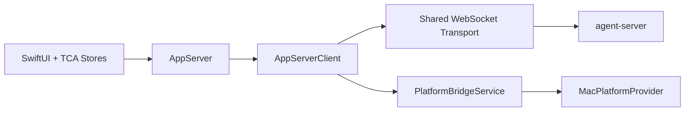

# AppServer Thread/Turn 破坏性重构设计

## 背景

当前 macOS 宿主层把 agent-server 进程管理、WebSocket 连接、协议编解码、事件分发、线程运行缓存、平台桥接处理分别散落在多个旧主路径对象中：

- `AgentServerService`
- `AppServerConnection`
- 旧协议客户端
- 旧事件分发总线
- 旧窗口生命周期控制器
- `PlatformBridgeService`
- 旧窗口级 ViewModel
- 旧 tab 级 ViewModel

这套结构有三个直接问题：

1. 旧窗口生命周期控制器同时承担窗口生命周期、协议路由、连接状态同步和事件翻译，职责过重。
2. 旧窗口级 / tab 级 ViewModel 既保存 UI 状态，又保存线程运行缓存，还直接持有协议发送逻辑，边界不清晰。
3. 宿主层对外暴露的主语义与目标中的 `thread / turn` 语义不一致，也不利于后续对齐 codex 的线程模型。

本次重构的目标不是在旧结构外再包一层，而是**做一次明确的破坏性重构**：以前后端统一 `Thread` 为唯一主命名，建立新的宿主内核、协议和 store 模型，最终删除旧主路径，不保留长期兼容实现，也不在新代码中保留旧语义命名。

## 本次硬约束

- 前端与后端统一以 `Thread` 命名主语义；新代码中不再新增旧命名的语义类型、协议类型或 store 类型。
- 这是一次破坏性重构，最终状态**不兼容旧实现**；允许分支内短暂中间态，但合入前必须全面切换到新代码。
- `PlatformBridgeService` 保持独立对象，但归属于统一的 `AppServer` 宿主内核，不再维护平行的宿主语义体系。
- Swift 前端状态统一迁移到 `swift-composable-architecture`（TCA）模型：`Store / State / Action / Reducer`。
- `ThreadState` 表示线程配置快照容器；`EventStore` 表示线程运行缓存容器。
- 本次只落地最小可用 `thread / turn` 协议；未实现的 codex 语义统一登记到 `docs/TODO.md`。

## 范围

### 包含

- Swift 宿主统一 `AppServer` 对象。
- Swift 宿主统一 `AppServerClient` 原始协议客户端。
- `apps/agent-server` 与 `packages/core` 主协议切换为最小 `thread / turn` 语义。
- Swift 宿主 store 切换到 TCA。
- 线程状态拆分为 `ThreadState` 与 `EventStore`。
- `PlatformBridgeService` 改为订阅统一连接体系中的平台请求流。
- 相关自动化测试、架构文档、手工 QA 文档同步更新。

### 不包含

- `thread.archive / unarchive`
- `thread.read`
- `thread.fork`
- `thread.rollback`
- thread metadata/title 独立更新接口
- thread settings 更新与通知
- goal / token budget
- realtime 音频 / transcript
- codex 风格统一 `item.*` 事件模型
- archived/search 等扩展线程管理能力

以上内容全部进入 `docs/TODO.md`，不在本次实现范围内。

## 方案比较

### 方案 A：协议先切，UI 后跟

先改 `packages/core` 与 `apps/agent-server` 协议，再让 Swift 宿主适配。

优点：

- 协议边界收敛最快。

缺点：

- Swift 主路径在迁移中间态持续不可用。
- 协议形状变化会放大桌面端失稳范围。

### 方案 B：宿主内核先成型，再切主协议

先建立 Swift 侧新的 `AppServer`、`AppServerClient` 和 TCA store 边界，再在同一分支内切到新的 `thread / turn` 协议，并删除旧主路径。

优点：

- 宿主层职责先稳定，协议迁移有明确收敛点。
- 连接、事件、平台请求、线程状态都归拢到同一内核，不会把旧耦合平移到新名字上。

缺点：

- 分支内会短暂存在“新 store + 旧 view model”并存的过渡提交，需要严格按阶段推进。

### 方案 C：先切 TCA，再第二轮改协议

优点：

- 单轮改动更小。

缺点：

- 会做两次迁移：先把旧主语义包进 TCA，再拆成 `thread / turn`。
- 与本次“统一 `AppServer` + 统一 Thread 语义”的目标不一致。

### 结论

采用**方案 B：宿主内核先成型，再切主协议**。

## 总体架构

重构完成后的宿主侧主分层如下：

其中：

- `AppServer` 是宿主唯一的上层门面。
- `AppServerClient` 只处理原始协议、连接和消息分发。
- `PlatformBridgeService` 只处理平台请求，不负责 thread / turn 主语义。
- UI 通过 TCA reducer 与 `AppServer` 交互，不再直接持有 socket、协议编码器或事件总线。

## Swift 宿主设计

### `AppServer`

`AppServer` 是 app 启动时初始化的长生命周期对象，职责如下：

- 启动和停止 `agent-server` 子进程。
- 管理宿主到 server 的共享连接生命周期。
- 暴露统一线程语义接口：
  - `startThread`
  - `resumeThread`
  - `listThreads`
  - `deleteThread`
  - `startTurn`
  - `interruptTurn`
- 接收 server notification 与 server request，并转换为 TCA action 输入。
- 维护宿主级可用性、重连、fatal error 与线程列表刷新时机。

`AppServer` 不直接负责 JSON 编解码，不直接调用 macOS 平台 API，也不直接保存视图状态。

### `AppServerClient`

`AppServerClient` 是原始协议客户端，职责如下：

- WebSocket 文本帧收发。
- `thread.*`、`turn.*`、notification、server request、platform 消息的编解码。
- request/response correlation。
- 连接状态回调与重连信号上报。
- 向上游发出“已解码入站消息”。

`AppServerClient` 不理解 tab、窗口、线程列表、权限气泡归属等 UI 语义。

### `PlatformBridgeService`

`PlatformBridgeService` 保持独立对象，但从属于 `AppServer` 宿主内核：

- 从统一连接体系中订阅 `platform_request`。
- 使用 `MacPlatformProvider` 处理平台能力调用。
- 通过 `AppServerClient` 回发 `platform_response`。
- 处理平台能力级别的权限失败、超时和方法路由。

`PlatformBridgeService` 不再自己维护一套与 thread 主流程平行的连接语义。

## TCA Store 设计

### 顶层 domain

建议至少拆分为以下几个 domain：

- `AppServerDomain`
  - 连接状态
  - 宿主级错误
  - 线程列表刷新触发
  - 入站 notification / request 总入口
- `ThreadDomain`
  - 单线程配置快照 `ThreadState`
- `EventStoreDomain`
  - 单线程运行缓存 `EventStore`
- `ThreadWindowDomain`
  - 窗口、tab、active thread、删除确认、搜索态等纯 UI 编排状态

### `ThreadState`

`ThreadState` 表示线程配置快照，只保存“恢复一个 thread 时应该得到的稳定定义”，建议包含：

- `threadId`
- `status`
- `title` 或 `preview`
- `createdAt`
- `updatedAt`
- `workspaceId`
- `actionBinding`
- 线程级配置快照
- 最近一次恢复得到的 thread snapshot 元数据
- 线程是否已失效、失效原因

`ThreadState` 不保存 assistant streaming 文本、tool 运行中间态、待处理 permission/workspace request，也不保存 tab 选中状态。

### `EventStore`

`EventStore` 表示线程运行缓存，只保存“当前运行过程需要的可变数据”，建议包含：

- `messages` 或 `items`
- 当前活跃 `turnId`
- assistant streaming delta 缓冲
- tool item 的 `running / completed / failed`
- `pendingPermissionRequests`
- `pendingWorkspaceRequests`
- 当前 turn 错误
- 本地 optimistic user item
- 等待 server 确认的 turn start 状态
- reconnect 后快照合并所需的临时辅助字段

### 窗口级 UI 状态

窗口与 tab 编排状态不进入 `ThreadDomain`，单独放在 `ThreadWindowDomain`：

- `tabs`
- `activeTabID`
- `threadList`
- `pendingDeletionThreadID`
- 搜索词
- notice banner
- 空态文案
- 宿主连接摘要

## 现有字段迁移

### 从旧 tab ViewModel 迁移

迁入 `ThreadState`：

- 旧线程标识 -> `threadId`
- 稳定状态快照
- `isInvalid`
- `invalidReason`

迁入 `EventStore`：

- `messages`
- `error`
- `pendingPermissionRequests`
- `pendingWorkspaceAskRequests`
- `pendingLocalTurnStartIndex`
- 与运行相关的连接态展示字段

### 从旧窗口 ViewModel 迁移

迁入 `ThreadWindowDomain.State`：

- `tabs`
- `activeTabID`
- `historyList` -> `threadList`
- `pendingHistoryDeletionID`
- `noticeMessage`

### 从旧摘要注册表迁移

旧摘要对象不再作为独立主状态维护，而是改为从 `ThreadState + EventStore` 派生得到的线程摘要视图。

## 最小 `thread / turn` 主协议

本次只实现以下主命令：

- `thread.start`
- `thread.resume`
- `thread.list`
- `thread.delete`
- `turn.start`
- `turn.interrupt`

选择 `thread.delete`，不做 `thread.archive`，原因如下：

1. 现有产品语义和 UI 入口已经是“删除历史会话”，直接映射成本最低。
2. `archive` 会引入新的生命周期状态、列表过滤和恢复语义，不适合本次最小可用目标。

## notification 与 server request

### 主 notification

建议本次至少定义：

- `thread.started`
- `thread.resumed` 或 `thread.snapshot`
- `thread.listed`
- `thread.deleted`
- `thread.status_changed`
- `turn.started`
- `turn.completed`
- `turn.failed`

### 细粒度运行通知

本次**保留现有细粒度运行通知模型**，仅将顶层命名切换到 thread / turn 体系，而不在本轮统一成 codex 风格 `item.*`：

- assistant delta
- tool started
- tool finished

原因：

- 本轮已经同时包含宿主内核、TCA、协议命名和 server/client 改造。
- 若同步引入统一 `item.*` 事件颗粒度，会显著扩大协议与 UI 重写范围。

### server request

本次统一为两类 server request：

- `permission.requested`
- `workspace.requested`

它们作为入站事件流进入 reducer，并把待处理请求状态落到对应 thread 的 `EventStore` 中。

## agent-server / core 改造要求

### `packages/core`

- 主协议类型改为 `Thread*` / `Turn*`。
- 更新 protocol 文档和所有导出类型。
- runtime 对 UI 暴露的主命令入口改为 `thread / turn` 语义。

### `apps/agent-server`

- 旧 command router、publisher、bridge 路径统一改名并改语义。
- 线程恢复主入口改为 `thread.resume`。
- 线程列表与线程删除主入口改为 `thread.list` / `thread.delete`。
- `permission`、`workspace`、`platform` 桥接仍保留，但统一挂接在新的协议体系下。

## 旧实现退场策略

这是一次破坏性重构，最终状态必须满足以下要求：

- 旧协议客户端不再是主链路协议客户端。
- `AppServerConnection` 不再是主链路连接抽象。
- 旧事件总线不再承担主事件分发。
- 旧窗口级 / tab 级 ViewModel 不再承担主业务状态。
- 旧 socket client 不再保留为主路径兼容层。
- 新增业务功能不得继续加在旧主路径对象上，也不得在新代码中重新引入旧语义命名。

允许在分支中间提交里短暂并存旧对象，但合入前必须：

1. 所有调用点切到新 `Thread` 主路径。
2. 所有主测试切到新对象。
3. 旧实现删除或降级为明确的非主路径临时壳层。

## 迁移顺序

### 阶段 1：建立新协议与宿主内核骨架

- 在 `packages/core` 定义最小 `thread / turn` 协议。
- 在 `apps/agent-server` 增加对应 router / publisher / bridge 适配。
- Swift 新增 `AppServer`、`AppServerClient` 与 TCA 顶层 domain。

### 阶段 2：切主调用链

- `AppCoordinator`、`ThreadWindowLifecycle`、`PromptPanel` 提交路径改用 `AppServer`。
- `ThreadWindow` 视图开始从 TCA store 读取状态。
- `thread.start / resume / list / delete` 与 `turn.start / interrupt` 全部切到新协议。
- `PlatformBridgeService` 改成订阅统一连接中的平台请求流。

### 阶段 3：删除旧主路径

- 删除或降级旧主链路对象。
- 清理旧测试与旧文档。
- 保证最终构建产物只依赖新的 `Thread` 主路径。

## 错误处理与恢复边界

重构后按以下层级分配错误职责：

- 进程错误：`AppServer`
- 连接错误：`AppServerClient`
- 线程恢复错误：`ThreadDomain` / `EventStore`
- 平台能力错误：`PlatformBridgeService`

必须保留并重新实现以下恢复行为：

- agent-server 子进程崩溃重启
- 主连接断线自动重连
- `thread.resume` 后快照恢复
- optimistic user item 与远端 snapshot 合并
- 权限请求 / workspace 请求在重连或 thread 切换时不串线
- 被删除或不存在的 thread 进入 invalid 状态并可被清理

## 测试策略

### Swift

- `AppServerClientTests`
- `AppServerTests`
- `ThreadDomainTests`
- `EventStoreReducerTests`
- `ThreadWindowDomainTests`
- `PlatformBridgeServiceTests`

### TypeScript

- protocol codec tests
- router tests for `thread.start / resume / list / delete`
- orchestrator tests for `turn.start / interrupt`
- bridge tests for permission / workspace / platform request routing

### 端到端最小回归

- 新建 thread
- 恢复 thread
- 发送一轮 turn
- 中断 turn
- 删除 thread
- server 重启后 resume 恢复

## 文档更新范围

本次实现完成后，需要同步更新以下文档：

- `handAgent.md`
- `apps/apps.md`
- `apps/desktop/desktop.md`
- `apps/desktop/Sources/AppServices/app-services.md`
- `apps/desktop/Sources/AppServices/AgentServer/agent-server.md`
- `apps/desktop/Sources/AppServices/PlatformBridge/platform-bridge.md`
- `apps/desktop/Sources/ThreadWindow/thread-window.md`
- `packages/core/src/protocol/protocol.md`
- `apps/agent-server/agent-server.md`
- `docs/manual-qa.md`

## `docs/TODO.md` 增补项

本次设计确认后，需要将以下未实现语义加入 `docs/TODO.md`：

- `thread.archive / unarchive`
- `thread.read`
- `thread.fork`
- `thread.rollback`
- thread metadata/title update
- thread settings update / notification
- goal / budget
- realtime
- codex 风格统一 `item.*` 事件模型
- archived/list/search 等扩展线程管理语义

## 验收标准

满足以下条件时，认为本次重构设计目标达成：

1. Swift 宿主只通过 `AppServer` 暴露主线程语义。
2. Swift 主 store 完全基于 TCA。
3. 主协议命名统一为 `thread / turn`。
4. `PlatformBridgeService` 成为统一连接体系中的独立平台请求处理器。
5. 前后端新代码不再保留旧主语义命名，旧主路径不再作为运行时主实现存在。
6. 最小 `thread.start / resume / list / delete` 与 `turn.start / interrupt` 全链路可用。
7. 所有缺失的 codex 语义明确写入 `docs/TODO.md`，不在实现中隐式留坑。
