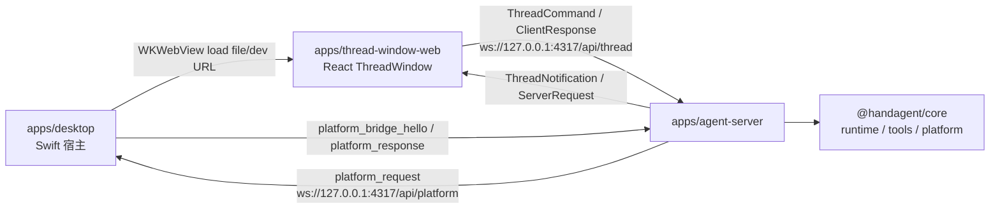

# ThreadWindow WKWebView + React 迁移设计

> **状态：历史迁移设计。**
> 本文背景段描述的是迁移前的 SwiftUI/TCA ThreadWindow 与共享连接状态；当前事实是 React ThreadWindow 持有 `/api/thread`，Swift 宿主持有独立 `/api/platform`。

## 背景

当前 ThreadWindow 完全由 SwiftUI/TCA 实现，Swift 侧通过 `AppServer` 维护进程级共享 WebSocket。该连接同时承载 thread 协议和 `PlatformBridgeMessage`，`AppServerClient` 在同一连接上发送 `platform_bridge_hello`，收到 `platform_request` 后交给 `PlatformBridgeService`。

本次重构目标是把 ThreadWindow 整体迁移到 `WKWebView + React`。React 成为 ThreadWindow 的 UI 与 thread 状态源，直接连接 agent-server 的 thread WebSocket；Swift 只保留 macOS 宿主、窗口生命周期、PromptPanel 入口和 platform bridge。StatusBubble 的摘要同步与点击回跳首版暂不实现，因为它需要 Swift 与 WebView 之间额外的业务 bridge，不能作为这次迁移的前置复杂度。

## 目标

- ThreadWindow 窗口内容由 `WKWebView` 承载，生产加载本地构建产物，开发可切换到 Vite dev server。
- React 直接管理 ThreadWindow 的历史、tabs、消息、运行态、权限请求、workspace 请求、输入区和重连恢复。
- agent-server 拆分两类 WebSocket 入口：`/api/thread` 与 `/api/platform`。
- Swift 使用独立 platform WebSocket 连接处理 `platform_request` / `platform_response`，不再通过 thread 连接承载平台 RPC。
- 保留现有输入边界：只有用户主动 prompt、用户主动附件和用户主动选区可作为初始上下文；屏幕、剪贴板、窗口、文件等仍只能由 tool 按需读取。

## 非目标

- 首版不做 StatusBubble 摘要同步、运行状态同步或点击回跳。
- 首版不设计 Swift 与 React 的通用业务 bridge。
- 首版不保留 SwiftUI/TCA ThreadWindow 作为兼容路径。
- 首版不新增旧 macOS fallback；桌面端仍只面向 macOS 15+。
- 首版不改变 core runtime、tool schema、thread 持久化格式或 LLM/provider 行为。

## 总体架构

### Swift 职责

- 启动与停止 agent-server 子进程，维护健康状态。
- 打开、聚焦、关闭全局唯一 ThreadWindow `NSWindow`。
- 通过 `WKWebView` 加载 React bundle 或开发服务地址。
- 把 PromptPanel 的 `PromptSubmission` 交给 WebView host 的初始 prompt 队列。
- 维护独立 platform WebSocket，连接 `ws://127.0.0.1:4317/api/platform`。
- 使用既有 `PlatformBridgeService` 和 `MacPlatformProvider` 执行 macOS 原生能力。

Swift 首版不解析 `ThreadNotification`，也不维护 ThreadWindow 的 tabs/messages/history 状态。

### React 职责

- 连接 `ws://127.0.0.1:4317/api/thread`。
- 编码并发送 `thread.start`、`thread.resume`、`thread.list`、`thread.delete`、`turn.start`、`turn.interrupt`。
- 编码并发送 `permission.answered` 与 `workspace.answered`。
- 解码 `ThreadNotification` 与 `ServerRequest`。
- 管理窗口级状态：历史列表、搜索、打开 tabs、active tab、删除确认、连接状态、启动中的 prompt。
- 管理 thread 级状态：消息、运行态、工具调用、错误、权限请求、workspace 请求、本地待确认首轮 turn。
- 断线重连后刷新历史，并对所有打开 tab 发送 `thread.resume` 获取 `thread.snapshot`。

### agent-server 职责

- `/api/thread` 只处理 `ThreadCommand` 与 `ClientResponse`，并推送 `ThreadNotification` 与 `ServerRequest`。
- `/api/platform` 只处理 `PlatformBridgeMessage`，包括 `platform_bridge_hello` 与 `platform_response`，并推送 `platform_request`。
- platform socket 关闭只 detach platform bridge token，不能中断 thread run 或清理 thread 权限。
- thread socket 关闭保持现有语义：解绑该连接持有的 permission/workspace binding，并中断该连接拥有的 active run。

## 前端包结构

新增 `apps/thread-window-web/`：

| 路径 | 职责 |
|------|------|
| `package.json` | React/Vite 包声明与脚本 |
| `index.html` | Vite 入口 |
| `src/main.tsx` | React 启动入口 |
| `src/App.tsx` | ThreadWindow 根组合 |
| `src/protocol/` | thread 协议类型、编码、解码与 runtime guard |
| `src/thread/` | WebSocket client、重连、命令发送、事件分发 |
| `src/store/` | Zustand store、immer 状态更新、selectors、初始 prompt 队列 |
| `src/components/` | history sidebar、tab bar、message list、request panels、composer |
| `src/native/` | 读取启动配置：thread URL、开发模式、初始 prompt |
| `src/styles/` | 暗色 glass 风格 CSS 与布局 token |
| `tests/` | store、protocol、socket client 单元测试 |

React 状态管理固定使用 `zustand + immer`。Zustand store 是 ThreadWindow 的单一状态源，覆盖 history、tabs、activeTab、connection、pending requests 和 pending initial prompts；immer 用于维护嵌套 tab/message 状态更新，避免手写深层拷贝。组件只通过 selector 订阅所需状态并调用明确 action，不直接操作 WebSocket。socket client 只负责收发、重连和把入站协议消息转成 store action，不直接持有 UI 状态。

## Swift 模块调整

### ThreadWindow

- 新增 `ThreadWindowWebView` 或同等命名的 `NSViewRepresentable`，内部承载 `WKWebView`。
- 新增 WebView host/model，负责：
  - 计算加载 URL。
  - 在 WebView 加载完成后注入或派发初始 prompt。
  - 暴露 `enqueueInitialPrompt(_:)` 给 `ThreadWindowLifecycle`。
- `ProductionThreadWindowPresenter` 改为创建 WebView 根视图，不再创建 `ThreadWindowView(viewModel:)`。
- `ThreadWindowLifecycle` 不再创建 `ThreadWindowViewModel`、`ThreadEventBus` 或连接 thread client。它只确保窗口存在并把 PromptPanel 提交送入 WebView host。

### AppServer / PlatformBridge

- `AppServer` 保留 agent-server 生命周期、可用性和 fatal error 回调。
- `AppServer` 删除或收缩 thread 语义方法；首版 Swift 不再发送 thread command。
- 新增 platform connection，URL 为 `ws://127.0.0.1:4317/api/platform`。
- `PlatformBridgeService` 继续生成 `platform_bridge_hello`，处理 `platform_request` 并返回 `platform_response`。
- 可复用 `AppServerConnection` 的重连能力，但 platform connection 不再暴露为 thread connection state。

## PromptPanel 到 React 的初始 prompt

PromptPanel 提交仍由 Coordinator 接收并调用 `ThreadWindowLifecycle.createTabWithInitialPrompt(_:)`。

`ThreadWindowLifecycle` 的新行为：

1. 确保 ThreadWindow 存在并聚焦。
2. 把 `PromptSubmission` 转成 WebView 可序列化 payload：
   - `text`
   - `attachments`
   - `actionBinding`
   - `clientRequestId`
3. 入队给 WebView host。
4. React 收到后执行现有语义：
   - 发送 `thread.start`
   - 收到匹配 `thread.started`
   - 创建 tab 并发送 `thread.resume`
   - 发送首轮 `turn.start`

如果 WebView 尚未加载完成，payload 保存在 Swift host 队列中；加载完成后按提交顺序派发。React 也需要维护本地 pending initial prompt，避免 `thread.snapshot` 与 `turn.start` 回流顺序不同导致首轮 user message 闪烁或丢失。

## ThreadWindow 用户行为

首版保留以下行为：

- 历史侧栏通过 `thread.list` 刷新。
- 搜索只在本地历史列表内过滤。
- 历史项点击：已打开则激活 tab；未打开则创建 tab 并发送 `thread.resume`。
- 删除历史必须先显示确认；确认后发送 `thread.delete`。
- 顶部 tab 关闭只关闭本地 tab，不删除持久化 thread。
- PromptPanel 提交总是新建 thread tab。
- 底部 composer 在有 active tab 时发送 `turn.start`；无 active tab 时先 `thread.start` 再发送首轮 turn。
- Stop 只作用于 active tab，发送 `turn.interrupt`。
- `permission.requested` 和 `workspace.requested` 以内联面板显示，用户选择后 React 直接发送 `ClientResponse`。
- `thread.snapshot` 是恢复入口，React 使用 snapshot 替换或合并 tab 消息，但保留本地尚未确认的 pending user turn。

## 连接与错误语义

- React thread socket 断线后进入 reconnecting；重连成功后发送 `thread.list`，并对已打开 tab 发送 `thread.resume`。
- React 主动关闭 tab 不发送 unsubscribe；这与现有协议一致。
- thread socket 关闭时，server 可以中断该连接拥有的 active run，这是现有行为。
- Swift platform socket 断线后只影响 platform tool；server 上 pending platform request 以 offline/timeout 失败。
- 新的 platform socket attach 会替换旧 bridge token，旧 token 的晚到 response 被忽略。

## 测试策略

### TypeScript

- agent-server：
  - `/api/thread` 不处理 `PlatformBridgeMessage`。
  - `/api/platform` 只处理 `PlatformBridgeMessage`。
  - platform socket close 只 detach bridge，不 interrupt thread。
  - thread socket close 仍 interrupt active run 并清理 thread permission/workspace binding。
- React：
  - Zustand store action 处理 `thread.started`、`thread.snapshot`、`assistant.delta`、`tool.started`、`tool.finished`、`turn.completed`、`thread.status.changed`、`thread.error`。
  - Zustand store action 处理 pending initial prompt 与 snapshot 竞态。
  - socket client 重连后触发 `thread.list` 和每个打开 tab 的 `thread.resume`。
  - request panel action 正确编码 `permission.answered` 与 `workspace.answered`。

### Swift

- ThreadWindow presenter 加载 WebView host，而不是旧 SwiftUI ThreadWindow。
- Lifecycle 在窗口未加载完成时可以入队多个 PromptSubmission，并按顺序交给 WebView host。
- AppServer 启动后连接 platform bridge，不连接 thread client。
- PlatformBridgeService 在独立 connection 上收到 `platform_request` 后能回写 `platform_response`。

### 手工 QA

更新 `docs/manual-qa.md`，至少覆盖：

1. mock LLM 启动桌面端。
2. PromptPanel 提交后打开 WebView ThreadWindow，并显示新 tab。
3. 当前 tab 继续追问。
4. 历史列表刷新、搜索、恢复、删除确认。
5. 权限请求与 workspace 请求可以在 React 内联面板完成。
6. 调用 platform tool 时，server 通过 `/api/platform` 请求 Swift 并收到结果。
7. 关闭 platform socket 或重启 agent-server 后，thread socket 与 platform socket 的失败语义符合预期。

## 文档更新

实施时同步更新：

- `handAgent.md`
- `apps/apps.md`
- `apps/desktop/desktop.md`
- `apps/desktop/Sources/ThreadWindow/thread-window.md`
- `apps/desktop/Sources/AppServices/AgentServer/agent-server.md`
- `apps/desktop/Sources/AppServices/PlatformBridge/platform-bridge.md`
- `apps/agent-server/agent-server.md`
- `apps/agent-server/src/server/server.md`
- `apps/agent-server/src/bridges/bridges.md`
- `packages/core/src/protocol/protocol.md`
- `docs/manual-qa.md`

新增 `apps/thread-window-web/thread-window-web.md`，并在 `apps/apps.md` 中索引该前端包。

## 风险与处理

- React 用 Zustand 重建旧 Swift/TCA 状态机时容易漏掉事件竞态。处理方式是先写 store action 测试，尤其覆盖 `thread.snapshot` 与 pending 首轮消息。
- WebView 本地 bundle 与 Vite dev server 两种入口容易分叉。处理方式是只允许“本地构建产物 file URL”和“显式 dev server URL”两种加载策略，其他情况显示可诊断错误。
- platform bridge 拆 socket 会影响现有测试。处理方式是先修改 server socket 测试，再修改 Swift connection 测试，最后删除旧共享 socket 断言。
- StatusBubble 暂停可能让运行状态少一个入口。处理方式是在文档和 manual QA 中明确首版不覆盖，后续另行设计 Swift-Web bridge。
