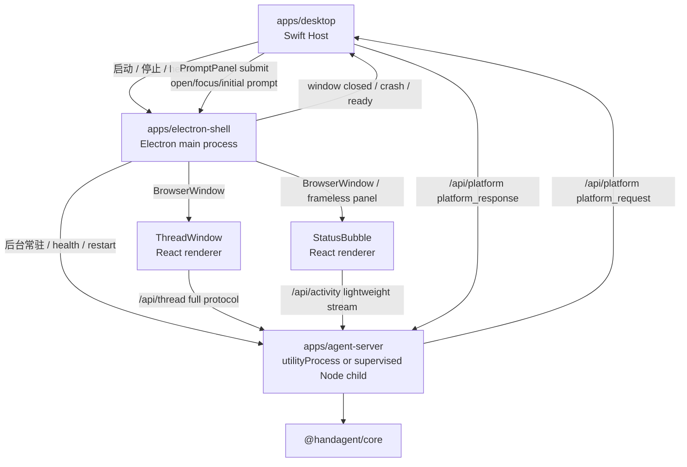
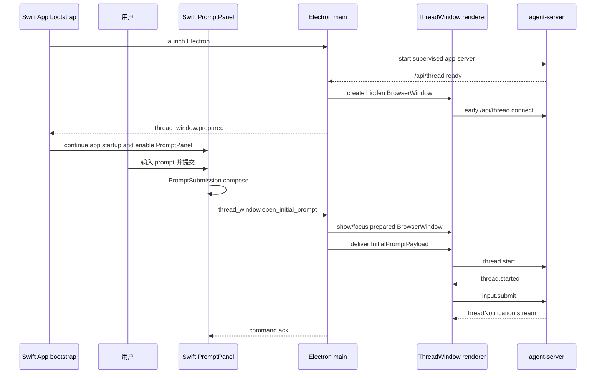

# Electron UI Shell 迁移设计

## 文档元信息

- 日期：2026-06-08
- 范围：桌面端复杂 UI 从 Swift/WKWebView 逐步迁移到 Electron/React
- 状态：迁移 spec；Phase 0-4 已进入实施，Phase 4 已删除 Swift 默认 WKWebView ThreadWindow、Swift StatusBubble、Swift agent-server 默认启动路径和 Swift `/api/activity` mirror
- 目标读者：后续实现者、架构评审者、QA 维护者

## 背景

当前 HandAgent 的桌面端由 Swift host 启动并协调：

- Swift `PromptPanel` 负责全局快捷键唤起、输入、附件采集和提交。
- Swift `Settings` 负责模型、工具、Plugin、MCP、权限、workspace 和快捷键配置。
- Swift `ThreadWindowLifecycle` 创建 `NSWindow/WKWebView`，加载 `apps/thread-window-web` 的 React ThreadWindow，并注入初始 prompt。
- React ThreadWindow 直接连接 `/api/thread`，持有 tabs、历史、消息、请求面板和 composer 状态。
- Swift `PlatformBridgeConnectionClient` 连接 `/api/platform`，执行 ScreenCaptureKit、Accessibility、NSWorkspace、NSPasteboard 等 macOS 原生能力。
- Swift `StatusBubble` 目前只从 `ThreadRegistry` 派生摘要，尚未接入 agent-server 的实时 thread 事件。

用户希望减少 Swift UI 代码，把复杂交互更多放到 React/Web 生态中。PromptPanel 的非激活窗口、焦点恢复、用户主动附件采集，以及设置页里的全局快捷键配置仍保留 Swift；ThreadWindow 和 StatusBubble 迁到 Electron/React。

Electron 官方进程模型支持该方向：main process 运行 Node.js 并管理窗口，每个 `BrowserWindow` 是独立 renderer process；长任务或服务可放入 `utilityProcess`。官方也要求 renderer 与 Node/Electron 能力通过受控 IPC、preload 或 `contextBridge` 暴露，而不是默认共享主进程能力。

参考资料：

- Electron Process Model: https://www.electronjs.org/docs/latest/tutorial/process-model
- Electron BrowserWindow: https://www.electronjs.org/docs/latest/api/browser-window
- Electron utilityProcess: https://www.electronjs.org/docs/latest/api/utility-process
- Electron Context Isolation / contextBridge: https://www.electronjs.org/docs/latest/tutorial/context-isolation
- Electron IPC: https://www.electronjs.org/docs/latest/tutorial/ipc

## 设计目标

1. Swift 收缩为原生入口层：PromptPanel、Settings、全局快捷键、焦点恢复、平台能力和 Electron 进程生命周期。
2. Electron 接管复杂 Web UI：ThreadWindow、StatusBubble，以及这些 UI 的窗口生命周期。
3. React 继续作为 thread UI 状态源；Swift 不重新持有 thread client，不解析完整 `ThreadNotification`。
4. agent-server 必须作为后台常驻服务运行，且由 Electron main 监督生命周期；ThreadWindow 订阅完整 thread 协议，StatusBubble 订阅轻量 activity stream。
5. 平台能力仍通过 `/api/platform` 回到 Swift，保持“macOS 原生能力不进入 Electron renderer”的边界。
6. 迁移采用渐进式 phase，每个 phase 都能独立验证和回退，不一次性替换整个桌面壳。

## 非目标

- 不把 PromptPanel 首版迁到 Electron。
- 不把 Settings 首版迁到 Electron，尤其不迁移全局快捷键配置。
- 不让 Electron renderer 直接调用 ScreenCaptureKit、Accessibility、窗口枚举或剪贴板等原生能力。
- 不在首版改变 core runtime、tool schema、thread 持久化格式或 LLM/provider 行为。
- 不把 agent-server 内联到 Electron main process，也不让任何 renderer 直接承载 runtime。agent-server 必须运行在 Electron main 监督的后台进程中，首选 `utilityProcess`，开发或打包限制下可使用等价的受监督 Node child process。
- 不追求 Swift 与 Electron 完全无 IPC。保留 Swift PromptPanel/Settings 时，Swift 到 Electron 的 command bridge 是必要边界。

## 方案取舍

### 方案 A：继续 Swift + WKWebView，仅补 StatusBubble bridge

优点：

- 改动最小。
- 当前 WKWebView ThreadWindow 已工作。
- 不引入 Electron 体积、签名和进程管理复杂度。

缺点：

- StatusBubble 如果继续 SwiftUI，会增加 Swift 复杂 UI 代码。
- 如果后续继续增加复杂常驻 UI，Swift 实现成本高。
- 未来每个 Web UI 与 Swift 状态同步都要单独做桥。

适用场景：只修 StatusBubble 实时状态，不做更多复杂 Web UI。

### 方案 B：混合壳，Swift 保留原生入口，Electron 接管复杂 UI（推荐）

优点：

- 符合“复杂 UI 走 React/Web 生态”的长期偏好。
- ThreadWindow、StatusBubble 都能消费同一套 Web UI 技术栈。
- Swift 不需要为 StatusBubble 维护复杂 thread 状态 UI。
- Electron renderer 可同时订阅 agent-server 通知，减少 Swift 业务状态 bridge。

缺点：

- 需要新增 Swift <-> Electron command bridge。
- 需要处理 Electron 进程启动、崩溃恢复、打包、签名、公证和资源路径。
- 窗口生命周期分属 Swift 与 Electron，需要明确激活策略和退出顺序。

适用场景：ThreadWindow、StatusBubble 都会长期做成复杂 React UI。

### 方案 C：全 Electron，Swift 只做极薄原生 helper

优点：

- UI 和大部分 app 生命周期统一到 Electron。
- Swift 只作为平台 helper，理论上 Swift 代码最少。

缺点：

- PromptPanel 的非激活窗口、焦点恢复、附件采集和全局快捷键配置需要重做。
- macOS 原生行为、权限引导和用户体验风险最大。
- 当前 Swift AppCoordinator、Settings、Hotkey、PlatformBridge 需要大规模重写。

适用场景：未来产品主目标变成跨平台 Electron app，并愿意重做 macOS 原生入口。

本 spec 采用方案 B。

## 目标架构



### Swift Host 职责

Swift 继续负责：

- App 启动与退出。
- PromptPanel 非激活面板、焦点恢复、用户主动附件采集。
- Settings 与全局快捷键配置。
- Electron 可用性提示、fatal alert、日志入口。
- `/api/platform` 连接与 `MacPlatformProvider`。
- Electron runtime 启动、停止、ready/crash 状态监听。

Swift 不负责：

- ThreadWindow tab/message/history 状态。
- StatusBubble 的运行态展示数据计算。
- Electron renderer 的 UI store。

### Electron main 职责

Electron main process 负责：

- 创建、显示、聚焦、关闭 ThreadWindow。
- 创建、定位、显示 StatusBubble 窗口。
- 维护 Electron renderer 的窗口级生命周期。
- 接收 Swift command bridge，例如 `threadWindow.openWithInitialPrompt`。
- 向 Swift 回报 ready、window closed、renderer crashed、server unavailable 等状态。
- 启动并持续监督 agent-server 后台进程。首选 Electron `utilityProcess`；若 dev worktree、TypeScript 入口或打包路径暂不满足 `utilityProcess`，可使用功能等价的受监督 Node child process，但必须保留同样的 health、restart、stdout/stderr 和 shutdown 语义。

Electron main 不负责：

- 直接执行 LLM/tool runtime。
- 直接读取 macOS 原生上下文。
- 把完整 thread 状态 mirror 到 main process。

### Electron renderer 职责

ThreadWindow renderer：

- 继续使用 `apps/thread-window-web` 的 React 代码或迁入 Electron shell 后复用同一包。
- 直接连接 `/api/thread`。
- 处理完整 `ThreadCommand`、`ThreadNotification`、`ServerRequest`、`ClientResponse`。
- 仍是 tabs、历史、消息、请求面板和 composer 的 UI 状态源。

StatusBubble renderer：

- 订阅 `/api/activity`。
- 展示当前 activity：idle、running、waiting permission/workspace、tool running、error、completed。
- 点击后通过 Electron main 聚焦已有 visible ThreadWindow；没有可聚焦 ThreadWindow 时不唤起 Swift PromptPanel。

### agent-server 职责

agent-server 继续负责：

- `/api/thread` 完整 thread 协议。
- `/api/platform` 平台能力桥。
- thread/turn 路由、runtime 驱动、持久化、permission/workspace 请求。
- 新增 `/api/activity` 轻量活动流。

agent-server 不负责：

- Electron 窗口生命周期。
- StatusBubble UI 具体动画。
- macOS 原生能力实现。

## Swift <-> Electron Command Bridge

保留 Swift PromptPanel 和 Settings 后，Swift 与 Electron 之间仍需要一个很薄的 command bridge。App 启动阶段已经阻塞等待 Electron、app-server 和隐藏 ThreadWindow 全部 ready，因此这个 bridge 不再负责 ready 竞态、pending prompt 队列或冷启动补偿。

它只负责跨进程窗口命令和生命周期事件：

- Swift PromptPanel 提交后，要求 Electron 显示/聚焦已预热的 ThreadWindow，并交付本次 `InitialPromptPayload`。
- Swift 请求打开历史或聚焦 ThreadWindow。
- Electron 回报 ready、`thread_window.prepared`、`thread_window.prepare_failed`、窗口关闭、renderer crash 和 agent-server health。

也就是说，它不是把当前 WKWebView initial prompt 注入机制原样换壳；它是 Swift 原生入口与 Electron Web UI 之间的最小窗口命令边界。

### 传输选择

首版建议使用本地 IPC socket 或 stdio JSON-RPC：

- Swift 启动 Electron 子进程。
- Electron ready 后向 Swift 发送 `electron.ready`；hidden ThreadWindow 预热完成后再发送 `thread_window.prepared`。
- Swift 通过同一通道发送 commands。
- Electron 回传 ack/event。

不建议首版使用临时文件轮询或 AppleScript。它们难以表达窗口 ack、崩溃恢复和 prompt 提交顺序。

### Command 类型

```typescript
type SwiftToElectronCommand =
  | {
      channel: "electron_shell";
      type: "thread_window.open_initial_prompt";
      commandId: string;
      payload: InitialPromptPayload;
    }
  | {
      channel: "electron_shell";
      type: "thread_window.open_history";
      commandId: string;
    }
  | {
      channel: "electron_shell";
      type: "thread_window.focus";
      commandId: string;
      threadId?: string | null;
    }
  | {
      channel: "electron_shell";
      type: "activity_window.show";
      commandId: string;
    }
  | {
      channel: "electron_shell";
      type: "shutdown";
      commandId: string;
    };
```

```typescript
type ElectronToSwiftEvent =
  | {
      channel: "electron_shell";
      type: "electron.ready";
      timestamp: string;
    }
  | {
      channel: "electron_shell";
      type: "thread_window.prepared";
      timestamp: string;
    }
  | {
      channel: "electron_shell";
      type: "thread_window.prepare_failed";
      message: string;
    }
  | {
      channel: "electron_shell";
      type: "command.ack";
      commandId: string;
      ok: boolean;
      error?: string;
    }
  | {
      channel: "electron_shell";
      type: "thread_window.closed";
      timestamp: string;
    }
  | {
      channel: "electron_shell";
      type: "renderer.crashed";
      window: "thread" | "activity";
      reason: string;
    }
  | {
      channel: "electron_shell";
      type: "agent_server.health";
      available: boolean;
      message?: string;
    };
```

### 启动与 PromptPanel 提交流程



Electron UI shell 迁移后，Swift App 启动流程必须等待 Electron ready、app-server 可用、hidden ThreadWindow prepared 三个条件成立后，才继续启动可交互入口，例如注册全局热键、展示 StatusBubble、允许 PromptPanel 提交。这样 PromptPanel 提交路径不再处理“Electron 未 ready”的正常分支。

如果 Electron、app-server 或 hidden ThreadWindow 预热失败，Swift 不进入正常可交互启动流程，而是进入启动失败状态并显示可诊断错误。实现可设置启动超时，但超时只能进入 fatal/diagnostic 状态，不能降级为“PromptPanel 可提交但 Electron 未 ready”。

### ThreadWindow 隐藏预热

迁到 Electron 后，ThreadWindow 在 App 启动阶段直接预热，而不是等 PromptPanel 打开后再预热。Swift 不直接创建 `BrowserWindow`，也不发送单独的 `thread_window.prepare` 命令；Electron main 在自身 ready 且 app-server 可用后主动完成预热，并通过 `thread_window.prepared` 通知 Swift。Electron main 负责：

1. 在 `app.whenReady()` 之后创建全局唯一 ThreadWindow。
2. 使用 `new BrowserWindow({ show: false, webPreferences: { preload, contextIsolation: true, nodeIntegration: false } })`。
3. 立即 `loadURL` 或 `loadFile`，让 preload、React bundle 和必要的 WebSocket 初始化提前完成。
4. 不调用 `show()`、`focus()` 或任何会激活应用的动作。
5. 等 hidden renderer 到达可接收 initial prompt 的状态后，向 Swift 发送 `thread_window.prepared`。
6. 收到 `thread_window.open_initial_prompt` 后，复用已准备好的窗口，传递 initial prompt，再 `show()` 和 `focus()`。

Electron 的隐藏预热比 WKWebView 更直接，因为 `BrowserWindow` 原生支持 `show: false`。实现时需要注意：

- `BrowserWindow` 只能在 Electron `app.whenReady()` 后创建；Swift App 启动流程必须等待 `thread_window.prepared` 后再继续。
- 不要把 `show()` 当作预热动作。预热只创建隐藏窗口并加载页面。
- 保持默认 `paintWhenInitiallyHidden: true`，否则 `ready-to-show` 不会触发，预热完成信号会失效。
- 默认先不关闭 `webPreferences.backgroundThrottling`。只有实测隐藏窗口中的 WebSocket、timer 或 React 初始化被节流影响时，再为 ThreadWindow 单独评估关闭。
- hidden window 不计入 Swift 的 open ThreadWindow 状态；只有 Electron main 收到 `open_initial_prompt` 并展示窗口后，才向 Swift 回报可见窗口状态。

## Activity Stream

StatusBubble 不应消费完整 `ThreadNotification` 洪流。完整协议包含消息 delta、tool 细节、请求回执和历史事件，适合 ThreadWindow，不适合小型状态 UI。

新增 `/api/activity` WebSocket，提供轻量事件：

```typescript
type AgentActivityEvent =
  | {
      channel: "activity";
      type: "activity.snapshot";
      activeThreadId: string | null;
      status: AgentActivityStatus;
      latestSummary: string | null;
      waitingRequest: "permission" | "workspace" | null;
      error: string | null;
      updatedAt: string;
    }
  | {
      channel: "activity";
      type: "activity.changed";
      activeThreadId: string | null;
      status: AgentActivityStatus;
      latestSummary: string | null;
      waitingRequest: "permission" | "workspace" | null;
      error: string | null;
      updatedAt: string;
    };

type AgentActivityStatus =
  | "idle"
  | "starting"
  | "running"
  | "tool_running"
  | "waiting"
  | "completed"
  | "error";
```

派生规则：

- `thread.started` 或首轮 `input.submit` 后进入 `starting`。
- `turn.started` / `assistant.delta` 后进入 `running`。
- `tool.started` 后进入 `tool_running`。
- `permission.requested` / `workspace.requested` 后进入 `waiting`。
- `turn.completed` 后进入 `completed`，随后可在短延迟后回到 `idle`。
- `thread.error` 后进入 `error`。

activity stream 可以广播给多个 subscriber：ThreadWindow 可不用订阅，StatusBubble 订阅即可。后端发多份通知是可接受的；关键是每个 subscriber 获得的协议刚好适配其 UI 需要。

## app-server 在 Electron 中的运行策略

### 不变量

Electron 迁移后，app-server 不是按需服务，也不是 ThreadWindow 打开时才启动的服务。它必须在后台持续运行，并早于 ThreadWindow 和 StatusBubble 的真实交互可用。

不允许的形态：

- app-server 内联到 Electron main process，导致 LLM/tool runtime、WebSocket server 和窗口生命周期共享同一事件循环。
- app-server 跑在任意 renderer 内，导致关闭窗口会结束 runtime。
- ThreadWindow 首次打开时才懒启动 app-server，导致 PromptPanel 提交路径承担冷启动。
- Swift 和 Electron 同时各自启动一份 app-server。

允许的形态：

- 首选：Electron main 使用 `utilityProcess.fork(...)` 启动构建后的 agent-server 入口。
- 兼容：Electron main 使用 `child_process.spawn` / `fork` 启动现有 Node 入口，但必须提供与 `utilityProcess` 等价的 supervision。

### 首选：Electron utilityProcess

`utilityProcess` 是首选，因为它属于 Electron main API，适合承载带 Node.js 能力的后台服务，并能通过 Electron 提供的进程事件与 MessagePort 机制做生命周期管理。

首版实现前必须验证：

- `utilityProcess.fork` 能启动构建后的 JS agent-server 入口。若当前 TypeScript 入口依赖 `--experimental-transform-types`，实施前需要先确定构建产物路径。
- `cwd` 能指向当前 dev worktree 或打包后的资源目录。
- `env` 能传递 mock LLM、provider 配置和必要的 Node module resolution。
- `stdio` 或等价日志通道能把 stdout/stderr 写入 `~/.spotAgent/log/` 或 Electron supervisor 日志。
- 进程退出、非零退出码、crash、主动 shutdown 都能映射为明确 health event。

### 兼容：受监督 Node child process

如果 `utilityProcess` 在开发态 TypeScript 入口、打包路径或模块解析上阻塞，允许用受监督 Node child process 作为等价选型：

```bash
node --experimental-transform-types --experimental-specifier-resolution=node apps/agent-server/src/server/server.ts
```

该选型必须满足：

- Electron main 是唯一 supervisor；Swift 不再直接启动 agent-server。
- 启动时机和 `utilityProcess` 相同：Electron ready 后立即后台启动，不等待 ThreadWindow 打开。
- health、restart、stdout/stderr、mock mode、shutdown 语义与 `utilityProcess` 版本一致。
- 后续可以用最小改动替换为 `utilityProcess`，renderer 和 Swift command bridge 不感知差异。

### Supervision 要求

无论使用 `utilityProcess` 还是 Node child process，supervisor 都必须提供：

- 单例保证：同一 Electron main 只允许一份 agent-server。
- 后台常驻：Electron ready 后启动，Electron shutdown 前停止。
- 健康状态：向 Swift 发送 `agent_server.health`，Swift 用它控制 PromptPanel 是否可提交。
- 重启策略：保留当前指数退避和最大重试次数语义，避免 crash loop。
- 端口管理：`127.0.0.1:4317` 冲突时给出明确错误，不静默启动第二个服务。
- 日志：stdout/stderr 和 fatal error 有可诊断落点。
- 测试入口保留：agent-server 仍可被 `bash ./scripts/test.sh` 以普通 TypeScript/Node 包方式测试。
- core runtime 边界：`packages/core` 的 thread/runtime/tool 循环只由受监督 agent-server 进程承载；Electron main 和任何 renderer 都不直接运行 core runtime。关闭 ThreadWindow 或 StatusBubble 不能停止 agent-server，只有 Electron shutdown 才能停止后台服务。

因此，迁移完成后的运行顺序是：

```text
Swift Host starts Electron
  -> Electron main ready
  -> Electron main starts supervised app-server in background
  -> app-server opens /api/thread, /api/platform, /api/activity
  -> Electron main creates hidden ThreadWindow and loads React
  -> hidden ThreadWindow reaches initial-prompt-ready state
  -> Electron sends agent_server.health available=true and thread_window.prepared to Swift
  -> Swift continues interactive startup and enables PromptPanel submit
```

### 后续事项：替换 renderer 与 app-server 的 WebSocket transport

首版即使使用 `utilityProcess` 或等价受监督 Node child process，仍保留 `/api/thread` 与 `/api/activity` WebSocket，目的是复用现有 React client、agent-server 路由、测试和调试入口，降低 Electron UI 迁移风险。

后续在 `utilityProcess` 路径稳定后，需要单独迁移 renderer 与 app-server 的 transport：

- 为 ThreadWindow 和 ActivityWindow 抽象 `ThreadTransport` / `ActivityTransport`，把协议 payload 与 WebSocket 实现解耦。
- 新增 `MessagePortTransport` 或 Electron IPC transport，由 Electron main 在 renderer 与 `utilityProcess` 之间分发 `MessagePort`。
- 保持 `ThreadCommand`、`ThreadNotification`、`ServerRequest`、`ClientResponse` 和 `AgentActivityEvent` payload 不变，只替换传输层。
- 替换后 renderer 不再连接 localhost `/api/thread` / `/api/activity`；这些 WebSocket 可作为开发调试 fallback 保留一段时间，再单独评估删除。
- `/api/platform` 是 app-server 到 Swift 原生能力的跨运行时边界，不纳入这次 renderer transport 后续事项；是否替换为 Swift <-> Electron <-> utilityProcess IPC 需要单独设计。

## 窗口策略

### ThreadWindow

- Electron `BrowserWindow` 承载 React ThreadWindow。
- Electron main 在 App 启动阶段创建 `show: false` 的 ThreadWindow，提前加载 preload、React bundle 和必要连接；Swift 等到 `thread_window.prepared` 后才继续可交互启动流程，PromptPanel 提交时只负责 `show/focus` 和传 initial prompt。
- 开发态可加载 Vite dev server 或 agent-server 静态资源。
- 生产态加载打包后的本地资源。
- 首版维持全局唯一 ThreadWindow；多窗口另行设计。
- PromptPanel 提交总是创建新 thread/tab，不写入当前 active tab。
- 隐藏预热窗口不算可见 ThreadWindow，不触发 Swift `.regular` 激活策略，也不改变 StatusBubble activity。

### StatusBubble

- Electron 创建小型 frameless/transparent window。
- 默认右下角定位，浮动在普通窗口上方。
- 点击时通过 Electron main 聚焦已有 visible ThreadWindow；如果没有可聚焦 ThreadWindow，则保持空闲状态，不回告 Swift 打开 PromptPanel。
- 不再从 Swift `ThreadRegistry` 派生状态。

## 平台能力边界

继续保留 `/api/platform` 到 Swift：

```text
LLM/tool runtime
  -> RemotePlatformAdapter
  -> agent-server /api/platform
  -> Swift PlatformBridgeService
  -> MacPlatformProvider
  -> platform_response
```

原因：

- ScreenCaptureKit、Accessibility、NSWorkspace、NSPasteboard 当前已经在 Swift 落地。
- macOS 权限提示、错误解释和系统设置入口在 Swift 更直接。
- Electron renderer 不应持有平台强能力，避免扩大安全边界。

如果未来某些能力迁到 Electron native module，必须单独写能力迁移 spec，不能在 UI shell 迁移中顺手完成。

## 仓库结构建议

新增：

```text
apps/electron-shell/
  electron-shell.md
  package.json
  src/main/
    main.ts
    windows/
    swiftBridge/
    serverSupervisor/
  src/preload/
    threadWindowPreload.ts
    activityPreload.ts
  src/activity-window/
    App.tsx
    store/
    components/
  tests/
```

保留：

```text
apps/thread-window-web/
```

首版可以让 Electron ThreadWindow 继续加载 `apps/thread-window-web` 的构建产物，避免一开始搬包。等 Electron shell 稳定后，再决定是否把 ThreadWindow 前端代码并入 `apps/electron-shell/src/thread-window/`。

## 迁移阶段

### Phase 0：Electron shell spike

目标：

- 新增最小 Electron app。
- Swift 能启动 Electron 并收到 `electron.ready`。
- Electron 能在启动阶段打开一个隐藏 `BrowserWindow` 并加载空或占位 renderer。
- Electron main 能以 `utilityProcess` 或受监督 Node child process 启动 app-server，并向 Swift 回报 health。
- 不接入 ThreadWindow，不替换现有 WKWebView。

验证：

- Electron dev/build 脚本可跑。
- Electron ready 后 app-server 在后台启动，不等待 ThreadWindow 打开。
- Electron 能发出 `thread_window.prepared`，Swift 在收到该事件前不继续可交互启动流程。
- `/api/thread`、`/api/platform` 和后续 `/api/activity` 的端口归属清晰，不启动第二份服务。
- Swift 根据 Electron 回报的 `agent_server.health` 与 `thread_window.prepared` 双条件控制 PromptPanel 提交可用性。
- 退出 HandAgent 后 Electron 和 app-server 进程不残留。

### Phase 1：Electron ThreadWindow 替代 WKWebView host

目标：

- App 启动阶段由 Electron 创建隐藏 ThreadWindow `BrowserWindow` 并加载 React；Swift 等待 `thread_window.prepared` 后才继续启动 PromptPanel/Hotkey 等交互入口。
- PromptPanel submit 通过 Swift -> Electron command bridge 打开 Electron ThreadWindow。
- Electron ThreadWindow 复用启动阶段已预热窗口；submit 路径不承担冷启动和预热职责。
- 初始 prompt 通过 Electron main/preload 传给 renderer。
- React 仍直接连接 `/api/thread`。
- Swift `ThreadWindowLifecycle` 收缩为 Electron window command client。

验证：

- App 启动完成后，Electron 已创建隐藏 ThreadWindow renderer；打开 PromptPanel 不再触发 ThreadWindow 预热。
- PromptPanel 提交创建新 thread/tab。
- 预热完成后提交的首屏延迟低于冷启动路径。
- 连续提交复用同一个 Electron ThreadWindow，但创建不同 thread/tab。
- 历史、composer、permission/workspace 请求保持现有行为。
- WKWebView host 可删除或保留为临时 fallback，但不能长期双写。

### Phase 2：新增 `/api/activity`，迁移 StatusBubble

目标：

- agent-server 增加 activity publisher。
- Electron StatusBubble 订阅 `/api/activity`。
- Swift StatusBubble 停用或删除。
- 点击 Electron StatusBubble 只尝试聚焦已有 ThreadWindow；没有可聚焦 ThreadWindow 时不唤起 Swift PromptPanel。

验证：

- running/tool/waiting/error/completed 状态实时展示。
- 多个 subscriber 同时连接不影响 ThreadWindow。
- agent-server 重启后 activity subscriber 自动恢复 snapshot。

### Phase 3：app-server supervision hardening

目标：

- 回收 Phase 1/2 旧实现里 PromptPanel 打开时触发预热的语义：删除 `thread_window.prepare` command，删除 Swift `prepareThreadWindow()` / `prepareForPromptPanel()` 路径，PromptPanel show/toggle 不再跨进程触发 ThreadWindow 预热。
- 把 hidden ThreadWindow 预热收敛到 App 启动阶段：Electron main 在 app ready 且 agent-server ready 后主动预热全局唯一 ThreadWindow；Swift 只等待 `agent_server.health available=true` 和 `thread_window.prepared`，不主动请求 prepare。
- 固化 Phase 0 的 app-server 后台服务选型，优先落到 `utilityProcess`；如果保留 Node child process，必须在本文档和实现文档中说明阻塞 `utilityProcess` 的具体原因。
- 完成 dev worktree、打包 `.app`、mock LLM、stdout/stderr、重启和 shutdown 的一致性验证。
- Swift 只通过 Electron health event 观察 app-server，不直接启动或停止 app-server。
- 确认 core runtime 始终由后台 agent-server 承载：ThreadWindow、StatusBubble、PromptPanel、Electron main 都不能直接运行 core runtime；关闭任意 UI 窗口不影响 agent-server 常驻，只有 App shutdown 才停止该后台进程。

验证：

- `SwiftToElectronCommand` 和 Swift `ElectronShellCommand` 中不再存在 `thread_window.prepare`。
- 打开或切换 PromptPanel 不会发送任何 prepare command；App 启动完成前已完成 hidden ThreadWindow 预热。
- dev worktree 路径正确。
- mock LLM 打包入口仍可用。
- server 非零退出后重启策略保留。
- 关闭 ThreadWindow 和 StatusBubble 后，agent-server 仍保持运行；core runtime 后续 turn 仍通过同一个后台服务执行。
- `utilityProcess` 可用时使用构建后的 agent-server 入口；不可用时文档记录具体阻塞原因，并保留等价 Node child process supervisor。
- fatal error 仍能在 Swift 显示原生 alert 或在 Electron UI 显示等效提示。

### Phase 4：Electron-only UI shell，删除 Swift 旧路径

目标：

- Electron shell 成为桌面端唯一 UI shell，不再依赖 `HANDAGENT_ELECTRON_SHELL` feature flag。
- Swift 只保留 PromptPanel、Settings、Hotkey、焦点恢复、平台能力 IPC 和 Swift <-> Electron command bridge。
- 删除 Swift 默认 `AgentServerService` 子进程启动路径；agent-server 只由 Electron main 监督。
- 删除 Swift `NSWindow/WKWebView` ThreadWindow host；ThreadWindow 只由 Electron `BrowserWindow` 承载。
- 删除 Swift StatusBubble、Swift `ThreadRegistry` 和 Swift `/api/activity` subscriber；StatusBubble 只由 Electron ActivityWindow renderer 订阅 `/api/activity`。
- ActivityWindow show 失败不再回退到 Swift StatusBubble；失败只保留 Electron/日志诊断和后续重试入口。

验证：

- `AppServices.defaultRuntime(environment: [:])` 返回同一个 `ElectronBackedAppServer`，同时作为 app-server health source、ThreadWindow command client 和 ActivityWindow command client。
- `AppCoordinator` submit/openHistory/focus 只发送 Electron command，不暴露 Swift WebHost。
- Swift build 中不存在 `ThreadWindowWebHost`、`ThreadWindowWebView`、`ThreadWindowLifecycle`、`StatusBubbleController`、`AgentActivityConnectionClient`、Swift `AppServer` wrapper 或 `ThreadRegistry`。
- `bash ./scripts/test.sh`、`bash ./scripts/swiftw test`、`bash ./scripts/swiftw build` 通过。
- packaged mock app 启动后无需 feature flag 即出现 Electron ActivityWindow，提交 prompt 后出现 Electron ThreadWindow，退出后 Electron 与 agent-server 无残留。

## 测试策略

### Swift

- Electron process supervisor：
  - 启动命令、ready event、shutdown。
  - Electron ready 后 app-server 后台启动，并向 Swift 回报 health。
  - Swift 等待 `thread_window.prepared` 后才继续可交互启动流程。
  - PromptPanel 提交可用性必须同时依赖 `agent_server.health available=true` 和 `thread_window.prepared`。
  - 进程 crash 后 health 状态更新。
  - app-server 非零退出后按退避策略重启，达到上限后进入 fatal 状态。
  - Electron 或 hidden ThreadWindow 启动失败时进入 fatal/diagnostic 状态，不允许 PromptPanel 进入可提交状态。
- Swift command bridge：
  - `open_initial_prompt` 编码正确。
  - ack failure 时恢复 PromptPanel 可提交状态。
- Platform bridge：
  - `/api/platform` 行为不因 Electron UI 迁移改变。

### Electron

- main process：
  - window create/focus/close。
  - Swift command 解码和 ack。
  - renderer crash event 上报。
- preload：
  - 只暴露有限 API。
  - 不把 Node/Electron 全量能力泄漏给 renderer。
- renderer：
  - ThreadWindow 初始 prompt 接收。
  - ActivityWindow store 处理 snapshot/changed。

### agent-server

- `/api/activity`：
  - 连接后发送 snapshot。
  - turn/thread/tool/request/error 事件能派生正确 activity。
  - 多 subscriber 广播。
  - subscriber 断线不影响 `/api/thread`。
- 现有 `/api/thread` 和 `/api/platform` 测试保持通过。

### 手工 QA

- PromptPanel 提交后打开 Electron ThreadWindow。
- ThreadWindow 首轮 prompt 不丢、不重复。
- 连续 PromptPanel 提交创建多个 thread/tab。
- StatusBubble 实时展示 running/tool/waiting/error。
- 关闭 ThreadWindow、StatusBubble 后进程和窗口状态正确。
- agent-server 重启后 ThreadWindow 和 activity subscriber 恢复。
- ScreenCaptureKit、Accessibility、剪贴板、窗口列表等 platform tool 仍通过 Swift 执行。
- 打包 `.app` 后签名、公证前检查无残留 helper 进程。

## 文档更新范围

实施时同步更新：

- `handAgent.md`
- `apps/apps.md`
- `apps/desktop/desktop.md`
- `apps/desktop/Sources/Coordinator/coordinator.md`
- `apps/desktop/Sources/AppServices/AgentServer/agent-server.md`
- `apps/desktop/Sources/AppServices/PlatformBridge/platform-bridge.md`
- `apps/desktop/Sources/ThreadWindow/thread-window.md`
- `apps/desktop/Sources/StatusBubble/status-bubble.md`
- `apps/thread-window-web/thread-window-web.md`
- 新增 `apps/electron-shell/electron-shell.md`
- `apps/agent-server/agent-server.md`
- `packages/core/src/protocol/protocol.md`
- `docs/manual-qa.md`

## 风险与处理

### 进程和打包复杂度

Electron 会显著增加打包体积和 helper 进程数量。处理方式：

- Phase 0 先验证 Electron、app-server supervisor、启动、退出和打包路径。
- ThreadWindow 迁移前先固定 app-server 后台常驻模型，避免 PromptPanel 提交路径承担 server 冷启动。
- QA 中加入“退出后无残留 Electron/Node 进程”。

### Swift 与 Electron 生命周期竞争

Swift 和 Electron 都可能想管理窗口激活。处理方式：

- Swift 只管理 PromptPanel/Settings。
- Electron 只管理 ThreadWindow/StatusBubble。
- 跨边界只发 command，不直接操作对方窗口对象。

### Activity 协议过重或过轻

如果 activity stream 暴露完整 thread 事件，小 UI 会被协议细节拖累；如果过轻，StatusBubble 无法表达状态。处理方式：

- 首版只暴露状态、activeThreadId、summary、waitingRequest、error。
- 不暴露完整消息内容。

### 安全边界扩大

Electron renderer 如果拿到 Node API，会扩大攻击面。处理方式：

- 开启 context isolation。
- 使用 preload 暴露最小 API。
- renderer 通过 WebSocket/IPC 发明确命令，不直接访问 filesystem、child_process 或 platform provider。

### 重复协议路径

ThreadWindow 完整协议和 activity stream 都来自 agent-server，可能产生状态不一致。处理方式：

- activity 由同一个 thread runtime/publisher 派生，不由 UI 自行推断。
- activity snapshot 是连接恢复入口。
- ThreadWindow 不依赖 activity，StatusBubble 不依赖完整 thread 协议。

## 成功标准

- Swift UI 代码不再继续扩展 ThreadWindow、StatusBubble 复杂状态。
- ThreadWindow 在 Electron 中保持现有 `/api/thread` 行为。
- StatusBubble 能实时订阅 activity stream，不需要 Swift thread 状态 bridge。
- PromptPanel 和 Settings 保留 Swift 原生体验。
- 平台 tool 仍通过 Swift `/api/platform` 执行。
- 每个迁移 phase 都有独立自动化测试和手工 QA。
