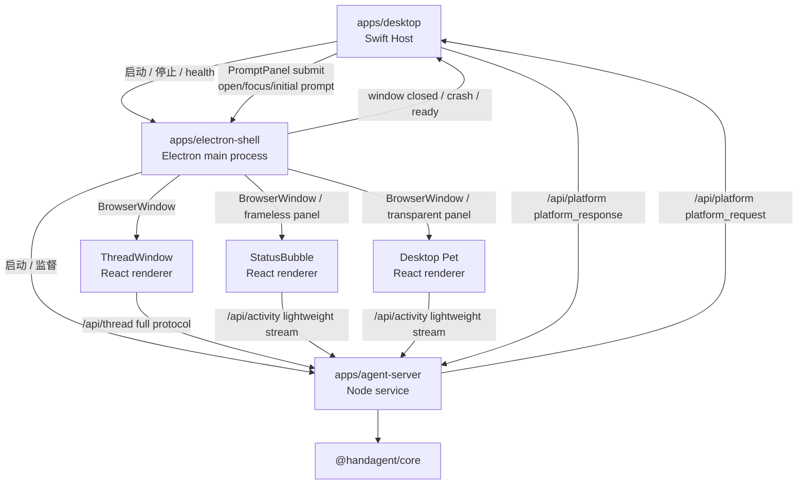
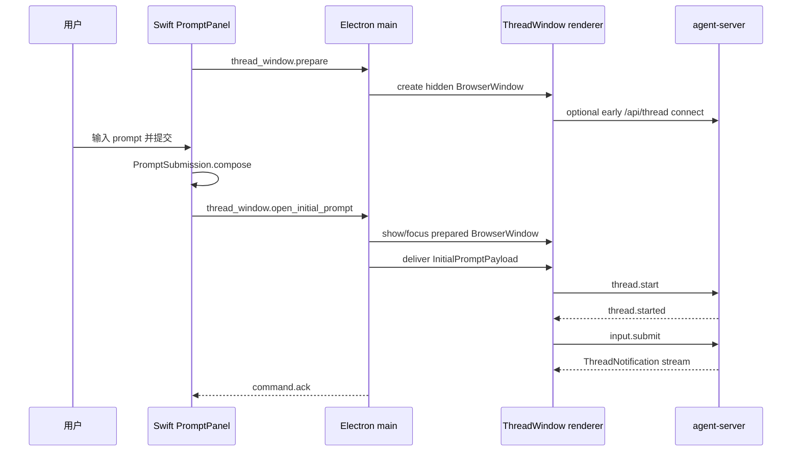

# Electron UI Shell 迁移设计

## 文档元信息

- 日期：2026-06-08
- 范围：桌面端复杂 UI 从 Swift/WKWebView 逐步迁移到 Electron/React
- 状态：设计 spec，尚未进入实施计划
- 目标读者：后续实现者、架构评审者、QA 维护者

## 背景

当前 HandAgent 的桌面端由 Swift host 启动并协调：

- Swift `PromptPanel` 负责全局快捷键唤起、输入、附件采集和提交。
- Swift `Settings` 负责模型、工具、Plugin、MCP、权限、workspace 和快捷键配置。
- Swift `ThreadWindowLifecycle` 创建 `NSWindow/WKWebView`，加载 `apps/thread-window-web` 的 React ThreadWindow，并注入初始 prompt。
- React ThreadWindow 直接连接 `/api/thread`，持有 tabs、历史、消息、请求面板和 composer 状态。
- Swift `PlatformBridgeConnectionClient` 连接 `/api/platform`，执行 ScreenCaptureKit、Accessibility、NSWorkspace、NSPasteboard 等 macOS 原生能力。
- Swift `StatusBubble` 目前只从 `ThreadRegistry` 派生摘要，尚未接入 agent-server 的实时 thread 事件。

用户希望减少 Swift UI 代码，把复杂交互更多放到 React/Web 生态中。PromptPanel 的非激活窗口、焦点恢复、用户主动附件采集，以及设置页里的全局快捷键配置仍保留 Swift；ThreadWindow、StatusBubble 和未来桌宠希望迁到 Electron/React。

Electron 官方进程模型支持该方向：main process 运行 Node.js 并管理窗口，每个 `BrowserWindow` 是独立 renderer process；长任务或服务可放入 `utilityProcess`。官方也要求 renderer 与 Node/Electron 能力通过受控 IPC、preload 或 `contextBridge` 暴露，而不是默认共享主进程能力。

参考资料：

- Electron Process Model: https://www.electronjs.org/docs/latest/tutorial/process-model
- Electron BrowserWindow: https://www.electronjs.org/docs/latest/api/browser-window
- Electron utilityProcess: https://www.electronjs.org/docs/latest/api/utility-process
- Electron Context Isolation / contextBridge: https://www.electronjs.org/docs/latest/tutorial/context-isolation
- Electron IPC: https://www.electronjs.org/docs/latest/tutorial/ipc

## 设计目标

1. Swift 收缩为原生入口层：PromptPanel、Settings、全局快捷键、焦点恢复、平台能力和 Electron 进程生命周期。
2. Electron 接管复杂 Web UI：ThreadWindow、StatusBubble、未来桌宠，以及这些 UI 的窗口生命周期。
3. React 继续作为 thread UI 状态源；Swift 不重新持有 thread client，不解析完整 `ThreadNotification`。
4. agent-server 的 thread 协议继续作为产品状态主干，ThreadWindow 订阅完整协议，StatusBubble/桌宠订阅轻量 activity stream。
5. 平台能力仍通过 `/api/platform` 回到 Swift，保持“macOS 原生能力不进入 Electron renderer”的边界。
6. 迁移采用渐进式 phase，每个 phase 都能独立验证和回退，不一次性替换整个桌面壳。

## 非目标

- 不把 PromptPanel 首版迁到 Electron。
- 不把 Settings 首版迁到 Electron，尤其不迁移全局快捷键配置。
- 不让 Electron renderer 直接调用 ScreenCaptureKit、Accessibility、窗口枚举或剪贴板等原生能力。
- 不在首版改变 core runtime、tool schema、thread 持久化格式或 LLM/provider 行为。
- 不把 agent-server 立即内联到 Electron main process。首版继续让 agent-server 作为独立 Node 服务运行，待 Electron UI 稳定后再评估 `utilityProcess`。
- 不追求 Swift 与 Electron 完全无 IPC。保留 Swift PromptPanel/Settings 时，Swift 到 Electron 的 command bridge 是必要边界。

## 方案取舍

### 方案 A：继续 Swift + WKWebView，仅补 StatusBubble bridge

优点：

- 改动最小。
- 当前 WKWebView ThreadWindow 已工作。
- 不引入 Electron 体积、签名和进程管理复杂度。

缺点：

- StatusBubble 和未来桌宠如果继续 SwiftUI，会增加 Swift 复杂 UI 代码。
- 如果桌宠需要 Canvas/WebGL/丰富动画，Swift 实现成本高。
- 未来每个 Web UI 与 Swift 状态同步都要单独做桥。

适用场景：只修 StatusBubble 实时状态，不做复杂桌宠或多 Web UI。

### 方案 B：混合壳，Swift 保留原生入口，Electron 接管复杂 UI（推荐）

优点：

- 符合“复杂 UI 走 React/Web 生态”的长期偏好。
- ThreadWindow、StatusBubble、桌宠都能消费同一套 Web UI 技术栈。
- Swift 不需要为 StatusBubble/桌宠维护复杂 thread 状态 UI。
- Electron renderer 可同时订阅 agent-server 通知，减少 Swift 业务状态 bridge。

缺点：

- 需要新增 Swift <-> Electron command bridge。
- 需要处理 Electron 进程启动、崩溃恢复、打包、签名、公证和资源路径。
- 窗口生命周期分属 Swift 与 Electron，需要明确激活策略和退出顺序。

适用场景：ThreadWindow、StatusBubble、桌宠都会长期做成复杂 React UI。

### 方案 C：全 Electron，Swift 只做极薄原生 helper

优点：

- UI 和大部分 app 生命周期统一到 Electron。
- Swift 只作为平台 helper，理论上 Swift 代码最少。

缺点：

- PromptPanel 的非激活窗口、焦点恢复、附件采集和全局快捷键配置需要重做。
- macOS 原生行为、权限引导和用户体验风险最大。
- 当前 Swift AppCoordinator、Settings、Hotkey、PlatformBridge 需要大规模重写。

适用场景：未来产品主目标变成跨平台 Electron app，并愿意重做 macOS 原生入口。

本 spec 采用方案 B。

## 目标架构



### Swift Host 职责

Swift 继续负责：

- App 启动与退出。
- PromptPanel 非激活面板、焦点恢复、用户主动附件采集。
- Settings 与全局快捷键配置。
- agent-server/Electron 可用性提示、fatal alert、日志入口。
- `/api/platform` 连接与 `MacPlatformProvider`。
- Electron runtime 启动、停止、ready/crash 状态监听。

Swift 不负责：

- ThreadWindow tab/message/history 状态。
- StatusBubble 的运行态展示数据计算。
- 桌宠动画状态。
- Electron renderer 的 UI store。

### Electron main 职责

Electron main process 负责：

- 创建、显示、聚焦、关闭 ThreadWindow。
- 创建、定位、显示 StatusBubble 和桌宠窗口。
- 维护 Electron renderer 的窗口级生命周期。
- 接收 Swift command bridge，例如 `threadWindow.openWithInitialPrompt`。
- 向 Swift 回报 ready、window closed、renderer crashed、server unavailable 等状态。
- 启动或监督 agent-server。首版可以继续启动现有 Node 子进程；后续再评估 `utilityProcess`。

Electron main 不负责：

- 直接执行 LLM/tool runtime。
- 直接读取 macOS 原生上下文。
- 把完整 thread 状态 mirror 到 main process。

### Electron renderer 职责

ThreadWindow renderer：

- 继续使用 `apps/thread-window-web` 的 React 代码或迁入 Electron shell 后复用同一包。
- 直接连接 `/api/thread`。
- 处理完整 `ThreadCommand`、`ThreadNotification`、`ServerRequest`、`ClientResponse`。
- 仍是 tabs、历史、消息、请求面板和 composer 的 UI 状态源。

StatusBubble renderer：

- 订阅 `/api/activity`。
- 展示当前 activity：idle、running、waiting permission/workspace、tool running、error、completed。
- 点击后通过 Electron main 聚焦 ThreadWindow；若没有活跃 thread，则让 Swift 显示 PromptPanel 或让 Electron 打开空 ThreadWindow，具体由 command bridge 决定。

Desktop Pet renderer：

- 订阅同一 `/api/activity`。
- 将 activity 映射为动画状态，例如 idle、thinking、tooling、waiting、success、error。
- 不消费完整消息内容，除非后续明确做情绪/摘要展示。

### agent-server 职责

agent-server 继续负责：

- `/api/thread` 完整 thread 协议。
- `/api/platform` 平台能力桥。
- thread/turn 路由、runtime 驱动、持久化、permission/workspace 请求。
- 新增 `/api/activity` 轻量活动流。

agent-server 不负责：

- Electron 窗口生命周期。
- StatusBubble 或桌宠 UI 具体动画。
- macOS 原生能力实现。

## Swift <-> Electron Command Bridge

保留 Swift PromptPanel 和 Settings 后，Swift 与 Electron 之间必须有 command bridge。它替代当前 WKWebView initial prompt 注入，但边界更清晰。

### 传输选择

首版建议使用本地 IPC socket 或 stdio JSON-RPC：

- Swift 启动 Electron 子进程。
- Electron ready 后向 Swift 发送 `electron.ready`。
- Swift 通过同一通道发送 commands。
- Electron 回传 ack/event。

不建议首版使用临时文件轮询或 AppleScript。它们难以表达窗口 ack、崩溃恢复和 prompt 提交顺序。

### Command 类型

```typescript
type SwiftToElectronCommand =
  | {
      channel: "electron_shell";
      type: "thread_window.prepare";
      commandId: string;
    }
  | {
      channel: "electron_shell";
      type: "thread_window.open_initial_prompt";
      commandId: string;
      payload: InitialPromptPayload;
    }
  | {
      channel: "electron_shell";
      type: "thread_window.open_history";
      commandId: string;
    }
  | {
      channel: "electron_shell";
      type: "thread_window.focus";
      commandId: string;
      threadId?: string | null;
    }
  | {
      channel: "electron_shell";
      type: "activity_window.show";
      commandId: string;
    }
  | {
      channel: "electron_shell";
      type: "shutdown";
      commandId: string;
    };
```

```typescript
type ElectronToSwiftEvent =
  | {
      channel: "electron_shell";
      type: "electron.ready";
      timestamp: string;
    }
  | {
      channel: "electron_shell";
      type: "command.ack";
      commandId: string;
      ok: boolean;
      error?: string;
    }
  | {
      channel: "electron_shell";
      type: "thread_window.closed";
      timestamp: string;
    }
  | {
      channel: "electron_shell";
      type: "renderer.crashed";
      window: "thread" | "activity" | "pet";
      reason: string;
    }
  | {
      channel: "electron_shell";
      type: "agent_server.health";
      available: boolean;
      message?: string;
    };
```

### PromptPanel 提交流程



如果 Electron 未 ready，Swift 必须保留 PromptPanel 草稿，不应丢弃提交。可选行为：

- 首版：禁用提交并显示 Electron 启动中。
- 后续：允许提交，Swift 排队一个 pending initial prompt，Electron ready 后发送。

首版采用禁用提交，降低竞态。

### ThreadWindow 隐藏预热

迁到 Electron 后仍保留“PromptPanel 打开时后台初始化 ThreadWindow 页面，提交时直接展示”的体验。Swift 不直接创建 `BrowserWindow`，只在 PromptPanel 显示后向 Electron main 发送 `thread_window.prepare`。Electron main 负责：

1. 在 `app.whenReady()` 之后创建全局唯一 ThreadWindow。
2. 使用 `new BrowserWindow({ show: false, webPreferences: { preload, contextIsolation: true, nodeIntegration: false } })`。
3. 立即 `loadURL` 或 `loadFile`，让 preload、React bundle 和必要的 WebSocket 初始化提前完成。
4. 不调用 `show()`、`focus()` 或任何会激活应用的动作。
5. 收到 `thread_window.open_initial_prompt` 后，复用已准备好的窗口，传递 initial prompt，再 `show()` 和 `focus()`。

Electron 的隐藏预热比 WKWebView 更直接，因为 `BrowserWindow` 原生支持 `show: false`。实现时需要注意：

- `BrowserWindow` 只能在 Electron `app.whenReady()` 后创建；Electron 未 ready 时，Swift 继续禁用提交或保留草稿。
- 不要把 `show()` 当作预热动作。预热只创建隐藏窗口并加载页面。
- 保持默认 `paintWhenInitiallyHidden: true`，否则 `ready-to-show` 不会触发，预热完成信号会失效。
- 默认先不关闭 `webPreferences.backgroundThrottling`。只有实测隐藏窗口中的 WebSocket、timer 或 React 初始化被节流影响时，再为 ThreadWindow 单独评估关闭。
- hidden window 不计入 Swift 的 open ThreadWindow 状态；只有 Electron main 收到 `open_initial_prompt` 并展示窗口后，才向 Swift 回报可见窗口状态。

## Activity Stream

StatusBubble 和桌宠不应消费完整 `ThreadNotification` 洪流。完整协议包含消息 delta、tool 细节、请求回执和历史事件，适合 ThreadWindow，不适合小型状态 UI。

新增 `/api/activity` WebSocket，提供轻量事件：

```typescript
type AgentActivityEvent =
  | {
      channel: "activity";
      type: "activity.snapshot";
      activeThreadId: string | null;
      status: AgentActivityStatus;
      latestSummary: string | null;
      waitingRequest: "permission" | "workspace" | null;
      error: string | null;
      updatedAt: string;
    }
  | {
      channel: "activity";
      type: "activity.changed";
      activeThreadId: string | null;
      status: AgentActivityStatus;
      latestSummary: string | null;
      waitingRequest: "permission" | "workspace" | null;
      error: string | null;
      updatedAt: string;
    };

type AgentActivityStatus =
  | "idle"
  | "starting"
  | "running"
  | "tool_running"
  | "waiting"
  | "completed"
  | "error";
```

派生规则：

- `thread.started` 或首轮 `input.submit` 后进入 `starting`。
- `turn.started` / `assistant.delta` 后进入 `running`。
- `tool.started` 后进入 `tool_running`。
- `permission.requested` / `workspace.requested` 后进入 `waiting`。
- `turn.completed` 后进入 `completed`，随后可在短延迟后回到 `idle`。
- `thread.error` 后进入 `error`。

activity stream 可以广播给多个 subscriber：ThreadWindow 可不用订阅，StatusBubble 和桌宠都订阅。后端发多份通知是可接受的；关键是每个 subscriber 获得的协议刚好适配其 UI 需要。

## app-server 在 Electron 中的运行策略

### Phase 1：保持现有 Node 子进程

Electron main 或 Swift 继续启动现有：

```bash
node --experimental-transform-types --experimental-specifier-resolution=node apps/agent-server/src/server/server.ts
```

优势：

- 不改变 agent-server 组合根。
- 不改变测试和 mock LLM 入口。
- Electron UI 迁移和 server 运行方式解耦。

### Phase 2：由 Electron main 监督 Node 子进程

Swift 只启动 Electron，Electron main 再启动 agent-server。Swift 通过 Electron health event 获得可用性。

优势：

- Web UI 与 server 生命周期更集中。
- Swift AppCoordinator 少管 Node 路径、stdout/stderr 和重启。

风险：

- 打包路径和 dev worktree 路径要重新设计。
- Swift fatal alert 与日志入口仍需要 Electron 回告。

### Phase 3：评估 Electron `utilityProcess`

如果 Electron 版本和打包验证稳定，可以把 agent-server 放入 `utilityProcess`。

采用条件：

- `utilityProcess` 能稳定运行当前 TypeScript/Node 入口或构建后的 JS 入口。
- stdout/stderr、重启、环境变量、mock mode、worktree dev path 都可测试。
- 不牺牲 agent-server 的独立单元测试和命令行启动能力。

本 spec 不要求 Phase 3 必做。

## 窗口策略

### ThreadWindow

- Electron `BrowserWindow` 承载 React ThreadWindow。
- Electron main 支持隐藏预热：PromptPanel 显示后创建 `show: false` 的 ThreadWindow，提前加载 preload、React bundle 和必要连接；PromptPanel 提交时再 `show/focus`。
- 开发态可加载 Vite dev server 或 agent-server 静态资源。
- 生产态加载打包后的本地资源。
- 首版维持全局唯一 ThreadWindow；多窗口另行设计。
- PromptPanel 提交总是创建新 thread/tab，不写入当前 active tab。
- 隐藏预热窗口不算可见 ThreadWindow，不触发 Swift `.regular` 激活策略，也不改变 StatusBubble/桌宠 activity。

### StatusBubble

- Electron 创建小型 frameless/transparent window。
- 默认右下角定位，浮动在普通窗口上方。
- 点击时通过 Electron main 聚焦 ThreadWindow；如果 Electron main 判定没有 ThreadWindow，则回告 Swift 显示 PromptPanel。
- 不再从 Swift `ThreadRegistry` 派生状态。

### Desktop Pet

- Electron 创建 transparent always-on-top window。
- UI 可使用 React + Canvas、SVG、Lottie、WebGL 或 CSS animation。
- 只消费 activity stream，不直接驱动 LLM/tool。
- 拖拽、位置保存、多屏策略单独设计，不阻塞 ThreadWindow 迁移。

## 平台能力边界

继续保留 `/api/platform` 到 Swift：

```text
LLM/tool runtime
  -> RemotePlatformAdapter
  -> agent-server /api/platform
  -> Swift PlatformBridgeService
  -> MacPlatformProvider
  -> platform_response
```

原因：

- ScreenCaptureKit、Accessibility、NSWorkspace、NSPasteboard 当前已经在 Swift 落地。
- macOS 权限提示、错误解释和系统设置入口在 Swift 更直接。
- Electron renderer 不应持有平台强能力，避免扩大安全边界。

如果未来某些能力迁到 Electron native module，必须单独写能力迁移 spec，不能在 UI shell 迁移中顺手完成。

## 仓库结构建议

新增：

```text
apps/electron-shell/
  electron-shell.md
  package.json
  src/main/
    main.ts
    windows/
    swiftBridge/
    serverSupervisor/
  src/preload/
    threadWindowPreload.ts
    activityPreload.ts
  src/activity-window/
    App.tsx
    store/
    components/
  src/pet-window/
    App.tsx
    store/
    components/
  tests/
```

保留：

```text
apps/thread-window-web/
```

首版可以让 Electron ThreadWindow 继续加载 `apps/thread-window-web` 的构建产物，避免一开始搬包。等 Electron shell 稳定后，再决定是否把 ThreadWindow 前端代码并入 `apps/electron-shell/src/thread-window/`。

## 迁移阶段

### Phase 0：Electron shell spike

目标：

- 新增最小 Electron app。
- Swift 能启动 Electron 并收到 `electron.ready`。
- Electron 能打开一个空 `BrowserWindow`。
- 不接入 ThreadWindow，不替换现有 WKWebView。

验证：

- Electron dev/build 脚本可跑。
- Swift 启动/停止 Electron 不影响现有 app-server。
- 退出 HandAgent 后 Electron 进程不残留。

### Phase 1：Electron ThreadWindow 替代 WKWebView host

目标：

- PromptPanel show 通过 Swift -> Electron command bridge 触发 `thread_window.prepare`，Electron 创建隐藏 `BrowserWindow` 并加载 React。
- PromptPanel submit 通过 Swift -> Electron command bridge 打开 Electron ThreadWindow。
- Electron ThreadWindow 复用已预热窗口；如果尚未预热完成，submit 路径负责创建窗口并等待 renderer 可接收 initial prompt。
- 初始 prompt 通过 Electron main/preload 传给 renderer。
- React 仍直接连接 `/api/thread`。
- Swift `ThreadWindowLifecycle` 收缩为 Electron window command client。

验证：

- 打开 PromptPanel 后不会跳出 ThreadWindow，但 Electron 已创建隐藏 ThreadWindow renderer。
- PromptPanel 提交创建新 thread/tab。
- 预热完成后提交的首屏延迟低于冷启动路径。
- 连续提交复用同一个 Electron ThreadWindow，但创建不同 thread/tab。
- 历史、composer、permission/workspace 请求保持现有行为。
- WKWebView host 可删除或保留为临时 fallback，但不能长期双写。

### Phase 2：新增 `/api/activity`，迁移 StatusBubble

目标：

- agent-server 增加 activity publisher。
- Electron StatusBubble 订阅 `/api/activity`。
- Swift StatusBubble 停用或删除。
- 点击 Electron StatusBubble 能聚焦 ThreadWindow，必要时让 Swift 打开 PromptPanel。

验证：

- running/tool/waiting/error/completed 状态实时展示。
- 多个 subscriber 同时连接不影响 ThreadWindow。
- agent-server 重启后 activity subscriber 自动恢复 snapshot。

### Phase 3：桌宠

目标：

- Electron Pet window 订阅 `/api/activity`。
- 实现基础状态动画：idle、running、tool_running、waiting、error。
- 桌宠不改变 thread run，也不直接注入上下文。

验证：

- activity 状态变化驱动动画。
- 关闭桌宠不影响 ThreadWindow 和 StatusBubble。
- 多屏、位置保存和透明点击区域按后续桌宠 spec 处理。

### Phase 4：agent-server 生命周期迁到 Electron 监督

目标：

- Swift 只启动 Electron。
- Electron main 启动/监督 agent-server。
- Electron 把 server health 回告 Swift，Swift 继续控制 PromptPanel 是否可提交。

验证：

- dev worktree 路径正确。
- mock LLM 打包入口仍可用。
- server 非零退出后重启策略保留。
- fatal error 仍能在 Swift 显示原生 alert 或在 Electron UI 显示等效提示。

### Phase 5：评估 `utilityProcess`

目标：

- 只在 Phase 4 稳定后评估。
- 以测试和打包结果决定是否迁移，不作为 Electron UI 迁移前置条件。

## 测试策略

### Swift

- Electron process supervisor：
  - 启动命令、ready event、shutdown。
  - 进程 crash 后 health 状态更新。
  - PromptPanel 提交时 Electron 未 ready 不丢草稿。
- Swift command bridge：
  - `open_initial_prompt` 编码正确。
  - ack failure 时恢复 PromptPanel 可提交状态。
- Platform bridge：
  - `/api/platform` 行为不因 Electron UI 迁移改变。

### Electron

- main process：
  - window create/focus/close。
  - Swift command 解码和 ack。
  - renderer crash event 上报。
- preload：
  - 只暴露有限 API。
  - 不把 Node/Electron 全量能力泄漏给 renderer。
- renderer：
  - ThreadWindow 初始 prompt 接收。
  - ActivityWindow store 处理 snapshot/changed。
  - PetWindow store 处理 activity 状态。

### agent-server

- `/api/activity`：
  - 连接后发送 snapshot。
  - turn/thread/tool/request/error 事件能派生正确 activity。
  - 多 subscriber 广播。
  - subscriber 断线不影响 `/api/thread`。
- 现有 `/api/thread` 和 `/api/platform` 测试保持通过。

### 手工 QA

- PromptPanel 提交后打开 Electron ThreadWindow。
- ThreadWindow 首轮 prompt 不丢、不重复。
- 连续 PromptPanel 提交创建多个 thread/tab。
- StatusBubble 实时展示 running/tool/waiting/error。
- 桌宠状态随 activity 改变。
- 关闭 ThreadWindow、StatusBubble、桌宠后进程和窗口状态正确。
- agent-server 重启后 ThreadWindow 和 activity subscriber 恢复。
- ScreenCaptureKit、Accessibility、剪贴板、窗口列表等 platform tool 仍通过 Swift 执行。
- 打包 `.app` 后签名、公证前检查无残留 helper 进程。

## 文档更新范围

实施时同步更新：

- `handAgent.md`
- `apps/apps.md`
- `apps/desktop/desktop.md`
- `apps/desktop/Sources/Coordinator/coordinator.md`
- `apps/desktop/Sources/AppServices/AgentServer/agent-server.md`
- `apps/desktop/Sources/AppServices/PlatformBridge/platform-bridge.md`
- `apps/desktop/Sources/ThreadWindow/thread-window.md`
- `apps/desktop/Sources/StatusBubble/status-bubble.md`
- `apps/thread-window-web/thread-window-web.md`
- 新增 `apps/electron-shell/electron-shell.md`
- `apps/agent-server/agent-server.md`
- `packages/core/src/protocol/protocol.md`
- `docs/manual-qa.md`

## 风险与处理

### 进程和打包复杂度

Electron 会显著增加打包体积和 helper 进程数量。处理方式：

- Phase 0 先验证启动、退出和打包路径。
- 不在 Phase 1 同时迁移 agent-server 运行方式。
- QA 中加入“退出后无残留 Electron/Node 进程”。

### Swift 与 Electron 生命周期竞争

Swift 和 Electron 都可能想管理窗口激活。处理方式：

- Swift 只管理 PromptPanel/Settings。
- Electron 只管理 ThreadWindow/StatusBubble/桌宠。
- 跨边界只发 command，不直接操作对方窗口对象。

### Activity 协议过重或过轻

如果 activity stream 暴露完整 thread 事件，小 UI 会被协议细节拖累；如果过轻，桌宠无法表达状态。处理方式：

- 首版只暴露状态、activeThreadId、summary、waitingRequest、error。
- 不暴露完整消息内容。
- 如需更丰富宠物行为，另写桌宠状态 spec。

### 安全边界扩大

Electron renderer 如果拿到 Node API，会扩大攻击面。处理方式：

- 开启 context isolation。
- 使用 preload 暴露最小 API。
- renderer 通过 WebSocket/IPC 发明确命令，不直接访问 filesystem、child_process 或 platform provider。

### 重复协议路径

ThreadWindow 完整协议和 activity stream 都来自 agent-server，可能产生状态不一致。处理方式：

- activity 由同一个 thread runtime/publisher 派生，不由 UI 自行推断。
- activity snapshot 是连接恢复入口。
- ThreadWindow 不依赖 activity，StatusBubble/桌宠不依赖完整 thread 协议。

## 成功标准

- Swift UI 代码不再继续扩展 ThreadWindow、StatusBubble、桌宠复杂状态。
- ThreadWindow 在 Electron 中保持现有 `/api/thread` 行为。
- StatusBubble 和桌宠都能实时订阅 activity stream，不需要 Swift thread 状态 bridge。
- PromptPanel 和 Settings 保留 Swift 原生体验。
- 平台 tool 仍通过 Swift `/api/platform` 执行。
- 每个迁移 phase 都有独立自动化测试和手工 QA。
