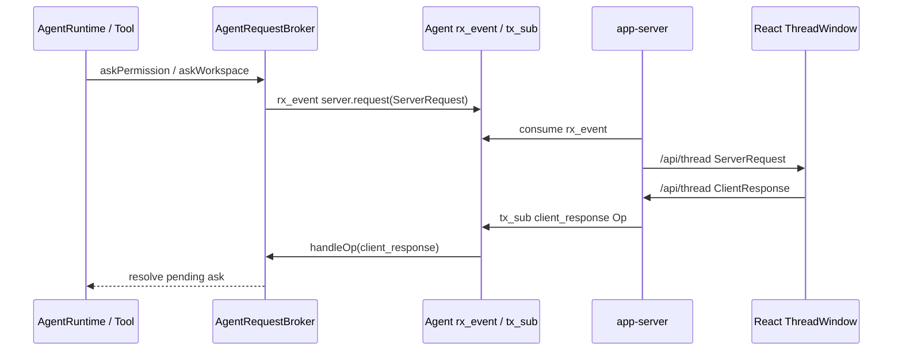

# Agent Request Rx Event 收敛设计

> **状态：已实现。** 本文定义在 Core Agent runtime model 上继续收敛 request-response 的目标形态：turn 中产生的 `ServerRequest` 不再由 socket bridge 直接发送，而是统一进入 Agent `rx_event`；React 回传的 `ClientResponse` 由 app-server 包装为 `client_response` Op 后投递到 Agent `tx_sub`。

## 背景

上一轮重构已经把公开运行期输入收敛为 `op.submit(UserInput | Interrupt)`，并建立了 server 侧持久 `Agent` 结构。但 permission 和 workspace 选择仍有一条旧侧路：`ThreadPermissionBridge` / `ThreadWorkspaceAskBridge` 在 `/api/thread` socket handler 内绑定当前连接，turn 中 ask resolver 直接通过这些 bridge 发送 `ServerRequest`，React 的 `ClientResponse` 又直接回到 bridge。

这让 request-response 绕开了 Agent 的 `rx_event / tx_sub` 边界。目标是把它改成和普通 turn 事件一致的 Agent 通道语义。

## 目标

1. Agent `rx_event` 承载两类输出：`thread.notification` 与 `server.request`。
2. permission/workspace ask resolver 不知道 WebSocket，也不直接调用 publisher；它只把 `ServerRequest` 包装成 `server.request` event。
3. app-server 从 Agent `rx_event` 消费事件，发布为 `/api/thread` 的 `ThreadNotification` / `ServerRequest`，并继续旁路给 `/api/activity`。
4. React 仍按跨进程协议发送 `ClientResponse`，但 app-server 收到后立即包装成 `client_response` Op，投递到目标 Agent `tx_sub`。
5. 公开 `ThreadCommand.payload.op` 仍只允许 `RuntimeOp = UserInput | Interrupt`；`client_response` 是 app-server 内部 Op，不允许 React 通过 `op.submit` 直接发送。
6. 删除生产路径中的 `ThreadPermissionBridge` / `ThreadWorkspaceAskBridge`，避免 request-response owner 分裂。

## 非目标

- 不改变 React ThreadWindow 的请求面板 UI。
- 不把 `thread.start` / `thread.resume` / `workspace.list` 改成 Op。
- 不改变 `/api/platform` 的 platform bridge。
- 不重新引入断线恢复或 pending request replay 协议。当前 ThreadWindow 非主动断开后仍不恢复订阅。

## 目标类型

```ts
export type RuntimeOp = UserInputOp | InterruptOp;
export type Op = RuntimeOp | ClientResponseOp;

export type ClientResponseOp = {
  type: "client_response";
  opId: string;
  timestamp: string;
  payload: { response: ClientResponse };
};

export type AgentEvent = AgentThreadNotificationEvent | AgentServerRequestEvent;

export type AgentThreadNotificationEvent = {
  type: "thread.notification";
  eventId: string;
  threadId?: string;
  timestamp: string;
  payload: ThreadNotification;
};

export type AgentServerRequestEvent = {
  type: "server.request";
  eventId: string;
  threadId: string;
  timestamp: string;
  payload: ServerRequest;
};
```

`ThreadCommand` 的 `op.submit` 使用 `RuntimeOp`，不是完整 `Op`。这保留“Op 只替代公开运行期输入”的外部边界，同时允许 Agent 内部用同一 `tx_sub` 接收 UI 回执。

## 数据流



## 失败语义

- ask 缺少 `threadId`：permission 返回 deny，workspace 返回 cancelled。
- Agent 已关闭或没有 request emitter：permission 返回 deny，workspace 返回 cancelled。
- UI 不回包直到 timeout：permission 返回 deny，workspace 返回 cancelled。
- socket close：server 中断该 socket 关联的 running thread，并清理 thread 临时权限规则；pending ask 会在 Agent interrupt/close 时取消，或在 timeout 时收敛。

## 验证要求

- `AgentRequestBroker` 覆盖 permission request event、workspace 串行队列和 `client_response` 唤醒。
- `ThreadCommandRouter.handleResponse` 覆盖 `ClientResponse -> client_response Op -> Agent tx_sub`。
- `attachThreadSocketHandlers` 覆盖 socket 只做订阅、ClientResponse 分派和 close 清理，不再绑定 permission/workspace bridge。
- 全量执行 `bash ./scripts/test.sh`，最终提交前再执行 Swift test/build。
