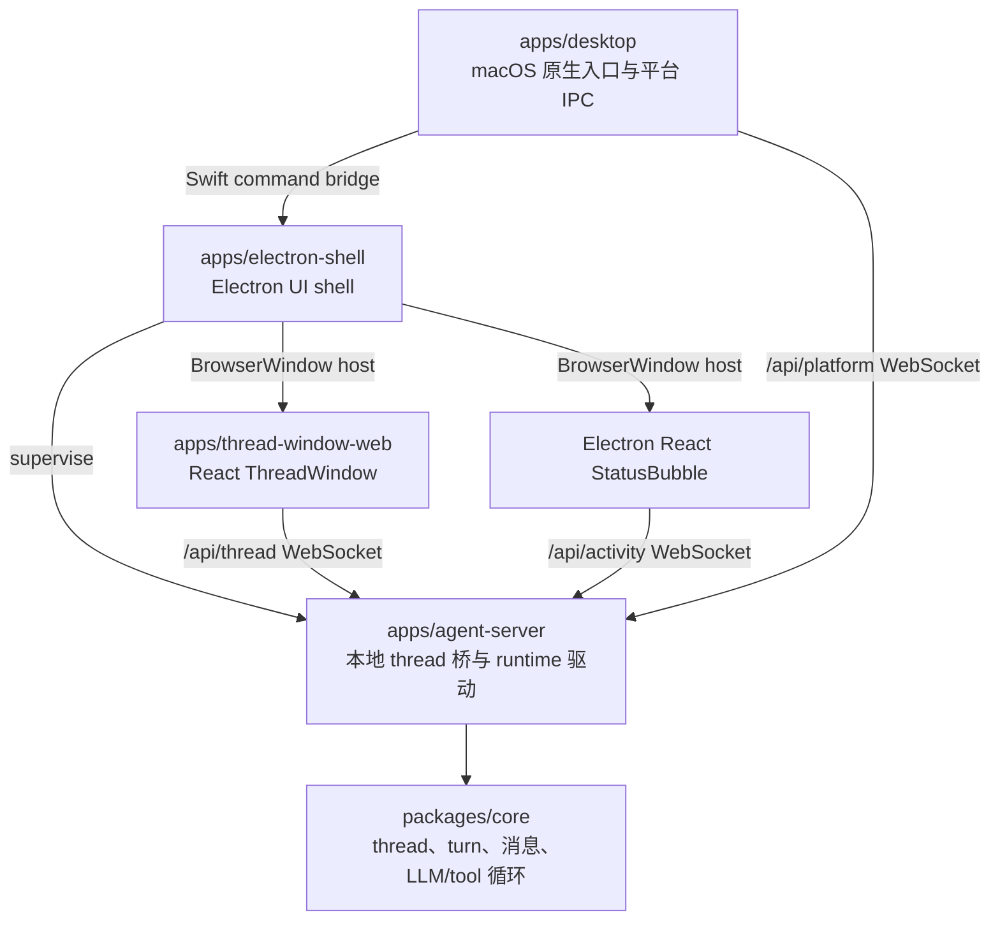
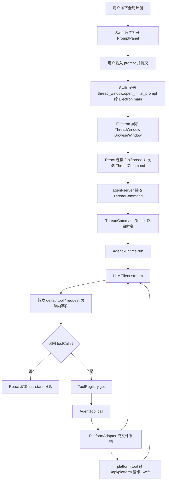

# handAgent

## 分层架构

Electron UI shell 是桌面端唯一 UI shell。Swift 启动 Electron，Electron 监督 agent-server，在 agent-server ready 后主动预热隐藏 ThreadWindow，并在 PromptPanel submit、openHistory 和 focus 时展示或聚焦 Electron `BrowserWindow` ThreadWindow；Electron ActivityWindow 承载 React StatusBubble，renderer 直接订阅 `/api/activity`。Swift 不启动 agent-server，不创建 `WKWebView` ThreadWindow，不显示 Swift StatusBubble，也不 mirror Electron activity 状态。平台能力仍只通过 Swift `/api/platform` 执行。

### 分层职责

- `apps/desktop`：负责宿主生命周期、热键、PromptPanel、Settings、焦点恢复、Swift <-> Electron command bridge，以及通过 `MacPlatformProvider` 实现 macOS 原生能力（ScreenCaptureKit / NSWorkspace / NSPasteboard 等）。
- `apps/electron-shell`：负责 Electron main 进程、Swift command socket、agent-server supervisor、隐藏 ThreadWindow 预热、PromptPanel submit/openHistory/focus 对应的 Electron `BrowserWindow` ThreadWindow 生命周期，以及 React StatusBubble ActivityWindow 生命周期。StatusBubble 点击时先通过 Electron main 聚焦 Electron ThreadWindow；无法聚焦时 Electron 回告 Swift 打开 PromptPanel。
- `apps/thread-window-web`：负责 React ThreadWindow UI，直接持有 `/api/thread` WebSocket，管理历史、tabs、消息、请求回执和 composer 状态。
- `apps/agent-server`：负责本地 WebSocket thread 桥、`/api/thread`、`/api/activity` 与 `/api/platform` 路径分流、thread/turn 路由、持久化封装和 runtime 驱动。
- `packages/core`：负责 thread 输入归一化、消息模型、tool 注册、LLM/tool 循环、`RemotePlatformAdapter` 通过 `PlatformBridge` 接口向桌面 App 请求平台能力。

## 主调用链路

## 跨层合约

- 初始上下文只来自用户主动输入和主动附件。PromptPanel 的 attachment 只通过 Electron initial prompt command 进入 React；屏幕、剪贴板、App 状态和文件读取都必须走 tool。
- Thread 主协议只跑在 `/api/thread`：React 发送 `ThreadCommand` / `ClientResponse`，agent-server 发送 `ThreadNotification` / `ServerRequest`。
- Activity 轻量状态只跑在 `/api/activity`：agent-server 只发送 `AgentActivityEvent`；新连接先收到 `activity.snapshot`，状态变化时收到 `activity.changed`。该流由 `ThreadNotification` / `ServerRequest` 派生，不承载完整 thread 消息。
- 平台 RPC 只跑在 `/api/platform`：Swift desktop 发送 `platform_bridge_hello`，处理 `channel: "platform"` 的 `platform_request`，并回写 `platform_response`。
- `thread.snapshot` 是打开、恢复和重连后的 thread 状态入口；`workspace.listed` 是 `workspace.list` 的连接级响应，不带 `threadId`。
- `permission.requested` / `workspace.requested` 是 server 向 React 提问、等待 UI 回执的少量交互；不要把它们混入普通 notification 或 platform RPC。
- 持久化主目录是 `~/.spotAgent/threads/`；workspace、permission、blob、log、plugin、MCP 配置分别由对应模块文档说明。
- 图片 attachment 先落 Blob/STUB；agent-server 在 runtime 前展开为多模态 image part，最终能否理解图片取决于当前 provider capability。

协议字段详见 [protocol/protocol.md](/Users/mu9/proj/handAgent/packages/core/src/protocol/protocol.md)。desktop 内部提交模型见 [PromptPanel](/Users/mu9/proj/handAgent/apps/desktop/Sources/PromptPanel/prompt-panel.md)，React UI 状态见 [thread-window-web](/Users/mu9/proj/handAgent/apps/thread-window-web/thread-window-web.md)，agent-server 编排见 [agent-server](/Users/mu9/proj/handAgent/apps/agent-server/agent-server.md)。

## 当前架构不变量

- Swift desktop 不持有 thread client，不发送 `ThreadCommand`，不解析 `ThreadNotification`，不订阅 `/api/activity`。
- Swift 不发送 `thread_window.prepare`；Electron main 是 hidden ThreadWindow 预热的唯一 owner。agent-server 是唯一承载 core runtime 的后台进程，关闭 Electron UI 窗口不停止该进程。
- React ThreadWindow 是 tabs、历史、消息、运行态、permission/workspace 请求面板和 composer 的 UI 状态源。
- agent-server 是组合根和本地桥：负责 socket 路径拆分、thread/turn 路由、runtime 驱动、持久化封装、permission/workspace 回执桥和 platform bridge 转发；外部用户输入命令统一是 `input.submit`，后端内部归一化为 input item。
- packages/core 只定义跨平台 runtime、tool、platform、protocol、storage、workspace 和 permission 抽象，不实现 UI 或 macOS 原生能力。

## 阅读顺序建议

1. 先读本文档，建立整体分层和主链路。
2. 再读 [apps/apps.md](/Users/mu9/proj/handAgent/apps/apps.md)，理解入口与交互层。
3. 再读 [packages/packages.md](/Users/mu9/proj/handAgent/packages/packages.md)，理解核心 runtime 与平台实现。
