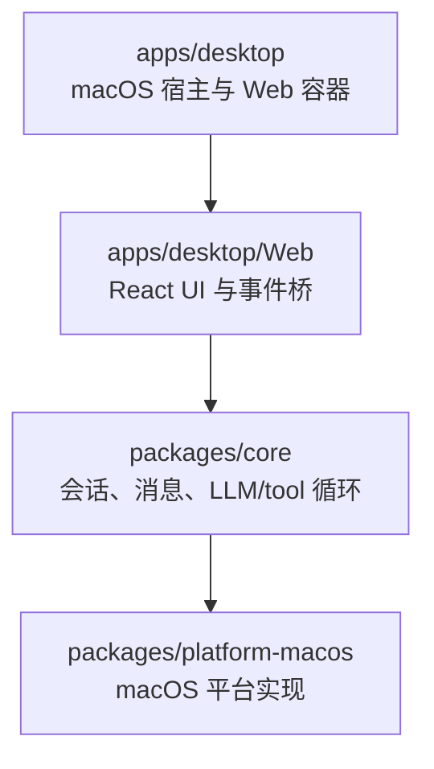
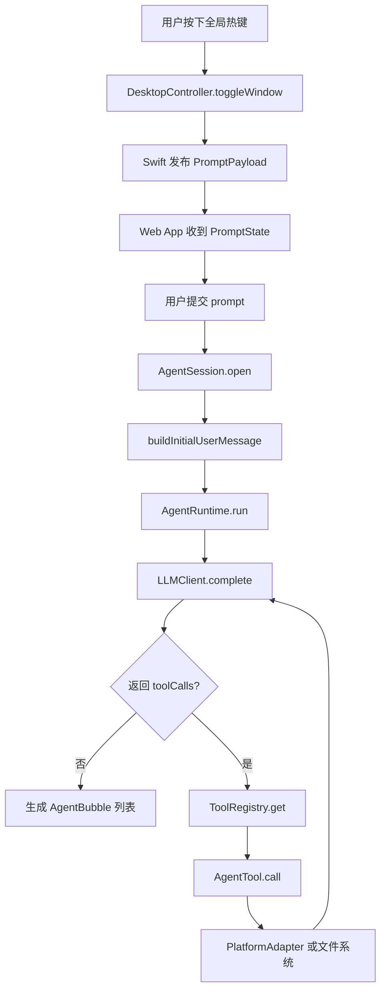

# handAgent

## 文档目标

本文档是仓库级总览，描述 HandAgent 的分层架构、核心调用链路、关键 DTO，以及各子目录文档之间的关系。

下级文档入口：

- [apps/apps.md](/Users/mu9/proj/handAgent/apps/apps.md)
- [packages/packages.md](/Users/mu9/proj/handAgent/packages/packages.md)

## 产品边界

- 当前产品是一个可由全局热键随时唤起的桌面 Agent。
- 第一版以 macOS 为优先，但核心 runtime 和 tool 协议按跨平台方式设计。
- 只有用户主动输入和用户主动选区可以作为会话初始上下文。
- 屏幕、窗口、文件、剪贴板、App 状态等信息不能默认注入模型，只能通过 tool 按需读取。

## 分层架构

### 分层职责

- `apps/desktop`：负责宿主生命周期、热键、窗口、`WKWebView` 容器和宿主事件桥。
- `apps/desktop/Web`：负责 prompt 输入、气泡渲染、提交会话、调用 `AgentRuntime`。
- `packages/core`：负责会话输入归一化、消息模型、tool 注册、LLM/tool 循环。
- `packages/platform-macos`：负责把平台能力映射到 macOS 的系统命令或 AppleScript。

## 主调用链路

## 主链路阶段 DTO

### 1. 宿主到 Web

- `PromptPayload`
  - `visible: boolean`
  - `prefill: string`
- `HostStatusPayload`
  - `hotkeyAvailable: boolean`
  - `message: string`
- `BubblePayload`
  - `id: string`
  - `text: string`

### 2. Web 侧本地状态

- `PromptState`
  - `visible: boolean`
  - `prefill: string`
- `HostStatus`
  - `hotkeyAvailable: boolean`
  - `message: string`
- `BubbleItem`
  - `id: string`
  - `text: string`
  - `kind?: "user" | "assistant"`

### 3. 会话输入与首轮消息

- `AgentSessionInput`
  - `prompt: string`
  - `selection?: SelectionCaptureResult | null`
- `SelectionCaptureResult`
  - `{ kind: "selected"; text: string }`
  - `{ kind: "empty" }`
  - `{ kind: "error"; message?: string }`
- `AgentSession`
  - `prompt: string`
  - `selectedText: string | null`

### 4. Runtime 与 LLM

- `AgentMessage`
  - `user`
  - `assistant`
  - `tool`
  - `system`
- `ToolCallEnvelope`
  - `id: string`
  - `name: string`
  - `arguments: Record<string, unknown>`
- `LLMCompletion`
  - `message: assistant message`
  - `toolCalls?: ToolCallEnvelope[]`
- `AgentRunResult`
  - `messages: AgentMessage[]`
  - `bubbles: AgentBubble[]`

### 5. Tool 与平台

- `RegisteredTool`
  - `name`
  - `description`
  - `inputSchema`
- `AgentTool<TInput, TOutput>`
  - `call(input): Promise<TOutput>`
- `PlatformAdapter`
  - `currentClipboardText`
  - `frontmostAppInfo`
  - `frontmostWindowList`
  - `captureScreen`
  - `recognizeText`
  - `accessibilitySnapshot`
  - `performAccessibilityAction`

## 当前实现状态

- 当前 Web 提交链路已经直接调用 `AgentSession` 与 `AgentRuntime`。
- `ToolRegistry` 在 Web 侧已经接入，但当前实例仍为空，真实 tool 集合待接入。
- `packages/core` 已经定义完整的 tool、platform DTO。
- `packages/platform-macos` 当前实现了选区捕获、前台 App、窗口列表、剪贴板、区域截图；OCR 与 accessibility 仍未完成。

## 阅读顺序建议

1. 先读本文档，建立整体分层和主链路。
2. 再读 [apps/apps.md](/Users/mu9/proj/handAgent/apps/apps.md)，理解入口与交互层。
3. 再读 [packages/packages.md](/Users/mu9/proj/handAgent/packages/packages.md)，理解核心 runtime 与平台实现。
