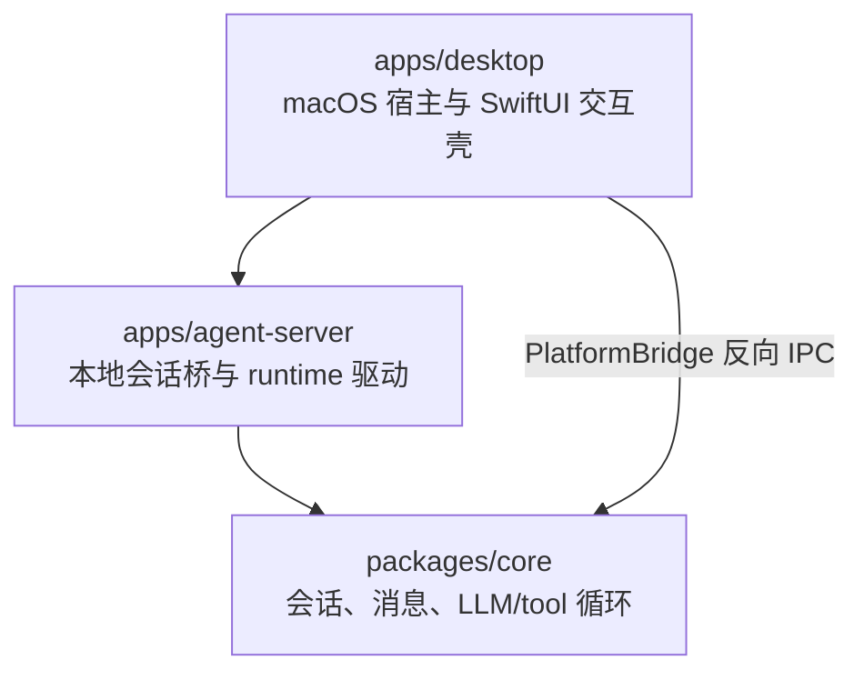
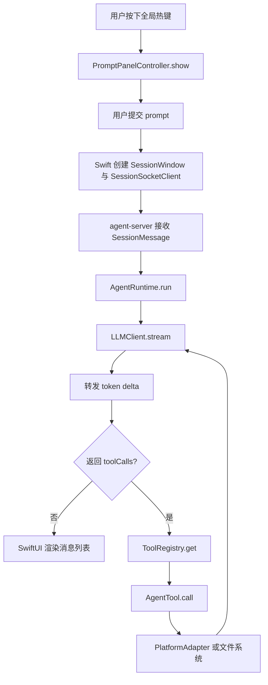

# handAgent

## 文档目标

本文档是仓库级总览，描述 HandAgent 的分层架构、核心调用链路、关键 DTO，以及各子目录文档之间的关系。

下级文档入口：

- [apps/apps.md](/Users/mu9/proj/handAgent/apps/apps.md)
- [packages/packages.md](/Users/mu9/proj/handAgent/packages/packages.md)

## 产品边界

- 当前产品是一个可由全局热键随时唤起的桌面 Agent。
- 第一版以 macOS 为优先，但核心 runtime 和 tool 协议按跨平台方式设计。
- 只有用户主动输入和用户主动选区可以作为会话初始上下文。
- 屏幕、窗口、文件、剪贴板、App 状态等信息不能默认注入模型，只能通过 tool 按需读取。

## 分层架构

### 分层职责

- `apps/desktop`：负责宿主生命周期、热键、PromptPanel、SessionWindow、独立历史窗口、状态气泡，以及通过 `MacPlatformProvider` 实现 macOS 原生能力（ScreenCaptureKit / NSWorkspace / NSPasteboard 等）。
- `apps/agent-server`：负责本地 WebSocket session 桥、会话路由、持久化封装和 runtime 驱动。
- `packages/core`：负责会话输入归一化、消息模型、tool 注册、LLM/tool 循环、`RemotePlatformAdapter` 通过 `PlatformBridge` 接口向桌面 App 请求平台能力。

## 主调用链路

## 主链路阶段 DTO

### 1. Prompt 与会话输入

- `AgentSessionInput`
  - `prompt: string`
  - `selection?: SelectionCaptureResult | null`
- `SelectionCaptureResult`
  - `{ kind: "selected"; text: string }`
  - `{ kind: "empty" }`
  - `{ kind: "error"; message?: string }`
- `AgentSession`
  - `prompt: string`
  - `selectedText: string | null`
- `UserMessageAttachment`（agent-server WS 协议）
  - `{ kind: "text-selection"; id; text }`
  - `{ kind: "image"; id; mimeType; base64 }`
- `PromptAttachmentResult`（desktop 内部）：5 case 详见 [PromptPanel](/Users/mu9/proj/handAgent/apps/desktop/Sources/PromptPanel/prompt-panel.md)。

### 2. Swift 宿主聚合状态

- `SessionSummary`
  - `sessionId: string`
  - `isRunning: boolean`
  - `latestSummary: string`
  - `lastActiveAt: Date`
  - `windowIsOpen: boolean`

### 3. Runtime 与 LLM

- `AgentMessage`
  - `user`
  - `assistant`
  - `tool`
  - `system`
- `ToolCallEnvelope`
  - `id: string`
  - `name: string`
  - `arguments: Record<string, unknown>`
- `LLMStreamEvent`
  - `text_delta`
  - `tool_call`
  - `message_end`
- `LLMCompletion`（兼容聚合结果）
  - `message: assistant message`
  - `toolCalls?: ToolCallEnvelope[]`
- `AgentRunResult`
  - `messages: AgentMessage[]`
  - `bubbles: AgentBubble[]`

### 4. Tool 与平台

- `RegisteredTool`
  - `name`
  - `description`
  - `inputSchema`
- `AgentTool<TInput, TOutput>`
  - `call(input): Promise<TOutput>`
- `PlatformAdapter`
  - `currentClipboardText`
  - `frontmostAppInfo`
  - `frontmostWindowList`
  - `captureScreen`
  - `recognizeText`
  - `accessibilitySnapshot`
  - `performAccessibilityAction`
- `PlatformBridge`：跨进程 RPC 接口；定义 `OfflineError` / `TimeoutError` / `RemoteError` 三个类型化错误。

### 5. 会话存储

- `SessionMetadata`
  - `id: string`
  - `title: string | null`
  - `createdAt: string`
  - `updatedAt: string`
  - `messageCount: number`
- `PersistedSession`
  - `version: 1`
  - `metadata: SessionMetadata`
  - `messages: AgentMessage[]`
  - `events: SessionEvent[]`
- `SessionEvent`
  - `tool_call`：记录 tool 调用入参
  - `tool_result`：记录 tool 执行结果与耗时
  - `permission_request`：权限审批记录
  - `error`：运行时错误
- `SessionStore`（接口）
  - `create / get / delete / list`
  - `updateTitle / appendMessages / setMessages / appendEvents`

### 6. 工作区与权限

- `Workspace` / `WorkspaceRegistry` / `FileWorkspaceRegistry`（持久化到 `~/.spotAgent/workspaces.json`）。
- `PermissionPolicy` / `PermissionDecision` / `PermissionResolution` / `PermissionScope` / `FilePermissionPolicy`（持久化到 `~/.spotAgent/permissions.json`）。

### 7. 跨进程协议（`packages/core/src/protocol/`）

跨进程协议分为两个判别联合：

- `SessionMessage` 覆盖会话生命周期、历史读写、权限审批和 workspace 选择：`open_session` / `user_message` / `assistant_message_start|delta|end` / `tool_message` / `status` / `interrupt` / `session_snapshot` / `error` / `list_sessions_*` / `load_session_*` / `delete_session_request` / `permission_request|response` / `workspace_ask_request|response`。
- `PlatformBridgeMessage` 覆盖平台反向 IPC：`channel: "platform"` + `platform_bridge_hello` / `platform_request` / `platform_response`。

详见 [protocol/protocol.md](/Users/mu9/proj/handAgent/packages/core/src/protocol/protocol.md)。

## 当前实现状态

- 当前桌面壳已经切到 `PromptPanel + SessionWindow + StatusBubble`。
- `agent-server` 通过 `SessionRouter + SessionRuntimeOrchestrator + SessionPersistence + SessionStore` 管理会话并驱动 runtime。
- `packages/core/src/storage` 提供持久化会话存储，默认使用 `FileSessionStore` 将会话写入 `~/.spotAgent/sessions/`。
- 桌面端通过 `SessionHistoryStore` 读取同一目录，为 PromptPanel 最近会话 action 与独立 HistoryWindow 提供搜索、预览、恢复和删除入口；恢复同一 sessionId 时优先聚焦已有窗口，未打开时等待 `open_session` 快照恢复。
- `packages/core` 已经定义完整的 tool、platform DTO。
- macOS 平台能力由 `apps/desktop` 内的 `MacPlatformProvider` 实现：剪贴板（`NSPasteboard`）、前台 App（`NSWorkspace`）、窗口列表（`CGWindowListCopyWindowInfo`）、屏幕截图（`ScreenCaptureKit` + `SCScreenshotManager`，支持 display / window / region 三种 target）；OCR 与 accessibility 仍未完成。
- 桌面 App 通过 `PlatformBridgeService` 与 `agent-server` 维护一条独立 WebSocket 反向通道，core 侧通过 `RemotePlatformAdapter` 调用平台能力。
- SessionWindow 已有断线自动重连并重发 `open_session` 的客户端逻辑；仍需实机验证 agent-server 重启后的 `session_snapshot` 恢复体验。
- 图片 attachment 已落 Blob/Stub，但尚未接入 vision / 多模态消息，当前 LLM 不能直接理解图片内容。

## 阅读顺序建议

1. 先读本文档，建立整体分层和主链路。
2. 再读 [apps/apps.md](/Users/mu9/proj/handAgent/apps/apps.md)，理解入口与交互层。
3. 再读 [packages/packages.md](/Users/mu9/proj/handAgent/packages/packages.md)，理解核心 runtime 与平台实现。
