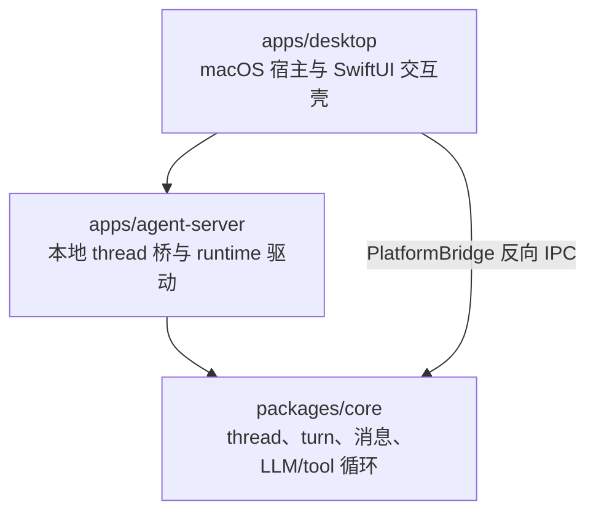
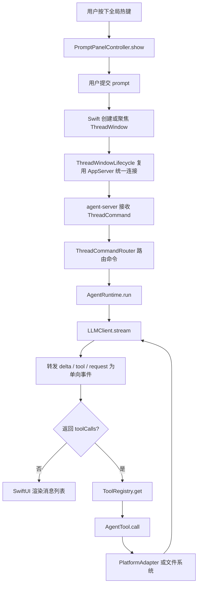

# handAgent

## 文档目标

本文档是仓库级总览，描述 HandAgent 的分层架构、核心调用链路、关键 DTO，以及各子目录文档之间的关系。

下级文档入口：

- [apps/apps.md](/Users/mu9/proj/handAgent/apps/apps.md)
- [packages/packages.md](/Users/mu9/proj/handAgent/packages/packages.md)
- [examples/examples.md](/Users/mu9/proj/handAgent/examples/examples.md)

## 产品边界

- 当前产品是一个可由全局热键随时唤起的桌面 Agent。
- 第一版以 macOS 为优先，但核心 runtime 和 tool 协议按跨平台方式设计。
- 只有用户主动输入和用户主动选区可以作为 thread 初始上下文。
- 屏幕、窗口、文件、剪贴板、App 状态等信息不能默认注入模型，只能通过 tool 按需读取。

## 分层架构

### 分层职责

- `apps/desktop`：负责宿主生命周期、热键、PromptPanel、全局唯一 ThreadWindow、状态气泡，以及通过 `MacPlatformProvider` 实现 macOS 原生能力（ScreenCaptureKit / NSWorkspace / NSPasteboard 等）。
- `apps/agent-server`：负责本地 WebSocket thread 桥、thread/turn 路由、持久化封装和 runtime 驱动。
- `packages/core`：负责 thread 输入归一化、消息模型、tool 注册、LLM/tool 循环、`RemotePlatformAdapter` 通过 `PlatformBridge` 接口向桌面 App 请求平台能力。

## 主调用链路

## 主链路阶段 DTO

### 1. Prompt 与 thread 输入

- `AgentThreadInput`
  - `prompt: string`
  - `selection?: SelectionCaptureResult | null`
- `SelectionCaptureResult`
  - `{ kind: "selected"; text: string }`
  - `{ kind: "empty" }`
  - `{ kind: "error"; message?: string }`
- `AgentThread`
  - `prompt: string`
  - `selectedText: string | null`
- `ThreadAttachment`（agent-server WS 协议）
  - `{ kind: "text-selection"; id; text }`
  - `{ kind: "image"; id; mimeType; base64 }`
- `PromptAttachmentResult`（desktop 内部）：5 case 详见 [PromptPanel](/Users/mu9/proj/handAgent/apps/desktop/Sources/PromptPanel/prompt-panel.md)。

### 2. Swift 宿主聚合状态

- `ThreadSummary`
  - `threadId: string`
  - `isRunning: boolean`
  - `latestSummary: string`
  - `lastActiveAt: Date`
  - `windowIsOpen: boolean`

### 3. Runtime 与 LLM

- `AgentMessage`
  - `user`
  - `assistant`
  - `tool`
  - `system`
- `ToolCallEnvelope`
  - `id: string`
  - `name: string`
  - `arguments: Record<string, unknown>`
- `LLMStreamEvent`
  - `text_delta`
  - `tool_call`
  - `message_end`
- `LLMCompletion`（兼容聚合结果）
  - `message: assistant message`
  - `toolCalls?: ToolCallEnvelope[]`
- `AgentRunResult`
  - `messages: AgentMessage[]`

### 4. Tool 与平台

- `RegisteredTool`
  - `name`
  - `description`
  - `inputSchema`
- `AgentTool<TInput, TOutput>`
  - `call(input): Promise<TOutput>`
- `PlatformAdapter`
  - `currentClipboardText`
  - `frontmostAppInfo`
  - `frontmostWindowList`
  - `captureScreen`
  - `recognizeText`
  - `accessibilitySnapshot`
  - `performAccessibilityAction`
- `PlatformBridge`：跨进程 RPC 接口；定义 `OfflineError` / `TimeoutError` / `RemoteError` 三个类型化错误。

### 5. Thread 存储

- `ThreadMetadata`
  - `id: string`
  - `preview: string | null`
  - `createdAt: string`
  - `updatedAt: string`
  - `messageCount: number`
- `PersistedThread`
  - `version: 1`
  - `metadata: ThreadMetadata`
  - `messages: AgentMessage[]`
  - `events: ThreadAuditEvent[]`
- `ThreadAuditEvent`
  - `tool_call`：记录 tool 调用入参
  - `tool_result`：记录 tool 执行结果与耗时
  - `permission_request`：权限审批记录（审计事件名，不是当前 UI 主协议名）
  - `error`：运行时错误
- `ThreadStore`（接口）
  - `create / get / delete / list`
  - `updatePreview / appendMessages / setMessages / appendEvents`

### 6. 工作区与权限

- `Workspace` / `WorkspaceRegistry` / `FileWorkspaceRegistry`（持久化到 `~/.spotAgent/workspaces.json`）。
- `PermissionPolicy` / `PermissionDecision` / `PermissionResolution` / `PermissionScope` / `FilePermissionPolicy`（持久化到 `~/.spotAgent/permissions.json`）。

### 7. 跨进程协议（`packages/core/src/protocol/`）

当前跨进程协议分为五组 DTO：

- `ThreadCommand`：desktop -> agent-server 的命令，例如 `thread.start`、`thread.resume`、`thread.list`、`thread.delete`、`turn.start`、`turn.interrupt`。
- `ThreadNotification`：agent-server / core -> desktop 的通知，例如 `thread.started`、`thread.snapshot`、`user.message.recorded`、`turn.started`、`assistant.delta`、`tool.started`、`tool.finished`、`turn.completed`、`thread.status.changed`、`thread.error`。
- `ServerRequest`：server -> desktop 的待回执请求，当前包括 `permission.requested` 与 `workspace.requested`。
- `ClientResponse`：desktop -> server 的请求回执，当前包括 `permission.answered` 与 `workspace.answered`。
- `PlatformBridgeMessage`：独立于 thread 协议的反向平台 IPC，仍使用 `channel: "platform"` + `platform_bridge_hello` / `platform_request` / `platform_response`。

详见 [protocol/protocol.md](/Users/mu9/proj/handAgent/packages/core/src/protocol/protocol.md)。

## 当前实现状态

- 当前桌面壳已经切到 `PromptPanel + 全局唯一 ThreadWindow + StatusBubble`。
- 当前桌面端使用全局唯一 ThreadWindow。ThreadWindow 左侧展示持久化 thread 历史；点击历史项会在当前窗口创建或激活 tab。Window 拥有 tabs；tab 拥有 `threadId`、消息、运行态、权限请求和 workspace 选择等完整 thread 生命周期，并通过共享连接接收各自事件。
- `agent-server` 通过 `ThreadCommandRouter + ThreadRuntimeOrchestrator + ThreadNotificationPublisher + ThreadPersistence + ThreadStore` 管理 thread 并驱动 runtime。
- `packages/core/src/storage` 提供持久化 thread 存储，默认使用 `FileThreadStore` 将 thread 写入 `~/.spotAgent/threads/`。
- 桌面端通过 `AppServer` 持有的共享 `AppServerConnection` 与 agent-server 通信；单个 ThreadWindow 内多个 tab 通过 `thread.resume` 复用同一连接，并按 `threadId` 路由 `ThreadNotification` 与 `ServerRequest`。
- 桌面端通过 agent-server 的 thread 协议读取同一目录，为 ThreadWindow 左侧历史列表提供恢复和删除入口；恢复同一 `threadId` 时优先激活已有 tab，未打开时创建新 tab 并等待 `thread.snapshot` 恢复。
- `packages/core` 已经定义完整的 tool、platform DTO。
- macOS 平台能力由 `apps/desktop` 内的 `MacPlatformProvider` 实现：剪贴板（`NSPasteboard`）、App 列表与前台 App（`NSWorkspace`）、窗口列表（`CGWindowListCopyWindowInfo`）、屏幕截图（`ScreenCaptureKit` + `SCScreenshotManager`，支持 display / window / region 三种 target）、OCR（Vision）与 Accessibility snapshot / action。
- 桌面 App 通过 `PlatformBridgeService` 与 `agent-server` 维护一条独立 WebSocket 反向通道，core 侧通过 `RemotePlatformAdapter` 调用平台能力。
- ThreadWindow 已有共享连接断线自动重连、历史刷新与 tab 重新恢复逻辑；仍需实机验证 agent-server 重启后的 `thread.snapshot` 恢复体验。
- 图片 attachment 会落 Blob/Stub；agent-server 在 runtime 前把 image STUB 展开为多模态 image part，LLM 是否能理解图片取决于当前 provider capability。

## 阅读顺序建议

1. 先读本文档，建立整体分层和主链路。
2. 再读 [apps/apps.md](/Users/mu9/proj/handAgent/apps/apps.md)，理解入口与交互层。
3. 再读 [packages/packages.md](/Users/mu9/proj/handAgent/packages/packages.md)，理解核心 runtime 与平台实现。
