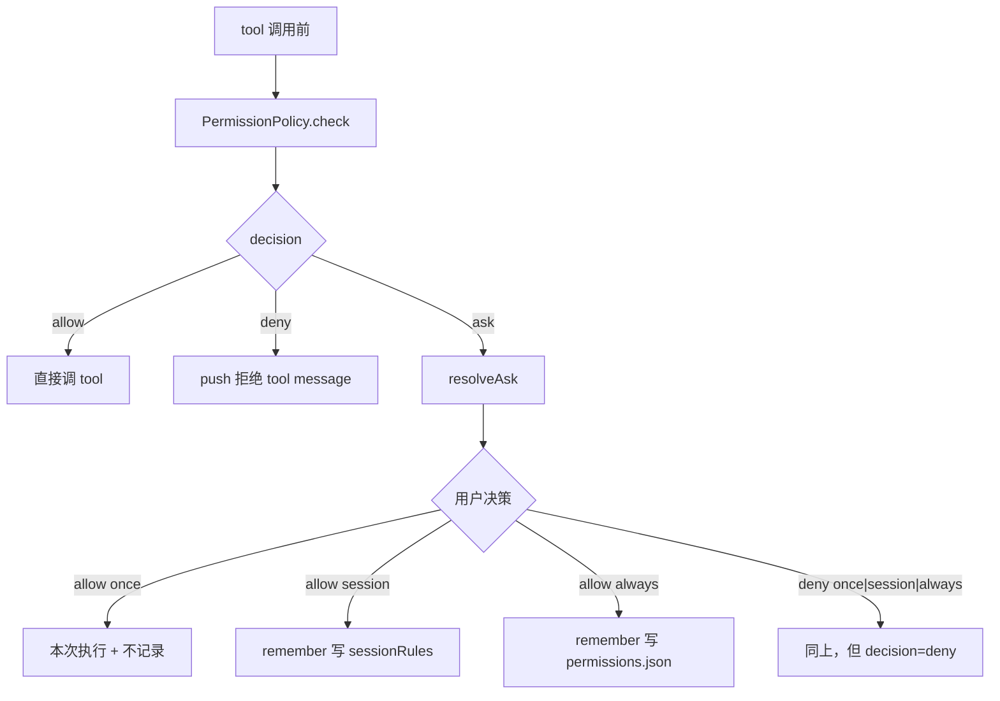

# permission

Tool 调用前的权限策略。runtime 默认 `AllowAllPermissionPolicy`；生产由 agent-server 注入 `FilePermissionPolicy(askResolver = SessionPermissionBridge.ask)`。

## 文件

| 文件 | 职责 |
|------|------|
| `PermissionPolicy.ts` | `PermissionPolicy` 接口（`check / resolveAsk / remember`）+ 输入输出类型 + `AllowAllPermissionPolicy` + `DENY_TOOL_RESULT_TEXT = "用户拒绝执行该 tool"` |
| `FilePermissionPolicy.ts` | 三层策略：`sessionRules`（内存 Map）→ 持久化 `~/.spotAgent/permissions.json` → fallback 调 `askResolver`；按 `sha256(toolName + stableJSON(args))` 做 key |

## 决策三态 + 三档记忆



`PermissionResolution.remember`：

- `"once"` 或不传：什么也不记。
- `"session"`：写入内存 `sessionRules` Map（按 keyFor 哈希）。
- `"always"`：去重后追加到 `~/.spotAgent/permissions.json`。

## 持久化文件

`~/.spotAgent/permissions.json`：

```json
{
  "version": 1,
  "rules": [
    {
      "toolName": "file.write",
      "argHash": "<sha256>",
      "decision": "allow",
      "createdAt": "2026-05-17T..."
    }
  ]
}
```

`stableStringify` 保证字段顺序无关，使得相同语义的入参产生相同 hash。

## 编辑此目录的约束

- 不要在 policy 内做 UI 询问；UI 必须走 `askResolver` 注入（agent-server 端的 `SessionPermissionBridge`）。
- `keyFor` 当前不区分 `sessionId`，意味着 `session` 范围在多 session 共存时有泄漏风险（架构改进项）。修改时务必同步设计文档。
- `loadSync` 内部一次缓存后不再失效；不要在 policy 里启 watcher，应通过 desktop 重启 agent-server 子进程触发重载。
- 增加新 scope 时，三个调用点（`check / resolveAsk / remember`）+ runtime 的 `permission_decision` 事件 + 协议 `permission_response.scope` 必须同步。

## 相关文档

- 调用方：[runtime/runtime.md](/Users/mu9/proj/handAgent/packages/core/src/runtime/runtime.md)
- AskResolver UI 实现：[apps/agent-server/agent-server.md](/Users/mu9/proj/handAgent/apps/agent-server/agent-server.md)
- 协议帧：[protocol/protocol.md](/Users/mu9/proj/handAgent/packages/core/src/protocol/protocol.md)
