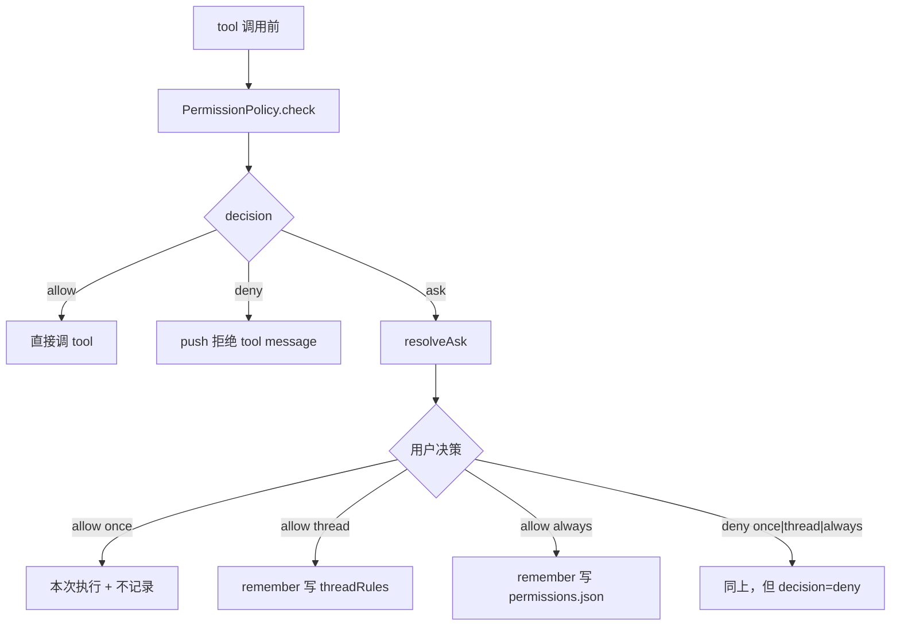

# permission

Tool 调用前的权限策略。runtime 默认 `AllowAllPermissionPolicy`；生产由 agent-server 注入 `FilePermissionPolicy(askResolver = AgentRequestBroker.askPermission)`。

## 文件

| 文件 | 职责 |
|------|------|
| `PermissionPolicy.ts` | `PermissionPolicy` 接口（`check / resolveAsk / remember`）+ 输入输出类型 + `AllowAllPermissionPolicy` + `DENY_TOOL_RESULT_TEXT = "用户拒绝执行该 tool"` |
| `FilePermissionPolicy.ts` | 三层策略：`threadRules`（内存 Map，按 `${threadId}::${argHash}` 隔离）→ 持久化 `~/.spotAgent/permissions.json`（按 `argHash` 全局命中）→ fallback 调 `askResolver`；`argHash = sha256(toolName + stableJSON(args))`；持久化规则缓存按文件状态戳失效 |

## 决策三态 + 三档记忆



`PermissionResolution.remember`：

- `"once"` 或不传：什么也不记。
- `"thread"`：写入内存 `threadRules` Map（按 keyFor 哈希）。
- `"always"`：去重后追加到 `~/.spotAgent/permissions.json`。

## 持久化文件

`~/.spotAgent/permissions.json`：

```json
{
  "version": 1,
  "rules": [
    {
      "toolName": "file.write",
      "argHash": "<sha256>",
      "decision": "allow",
      "createdAt": "2026-05-17T...",
      "arguments": {
        "workspaceId": "default",
        "relativePath": "notes/today.md"
      }
    }
  ]
}
```

`stableStringify` 保证字段顺序无关，使得相同语义的入参产生相同 hash；`arguments` 保存原始入参摘要，供 Settings UI 展示规则含义，旧规则缺少该字段时仍按 `argHash` 生效。

## 编辑此目录的约束

- 不要在 policy 内做 UI 询问；UI 必须走 `askResolver` 注入。生产路径由 agent-server 端 `AgentRequestBroker` 把 ask 转成 Agent `server.request` 事件。
- `threadRules` 的 key 已按 `${threadId}::${argHash}` 隔离；多 thread 共存时不会互相泄漏。`always` 持久化层仍按 `argHash` 全局命中（这是设计意图，不是 bug）。
- thread 断开时由 agent-server 调用 `clearThreadRules(threadId)` 释放该 thread 的内存规则；新增 thread 生命周期相关清理时需要保持这个调用。
- `loadSync` 不启 watcher，但每次 `check / listPersistedRules / revoke / remember(always)` 读取持久化规则前都会比较 `permissions.json` 的 `mtimeMs + size`；文件被 Settings 或外部进程改动后，下一次调用会自动重读，写操作不会用旧缓存覆盖外部新增规则。
- 增加新 scope 时，三个调用点（`check / resolveAsk / remember`）+ runtime 的 `permission_decision` 事件 + 协议 `permission.answered.payload.scope` 必须同步。

## 相关文档

- 调用方：[runtime/runtime.md](/Users/mu9/proj/handAgent/packages/core/src/runtime/runtime.md)
- AskResolver UI 实现：[apps/agent-server/agent-server.md](/Users/mu9/proj/handAgent/apps/agent-server/agent-server.md)
- 协议帧：[protocol/protocol.md](/Users/mu9/proj/handAgent/packages/core/src/protocol/protocol.md)
