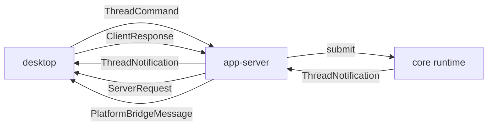

# protocol

`packages/core/src/protocol` 定义 desktop、app-server、core 之间的跨进程协议边界。新主路径统一使用 `Thread` / `Turn` 语义：

- desktop 只提交 `ThreadCommand`，并回覆 `ClientResponse`
- app-server / core 只向 desktop 推送 `ThreadNotification`，并在需要用户决定时发 `ServerRequest`
- 平台 RPC 独立于 thread 主路径，继续走 `PlatformBridgeMessage`

## 文件

| 文件 | 职责 |
|------|------|
| `ThreadCommand.ts` | 最小命令协议：`thread.start` / `thread.resume` / `thread.list` / `thread.delete` / `turn.start` / `turn.interrupt` |
| `ThreadNotification.ts` | 通知协议：`thread.started` / `thread.snapshot` / `assistant.delta` / `tool.started` / `turn.completed` 等 |
| `ServerRequest.ts` | 待回执请求：`permission.requested` / `workspace.requested`，按 `threadId` 路由 |
| `ClientResponse.ts` | 回执协议：`permission.answered` / `workspace.answered` |
| `ThreadProtocolShared.ts` | 共享类型：`RunStatus` / `ThreadListEntry` / `WorkspaceAskCandidate` / `ThreadAttachment` |
| `PlatformBridgeMessage.ts` | `PlatformBridgeMessage`（平台反向 RPC 帧）/ `PlatformResponsePayload` |

## 单向边界



- desktop 不直接驱动 `AgentRuntime`，只发命令、收事件。
- app-server 负责 socket、订阅路由、持久化、权限 / workspace 回执桥接。
- core 负责把命令转成 runtime 执行，并把执行结果归一化成稳定事件流。

## 主协议分类

### `ThreadCommand`

- `thread.start`
- `thread.resume`
- `thread.list`
- `thread.delete`
- `turn.start`
- `turn.interrupt`

### `ThreadNotification`

- `thread.started`
- `thread.snapshot`
- `user.message.recorded`
- `turn.started`
- `assistant.delta`
- `tool.started`
- `tool.finished`
- `turn.completed`
- `thread.status.changed`
- `thread.listed`
- `thread.deleted`
- `thread.error`

### `ServerRequest` / `ClientResponse`

- `permission.requested` <-> `permission.answered`
- `workspace.requested` <-> `workspace.answered`

这两组消息只用于“server 发起问题，等待 UI 回执”的少量交互，不承担普通 thread 流。

## 单连接恢复模型

- desktop 进程固定只有一条到 `app-server` 的长连接。
- thread 打开或重连时发送 `thread.resume(threadId)`。
- `thread.resume` 的结果是 `thread.snapshot`，不是新建 socket，也不是额外握手通道。
- 所有 `ThreadNotification` 与 `ServerRequest` 都带 `threadId`，由 desktop 本地 store 按 thread 分发。

## core 侧消费方式

- 新主路径由 agent-server 的 thread runtime 编排 `AgentRuntime`，对外只暴露 `ThreadNotification`。
- `AgentRuntimeEvent` 到 `ThreadNotification` 的归一化由 app-server thread 层维护，避免 runtime 内部事件直接暴露给 UI。

## Action Binding

plugin action 绑定信息位于 `thread.start.payload.actionBinding`。app-server 会重新读取本地 manifest，确认该 prompt 是可绑定的 plugin action，解析并持久化 thread metadata 的 `actionBinding.mcpServerIds`，随后只在该 thread 的 runtime 前组合对应 MCP tools。`kind: "skill"` 的 action 只提交渲染后的普通 prompt，不携带 action binding。

普通 `turn.start` 不携带 action binding；一个 thread 的 MCP scope 由创建时 metadata 决定，不随后续消息变化。

## Turn 中断

- 主路径下，ThreadWindow 运行态 Stop 控件发送 `turn.interrupt`，不会断开 socket。
- agent-server 在中断后输出 `turn.completed(status: "interrupted")` 与 `thread.status.changed(value: "interrupted")`。
- 已中断 run 的后续 assistant delta、tool result 与最终 runtime result 不再继续产出新事件。

## 附件

`ThreadAttachment` 当前两类：

- `text-selection`：纯文本选区。
- `image`：base64 图片（`image/png | image/jpeg | image/webp`）。

注：`MessageTranslator.composeUserContent` 会把 `image` 附件写入 BlobStore，并在持久化 user message 中插入空 body 的 image STUB；原始 base64 不进入 thread 历史。agent-server 在调用 runtime 前会把 image STUB 展开为 `{ type: "image"; blobId; mimeType }`，由 LLM adapter 按需读取 blob 并发送多模态消息。

## Workspace 选择

`workspace.askUser` 通过 `ServerRequest` / `ClientResponse` 向当前 ThreadWindow 发起内联选择，而不是复用平台 RPC。

```json
{
  "type": "workspace.requested",
  "requestId": "...",
  "threadId": "...",
  "timestamp": "...",
  "payload": {
    "toolCallId": "...",
    "prompt": "请选择 workspace",
    "candidates": [
      { "id": "docs", "name": "文档", "description": "产品文档", "isDefault": false }
    ],
    "timeoutMs": 60000
  }
}
```

桌面端回复：

```json
{
  "type": "workspace.answered",
  "requestId": "...",
  "timestamp": "...",
  "payload": {
    "workspaceId": "docs",
    "cancelled": false
  }
}
```

用户取消、超时、thread 关闭或没有活动 ThreadWindow 时，tool 返回 `{ "cancelled": true }`。

## 平台 RPC 帧

```json
// platform_request
{
  "channel": "platform",
  "type": "platform_request",
  "messageId": "...",
  "timestamp": "...",
  "payload": {
    "requestId": "...",
    "method": "screen.capture",
    "args": {...},
    "timeoutMs": 15000
  }
}

// platform_response
{
  "channel": "platform",
  "type": "platform_response",
  "messageId": "...",
  "timestamp": "...",
  "payload": {
    "requestId": "...",
    "status": "ok",
    "result": {...}
  }
}
```

## 编辑此目录的约束

- 协议是合约，desktop（Swift）与 app-server（TS）必须严格对齐字段。
- 新增 type 时考虑：是否同时影响 `ThreadStore` 持久化、`ConversationMessage` UI、`ThreadAuditEvent` 审计三处。
- 协议字段保持平铺，不要嵌套 anyJson 黑洞，让两边 codec 都能强类型化。
- 平台 RPC 不带 `threadId`；server 只通过 `channel: "platform"` 分派平台帧。

## 相关文档

- TS 处理方：[apps/agent-server/agent-server.md](/Users/mu9/proj/handAgent/apps/agent-server/agent-server.md)
- Swift 处理方：[apps/desktop/Sources/ThreadWindow/thread-window.md](/Users/mu9/proj/handAgent/apps/desktop/Sources/ThreadWindow/thread-window.md) / [PlatformBridge](/Users/mu9/proj/handAgent/apps/desktop/Sources/AppServices/PlatformBridge/platform-bridge.md)
- 平台 RPC 接口：[platform/platform.md](/Users/mu9/proj/handAgent/packages/core/src/platform/platform.md)
- UI 模型：[conversation/conversation.md](/Users/mu9/proj/handAgent/packages/core/src/conversation/conversation.md)
