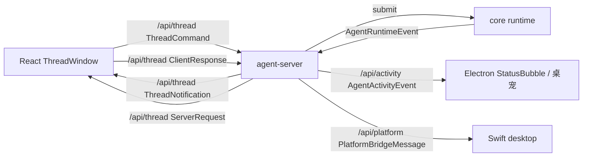

# protocol

`packages/core/src/protocol` 定义 React ThreadWindow、agent-server、desktop 之间的跨进程协议 DTO。新主路径统一使用 `Thread` / `Turn` 语义：

- React ThreadWindow 只提交 `ThreadCommand`，并回覆 `ClientResponse`
- agent-server 向 React ThreadWindow 推送 `ThreadNotification`，并在需要用户决定时发 `ServerRequest`
- Electron StatusBubble 和后续桌宠只订阅 `/api/activity`，接收轻量 `AgentActivityEvent`
- 平台 RPC 独立于 thread 主路径，由 Swift desktop 通过 `/api/platform` 处理 `PlatformBridgeMessage`

## 文件

| 文件 | 职责 |
|------|------|
| `Op.ts` | Agent 输入协议：公开运行期 `UserInput` / `Interrupt`，以及 app-server 内部 `client_response` 回执 Op |
| `ThreadCommand.ts` | 最小命令协议：`thread.start` / `thread.resume` / `thread.list` / `thread.delete` / `op.submit(RuntimeOp)` / `workspace.list` |
| `ThreadNotification.ts` | 通知协议：`thread.started` / `thread.snapshot` / `assistant.delta` / `tool.started` / `turn.completed` 等 |
| `AgentEvent.ts` | Agent 输出事件：`thread.notification` / `server.request`，供 app-server 从 Agent `rx_event` 消费 |
| `ServerRequest.ts` | 跨进程待回执请求：`permission.requested` / `workspace.requested`，按 `threadId` 路由 |
| `ClientResponse.ts` | 回执协议：`permission.answered` / `workspace.answered` |
| `ThreadProtocolShared.ts` | 共享类型：`RunStatus` / `ThreadListEntry` / `WorkspaceAskCandidate` / `ThreadAttachment` |
| `AgentActivity.ts` | `/api/activity` 轻量活动流：`activity.snapshot` / `activity.changed` |
| `PlatformBridgeMessage.ts` | `PlatformBridgeMessage`（平台反向 RPC 帧）/ `PlatformResponsePayload` |

## 单向边界



- React ThreadWindow 不直接驱动 `AgentRuntime`，只发命令、收事件。
- Swift desktop 不处理 thread DTO，只处理 platform bridge DTO。
- agent-server 负责 socket、订阅路由、持久化、Agent request broker，以及把 Agent `rx_event` 中的 notification/request 归一化发布到 `/api/thread`。
- `/api/activity` 不承载 `ThreadCommand`、`ClientResponse`、`ThreadNotification` 或 `ServerRequest`，只发送 `AgentActivityEvent`。
- core 只定义协议 DTO 与 runtime 事件，不负责 WebSocket 生命周期或连接分发。

## 主协议分类

### `ThreadCommand`

- `thread.start`
- `thread.resume`
- `thread.list`
- `thread.delete`
- `op.submit`
- `workspace.list`

### `ThreadNotification`

- `thread.started`
- `thread.snapshot`
- `user.message.recorded`
- `turn.started`
- `assistant.delta`
- `tool.started`
- `tool.finished`
- `turn.completed`
- `thread.status.changed`
- `thread.listed`
- `thread.deleted`
- `thread.error`
- `workspace.listed`

### `ServerRequest` / `ClientResponse`

- `permission.requested` <-> `permission.answered`
- `workspace.requested` <-> `workspace.answered`

这两组消息只用于“server 发起问题，等待 UI 回执”的少量跨进程交互，不承担普通 thread 流。Agent 内部对应为 `server.request` event 与 `client_response` Op。

### `AgentActivityEvent`

- `activity.snapshot`
- `activity.changed`

这组消息只用于状态气泡、桌宠等轻量运行态展示。它由 agent-server 从 thread 通知和待回执请求派生，不暴露完整消息内容。`/api/activity` subscriber 连接后先收到 `activity.snapshot`，只有状态变化时才收到 `activity.changed`。

## Thread Socket 状态入口

- React ThreadWindow 持有到 `/api/thread` 的长连接。
- 用户打开历史 thread，或初始 prompt 创建 thread 后需要拉取初始状态时，发送 `thread.resume(threadId)`。
- `thread.resume` 的结果是 `thread.snapshot`，不是新建 socket，也不是额外握手通道。
- 普通 thread 级 `ThreadNotification` 与 `ServerRequest` 都带 `threadId`，由 React store 按 thread 分发。
- 连接级通知是例外，例如 `workspace.listed` 对应 `workspace.list` 命令，只返回给发起命令的连接，不带 `threadId`。
- React 和 app-server 当前不做断线恢复；非主动断开后不自动重连、不恢复订阅、不拉取 snapshot、不发送恢复命令。

## core 侧消费方式

- 新主路径由 agent-server 的持久 Agent 消费 `Op`，并由内部 turn 执行器编排 `AgentRuntime`；对外只暴露 `ThreadNotification` / `ServerRequest`。
- `AgentRuntimeEvent` 到 `ThreadNotification` 的归一化由 agent-server thread 层维护，随后作为 `thread.notification` 进入 Agent `rx_event`，避免 runtime 内部事件直接暴露给 UI。
- permission/workspace ask resolver 会把待回执请求包装成 `server.request` 进入 Agent `rx_event`；app-server 发布后，React 的 `ClientResponse` 会被包装成 `client_response` Op 投回同一 Agent。

## Action Binding

plugin action 绑定信息位于 `thread.start.payload.actionBinding`。agent-server 会重新读取本地 manifest，确认该 prompt 是可绑定的 plugin action，解析并持久化 thread metadata 的 `actionBinding.mcpServerIds`，随后只在该 thread 的 runtime 前组合对应 MCP tools。`kind: "skill"` 的 action 只提交渲染后的普通 prompt，不携带 action binding。

普通 `op.submit(UserInput)` 不携带 action binding；一个 thread 的 MCP scope 由创建时 metadata 决定，不随后续消息变化。

## Turn 中断

- 主路径下，ThreadWindow 运行态 Stop 控件发送 `op.submit(Interrupt)`，不会断开 socket。
- agent-server 在中断后输出 `turn.completed(status: "interrupted")` 与 `thread.status.changed(value: "interrupted")`。
- 已中断 run 的后续 assistant delta、tool result 与最终 runtime result 不再继续产出新事件。

## 运行期 Op

`Op` 在 Agent 内部表示可投递给 `tx_sub` 的操作；公开 `op.submit` 只接受运行期输入，不替代 thread 生命周期：

- `UserInput`：`payload.items` 是用户本次主动输入的结构化列表，支持 `text`、`image`、`skill`、`text_selection`。
- `Interrupt`：表示用户或系统请求中断当前运行。
- `ClientResponseOp`：app-server 内部 Op，包装 React 回传的 `permission.answered` / `workspace.answered`，不允许 React 通过 `op.submit` 直接提交。

`thread.start` / `thread.resume` / `thread.list` / `thread.delete` / `workspace.list` 仍是独立 `ThreadCommand`。

## 附件

`ThreadAttachment` 当前两类：

- `text_selection`：纯文本选区。
- `image`：base64 图片（`image/png | image/jpeg | image/webp`）。

注：`MessageTranslator.composeUserContent` 会把 `image` 附件写入 BlobStore，并在持久化 user message 中插入空 body 的 image STUB；原始 base64 不进入 thread 历史。agent-server 在调用 runtime 前会把 image STUB 展开为 `{ type: "image"; blobId; mimeType }`，由 LLM adapter 按需读取 blob 并发送多模态消息。

## Workspace 选择

`workspace.askUser` 通过 `ServerRequest` / `ClientResponse` 向当前 ThreadWindow 发起内联选择，而不是复用平台 RPC。

```json
{
  "type": "workspace.requested",
  "requestId": "...",
  "threadId": "...",
  "timestamp": "...",
  "payload": {
    "toolCallId": "...",
    "prompt": "请选择 workspace",
    "candidates": [
      { "id": "docs", "name": "文档", "description": "产品文档", "isDefault": false }
    ],
    "timeoutMs": 60000
  }
}
```

React ThreadWindow 回复：

```json
{
  "type": "workspace.answered",
  "requestId": "...",
  "timestamp": "...",
  "payload": {
    "workspaceId": "docs",
    "cancelled": false
  }
}
```

用户取消、超时、thread 关闭或没有活动 ThreadWindow 时，tool 返回 `{ "cancelled": true }`。

## 平台 RPC 帧

```json
// platform_request
{
  "channel": "platform",
  "type": "platform_request",
  "messageId": "...",
  "timestamp": "...",
  "payload": {
    "requestId": "...",
    "method": "screen.capture",
    "args": {...},
    "timeoutMs": 15000
  }
}

// platform_response
{
  "channel": "platform",
  "type": "platform_response",
  "messageId": "...",
  "timestamp": "...",
  "payload": {
    "requestId": "...",
    "status": "ok",
    "result": {...}
  }
}
```

## 编辑此目录的约束

- 协议是合约，desktop（Swift）与 agent-server（TS）必须严格对齐字段。
- 新增 type 时考虑：是否同时影响 `ThreadStore` 持久化、`ConversationMessage` UI、`ThreadAuditEvent` 审计三处。
- 协议字段保持平铺，不要嵌套 anyJson 黑洞，让两边 codec 都能强类型化。
- 平台 RPC 不带 `threadId`；server 只通过 `channel: "platform"` 分派平台帧。

## 相关文档

- TS 处理方：[apps/agent-server/agent-server.md](/Users/mu9/proj/handAgent/apps/agent-server/agent-server.md)
- React 处理方：[apps/thread-window-web/thread-window-web.md](/Users/mu9/proj/handAgent/apps/thread-window-web/thread-window-web.md)
- Swift platform 处理方：[PlatformBridge](/Users/mu9/proj/handAgent/apps/desktop/Sources/AppServices/PlatformBridge/platform-bridge.md)
- 平台 RPC 接口：[platform/platform.md](/Users/mu9/proj/handAgent/packages/core/src/platform/platform.md)
- UI 模型：[conversation/conversation.md](/Users/mu9/proj/handAgent/packages/core/src/conversation/conversation.md)
