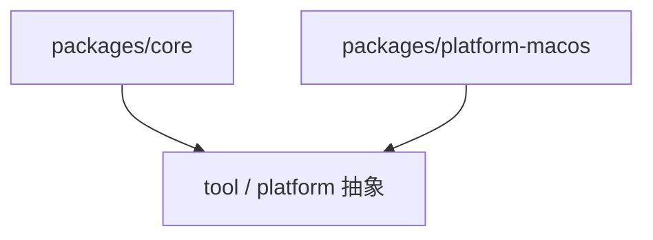

# packages

## 目录职责

`packages` 层承载可复用、可跨平台的核心能力与平台实现。

当前包含两个主包：

- [core/core.md](/Users/mu9/proj/handAgent/packages/core/core.md)
- [platform-macos/platform-macos.md](/Users/mu9/proj/handAgent/packages/platform-macos/platform-macos.md)

## 分层关系

## 包级边界

- `core` 只定义会话、消息、runtime、tool 协议和平台抽象，不依赖 AppKit。
- `platform-macos` 只实现 macOS 平台能力，不反向污染 core 的抽象边界。

## 数据流角色

### `packages/core`

- 接收 Web 层传入的用户输入。
- 维护 `AgentMessage[]`。
- 调用 `LLMClient`。
- 解析 `toolCalls` 并回调 `ToolRegistry`。

### `packages/platform-macos`

- 作为 `PlatformAdapter` 的 macOS 实现。
- 把抽象请求转成 `pbpaste`、`osascript`、`screencapture` 等系统能力。
