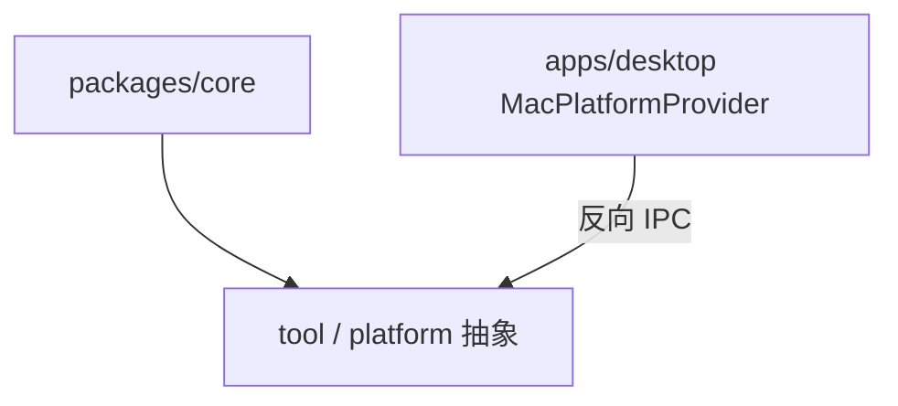

# packages

## 目录职责

`packages` 层承载可复用、可跨平台的核心能力抽象。

当前包含一个主包：

- [core/core.md](/Users/mu9/proj/handAgent/packages/core/core.md)：workspace 包名为 `@handagent/core`，对外通过 package exports 映射到 `src/`。

## 分层关系

## 包级边界

- `core` 只定义会话、消息、runtime、tool 协议和平台抽象，不依赖 AppKit。
- macOS 平台能力由桌面 App 的 `MacPlatformProvider`（Swift）实现，通过 `PlatformBridge` 反向 IPC 暴露给 `RemotePlatformAdapter`。
- 应用层 TypeScript 代码通过 `@handagent/core/...` 引用 core，不再使用 `../../../packages/core/src/...` 跨包相对路径。

## 数据流角色

### `packages/core`

- 接收 Web 层传入的用户输入。
- 维护 `AgentMessage[]`。
- 调用 `LLMClient`。
- 解析 `toolCalls` 并回调 `ToolRegistry`。
- 通过 `RemotePlatformAdapter` + `PlatformBridge` 接口向桌面 App 发起平台能力请求。
